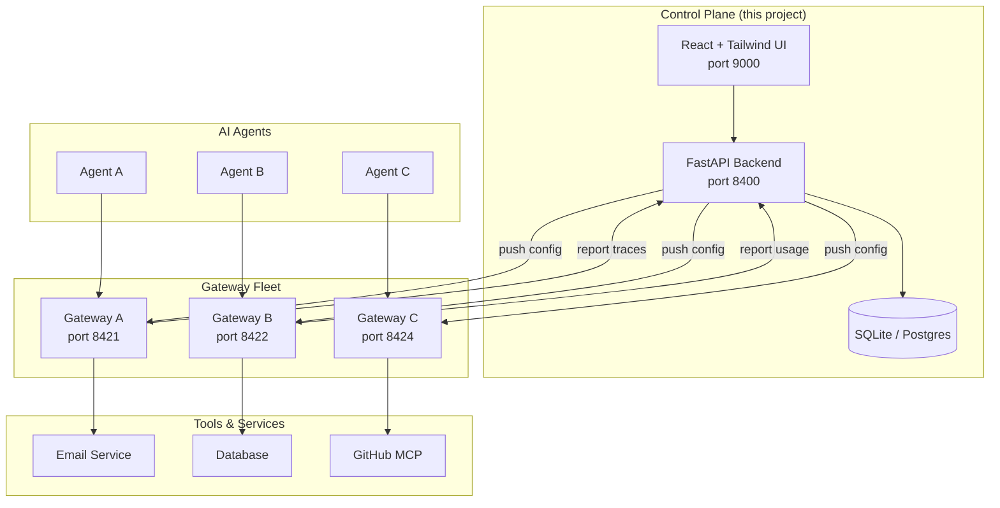
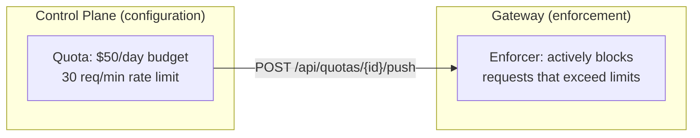
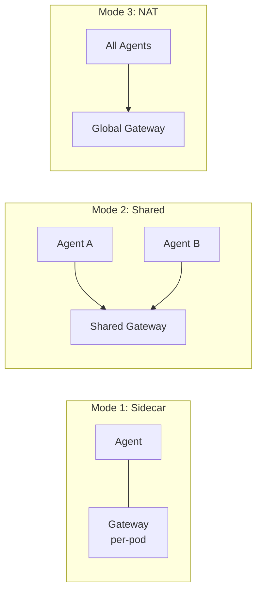

# Ostiari Control Plane

Centralized web console for managing a fleet of Ostiari **agent gateways** — the
proxies that enforce safety policies between AI agents and their tools.

---

## Architecture



---

## Features

| Feature | Description |
|---------|-------------|
| **Agent Gateway Registry** | Register gateways (formerly "sidecars"), monitor health via a background check loop, push configuration to one or all. Per-gateway enforcement mode: `enforce` or `shadow` |
| **Agent Registry** | View all agents across your fleet — 9 seeded agents across 8 frameworks (OpenAI, Anthropic, Strands, Bedrock, AgentCore, CrewAI, LangGraph, plus `gateway-invoke` for the two bots that call the gateway directly). Shows framework badges, tools, model, and gateway assignment |
| **Tool Management** | CRUD tools per gateway with search/filter, plus OpenAPI spec import. The demo registers 23 tools across the four gateways |
| **Policy Management** | Create/edit/push safety policies (allow/block/risk-adjust). The demo creates `block-destructive` (crm-agent) and `ops-guard` (ops-agent) |
| **MCP Server Management** | Configure MCP servers (embedded, remote HTTP, or stdio subprocess) with tool auto-discovery. The demo seeds two *real* stdio servers (draw.io + filesystem, via `npx`) |
| **Model Configuration** | Central registry of LLM models — 18 pre-seeded from AxonLLM. CRUD with inline routing strategy editing. Shows providers, pricing, capabilities (tools/vision), and category (reasoning/general/speed) |
| **Provider Routes** | Tenant-scoped encrypted credentials and endpoint assignments with adaptive AxonLLM health, weighted selection, failover priorities, shared-account capacity, connection-pool limits, hot push, and fleet runtime health |
| **Quotas (Runtime Enforced)** | Per-gateway and per-agent rate limits, budget caps, model/provider allowlists, and `max_tokens` caps. Agent quotas persist in the control plane, push as a complete gateway bundle, restore measured spend after restart, and use actual usage records for dashboard spend/RPM |
| **Approvals (HITL)** | Human-in-the-loop queue for calls that score *intervene*. The gateway answers 202 with an approval id; a human decides here; the caller re-submits with `X-Approval-Id` |
| **Sandbox** | Four-tab testing environment: Chat, governed scenarios, browser-isolated JavaScript with a metered tool bridge, and A2A tasks. Code runs in an opaque-origin worker; source never reaches the backend |
| **Cost Dashboard** | Track LLM spend broken down by model, gateway, agent, and day |
| **Metering** | Per-agent token/cost rollups with CSV/JSON export |
| **Payments (x402)** | Per-agent USDC policy wallets with balance, per-call and daily limits, a retry-safe ledger, per-tool pricing, simulated settlement, and optional live x402 v2 passthrough |
| **Token Broker** | Retry-safe pool drawdown and customer charging, optional Stripe Meter Events billing, depleted-provider routing controls, margin reporting, and invoice reconciliation |
| **A/B Experiments** | Percentage-based traffic splitting between models with side-by-side results comparison. 3 seeded in the demo |
| **Live Trace Viewer** | Real-time WebSocket feed of tool calls across all gateways, with session/plan/step grouping, tool parameters, and a model badge per trace |
| **Shadow Report** | What a gateway in `shadow` mode *would* have blocked — try before you enforce |
| **Protocol Governance (A2A)** | Register peer agents per gateway, govern agent-to-agent delegation, and view a delegation report with trust scoring |
| **Discovery** | Reconcile gateway traces with opt-in AWS CloudTrail Lake, Bedrock Agent, and tagged-resource signals. Onboarding validates a tenant gateway, installs an agent authorization entry, and distinguishes registration from traffic actually routed through that gateway |
| **Compliance** | EU AI Act–oriented framework reports |
| **ROI / Savings** | "Damage prevented" dashboard driven by a configurable cost model |
| **Audit Log** | Tamper-evident record of who changed what config, when (filterable by resource, action, actor; `/api/audit/verify` checks the chain) |
| **Users & SSO** | Local accounts with roles (admin / operator / viewer) plus an OIDC SSO flow, including IdP claim→role mapping |
| **Gateway Proxy** | `/api/proxy/gateway/{gateway_id}/{path}` forwards UI requests to gateways, eliminating CORS and enabling Sandbox in production |
| **Data Persistence** | SQLAlchemy-backed storage throughout: PostgreSQL in production and SQLite in development. Approvals, sanitized traces, SSO state, quotas, alerts, experiments, models, agent routing, agents, encrypted provider config, pricing, trust state, ROI/broker settings, and offline config updates are durable. `state.json` is read only for one-time upgrades from older versions |

### UI Design

The control plane uses a warm light theme (stone-50 background) with white cards,
Inter font, and violet primary buttons. Each page features colored glowing borders
that match its sidebar icon color.

### Sidebar Navigation Structure

The sidebar is organized into labeled sections with colored left border accents
(see `frontend/src/components/Layout.tsx`):

| Section | Color | Pages |
|---------|-------|-------|
| **Observe** | Emerald | Dashboard, Live Traces, Shadow Report, Approvals, Costs, Metering, Audit Log, Compliance, ROI / Savings |
| **Control** | Rose | Models (per agent), Policies (per tool), Quotas (per gateway), Quotas (per agent) |
| **Monetize** | Emerald | Payments (x402), Token Broker |
| **Configure** | Sky | Discovery, Agent Gateways, Agents, Tools, MCP Servers, Protocol (A2A) |
| **Test** | Fuchsia | Sandbox, A/B Tests, Architecture |
| **Admin** | Violet | LLM Providers, Users |

**Admin** is admin-only; a `viewer` additionally loses the write sections.
`/efficiency` and `/` (the landing page) are routed in `App.tsx` but not linked
from the sidebar — reach them by URL.

> **Role enforcement is mostly a frontend affordance.** Hiding a section stops the
> nav, not the API. Only three surfaces check the role server-side: providers
> (`require_role("admin")`), user management (admin), and the audit log
> (admin-or-operator). Everything else — policies, quotas, tools, gateways, mode —
> accepts a write from any authenticated principal, and from *any* caller at all
> unless `OSTIARI_REQUIRE_AUTH` is set. Treat the roles as UI organization until
> those checks exist.

---

## Quick Start

### Backend

```bash
cd backend
pip install -e .
python main.py
# API available at http://localhost:8400
```

### Frontend

```bash
cd frontend
npm ci
npm run dev
# UI available at http://localhost:9000
```

### Verify

```bash
curl http://localhost:8400/api/health
# {"status": "ok", "service": "control-plane"}
```

**By default no route requires a token.** The `AuthMiddleware` gate is a no-op
unless `OSTIARI_REQUIRE_AUTH` is truthy — which is what keeps the demo working
with zero config, and also means a dev instance on a shared network is wide open.
Set it in anything but a laptop demo.

With it on, every `/api/*` route needs a Bearer token except `/api/health`,
`/api/auth/login`, `/api/auth/register`, `/api/auth/sso/*`, `/api/traces/ingest`
(guarded by its own `X-Ingest-Key`), and the OpenAPI docs. Sign in through the UI
or `POST /api/auth/login`. See [`../auth/README.md`](../auth/README.md) for the
OIDC path.

---

## API Reference

Authoritative source: `http://localhost:8400/docs` (generated from the app).

### Gateways

| Endpoint | Method | Description |
|----------|--------|-------------|
| `/api/gateways` | GET | List all registered gateways |
| `/api/gateways` | POST | Register a new gateway |
| `/api/gateways/{gateway_id}` | GET | Get gateway details |
| `/api/gateways/{gateway_id}` | PATCH | Update a gateway |
| `/api/gateways/{gateway_id}` | DELETE | Remove a gateway |
| `/api/gateways/{gateway_id}/push` | POST | Push the full config bundle, rebuilt from stored state. **Prefer this** — it's the Gateways page's ↑ button and can't clear anything |
| `/api/gateways/{gateway_id}/push-config` | POST | Forward a caller-supplied body to the gateway's `POST /config`. **Not persisted**; tools/policy/base fields use replacement semantics while explicitly present runtime gates apply live. `provider_routes` is rejected; use the encrypted route API. Prefer dedicated routes for individual controls |
| `/api/gateways/{gateway_id}/config-bundle` | GET | Fetch the config a gateway would receive. Signed-in operators receive secret-free provider-route metadata; a valid `X-Ostiari-Service-Key` is required for resolved credentials |
| `/api/gateways/{gateway_id}/register` | POST | Self-registration (called by the gateway on boot; requires `X-Ostiari-Service-Key` when API auth is enabled) |
| `/api/gateways/{gateway_id}/heartbeat` | POST | Liveness ping (called by the gateway; requires `X-Ostiari-Service-Key` when API auth is enabled) |
| `/api/gateways/{gateway_id}/health` | GET | Check gateway health |
| `/api/gateways/{gateway_id}/mode` | PUT | Set enforcement mode (`enforce` \| `shadow`), persist it, and push it live. Registration and reconnect bundles include the stored mode, so it is restored after a gateway restart |
| `/api/gateways/push-all` | POST | Push config to all gateways |

### Tools

| Endpoint | Method | Description |
|----------|--------|-------------|
| `/api/tools` | GET | List all tools across gateways |
| `/api/tools/{gateway_id}` | POST | Add a tool to a gateway |
| `/api/tools/{gateway_id}/import-openapi` | POST | Import tools from an OpenAPI spec |
| `/api/tools/{tool_id}` | DELETE | Remove a tool |

### Policies

| Endpoint | Method | Description |
|----------|--------|-------------|
| `/api/policies` | GET | List all policies |
| `/api/policies` | POST | Create a new policy |
| `/api/policies/{policy_id}` | GET | Get a policy |
| `/api/policies/{policy_id}` | PATCH | Update a policy |
| `/api/policies/{policy_id}` | DELETE | Remove a policy |
| `/api/policies/{policy_id}/push` | POST | Push the effective policy set to its assigned gateway, or every org gateway for a global policy |

### MCP Servers

| Endpoint | Method | Description |
|----------|--------|-------------|
| `/api/mcp-servers` | GET | List MCP servers (optional `?gateway_id=` filter) |
| `/api/mcp-servers/{gateway_id}` | POST | Add an MCP server to a gateway |
| `/api/mcp-servers/{mcp_id}` | GET | Get MCP server details |
| `/api/mcp-servers/{mcp_id}` | DELETE | Remove an MCP server |
| `/api/mcp-servers/{mcp_id}/discover` | POST | Discover the server's tools |
| `/api/mcp-servers/{mcp_id}/tools` | GET | List discovered tools |

### Models

Models are keyed by **name**, not a numeric id.

| Endpoint | Method | Description |
|----------|--------|-------------|
| `/api/models` | GET | List all registered models (18 pre-seeded from AxonLLM) |
| `/api/models` | POST | Register a new model (custom or fine-tuned) |
| `/api/models/{name}` | GET | Get model details (pricing, capabilities, routing strategy) |
| `/api/models/{name}` | PUT | Update a model's configuration |
| `/api/models/{name}` | DELETE | Remove a model from the registry |
| `/api/models/push` | POST | Validate and push the tenant model/provider catalog to each reachable gateway with the LLM module active |

### Quotas

| Endpoint | Method | Description |
|----------|--------|-------------|
| `/api/quotas` | GET | List quotas; optional `scope=gateway|agent|...` filter. Spend and trailing-minute RPM are aggregated from usage records |
| `/api/quotas` | POST | Create a gateway or agent quota (rate limit, budget, model/provider allowlists, `max_tokens`, alert threshold) |
| `/api/quotas/{quota_id}` | PUT | Update a quota's limits (partial — omitted fields are untouched, an explicit `null` clears one) |
| `/api/quotas/{quota_id}` | DELETE | Remove a quota |
| `/api/quotas/{quota_id}/push` | POST | **Push quota to the gateway** — agent scope rebuilds the complete agent quota map for that gateway |
| `/api/quotas/agents/push?gateway_id=...` | POST | Push all persisted agent quotas for a gateway (also removes deleted limits) |
| `/api/quotas/alerts` | POST | Record a budget threshold crossing (80/90/100%) — called by the gateway |
| `/api/quotas/alerts` | GET | Budget alerts from this org's gateways, newest first |
| `/api/quotas/alerts` | DELETE | Acknowledge (clear) this org's alerts; returns the count cleared |

> Budget alerts are SQL-backed and restored into an in-memory deque capped at 200
> per org. An alert is a notification, not the spend ledger; the underlying spend
> remains in `usage_records`.
> Ingest is a service-key machine path when production auth is enabled, and the
> org comes from the reporting gateway's row rather than the payload. The
> **Quotas** page shows them, newest first, with an Acknowledge-all button.
>
> **Editing a quota does not enforce the change** — push it afterwards, same as a
> newly created one.

> **Important:** Creating or editing through the API saves the quota; call
> `/api/quotas/{id}/push` to activate it. The Agent Quotas page combines these as
> **Save & Push**. Gateway quotas are sent to `/config/quota`. Agent quotas are
> layered over the gateway's existing tool grants and sent together to
> `/config/agent-auth`, so changing one agent cannot erase another or widen its
> tool access. The same bundle is stored on the gateway record and is returned
> during registration/reconnect. Tool authorization and quota enforcement have
> separate enable switches, so adding a quota does not turn on tool restrictions.

### Approvals (HITL)

| Endpoint | Method | Description |
|----------|--------|-------------|
| `/api/approvals` | GET | List pending approvals |
| `/api/approvals` | POST | Create an approval request (called by the gateway) |
| `/api/approvals/all` | GET | List pending *and* decided approvals |
| `/api/approvals/{approval_id}` | GET | Get approval details (action, params, risk signals) |
| `/api/approvals/{approval_id}/decision` | POST | Approve or deny |

### Cost Tracking

| Endpoint | Method | Description |
|----------|--------|-------------|
| `/api/costs/summary` | GET | Aggregated costs by model/gateway/agent/day (`?period_days=7&gateway_id=`) |
| `/api/costs/records` | GET | List individual usage records (`?gateway_id=&model=&limit=100`) |
| `/api/costs/record` | POST | Record a single usage event (called by gateways) |
| `/api/costs/record/batch` | POST | Record a batch of usage events |

### Metering

| Endpoint | Method | Description |
|----------|--------|-------------|
| `/api/metering/summary` | GET | Per-agent token and cost rollups |
| `/api/metering/export` | GET | Export usage records (CSV / JSON) |

### Payments (x402)

| Endpoint | Method | Description |
|----------|--------|-------------|
| `/api/payments/wallets` | GET | List agent wallets (balance, limits) |
| `/api/payments/wallets` | POST | Create a wallet |
| `/api/payments/wallets/{agent_id}` | PATCH | Update limits |
| `/api/payments/wallets/{agent_id}/fund` | POST | Add USDC to a wallet |
| `/api/payments/pricing` | GET/POST | Per-tool price list |
| `/api/payments/ledger` | GET | Payment history |
| `/api/payments/summary` | GET | Spend rollup |
| `/api/payments/ingest` | POST | Idempotently record a payment (called by the gateway) |
| `/api/payments/push` | POST | Push wallets + pricing to gateways |

### Token Broker

| Endpoint | Method | Description |
|----------|--------|-------------|
| `/api/token-broker/config` | GET/POST | Bulk discount and markup settings |
| `/api/token-broker/config/reset` | POST | Restore defaults |
| `/api/token-broker/report` | GET | Margin report (retail vs. wholesale) |
| `/api/token-broker/pilot/pools` | GET | Pool inventory and gateway-enforced low-water status |
| `/api/token-broker/pilot/pools/fund` | POST | Buy tokens into a pool |
| `/api/token-broker/pilot/collector` | GET | Collector state |
| `/api/token-broker/pilot/reconcile` | POST | Reconcile a provider invoice |
| `/api/token-broker/pilot/reconciliations` | GET | Reconciliation history |

Gateway cost batches carry a stable `event_id` and the provider that actually
served each request. The control plane uses `(gateway_id, event_id)` to apply the
usage row, pool debit, and customer charge once. A billing failure returns `503`
after persisting the usage and debit; the gateway retains and retries that exact
batch with the same event IDs. Pool state is returned with ingestion responses
and heartbeats so gateways reroute away from, or block, depleted providers.

Set `OSTIARI_BROKER_BILLING=live` to deliver broker charges to Stripe Billing
Meter Events. Configure `STRIPE_API_KEY`, `STRIPE_METER_EVENT_NAME`, and either
`STRIPE_CUSTOMER_ID` for one tenant or `STRIPE_CUSTOMER_MAP` as a JSON mapping
from Ostiari organization IDs to Stripe customer IDs. Event values are integer
micro-USD, so the Stripe meter/price must interpret 1,000,000 units as $1.00.
The gateway event identity is used for both the Stripe meter-event identifier
and idempotency key.

### A/B Experiments

| Endpoint | Method | Description |
|----------|--------|-------------|
| `/api/experiments` | GET | List all experiments |
| `/api/experiments` | POST | Create a new experiment |
| `/api/experiments/{name}` | DELETE | Delete an experiment |
| `/api/experiments/{name}/toggle` | PATCH | Enable/disable an experiment |
| `/api/experiments/{name}/push` | POST | Re-push this experiment's gateway set — for a gateway that was down when it was created (502 if still unreachable) |
| `/api/experiments/{name}/results` | GET | Compare model A vs model B stats (`?period_days=7`) |

### Traces

| Endpoint | Method | Description |
|----------|--------|-------------|
| `/api/traces/ingest` | POST | Receive a trace event from a gateway. Production requires a short-lived workload OIDC Bearer token bound to the reporting gateway. Legacy `X-Ingest-Key` authentication remains development-only. |
| `/api/traces/recent` | GET | Get recent traces (`?limit=50`) |
| `/api/traces/spans` | GET | Traces grouped into session/plan/step spans |
| `/api/traces/shadow-report` | GET | What shadow-mode gateways would have blocked |
| `/api/traces/delegation-report` | GET | Agent-to-agent delegation summary |
| `/ws/traces` | WebSocket | Live stream of trace events (for the UI) |

### Protocol Governance (A2A) & Trust

| Endpoint | Method | Description |
|----------|--------|-------------|
| `/api/a2a-agents` | GET | List registered peer agents |
| `/api/a2a-agents/{gateway_id}` | POST | Register a peer agent on a gateway |
| `/api/a2a-agents/{agent_id}` | DELETE | Remove a peer agent |
| `/api/agent-routing` | GET/POST | Per-gateway agent routing rules |
| `/api/agent-routing/{gateway_id}` | GET | Rules for one gateway |
| `/api/agent-routing/{gateway_id}/{agent_id}` | DELETE | Remove a rule |
| `/api/routing-controls/{gateway_id}` | GET | Read stored task-classification and budget-period controls |
| `/api/routing-controls/{gateway_id}/task-classification` | PUT | Persist and push keyword categories and target models |
| `/api/routing-controls/{gateway_id}/budget-reset` | PUT | Persist and push the UTC budget-reset schedule |
| `/api/routing-controls/{gateway_id}/reset-spend` | POST | Start a new gateway and per-agent budget period immediately |
| `/api/trust/scores` | GET | Trust scores per agent |
| `/api/trust/apply` | POST | Apply trust-based gating |
| `/api/trust/disable` | POST | Turn trust gating off |

### Discovery, Compliance, ROI

| Endpoint | Method | Description |
|----------|--------|-------------|
| `/api/discovery/agents` | GET | Reconcile gateway and configured cloud sightings; reports shadow, off-gateway, governed, and registered-unseen agents plus source health |
| `/api/discovery/onboard` | POST | Register a discovered agent on a tenant-owned gateway and persist/push its agent-auth policy |
| `/api/compliance/frameworks` | GET | Supported compliance frameworks |
| `/api/compliance/report` | GET | Generate a compliance report |
| `/api/roi/report` | GET | "Damage prevented" / savings report |
| `/api/roi/cost-model` | GET/POST | Configure the incident cost model |
| `/api/roi/cost-model/reset` | POST | Restore defaults |

### Audit Log

| Endpoint | Method | Description |
|----------|--------|-------------|
| `/api/audit` | GET | List audit entries (`?resource_type=&actor=&action=&limit=100`) |
| `/api/audit/verify` | GET | Verify the audit hash chain |

### Agents

Agents are keyed by **name**, and there is no `PUT` — re-`POST` to replace.

The live registry is a hot cache over tenant-scoped SQL records. Registration,
replacement, discovery onboarding, and deletion write through transactionally,
so a hard process stop does not lose agent records.

| Endpoint | Method | Description |
|----------|--------|-------------|
| `/api/agents` | GET | List all registered agents (framework, model, tools, gateway assignment) |
| `/api/agents/{name}` | GET | Get agent details |
| `/api/agents` | POST | Register or replace an agent |
| `/api/agents/{name}` | DELETE | Remove an agent |

### Production AWS discovery

Install the optional collector dependency from `control-plane/backend`:

```bash
pip install '.[aws]'
```

Then bind one AWS account scan to one Ostiari tenant:

```bash
export OSTIARI_DISCOVERY_AWS=1
export OSTIARI_DISCOVERY_AWS_ORG=default
export OSTIARI_DISCOVERY_AWS_REGIONS=us-east-1,us-west-2
export OSTIARI_DISCOVERY_CLOUDTRAIL_DATA_STORES=us-east-1=<event-data-store-id>
```

The runtime role needs `cloudtrail:StartQuery`,
`cloudtrail:GetQueryResults`, `cloudtrail:CancelQuery`,
`bedrock:ListAgents`, and `tag:GetResources`. The CloudTrail Lake event data
store must contain the Bedrock invocation and Secrets Manager access events you
expect to discover.

Optional controls:

| Variable | Default | Purpose |
|----------|---------|---------|
| `OSTIARI_DISCOVERY_LOOKBACK_HOURS` | `24` | CloudTrail Lake lookback |
| `OSTIARI_DISCOVERY_MAX_EVENTS` | `1000` | Per-store result limit |
| `OSTIARI_DISCOVERY_CACHE_SECONDS` | `60` | Cloud collector cache TTL |
| `OSTIARI_DISCOVERY_SECRET_PATTERNS` | `openai,anthropic,bedrock,llm,api-key` | Only matching `GetSecretValue` events become sightings |
| `OSTIARI_DISCOVERY_AGENT_TAG_KEY` | `ostiari:agent-id` | Explicit identity tag read through Resource Groups Tagging API |
| `OSTIARI_DISCOVERY_RESOURCE_TYPES` | all | Optional comma-separated resource type filters |
| `OSTIARI_DISCOVERY_AWS_PROFILE` | SDK default chain | Optional local AWS profile |

AWS collectors are active only for `OSTIARI_DISCOVERY_AWS_ORG`; other tenants
receive only their own gateway-trace sightings. The demo mock cloud source
remains separate and is enabled only by `OSTIARI_DISCOVERY_MOCK=1`.

### Auth, Users, Providers

| Endpoint | Method | Description |
|----------|--------|-------------|
| `/api/auth/login` | POST | Exchange credentials for a bearer token |
| `/api/auth/register` | POST | Create a user |
| `/api/auth/me` | GET | Current user + role |
| `/api/auth/users` | GET | List users (admin) |
| `/api/auth/users/{user_id}` | DELETE | Remove a user (admin) |
| `/api/auth/sso/config` | GET | SSO discovery config |
| `/api/auth/sso/login` | GET | Begin the OIDC flow |
| `/api/auth/sso/callback` | GET | OIDC redirect target |
| `/api/providers` | GET/POST | LLM provider credentials |
| `/api/providers/{name}` | PUT/DELETE | Update or remove a provider |
| `/api/providers/{name}/key` | GET | Masked key |
| `/api/providers/{name}/test` | POST | Send a test completion |
| `/api/providers/{name}/health` | GET | Provider reachability |
| `/api/providers/routes` | GET | List tenant route metadata without private values |
| `/api/providers/{name}/routes` | POST | Create an encrypted concrete provider route |
| `/api/providers/{name}/routes/{route_id}` | PUT/DELETE | Update, rotate, disable, or delete a route |
| `/api/providers/routes/push` | POST | Push the complete resolved catalog to LLM-enabled gateways |
| `/api/providers/routes/runtime` | GET | Aggregate secret-free adaptive health and load from gateways |

The base provider record supplies backward-compatible single-key operation. If a
provider has no explicit route records, the control plane synthesizes one
`<provider>:default` route. Once any explicit route exists, that provider's
explicit catalog is authoritative; disabling every route intentionally removes
the provider from runtime selection.

Set `OSTIARI_ENCRYPTION_KEY` before writing provider or route credentials and
retain it across deployments. A route list never returns credential values.
Resolved private material is sent only through the config-admin-authenticated
gateway channel. Apply `alembic upgrade head` before using the route endpoints.

Browser SSO requires `OIDC_ISSUER`, `OIDC_CLIENT_ID`, and
`OIDC_CLIENT_SECRET`. Register `OIDC_REDIRECT_URI` with the IdP; its local
default is `http://localhost:8400/api/auth/sso/callback`. Set
`OSTIARI_FRONTEND_URL` to the browser-reachable dashboard origin (local default
`http://localhost:9000`). The callback redirects to `/auth/sso-callback` with
the issued token in the URL fragment; the frontend removes it from history,
validates `/api/auth/me`, then stores the session.

This browser flow issues a local Ostiari JWT, so leave `OSTIARI_AUTH_MODE`
unset. `OSTIARI_AUTH_MODE=oidc` plus `OSTIARI_OIDC_*` is the separate mode for
API clients that send IdP bearer tokens directly.

### Gateway Proxy

| Endpoint | Method | Description |
|----------|--------|-------------|
| `/api/proxy/gateway/{gateway_id}/{path}` | GET, POST | Forward request to a gateway (eliminates CORS, enables Sandbox) |

> The proxy looks up the gateway's registered endpoint and forwards the full
> request. The browser never talks to gateways directly.

### Sandbox execution

The Code tab runs JavaScript inside a disposable Worker created by an
opaque-origin sandboxed iframe. Its CSP denies network access; the worker receives
no bearer token, cookies, storage, DOM, or filesystem. The only privileged
operation is `await ostiari.tool(name, params)`, which crosses the authenticated
control-plane API and then the selected gateway's normal policy, quota, approval,
and trace chain.

Only metadata is persisted: source SHA-256, byte count, limits, status, tool-call
count, and timestamps. Source and output are never stored by the backend.

| Endpoint | Method | Description |
|----------|--------|-------------|
| `/api/sandbox/runs` | POST | Start a bounded run for a tenant-owned gateway |
| `/api/sandbox/runs/{id}` | GET, DELETE | Read metadata or cancel a run |
| `/api/sandbox/runs/{id}/tools/{tool}` | POST | Execute one metered governed tool call |
| `/api/sandbox/runs/{id}/complete` | POST | Record terminal status and audit evidence |

Optional server limits:

| Variable | Default | Range |
|----------|---------|-------|
| `OSTIARI_SANDBOX_MAX_SOURCE_BYTES` | `32768` | 1 KiB–128 KiB |
| `OSTIARI_SANDBOX_TIMEOUT_MS` | `10000` | 1–60 seconds |
| `OSTIARI_SANDBOX_MAX_TOOL_CALLS` | `20` | 1–100 |
| `OSTIARI_SANDBOX_MAX_OUTPUT_BYTES` | `65536` | 1–256 KiB |
| `OSTIARI_SANDBOX_MAX_TOOL_PAYLOAD_BYTES` | `16384` | 256 B–64 KiB |
| `OSTIARI_SANDBOX_MAX_ACTIVE_RUNS` | `4` | 1–20 per tenant |

Gateway responses are streamed under the run deadline and each response is
capped by `OSTIARI_SANDBOX_MAX_OUTPUT_BYTES`. The bridge forwards a validated
caller's bearer token with the matching gateway agent identity. To use a
dedicated least-privilege credential instead, set
`OSTIARI_SANDBOX_GATEWAY_TOKEN` and its matching
`OSTIARI_SANDBOX_GATEWAY_AGENT_ID`.

### Health

| Endpoint | Method | Description |
|----------|--------|-------------|
| `/api/health` | GET | Control plane health check (unauthenticated) |

---

## Tech Stack

| Layer | Technology |
|-------|-----------|
| Frontend | React 19, Tailwind CSS 3, Vite 6, TanStack Query 5 |
| Backend | Python 3.11+, FastAPI, SQLAlchemy (async), Pydantic |
| Database | SQLite (dev) / PostgreSQL (prod) |
| Real-time | WebSockets (trace streaming) |
| Gateway Communication | HTTP push (`POST /config/*`) |
| LLM Cost Estimation | Built-in pricing table (Claude, GPT-4o, Nova, Gemini, etc.) |

---

## Project Structure

```
control-plane/
├── backend/
│   ├── main.py                     # Entry point
│   ├── control_plane/
│   │   ├── app.py                  # FastAPI app + lifespan (restore SQL, seed demo)
│   │   ├── database.py             # Async engine / session
│   │   ├── env.py                  # Production posture + development data paths
│   │   ├── persistence.py          # SQL cache restore + legacy JSON import
│   │   ├── demo_seed.py            # Idempotent demo seeding
│   │   ├── auth/                   # Local auth, roles, OIDC SSO
│   │   ├── routers/
│   │   │   ├── gateways.py         # Gateway registry, push, mode
│   │   │   ├── agents.py           # Agent registry (9 agents, 8 frameworks)
│   │   │   ├── agent_routing.py    # Per-gateway agent routing rules
│   │   │   ├── a2a_agents.py       # A2A peer registry
│   │   │   ├── trust.py            # Delegation trust scoring
│   │   │   ├── tools.py            # Tool CRUD + OpenAPI import
│   │   │   ├── policies.py
│   │   │   ├── mcp_servers.py
│   │   │   ├── model_config.py     # Model registry (18 pre-seeded)
│   │   │   ├── quotas.py           # Quota CRUD + push to gateway
│   │   │   ├── approvals.py        # HITL queue
│   │   │   ├── costs.py
│   │   │   ├── metering.py
│   │   │   ├── payments.py         # x402 wallets, pricing, ledger
│   │   │   ├── token_broker.py     # Margin, pools, reconciliation
│   │   │   ├── broker_pilot.py
│   │   │   ├── experiments.py
│   │   │   ├── traces.py           # Ingest, spans, shadow report, /ws/traces
│   │   │   ├── discovery.py
│   │   │   ├── compliance.py
│   │   │   ├── roi.py
│   │   │   ├── providers.py
│   │   │   ├── proxy.py            # Gateway proxy (eliminates CORS)
│   │   │   └── audit.py
│   │   ├── models/                 # DB models + Pydantic schemas + org scoping
│   │   └── services/               # Business logic (push, audit, health check)
│   ├── tests/
│   └── pyproject.toml
├── data/                           # Development SQLite DB + optional legacy import
├── frontend/
│   ├── src/
│   │   ├── components/Layout.tsx   # Sidebar nav sections
│   │   ├── pages/                  # One per sidebar entry (Dashboard, Sandbox, …)
│   │   └── ...
│   └── package.json
└── docs/
    └── getting-started.md          # Step-by-step setup guide
```

---

## Runtime Enforcement (Not Just Informational)

A key architectural distinction: quotas and budgets configured here are
**runtime-enforced on the gateway**, not just informational dashboards.



When you push a quota, the gateway:
1. Loads the gateway quota or complete per-agent quota map into its enforcers
2. Checks every LLM request against rate, projected budget, model/provider, and token limits
3. Rejects agent rate/budget failures with 429 on the API shims (the `/invoke` response carries a blocked result)
4. Silently caps `max_tokens` without rejecting (agent gets shorter responses, not errors)
5. Reports actual usage from `/invoke`, `/v1/messages`, and `/v1/chat/completions` so control-plane spend survives gateway restarts

The gateway calculates cost locally using per-model pricing tables (no round-trip
to the control plane needed). Pre-request budget projection estimates cost BEFORE
calling the LLM, preventing budget overshoot.

---

## Demo Fleet Summary

`make demo-full` (from the repo root) brings up this fleet. Everything below is
seeded by `control_plane/demo_seed.py` and the `gateway/register_demo_*.py` /
`register_fleet_tools.py` scripts — no checked-in database.

| Resource | Count | Details |
|----------|-------|---------|
| Gateways | 4 | `crm-agent`:8421, `ops-agent`:8422, `devops-agent`:8424, `analytics-agent`:8425 |
| Agents | 9 | Across 8 frameworks (OpenAI, Anthropic, Strands, Bedrock, AgentCore, CrewAI, LangGraph, gateway-invoke) |
| Tools | 23 | 12 on crm-agent, 4 on ops-agent, 4 on devops-agent, 3 on analytics-agent — all pointed at the demo tools server on :9300 |
| Policies | 3 created | `block-destructive` (crm-agent), `ops-guard` (ops-agent), `devops-guard` (devops-agent). One per gateway that registers a destructive tool; `analytics-agent` gets none because it registers none |
| Quotas | 4 | One per gateway; `current_spend` summed from real usage records so the budget bars match the Costs page |
| MCP Servers | 2 | Real stdio servers via `npx`: draw.io and filesystem (sandboxed to `/tmp/ostiari-mcp-sandbox`) |
| Models | 18 | Pre-seeded from AxonLLM; 4 appear in metered usage |
| Wallets | 8 | Varied balances — one nearly drained so payments actually block |
| Approvals | 8 | 4 pending, 4 already decided |
| Experiments | 3 | `haiku-vs-sonnet`, `gpt4o-vs-o3`, `cost-routing-test` |
| Broker Pools | 2 | One healthy, one deliberately under its low-water mark |
| Usage Records | 647 | Across 8 agents and 4 models, for Costs / Metering / ROI |
| Live Traces | Seeded | Plus live streaming from real Sandbox/gateway calls |

Set `OSTIARI_NO_DEMO=1` (what `make clean-start` does) to skip every seeder above,
including the built-in model catalog. `make clean-start` deletes the development
SQLite database and both historical legacy-import paths, so the resulting control
plane is empty. Production runtime configuration is PostgreSQL-backed and is not
stored in `state.json`.

---

## Agent Gateway (Rename from "Sidecar")

The UI displays "Agent Gateways" instead of "Sidecars." The concept: an Agent
Gateway can be deployed in three topologies — not just as a K8s sidecar.



| Topology | Description | Manifest |
|------|-------------|----------|
| **Sidecar** | Per-pod in K8s, co-located with the agent | `deploy/kubernetes/gateway-sidecar.yaml` |
| **Shared gateway** | One gateway serving multiple agents (per-agent auth) | `deploy/kubernetes/gateway-shared.yaml` |
| **Global NAT gateway** | Network-level proxy all agents route through | — |

This is a deployment topology, chosen by how you run the gateway. It is distinct
from the gateway's **enforcement mode** (`enforce` \| `shadow`), which is the
`mode` field on a gateway record and is set via `PUT /api/gateways/{id}/mode`.

> The sidecar→gateway rename is complete: routes are `/api/gateways/*` and
> `/api/proxy/gateway/*`. There is no `/api/sidecars` alias — it returns 404.
> Filter query params are `?gateway_id=`, not `?sidecar_id=`.

---

## Per-Agent Tool Authorization

Least privilege enforcement when multiple agents share a gateway:

- Each agent gets explicit tool grants (exact names or wildcards like `github.*`)
- Unregistered agents denied by default
- Wildcard `*` for full access
- Configured on the gateway (`/config/agent-auth`), surfaced in the UI as
  **Quotas (per agent)**

---

## Full Cost Enforcement (Gateway-Local)

The gateway calculates cost locally and enforces budgets without round-tripping
to the control plane:

- **Pre-request budget projection** — blocks before calling the LLM if cost would exceed budget
- **Local pricing table** — per-model pricing for all supported models
- **Budget alerts** at 80% / 90% / 100% thresholds
- **Silent `max_tokens` cap** — reduces output length without erroring

---

## Related

- [Gateway](../gateway/) — the runtime proxy that sits between agents and tools
- [Features and Flows](../docs/features-and-flows.md) — complete capability map
  and end-to-end runtime flows
- [Getting Started Guide](docs/getting-started.md) — full walkthrough from zero to running fleet
- [Control Plane Guide](../docs/control-plane-guide.md) — novice-friendly tour with diagrams and pitfalls
