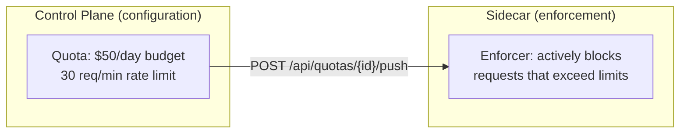
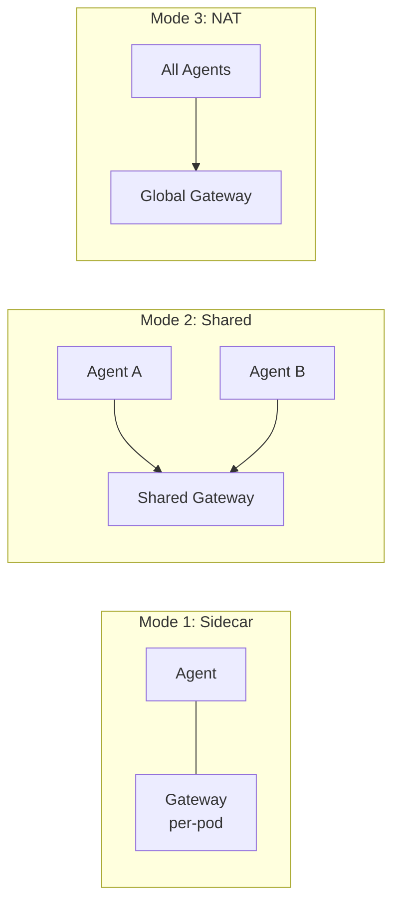

# Ostiari Control Plane

Centralized web console for managing a fleet of Ostiari sidecars — the dynamic proxies that enforce safety policies between AI agents and their tools.

---

## Architecture


---

## Features

| Feature | Description |
|---------|-------------|
| **Agent Gateway Registry** | Register gateways (formerly "sidecars"), monitor health, push configuration to one or all. 7 gateways in demo fleet. Supports 3 deployment modes: sidecar, shared, NAT |
| **Agent Registry** | View all agents across your fleet — 9 agents across 7 frameworks (OpenAI, Anthropic, Strands, Bedrock, AgentCore, CrewAI, LangGraph). Shows framework badges, tools, model, and sidecar assignment |
| **Tool Management** | CRUD tools per sidecar with search/filter by name, description, endpoint, or sidecar. 22 tools across sidecars in demo |
| **Policy Management** | Create/edit/push YAML-based safety policies (allow/block/risk rules). 5 policies configured in demo |
| **MCP Server Management** | Configure MCP servers (embedded, remote HTTP, or stdio subprocess) with auto-discovery |
| **Model Configuration** | Central registry of LLM models — 14 pre-seeded from AxonLLM. CRUD with inline routing strategy editing. Shows providers, pricing, capabilities (tools/vision), and category (reasoning/general/speed) |
| **Quotas (Runtime Enforced)** | Rate limits, budget caps, model allowlists, and max_tokens caps per sidecar. Push to sidecar for active enforcement — not just informational. 5 quotas configured in demo |
| **Sandbox** | Three-tab testing environment: Chat (invoke LLM via sidecar), Scenarios (one-click pre-built demos), Code (write and run agent code). Uses sidecar proxy to eliminate CORS |
| **Cost Dashboard** | Track LLM spend broken down by model, sidecar, agent, and day. 5 models tracked: claude-sonnet-4-6, claude-haiku-4-5, gpt-4o, gpt-4o-mini, bedrock/us.anthropic.claude-sonnet-4-6 |
| **A/B Experiments** | Percentage-based traffic splitting between models with side-by-side results comparison |
| **Live Trace Viewer** | Real-time WebSocket feed of tool calls across all sidecars. Includes /invoke tool calls, session/plan/step grouping, tool parameters (collapsed), and model badge (indigo) per trace |
| **Audit Log** | Immutable record of who changed what config, when (filterable by resource, action, actor) |
| **Sidecar Proxy** | `/api/proxy/sidecar/{id}/{path}` forwards UI requests to sidecars, eliminating CORS and enabling Sandbox in production |
| **Data Persistence** | SQLite at `backend/data/control_plane.db` + JSON state at `backend/data/state.json`. Saved on graceful shutdown, restored on startup. No re-seeding needed after restart |

### UI Design

The control plane uses a warm light theme (stone-50 background) with white cards, Inter font, and violet primary buttons. Each page features colored glowing borders that match its sidebar icon color.

### Sidebar Navigation Structure

The sidebar is organized into labeled sections with colored left border accents:

| Section | Color | Pages |
|---------|-------|-------|
| **Overview** | Violet | Dashboard |
| **Infrastructure** | Sky | Agent Gateways, Agents, Tools, MCP Servers |
| **Safety** | Rose | Policies, Quotas, Audit Log |
| **Intelligence** | Indigo | Models, Costs, A/B Tests, Efficiency |
| **Monitor** | Emerald | Live Traces |
| **Develop** | Fuchsia | Sandbox |

Each section label has a colored left border accent and colored text. Page icons use distinctive colors matching their section.

---

## Quick Start

### Backend

```bash
cd backend
pip install -e .
python main.py
# API available at http://localhost:8400
```

### Frontend

```bash
cd frontend
npm install
npm run dev
# UI available at http://localhost:3000
```

### Verify

```bash
curl http://localhost:8400/api/health
# {"status": "ok", "service": "control-plane"}
```

---

## API Reference

### Sidecars

| Endpoint | Method | Description |
|----------|--------|-------------|
| `/api/sidecars` | GET | List all registered sidecars |
| `/api/sidecars` | POST | Register a new sidecar |
| `/api/sidecars/{id}` | GET | Get sidecar details |
| `/api/sidecars/{id}` | DELETE | Remove a sidecar |
| `/api/sidecars/{id}/push` | POST | Push full config to a sidecar |
| `/api/sidecars/{id}/health` | GET | Check sidecar health |
| `/api/sidecars/push-all` | POST | Push config to all sidecars |

### Tools

| Endpoint | Method | Description |
|----------|--------|-------------|
| `/api/tools` | GET | List all tools across sidecars |
| `/api/tools/{sidecar_id}` | POST | Add a tool to a sidecar |
| `/api/tools/{id}` | DELETE | Remove a tool |

### Policies

| Endpoint | Method | Description |
|----------|--------|-------------|
| `/api/policies` | GET | List all policies |
| `/api/policies` | POST | Create a new policy |
| `/api/policies/{id}` | PATCH | Update a policy |
| `/api/policies/{id}` | DELETE | Remove a policy |
| `/api/policies/{id}/push` | POST | Push policy to its assigned sidecar |

### MCP Servers

| Endpoint | Method | Description |
|----------|--------|-------------|
| `/api/mcp-servers` | GET | List MCP servers (optional `?sidecar_id=` filter) |
| `/api/mcp-servers/{sidecar_id}` | POST | Add an MCP server to a sidecar |
| `/api/mcp-servers/{id}` | DELETE | Remove an MCP server |

### Models

| Endpoint | Method | Description |
|----------|--------|-------------|
| `/api/models` | GET | List all registered models (14 pre-seeded from AxonLLM) |
| `/api/models` | POST | Register a new model (custom or fine-tuned) |
| `/api/models/{id}` | GET | Get model details (pricing, capabilities, routing strategy) |
| `/api/models/{id}` | PUT | Update a model's configuration |
| `/api/models/{id}` | DELETE | Remove a model from the registry |

### Quotas

| Endpoint | Method | Description |
|----------|--------|-------------|
| `/api/quotas` | GET | List all quotas (optional `?sidecar_id=` filter) |
| `/api/quotas` | POST | Create a new quota (rate limits, budget, model allowlist, max_tokens) |
| `/api/quotas/{id}` | GET | Get quota details |
| `/api/quotas/{id}` | PUT | Update a quota |
| `/api/quotas/{id}` | DELETE | Remove a quota |
| `/api/quotas/{id}/push` | POST | **Push quota to sidecar** — activates runtime enforcement |

> **Important:** Creating a quota only saves it in the database. You must call `/push` to activate enforcement on the sidecar. The sidecar's `/config/quota` endpoint receives the quota config and begins enforcing rate limits, budgets, model restrictions, and token caps immediately.

### Cost Tracking

| Endpoint | Method | Description |
|----------|--------|-------------|
| `/api/costs/summary` | GET | Aggregated costs by model/sidecar/agent/day (`?period_days=7&sidecar_id=`) |
| `/api/costs/records` | GET | List individual usage records (`?sidecar_id=&model=&limit=100`) |
| `/api/costs/record` | POST | Record a single usage event (called by sidecars) |
| `/api/costs/record/batch` | POST | Record a batch of usage events |

### A/B Experiments

| Endpoint | Method | Description |
|----------|--------|-------------|
| `/api/experiments` | GET | List all experiments |
| `/api/experiments` | POST | Create a new experiment |
| `/api/experiments/{name}` | DELETE | Delete an experiment |
| `/api/experiments/{name}/toggle` | PATCH | Enable/disable an experiment |
| `/api/experiments/{name}/results` | GET | Compare model A vs model B stats (`?period_days=7`) |

### Live Traces

| Endpoint | Method | Description |
|----------|--------|-------------|
| `/api/traces/ingest` | POST | Receive a trace event from a sidecar. Requires the `X-Ingest-Key` header when `OSTIARI_INGEST_KEY` is set (fail-open in dev when unset). |
| `/api/traces/recent` | GET | Get recent traces (`?limit=50`) |
| `/ws/traces` | WebSocket | Live stream of trace events (for the UI) |

### Audit Log

| Endpoint | Method | Description |
|----------|--------|-------------|
| `/api/audit` | GET | List audit entries (`?resource_type=&actor=&action=&limit=100`) |

### Agents

| Endpoint | Method | Description |
|----------|--------|-------------|
| `/api/agents` | GET | List all registered agents (framework, model, tools, sidecar assignment) |
| `/api/agents/{id}` | GET | Get agent details |
| `/api/agents` | POST | Register a new agent |
| `/api/agents/{id}` | PUT | Update agent configuration |
| `/api/agents/{id}` | DELETE | Remove an agent |

### Sidecar Proxy

| Endpoint | Method | Description |
|----------|--------|-------------|
| `/api/proxy/sidecar/{id}/{path}` | ANY | Forward request to a sidecar (eliminates CORS, enables Sandbox) |

> The proxy looks up the sidecar's registered endpoint and forwards the full request (method, headers, body). The browser never talks to sidecars directly.

### Health

| Endpoint | Method | Description |
|----------|--------|-------------|
| `/api/health` | GET | Control plane health check |

---

## Tech Stack

| Layer | Technology |
|-------|-----------|
| Frontend | React 18, Tailwind CSS, Vite |
| Backend | Python 3.11+, FastAPI, SQLAlchemy (async), Pydantic |
| Database | SQLite (dev) / PostgreSQL (prod) |
| Real-time | WebSockets (trace streaming) |
| Sidecar Communication | HTTP push (POST /config) |
| LLM Cost Estimation | Built-in pricing table (Claude, GPT-4o, etc.) |

---

## Project Structure

```
ostiari-control-plane/
├── backend/
│   ├── main.py                  # Entry point
│   ├── data/
│   │   └── control_plane.db    # SQLite database (persists all state)
│   ├── control_plane/
│   │   ├── app.py              # FastAPI app factory
│   │   ├── database.py         # Async DB session
│   │   ├── routers/            # API route handlers
│   │   │   ├── sidecars.py
│   │   │   ├── tools.py
│   │   │   ├── policies.py
│   │   │   ├── mcp_servers.py
│   │   │   ├── models.py       # Model registry CRUD (14 pre-seeded)
│   │   │   ├── quotas.py       # Quota CRUD + push to sidecar
│   │   │   ├── agents.py       # Agent registry (9 agents, 7 frameworks)
│   │   │   ├── proxy.py        # Sidecar proxy (eliminates CORS)
│   │   │   ├── costs.py
│   │   │   ├── experiments.py
│   │   │   ├── traces.py
│   │   │   └── audit.py
│   │   ├── models/             # DB models + Pydantic schemas
│   │   └── services/           # Business logic (push, audit)
│   └── pyproject.toml
├── frontend/
│   ├── src/
│   │   ├── pages/
│   │   │   ├── Agents.tsx      # Agent registry page
│   │   │   ├── Models.tsx      # Model configuration page
│   │   │   ├── Quotas.tsx      # Quota management + push
│   │   │   ├── Sandbox.tsx     # Chat / Scenarios / Code tabs
│   │   │   └── ...
│   │   └── ...
│   └── package.json
└── docs/
    └── getting-started.md      # Step-by-step setup guide
```

---

## Runtime Enforcement (Not Just Informational)

A key architectural distinction: quotas and budgets in the control plane are **runtime-enforced on the sidecar**, not just informational dashboards.



When you push a quota, the sidecar:
1. Loads the quota config into its in-memory enforcer
2. Checks every incoming request against rate limits, budgets, model allowlists, and token caps
3. Rejects requests that would exceed limits (429 for rate/budget, 403 for model restrictions)
4. Silently caps max_tokens without rejecting (agent gets shorter responses, not errors)

The sidecar calculates cost locally using per-model pricing tables (no round-trip to control plane needed). Pre-request budget projection estimates cost BEFORE calling the LLM, preventing budget overshoot.

---

## Demo Fleet Summary

The demo environment showcases the full platform with:

| Resource | Count | Details |
|----------|-------|---------|
| Sidecars | 7 | crm-agent, ops-agent, support-agent, devops-agent, analytics-agent, security-agent, finance-agent |
| Agents | 9 | Across 7 frameworks (OpenAI, Anthropic, Strands, Bedrock, AgentCore, CrewAI, LangGraph) |
| Tools | 22 | Across all sidecars |
| Policies | 5 | Global + sidecar-specific |
| Quotas | 5 | Rate limits + budgets per sidecar |
| Models | 5 in cost tracking | claude-sonnet-4-6, claude-haiku-4-5, gpt-4o, gpt-4o-mini, bedrock/us.anthropic.claude-sonnet-4-6 |
| Live Traces | Active | From all agents with session grouping |

---

## Agent Gateway (UI Rename from "Sidecar")

The UI now displays "Agent Gateways" instead of "Sidecars." The concept: an Agent Gateway can be deployed in three modes — not just as a K8s sidecar.



| Mode | Description |
|------|-------------|
| **Sidecar** | Per-pod in K8s, co-located with the agent |
| **Shared gateway** | One gateway serving multiple agents (per-agent auth) |
| **Global NAT gateway** | Network-level proxy all agents route through |

> **API routes still use `/api/sidecars`** for backward compatibility. The rename is UI-only for now.

---

## Per-Agent Tool Authorization

Least privilege enforcement when multiple agents share a gateway:

- Each agent gets explicit tool grants (exact names or wildcards like `github.*`)
- Unregistered agents denied by default
- Wildcard `*` for full access
- Future JWT override documented for temporary elevated access

---

## Full Cost Enforcement (Sidecar-Local)

The sidecar calculates cost locally and enforces budgets without round-tripping to the control plane:

- **Pre-request budget projection** — blocks before calling the LLM if cost would exceed budget
- **Local pricing table** — per-model pricing for all supported models
- **Budget alerts** at 80% / 90% / 100% thresholds
- **Silent max_tokens cap** — reduces output length without erroring

---

## Related

- [Ostiari Sidecar](https://github.com/hk-775/Ostiari) — the runtime proxy that sits between agents and tools
- [Getting Started Guide](docs/getting-started.md) — full walkthrough from zero to running fleet
