# Getting Started: Ostiari Control Plane + Agent Gateways

## What is the Control Plane?

The Ostiari Control Plane is a centralized admin console that lets you manage all your Ostiari gateways from one place. Think of it like a router admin panel, but instead of managing network traffic, you manage AI agent safety.

**Without the control plane:** You would need to SSH into each gateway, manually edit config files, and restart processes. If you have 20 agents, that means 20 manual deployments every time a policy changes.

**With the control plane:** You open a web UI, change a policy, click "Push," and every gateway reloads in under a second. No restarts. No code changes. No deploying anything.

The control plane itself is a React frontend (for the UI) backed by a FastAPI server (for the API and database). It communicates with gateways over HTTP, pushing configuration to them and receiving telemetry back.

> **On naming:** this component is an **Agent Gateway**, not a "sidecar" — sidecar
> is only one of its three deployment modes (see [Agent Gateway Deployment
> Model](#agent-gateway-deployment-model)). Control-plane routes are
> `/api/gateways/*`; there is **no** `/api/sidecars` alias — it returns 404. Two
> places keep the old word: the gateway's CLI flag `--sidecar-id`, and the
> `sidecar_id` field in the gateway's own `/health` and trace-ingest payloads.

---

## Features Overview

The control plane provides twelve core capabilities:

| # | Feature | What it does |
|---|---------|-------------|
| 1 | **Agent Gateway Registry** | Register gateways, monitor their health, and push configuration to one or all at once. Supports sidecar, shared, and NAT deployment modes |
| 2 | **Tool Management** | Define the HTTP endpoints (tools) each gateway proxies to, so agents can call them |
| 3 | **Policy Management** | Create safety policies with allow/block/risk-score rules that gateways enforce in real time |
| 4 | **MCP Server Management** | Connect MCP-compatible tool servers (embedded, remote, or stdio) that auto-discover tools |
| 5 | **Model Configuration** | Central registry of LLM models with pricing, capabilities, providers, and routing strategies. 18 models pre-seeded. |
| 6 | **Quotas (Runtime Enforced)** | Rate limits, budget caps, model allowlists, and max_tokens caps — pushed to gateways and enforced at runtime |
| 7 | **Sandbox** | Interactive testing through real gateways: chat, scenarios, browser-isolated JavaScript, and A2A. The Code tab selects a registered gateway and executes real control flow through a bounded governed tool bridge |
| 8 | **Cost Dashboard** | Track LLM spend across your fleet, broken down by model, gateway, agent, and day |
| 9 | **A/B Experiments** | Compare two models on cost/token/request metrics. Creating, toggling, or deleting an experiment pushes the full set to its gateway, which runs the split — see Step 13 |
| 10 | **Live Trace Viewer** | Watch tool calls happen in real time across all gateways via WebSocket streaming, including /invoke tool calls, session grouping, and parameters. In-memory, 200 per org |
| 11 | **Audit Log** | Hash-chained, tamper-evident history of configuration changes — gateways, policies, tools, MCP servers, quotas, models, agents, and experiments |
| 12 | **Agent Registry** | View all agents across your fleet — framework badges, tools, model, and gateway assignment. 9 agents across 8 frameworks in demo |

---

### Sidebar Navigation

The UI sidebar is organized into labeled sections, each with a colored left border accent and a colored section label:

| Section | Color | Pages |
|---------|-------|-------|
| **Observe** | Emerald | Dashboard, Live Traces, Shadow Report, Approvals, Costs, Metering, Audit Log, Compliance, ROI / Savings |
| **Control** | Rose | Models (per agent), Policies (per tool), Quotas (per gateway), Quotas (per agent) |
| **Monetize** | Emerald | Payments (x402), Token Broker |
| **Configure** | Sky | Discovery, Agent Gateways, Agents, Tools, MCP Servers, Protocol (A2A) |
| **Test** | Fuchsia | Sandbox, A/B Tests, Architecture |
| **Admin** | Violet | LLM Providers, Users |

This grouping follows the operator's mental model: "what happened" (Observe) -> "what's enforced" (Control) -> "who pays" (Monetize) -> "what exists" (Configure) -> "try it" (Test) -> "who has access" (Admin).

**Admin** is admin-only; a `viewer` additionally loses the write sections. The
authoritative list is `frontend/src/components/Layout.tsx`.

Two routes exist in `App.tsx` but aren't linked from the sidebar: `/efficiency`
and `/` (the landing page).

---

## System Architecture


**Data flow:**
1. Platform team configures tools, policies, and MCP servers via the UI
2. Control plane pushes config to gateways over HTTP
3. Agents call tools through their gateway (the gateway enforces policies)
4. Gateways report usage and traces back to the control plane
5. Platform team monitors costs, traces, and experiments in the UI

---

## What This Guide Covers

This guide walks you through the complete setup — from zero to a fully managed AI agent safety infrastructure:

1. Deploy gateways alongside your agents
2. Start the control plane (this project)
3. Register gateways in the control plane
4. Configure tools and policies via the UI
5. Push configuration to gateways
6. Connect your agents to the gateways
7. Add MCP servers for auto-discovered tools
8. Monitor costs and set up budgets
9. Configure the model registry
10. Create quotas with runtime enforcement
11. Test everything in the Sandbox
12. Run A/B experiments between models
13. Monitor live traces with session context
14. View the agent registry

By the end, you'll have a centralized dashboard managing all your agent gateways, with safety policies, cost budgets, and rate limits enforced without any code changes to your agents.

---

## The Big Picture

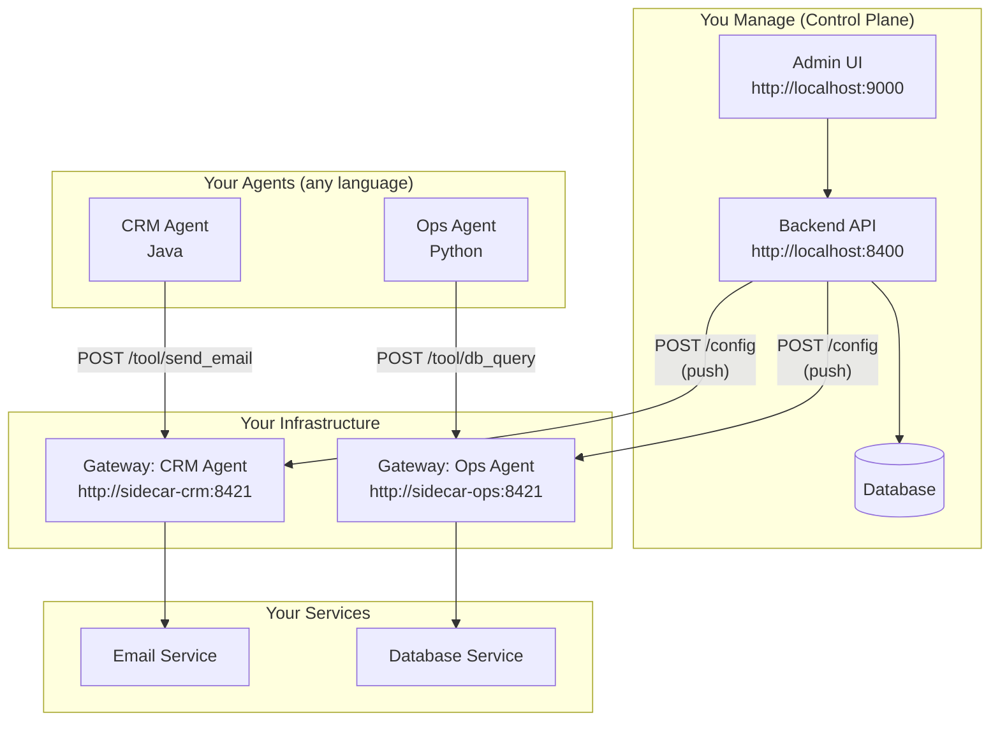

---

## Prerequisites

- Python 3.11+ for the control-plane backend (`control-plane/backend/pyproject.toml`
  sets `requires-python = ">=3.11"`); the Guard library and the gateway both
  accept 3.10+. CI runs a single Python 3.11 / `ubuntu-latest` job.
- Node.js 20+ (for the frontend)
- Docker (optional, for containerized deployment)

---

## Step 1: Deploy a Gateway

The gateway is the runtime proxy that sits between your agent and its tools. You
deploy one gateway per agent (or per group of agents).

> The CLI flag is still `--sidecar-id` — it names the gateway, and it **must**
> match the gateway's id in the control plane, or the control plane will push
> that gateway's tools and policy to an id nothing is listening on.

### Option A: Run directly (development)

```bash
# Clone the Ostiari repo (contains the gateway)
git clone https://github.com/hk-775/ostiari.git
cd ostiari

# Install the core library, bundled AxonLLM, then the gateway package
pip install -e .
pip install -e "vendor/axonllm[server]"
pip install -e "gateway[payments,redis]"

# Start (empty — will be configured via control plane)
ostiari-gateway --sidecar-id crm-agent --port 8421
```

Or without installing the console script:

```bash
cd gateway && python -m ostiari_gateway.main --sidecar-id crm-agent --port 8421
```

You should see (the banner still says "Sidecar" — `main.py:86`):

```
Ostiari Sidecar [crm-agent]: http://0.0.0.0:8421
  POST /tool/{action}       — validate & proxy to remote endpoint
  POST /validate            — validate only
  POST /config              — apply full config (control plane)
  POST /config/tools        — hot-reload tools
  POST /config/tools/{name} — add/update single tool
  POST /config/policy       — hot-reload policy
  GET  /config              — view current config
  GET  /tools               — list registered tools
  GET  /health              — health check
```

### Option B: Run with Docker (production)

```bash
# Build the gateway image (from the repo root — the Dockerfile lives in deploy/)
docker build -f deploy/docker/Dockerfile.gateway -t ostiari-gateway .

# Run it
docker run -d \
  --name gateway-crm \
  -p 8421:8421 \
  ostiari-gateway \
  --sidecar-id crm-agent
```

The image runs as a non-root user (uid 10001), so mount any writable volume with
that ownership. `deploy/docker/docker-compose.yml` brings up the gateway,
control plane, and frontend together.

### Option C: Run with initial config (skip control plane for testing)

```bash
cd gateway
ostiari-gateway \
  --sidecar-id crm-agent \
  --config example-config.yaml \
  --port 8421
```

`gateway/example-config.yaml` pre-configures tools and policies so you can test
immediately without the control plane. (`gateway/llm-gateway-config.yaml` is the
richer one the demo uses — it also enables the LLM module.)

### Verify the gateway is running

```bash
curl http://localhost:8421/health
```

Expected response:
```json
{
  "status": "ok",
  "sidecar_id": "crm-agent",
  "tools_registered": 0,
  "http_tools": 0,
  "mcp_tools": 0,
  "mcp_servers": 0,
  "policy_loaded": false,
  "modules_active": [],
  "modules_available": [{"name": "llm_gateway", "description": "..."}],
  "quota": {"...": "..."},
  "agent_auth": {"...": "..."},
  "llm_router": {"...": "..."}
}
```

---

## Step 2: Start the Control Plane

The control plane is THIS project. It's the admin console that manages all your gateways.

### Backend

```bash
cd control-plane/backend
pip install -e .
python main.py
```

The API starts at `http://localhost:8400`. Verify:

```bash
curl http://localhost:8400/api/health
# {"status": "ok", "service": "control-plane"}
```

### Frontend

```bash
cd control-plane/frontend
npm ci
npm run dev
```

The UI starts at `http://localhost:9000`. Open it in your browser.

---

## Step 3: Register a Gateway in the Control Plane

### Via the UI

1. Open `http://localhost:9000`
2. Click **Gateways** in the sidebar (under **Configure**)
3. Click **Register**
4. Fill in:
   - **Gateway ID:** `crm-agent` — must match the id the gateway was started with
   - **Name:** `CRM Agent Gateway`
   - **Endpoint URL:** `http://localhost:8421`
5. Click **Register**

```
┌──────────────────────────────────────────────────────────┐
│  Agent Gateways                    [Push All] [+ Register]│
│  Register and manage your agent gateway fleet             │
│                                                           │
│  ┌─────────────────────────────────────────────────────┐ │
│  │  Gateway ID:  [crm-agent                         ]  │ │
│  │  Name:        [CRM Agent Gateway                  ]  │ │
│  │  Endpoint URL:[http://localhost:8421              ]  │ │
│  │                                                      │ │
│  │  [Register]  [Cancel]                                │ │
│  └─────────────────────────────────────────────────────┘ │
│                                                           │
│  ┌─────────────────────────────────────────────────────┐ │
│  │  Name          │ Endpoint              │ Status │ ... │
│  │─────────────────────────────────────────────────────│ │
│  │  CRM Agent     │ http://localhost:8421  │ ● reg  │ ↑🗑│ │
│  └─────────────────────────────────────────────────────┘ │
└──────────────────────────────────────────────────────────┘
```

A gateway that's already running will have auto-registered itself on startup, so
you may find it already listed. Registering by hand first just gives it a
friendly name and makes it visible before it comes up.

### Via the API (curl)

```bash
curl -X POST http://localhost:8400/api/gateways \
  -H "Content-Type: application/json" \
  -d '{
    "id": "crm-agent",
    "name": "CRM Agent Gateway",
    "endpoint": "http://localhost:8421"
  }'
```

---

## Step 4: Add Tools to the Gateway

Tools are the remote services the gateway proxies to. They're what your agent
calls through the gateway.

### Via the UI

The **Tools** page (under **Configure**) lists every tool registered across your
fleet. Creating them is API-driven for now — use the calls below, then push.

### Via the API

```bash
# Add send_email tool
curl -X POST http://localhost:8400/api/tools/crm-agent \
  -H "Content-Type: application/json" \
  -d '{
    "name": "send_email",
    "endpoint": "http://email-service:8080/send",
    "method": "POST",
    "description": "Send an email to a recipient",
    "timeout_seconds": 10
  }'

# Add db_query tool
curl -X POST http://localhost:8400/api/tools/crm-agent \
  -H "Content-Type: application/json" \
  -d '{
    "name": "db_query",
    "endpoint": "http://db-service:8080/query",
    "method": "POST",
    "description": "Execute a database query",
    "timeout_seconds": 30
  }'
```

Registering a tool for an unknown gateway returns **404** — register the gateway
(Step 3) first. `GET /api/tools?gateway_id=crm-agent` lists one gateway's tools;
without the filter you get the whole (org-scoped) fleet.

### Bulk-import from an OpenAPI spec

If the service already publishes a spec, you don't have to enumerate tools by hand:

```bash
# Preview what would be generated — nothing is persisted
curl -X POST http://localhost:8400/api/tools/crm-agent/import-openapi \
  -H "Content-Type: application/json" \
  -d '{"source": "https://email-service/openapi.json", "preview": true}'
# {"status": "preview", "count": 12, "tools": [{"name": "...", "method": "POST", ...}]}

# Import for real, namespacing the generated names
curl -X POST http://localhost:8400/api/tools/crm-agent/import-openapi \
  -H "Content-Type: application/json" \
  -d '{"source": "https://email-service/openapi.json", "name_prefix": "email."}'
```

`source` takes a URL, or raw JSON/YAML text; `spec` takes an inline spec object.
`server_url` overrides the base URL from the spec. Import **upserts by
(gateway, name)**, so re-importing an updated spec refreshes tools instead of
duplicating them — pass `"replace": true` to delete the gateway's other tools
first. A spec that won't parse returns 400; a URL that won't fetch returns 502.

After adding, verify on the **Tools** page:

```
┌──────────────────────────────────────────────────────────┐
│  Tools                                                    │
│  All tools registered across gateways                     │
│                                                           │
│  ┌─────────────────────────────────────────────────────┐ │
│  │ Tool       │ Endpoint                │ Method │ Side │ │
│  │──────────────────────────────────────────────────────│ │
│  │ send_email │ http://email-svc:8080   │ POST   │ crm  │ │
│  │ db_query   │ http://db-svc:8080      │ POST   │ crm  │ │
│  └─────────────────────────────────────────────────────┘ │
└──────────────────────────────────────────────────────────┘
```

---

## Step 5: Create a Policy

Policies define what's allowed, what's blocked, and what needs human approval.

### Via the UI

1. Go to the **Policies** page
2. Click **New Policy**
3. Enter a name: `CRM Safety Policy`
4. Enter the policy JSON:

```json
{
  "block": ["*delete*", "*.drop"],
  "allow": ["db_query"],
  "rules": [
    {
      "type": "risk_adjust",
      "action": "send_email",
      "risk_adjust": 25,
      "description": "Email has moderate risk"
    }
  ],
  "thresholds": {
    "global": {
      "allow_max": 30,
      "intervene_max": 70
    }
  }
}
```

> **Why `*delete*` and not `*.delete`.** Patterns are `fnmatch` globs, so
> `*.delete` requires a literal dot: it matches `github.delete` but **not**
> `db_delete`. The demo seeders learned this the hard way — both
> `register_demo_tools.py` and `register_fleet_tools.py` now use
> `["*delete*", "*.drop", "*.destroy", "db_delete"]`. If you write `*.delete`
> and then call `db_delete`, the call is *scored*, not blocked, and probably
> executes.

> **The schema is strict.** Top level accepts exactly `allow`, `block`, `rules`,
> and `thresholds` — anything else (including a `version:` key) is rejected as an
> unknown top-level key. A rule is keyed by `type`, not `decision`, and `type`
> must be one of `allow`, `block`, `risk_adjust`, `threshold_override`,
> `context_rule`. Caps: 500 rules per file, 256 characters per pattern, and the
> same pattern in both `allow` and `block` is an error rather than a precedence
> question. See `src/ostiari/policy/validator.py`.

5. Click **Create**

```
┌──────────────────────────────────────────────────────────┐
│  Policies                                    [+ New Policy]│
│  Define safety rules for your agents                      │
│                                                           │
│  ┌─────────────────────────────────────────────────────┐ │
│  │  📄 CRM Safety Policy                         [↑] [🗑] │
│  │  Global policy · Active                              │ │
│  │  ┌────────────────────────────────────────────────┐  │ │
│  │  │ {                                              │  │ │
│  │  │   "block": ["*delete*", "*.drop"],             │  │ │
│  │  │   "allow": ["db_query"],                       │  │ │
│  │  │   "rules": [                                   │  │ │
│  │  │     {"type": "risk_adjust",                    │  │ │
│  │  │      "action": "send_email",                   │  │ │
│  │  │      "risk_adjust": 25}                        │  │ │
│  │  │   ]                                            │  │ │
│  │  │ }                                              │  │ │
│  │  └────────────────────────────────────────────────┘  │ │
│  └─────────────────────────────────────────────────────┘ │
└──────────────────────────────────────────────────────────┘
```

### What the policy means

| Rule | Effect |
|------|--------|
| `block: ["*delete*", "*.drop"]` | `*delete*` blocks any action with "delete" anywhere in the name (score 100); `*.drop` only matches a dotted name like `db.drop` |
| `allow: ["db_query"]` | `db_query` is always allowed (score 0) |
| `rules: send_email → +25` | `send_email` gets +25 risk score (total 25, under allow_max of 30 → allowed) |
| `thresholds: allow_max=30` | Score ≤ 30 = allowed |
| `thresholds: intervene_max=70` | Score 31-70 = needs human approval |
| Score > 70 | Blocked automatically |

---

## Step 6: Push Configuration to the Gateway

This is the key step — sending the tools + policy you configured in the control plane to the actual running gateway.

### Via the UI

1. Go to the **Gateways** page
2. Click the **↑** (upload/push) icon next to your gateway
3. Or click **Push All** to sync all gateways at once

### Via the API

```bash
# Push to one gateway
curl -X POST http://localhost:8400/api/gateways/crm-agent/push

# Push to all gateways in your org
curl -X POST http://localhost:8400/api/gateways/push-all
```

Expected response:
```json
{"gateway_id": "crm-agent", "status": "success", "message": ""}
```

`push-all` returns the per-gateway results plus counts:

```json
{"results": [{"gateway_id": "crm-agent", "status": "success", "message": ""}],
 "total": 1, "succeeded": 1, "failed": 0}
```

A single push that fails returns **502** with the failure detail, rather than a
200 you have to inspect.

> **What a push actually carries — and what the gateway keeps.** `_build_config`
> sends `gateway_id`, `tools`, the merged `policy`, `mcp_servers`, `payments`
> (when configured), everything in the gateway's stored `config` blob (modules,
> `llm`, …), and an explicit `mode`. The register/heartbeat path additionally
> folds in `quotas`, `agent_auth`, and `ab_experiments` from that stored blob. The
> gateway's `_apply_bundle` reads all of these — tools, policy, MCP, payments,
> quotas, agent-auth, A/B experiments, and `mode`. Mode is applied **first**, before
> tools or policy, so a gateway the operator left in shadow doesn't spend even one
> request enforcing. An unrecognized mode value is ignored rather than defaulted, so
> a typo can't silently flip a deliberately-observing gateway into enforcement. See
> [`docs/Ostiari-Configure-Orchestrate-Lifecycle.md`](../../docs/Ostiari-Configure-Orchestrate-Lifecycle.md).

### What happens during a push

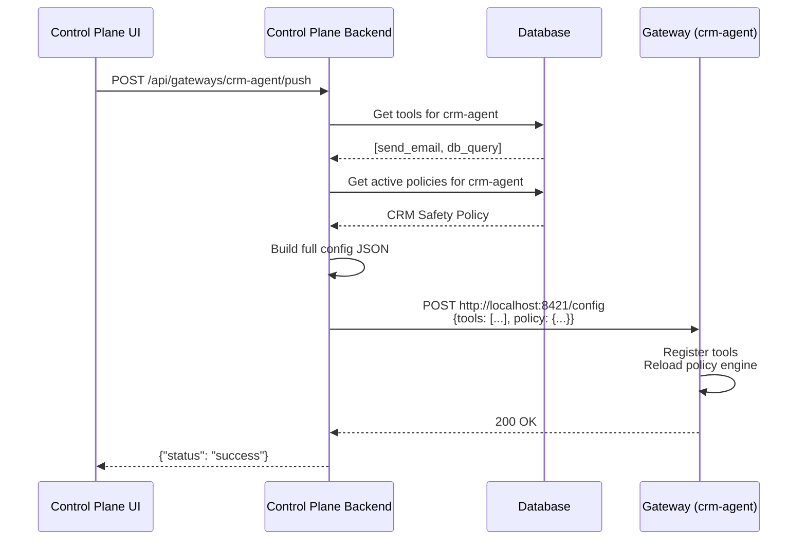

After pushing, verify the gateway received the config:

```bash
curl http://localhost:8421/tools
# {"tools": [{"name": "send_email", ...}, {"name": "db_query", ...}]}

curl http://localhost:8421/health
# {"status": "ok", "tools_registered": 2, "policy_loaded": true, ...}
```

---

## Step 7: Connect Your Agent to the Gateway

Now your gateway is configured. Point your agent at it.

### Python Agent

```python
import requests

GATEWAY = "http://localhost:8421"

def call_tool(action: str, params: dict) -> dict:
    resp = requests.post(f"{GATEWAY}/tool/{action}", json=params)
    if resp.status_code == 403:
        return {"blocked": True, "reason": resp.json()["reason"]}
    if resp.status_code == 404:
        return {"error": "Unknown tool"}
    return resp.json()["result"]

# Example: this will work (db_query is in the allow list)
result = call_tool("db_query", {"sql": "SELECT * FROM customers LIMIT 10"})
print(result)

# Example: this will be BLOCKED (*delete* matches the block list)
result = call_tool("db_delete", {"table": "customers"})
print(result)  # {"blocked": True, "reason": "Blocked by policy"}
```

A blocked call is a **403** whose body is
`{"blocked": true, "action": ..., "score": ..., "reason": ..., "rule_id": ...}`.
Two other refusals use different codes and are worth handling separately: a quota
or budget refusal is **429** with a `limit_type` field
(`rate_limit` / `budget` / `model_restriction`), and an agent-authorization or
delegation refusal is **403** with `limit_type` set to `agent_authorization` /
`cross_agent_delegation`. There is no `Retry-After` header on the gateway's 429 —
only the standalone `RateLimitMiddleware` in `src/ostiari/http_limits.py` sets one.

### Java Agent

```java
String GATEWAY = "http://localhost:8421";
HttpClient client = HttpClient.newHttpClient();

// Allowed: db_query
HttpResponse<String> resp = client.send(
    HttpRequest.newBuilder()
        .uri(URI.create(GATEWAY + "/tool/db_query"))
        .header("Content-Type", "application/json")
        .POST(BodyPublishers.ofString("{\"sql\": \"SELECT * FROM users\"}"))
        .build(),
    BodyHandlers.ofString());
System.out.println(resp.statusCode()); // 200

// Blocked: delete action
resp = client.send(
    HttpRequest.newBuilder()
        .uri(URI.create(GATEWAY + "/tool/db_delete"))
        .header("Content-Type", "application/json")
        .POST(BodyPublishers.ofString("{\"table\": \"users\"}"))
        .build(),
    BodyHandlers.ofString());
System.out.println(resp.statusCode()); // 403
```

### curl (for testing)

```bash
# Allowed
curl -X POST http://localhost:8421/tool/db_query \
  -H "Content-Type: application/json" \
  -d '{"sql": "SELECT * FROM users"}'
# → 200 {"result": {...}, "action": "db_query", "duration_ms": 45.2}

# Blocked
curl -X POST http://localhost:8421/tool/db_delete \
  -H "Content-Type: application/json" \
  -d '{"table": "users"}'
# → 403 {"blocked": true, "action": "db_delete", "score": 100, "reason": "...", "rule_id": "..."}
```

In **shadow** mode the same call answers **200** with
`{"result": {"shadow": true, "note": "shadowed — tool not executed"}, ...}` — the
decision is recorded as `would_block` and no side effect runs. That's the "try
before you enforce" path; see the Shadow Report page.

---

## Complete Workflow Diagram

Here's everything connected end-to-end:

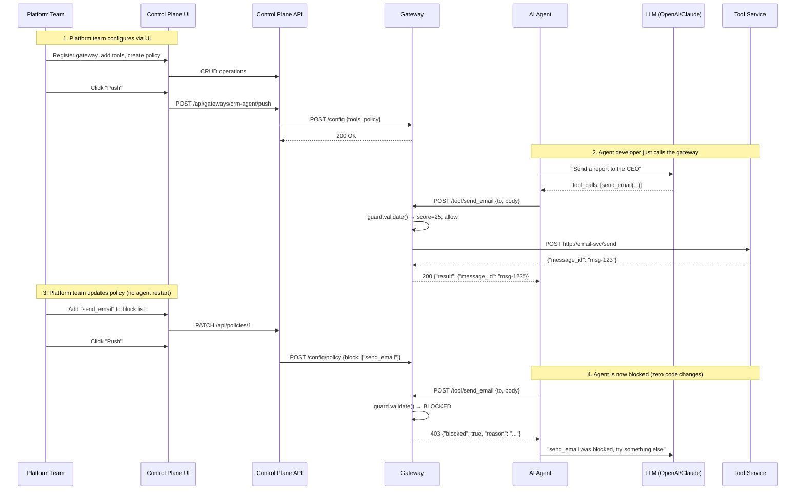

---

## Deploying Multiple Gateways

For production, you'll have one gateway per agent (or per agent group):

```bash
# Gateway for CRM agent
docker run -d --name gateway-crm -p 8421:8421 ostiari-gateway --sidecar-id crm-agent

# Gateway for Ops agent
docker run -d --name gateway-ops -p 8422:8421 ostiari-gateway --sidecar-id ops-agent

# Gateway for Support agent
docker run -d --name gateway-support -p 8423:8421 ostiari-gateway --sidecar-id support-agent
```

Then register all three in the control plane:

```bash
curl -X POST http://localhost:8400/api/gateways -d '{"id":"crm-agent","name":"CRM","endpoint":"http://gateway-crm:8421"}'
curl -X POST http://localhost:8400/api/gateways -d '{"id":"ops-agent","name":"Ops","endpoint":"http://gateway-ops:8421"}'
curl -X POST http://localhost:8400/api/gateways -d '{"id":"support-agent","name":"Support","endpoint":"http://gateway-support:8421"}'
```

Each gateway can have different tools and policies — configure them independently via the UI.

---

## Updating Policies Without Restarting Anything

This is the killer feature. To change what your agents can do:

1. Edit the policy in the UI (or via API)
2. Click Push
3. Done. The gateway hot-reloads. The agent doesn't restart. No code changes.

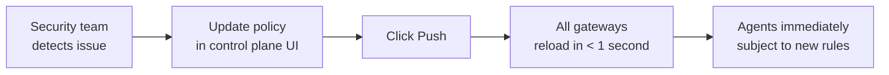

**Real-world scenario:** It's 2 AM. An agent is spamming emails due to a bug. The on-call:
1. Opens the control plane UI on their phone
2. Adds `send_email` to the block list
3. Clicks Push
4. Problem stopped. No deploy. No code change. No agent restart.

---

## Health Monitoring

Gateways heartbeat to the control plane every 30s. You can also poll one on
demand — the control plane calls the gateway's own `/health` and returns it
nested under `details`:

```bash
# Check one gateway
curl http://localhost:8400/api/gateways/crm-agent/health
```

Response:
```json
{
  "gateway_id": "crm-agent",
  "status": "healthy",
  "details": {
    "status": "ok",
    "sidecar_id": "crm-agent",
    "tools_registered": 3,
    "http_tools": 2,
    "mcp_tools": 1,
    "mcp_servers": 1,
    "policy_loaded": true,
    "modules_active": ["llm_gateway"],
    "modules_available": ["llm_gateway", "payments", "a2a"],
    "quota": {
      "current_rpm": 4,
      "current_spend": 1.8234,
      "spend_scope": "process",
      "rate_limit_rpm": 60,
      "budget_limit_usd": 10.0,
      "max_tokens_per_request": 2048,
      "allowed_models": ["claude-sonnet-4-6"],
      "budget_pct_used": 18.2,
      "pricing_models": 8
    },
    "agent_auth": {
      "enabled": true,
      "registered_agents": 4,
      "default_grants": [],
      "default_models": ["*"],
      "default_providers": ["*"]
    },
    "llm_router": {"available": true}
  }
}
```

`quota.spend_scope` is the one to watch: `"process"` means spend is tracked in
this gateway's memory only, `"fleet"` means Redis is wired up and the budget is
shared across gateways. The `rate_limit_rpm` / `budget_limit_usd` /
`max_tokens_per_request` / `allowed_models` / `budget_pct_used` keys appear **only
once a quota has been pushed** — a health response with just `current_rpm`,
`current_spend`, and `spend_scope` means no quota is configured. Similarly
`agent_auth.enabled: false` means the per-agent gate is inert regardless of what
the UI shows.

`tools_registered` is the **sum** of `http_tools` and `mcp_tools`, so it moves when
an MCP server connects or drops. `policy_loaded` is just "a Guard exists" — it's
`true` for a permissive policy too, so it tells you a policy loaded, not that it
blocks anything. The `quota` and `agent_auth` blocks are the enforcers' live view,
which is the fastest way to confirm a push actually landed (and to see current
spend). Note there is no `mode` field: the gateway doesn't report whether it's
enforcing or shadowing, which is the same gap that makes mode not survive a
restart.

If the gateway can't be reached, the same call returns `"status": "unreachable"`
with an `error` field instead of `details` — and the control plane marks the
gateway unreachable as a side effect. (The `sidecar_id` inside `details` is the
gateway's own field name, unchanged; the control plane's own key is
`gateway_id`.)

The dashboard shows real-time status for all gateways:

```
┌──────────────────────────────────────────────────────────┐
│  Control Plane                                            │
│  Manage your Ostiari gateway fleet                     │
│                                                           │
│  ┌──────────┐  ┌──────────┐  ┌──────────┐               │
│  │    3     │  │    8     │  │    2     │               │
│  │ Gateways │  │  Tools   │  │ Policies │               │
│  └──────────┘  └──────────┘  └──────────┘               │
│                                                           │
│  Gateway Fleet                                            │
│  ┌─────────────────────────────────────────────────────┐ │
│  │  CRM Agent Gateway                                   │ │
│  │  http://sidecar-crm:8421           3 tools  ● healthy│ │
│  │─────────────────────────────────────────────────────│ │
│  │  Ops Agent Gateway                                   │ │
│  │  http://sidecar-ops:8421           2 tools  ● healthy│ │
│  │─────────────────────────────────────────────────────│ │
│  │  Support Agent Gateway                               │ │
│  │  http://sidecar-support:8421       3 tools ● unreachable│ │
│  └─────────────────────────────────────────────────────┘ │
└──────────────────────────────────────────────────────────┘
```

---

## Step 8: Add MCP Servers (Auto-Discover Tools)

MCP servers are services that expose tools via the Model Context Protocol. Instead of manually registering each tool, you add an MCP server and the gateway **auto-discovers all its tools**.

### What is MCP? (Simple Explanation)

Think of MCP like USB for AI tools:
- Plug in a USB device → computer discovers what it can do
- Add an MCP server → gateway discovers what tools it has

A GitHub MCP server might expose 15+ tools (create_issue, list_repos, search_code, create_pr, etc.). Without MCP, you'd register each one manually. With MCP, you point the gateway at the server and it discovers them all automatically.

### Adding an MCP Server via the UI

1. Go to the **MCP Servers** page (in the nav bar)
2. Click **Add MCP Server**
3. Fill in the form:

```
┌──────────────────────────────────────────────────────────┐
│  MCP Servers                              [+ Add MCP Server]│
│  Connect MCP tool servers to gateways                     │
│                                                           │
│  ┌─────────────────────────────────────────────────────┐ │
│  │  Server name: [github                             ]  │ │
│  │  Gateway:     [CRM Agent Gateway           ▼      ]  │ │
│  │                                                      │ │
│  │  [📦 Embedded (in-process)]  [🌐 Remote]  [💻 Stdio]  │ │
│  │       ↑ selected                                     │ │
│  │                                                      │ │
│  │  Package: [mcp-server-github                      ]  │ │
│  │  Prefix:  [github                                 ]  │ │
│  │  Blocked: [delete_repo, delete_branch             ]  │ │
│  │  Config:  [{"token": "ghp_xxxx"}                  ]  │ │
│  │                                                      │ │
│  │  [Add Server]  [Cancel]                              │ │
│  └─────────────────────────────────────────────────────┘ │
└──────────────────────────────────────────────────────────┘
```

### Three Modes Explained

Choose based on where the MCP server should run:

| Mode | Select when... | Example |
|------|---------------|---------|
| **📦 Embedded** | MCP server is a Python package you can `pip install` | `mcp-server-github`, `mcp-server-postgres` |
| **🌐 Remote** | MCP server is already running somewhere as a service | `http://mcp-server:3000/mcp` |
| **💻 Stdio** | MCP server is a Node.js/Go binary you want to run locally | `npx @modelcontextprotocol/server-filesystem /data` |

**Embedded is fastest** (zero network hop) — use it when possible.

### Via the API

```bash
# Embedded: Python MCP server runs inside the gateway
curl -X POST http://localhost:8400/api/mcp-servers/crm-agent \
  -H "Content-Type: application/json" \
  -d '{
    "name": "github",
    "mode": "embedded",
    "package": "mcp-server-github",
    "config": {"token": "ghp_your_token_here"},
    "blocked_tools": ["delete_repo"],
    "prefix": "github"
  }'

# Remote: connects to an external MCP server
curl -X POST http://localhost:8400/api/mcp-servers/crm-agent \
  -H "Content-Type: application/json" \
  -d '{
    "name": "slack",
    "mode": "remote",
    "url": "http://slack-mcp-server:3000/mcp",
    "prefix": "slack"
  }'

# Stdio: spawns a local subprocess
curl -X POST http://localhost:8400/api/mcp-servers/crm-agent \
  -H "Content-Type: application/json" \
  -d '{
    "name": "filesystem",
    "mode": "stdio",
    "command": ["npx", "@modelcontextprotocol/server-filesystem", "/data"],
    "prefix": "fs"
  }'
```

### After Adding: Push Config

After adding MCP servers, **push the config** to the gateway (same as tools and policies):

```bash
curl -X POST http://localhost:8400/api/gateways/crm-agent/push
```

The gateway will:
1. Connect to each MCP server (load package / connect via HTTP / spawn process)
2. Call `tools/list` to discover available tools
3. Register them as `{prefix}.{tool_name}`
4. Apply any `blocked_tools` / `allowed_tools` filters

### Verify Tools Were Discovered

```bash
curl http://localhost:8421/tools
```

```json
{
  "tools": [
    {"name": "send_email", "endpoint": "http://email-svc:8080/send", ...}
  ],
  "mcp_tools": [
    {"name": "github.create_issue", "description": "Create a GitHub issue", "server": "github"},
    {"name": "github.list_repos", "description": "List repositories", "server": "github"},
    {"name": "github.search_code", "description": "Search code", "server": "github"},
    {"name": "github.create_pr", "description": "Create a pull request", "server": "github"},
    {"name": "slack.send_message", "description": "Send a Slack message", "server": "slack"},
    {"name": "fs.read_file", "description": "Read a file", "server": "filesystem"}
  ]
}
```

### Calling MCP Tools from Your Agent

MCP tools use the exact same `/tool/{action}` endpoint as HTTP tools:

```bash
# Call a GitHub tool (MCP)
curl -X POST http://localhost:8421/tool/github.create_issue \
  -d '{"repo": "myorg/myapp", "title": "Fix login bug", "body": "Steps to reproduce..."}'

# Call a Slack tool (MCP)
curl -X POST http://localhost:8421/tool/slack.send_message \
  -d '{"channel": "#alerts", "text": "Deploy complete"}'

# Call an HTTP tool (regular)
curl -X POST http://localhost:8421/tool/send_email \
  -d '{"to": "boss@co.com", "body": "Report attached"}'
```

**The agent doesn't know the difference.** All tools use the same interface.

### Policy Applies to MCP Tools Too

You can block, allow, or score MCP tools in your policy — just use their qualified name:

```json
{
  "block": ["github.delete_repo", "*delete*"],
  "allow": ["github.list_repos", "github.search_code"],
  "rules": [
    {"type": "risk_adjust", "action": "github.create_pr", "risk_adjust": 40}
  ]
}
```

Qualified MCP names *do* contain a dot, so `*.delete` would match
`github.delete` — but it still misses undotted local tools like `db_delete`, and
it misses `github.delete_repo` too (nothing follows `delete`). `*delete*` catches
all three. See the fnmatch note in Step 5.

### Complete MCP Workflow


---

## Step 9: Cost Dashboard

The Cost Dashboard tracks LLM spending across your entire gateway fleet. It shows total cost, broken down by model, gateway, agent, and day.

### Where the data comes from

When gateways have the LLM Gateway module enabled, every LLM call is reported to the control plane:

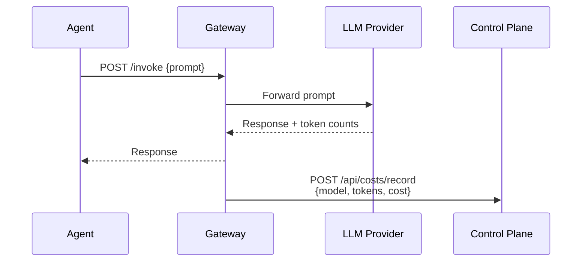

The control plane estimates cost from `MODEL_PRICING` in
`routers/costs.py` — **five** models: `claude-sonnet-4-6`, `claude-haiku-4-5`,
`claude-opus-4-6`, `gpt-4o`, `gpt-4o-mini`. An unlisted model gets a substring
match against those keys, then falls back to a flat `$3 / $15 per M tokens` guess,
so a cheap unlisted model is over-billed and an expensive one under-billed. If a
gateway sends a non-zero `cost_usd`, that value is used verbatim and no estimate
happens.

> **This is a third pricing table**, separate from the model registry's
> `input_cost_per_1k` (Step 10) and the gateway's `DEFAULT_PRICING` (Step 11).
> Nothing syncs them: the Costs page can report a different dollar figure than the
> gateway used when it decided whether you were over budget. Editing a model's
> price in the Models page changes neither of the other two.

### Viewing the dashboard

Open the **Costs** page in the UI. You can:

- **Select a time period** — 1 day, 7 days, 30 days, or 90 days
- **Filter by gateway** — see costs for just one gateway
- **View breakdowns** — by model (which LLM costs most), by gateway, by agent ID, and by day (trending)

### Via the API

```bash
# Get cost summary for the last 7 days
curl "http://localhost:8400/api/costs/summary?period_days=7"

# Filter by gateway
curl "http://localhost:8400/api/costs/summary?period_days=30&gateway_id=crm-agent"

# Get raw records (filterable by gateway_id and model)
curl "http://localhost:8400/api/costs/records?limit=50&model=gpt-4o"
```

`period_days` is capped at 90; `limit` on `/records` is capped at 1000. Both are
scoped to the caller's org, so the `by_gateway` / `by_agent` breakdowns never leak
another tenant's names or spend.

Example summary response:

```json
{
  "total_cost_usd": 42.87,
  "total_tokens": 2850000,
  "total_requests": 1240,
  "by_model": [
    {"model": "claude-sonnet-4-6", "cost": 28.50, "tokens": 1900000, "requests": 800},
    {"model": "gpt-4o", "cost": 14.37, "tokens": 950000, "requests": 440}
  ],
  "by_gateway": [
    {"gateway_id": "crm-agent", "cost": 30.12, "tokens": 2010000, "requests": 900},
    {"gateway_id": "ops-agent", "cost": 12.75, "tokens": 840000, "requests": 340}
  ],
  "by_agent": [
    {"agent_id": "crm-main", "cost": 30.12, "tokens": 2010000, "requests": 900}
  ],
  "daily_costs": [
    {"date": "2026-06-27", "cost": 5.20, "tokens": 350000, "requests": 180},
    {"date": "2026-06-28", "cost": 6.10, "tokens": 410000, "requests": 195}
  ]
}
```

### Recording usage manually (for testing)

If you want to populate the dashboard without running actual LLM calls:

```bash
curl -X POST http://localhost:8400/api/costs/record \
  -H "Content-Type: application/json" \
  -d '{
    "gateway_id": "crm-agent",
    "event_id": "01J5CRM7Z8Q2A1B3C4D5E6F7G8",
    "agent_id": "crm-main",
    "model": "claude-sonnet-4-6",
    "provider": "anthropic",
    "input_tokens": 1500,
    "output_tokens": 500,
    "total_tokens": 2000,
    "cost_usd": 0.0,
    "action": "generate_report"
  }'
```

When `cost_usd` is `0.0` **and** `total_tokens > 0`, the backend estimates the cost
from `input_tokens`/`output_tokens` and `MODEL_PRICING`. Note that `total_tokens` is
what you send, not a computed sum — it isn't validated against
`input_tokens + output_tokens`, and it's the field the summary totals and the broker
drawdown use. Send them consistently. `provider` should identify the provider
that actually served the request, which can differ from the model family after
routing or fallback.

Use a stable, gateway-generated `event_id` for every event and preserve it across
retries. The control plane keys idempotency on `(gateway_id, event_id)`, covering
the usage row, token-pool debit, and broker charge. If billing fails after usage
is persisted, the endpoint returns `503`; retry the unchanged event rather than
creating a new ID.

There's also a batch endpoint for backfills:

```bash
curl -X POST http://localhost:8400/api/costs/record/batch \
  -H "Content-Type: application/json" \
  -d '[{"gateway_id": "crm-agent", "event_id": "backfill-0001",
        "model": "gpt-4o", "provider": "openai", "input_tokens": 100,
        "output_tokens": 50, "total_tokens": 150, "cost_usd": 0.0}]'
```

Each record is stamped with the org of its `gateway_id`, so posting usage for an
unregistered gateway files it under the default org.

---

## Step 10: Model Configuration

The Model Configuration page is a central registry for all LLM models available in your fleet. It controls which models gateways can route to, their pricing (for cost calculation), capabilities, and provider mappings.

### Why a model registry?

Without a central registry:
- Each gateway has hardcoded model lists that drift out of sync
- Pricing tables need manual updates across every gateway
- No visibility into which models are available across the fleet
- Adding a new model means touching every gateway config

With the registry:
- One source of truth for all model metadata
- Pricing automatically pushed to gateways (enables local cost calculation)
- Routing strategies configured per model
- Capabilities (tool use, vision) declared centrally

### Pre-seeded models

The control plane ships with 18 models pre-seeded from AxonLLM:

A model is a **logical name** mapped to one or more concrete providers, in
fallback order — that's what lets a policy or quota name `claude-sonnet` without
caring whether it resolves to Anthropic or Bedrock today. See
`control_plane/routers/model_config.py::seed_models`.

| Model | Providers (in fallback order) | Category | Capabilities |
|-------|-------------------------------|----------|-------------|
| claude-opus | bedrock, anthropic | Reasoning | Tools, Vision |
| claude-sonnet | anthropic, bedrock | General | Tools, Vision |
| claude-haiku | anthropic, bedrock | Speed | Tools |
| gpt-4o | openai | General | Tools, Vision |
| gpt-4o-mini | openai | Speed | Tools |
| o4-mini | openai | Reasoning | Tools |
| o3 | openai | Reasoning | Tools |
| gemini-2.5-pro | vertex | General | Tools, Vision |
| gemini-2.5-flash | vertex | Speed | Tools |
| nova-pro | bedrock | General | Tools |
| nova-lite | bedrock | Speed | Tools |
| deepseek-r1 | bedrock | Reasoning | - |
| llama-4-maverick | bedrock | General | Tools |
| mistral-large | bedrock | General | Tools |
| grok-3 | xai | General | Tools |
| grok-3-mini | xai | Speed | Tools |
| llama-3.3-70b | together | General | Tools |
| deepseek-r1-together | together | Reasoning | - |

### Managing models via the UI

1. Go to the **Models** page (indigo icon in sidebar)
2. View all registered models with their pricing, provider, and capabilities
3. Click a model to edit its routing strategy, pricing, or capabilities
4. Click **Add Model** to register a custom or fine-tuned model
5. Click **Push Registry** to validate the catalog and replace the embedded
   AxonLLM registry on each reachable LLM-enabled tenant gateway

### Via the API

Models are keyed by their **logical `name`**, not an `id`, and the record is
flat — `input_cost_per_1k` / `output_cost_per_1k` rather than a nested `pricing`
object, and `supports_tools` / `supports_vision` booleans rather than a
`capabilities` list. The full shape is `ModelConfig` in
`control_plane/routers/model_config.py`.

```bash
# List all models
curl http://localhost:8400/api/models

# Get one model (logical name — "claude-sonnet", not "claude-sonnet-4-6")
curl http://localhost:8400/api/models/claude-sonnet

# Add a custom model
curl -X POST http://localhost:8400/api/models \
  -H "Content-Type: application/json" \
  -d '{
    "name": "my-fine-tuned-model",
    "description": "Fine-tuned on support transcripts",
    "routing_strategy": "round-robin",
    "providers": [{"provider": "openai", "model_id": "ft:gpt-4o:acme:v1", "fallback_order": 0}],
    "input_cost_per_1k": 0.005,
    "output_cost_per_1k": 0.020,
    "max_tokens": 8192,
    "supports_tools": true,
    "category": "general"
  }'

# Update — PUT is a whole-document replace, not a patch: send every field you
# want to keep, or the omitted ones fall back to their schema defaults.
curl -X PUT http://localhost:8400/api/models/my-fine-tuned-model \
  -H "Content-Type: application/json" \
  -d '{
    "name": "my-fine-tuned-model",
    "providers": [{"provider": "openai", "model_id": "ft:gpt-4o:acme:v1"}],
    "input_cost_per_1k": 0.004,
    "output_cost_per_1k": 0.016
  }'

# Delete a model
curl -X DELETE http://localhost:8400/api/models/my-fine-tuned-model

# Validate and push the complete tenant registry to every gateway
curl -X POST http://localhost:8400/api/models/push
```

> The registry is tenant-scoped and SQL-backed. `seed_models()` is gated by
> `OSTIARI_NO_DEMO`, so a clean install starts empty. Every create, update, and
> delete is written through to the database before the API returns.

### Routing strategies

`routing_strategy` names how the router picks among a model's providers. These
are the values the Models page offers (`frontend/src/pages/Models.tsx`):

| Strategy | Description | When to use |
|----------|-------------|-------------|
| `round-robin` | Rotate across the model's providers | The default, and what 16 of the 18 seeded models use |
| `least-latency` | Prefer the fastest-responding provider | Latency-sensitive paths (seeded on `claude-opus`) |
| `cost-optimized` | Prefer the cheapest provider that can serve the request | Cost-sensitive paths (seeded on `claude-sonnet`) |
| `weighted` | Split by each provider's `weight` | Gradual provider migration, capacity splitting |

Provider *transport* is not a routing strategy — it comes from each entry in the
model's `providers` list (`bedrock`, `anthropic`, `openai`, `vertex`, `xai`,
`together`), and fallback is expressed by `fallback_order` on those entries
rather than by a `fallback` strategy. The API rejects any provider-routing
strategy outside the four listed above. Public `vertex` and `azure` provider
names are translated to AxonLLM's `vertex_ai` and `azure_openai` identifiers
when the registry is pushed.

Prompt classification is a separate, gateway-scoped control. The Models page
stores keyword categories and target models through
`PUT /api/routing-controls/{gateway_id}/task-classification`; the gateway checks
those rules before AxonLLM's built-in classifier.

### How model pricing feeds cost enforcement

The gateway's `QuotaEnforcer` takes a pushed per-model pricing table — its
`configure()` reads a `pricing` key, and `_get_pricing()` prefers it over the
built-in `DEFAULT_PRICING`. `POST /api/quotas/{id}/push` sends it: alongside
`rate_limit_rpm`, `budget_limit_usd`, `max_tokens_per_request`, and
`allowed_models`, it includes a `pricing` table built from the model registry by
`model_config.py::pricing_table(org)`. The registry already stores per-1k costs,
the same unit the enforcer wants, so no conversion happens in between.

So editing a model's `input_cost_per_1k` in the Models page changes both what the
**control plane** reports (the Costs dashboard's `_estimate_cost`) and — after the
next quota push — what the **gateway** uses to project a budget.

**Push Registry** separately updates AxonLLM's live provider mappings, routing
strategy, capabilities, and per-token pricing. The catalog is also included in
registration and reconnect bundles, so a gateway restart restores the tenant
registry.

Models priced at `0.0` on both sides are **omitted** from the pushed table rather
than sent as free. A missing model means "fall back to `DEFAULT_PRICING`" in the
gateway, which is safer than asserting a real model costs nothing (that would
disable the budget for it).

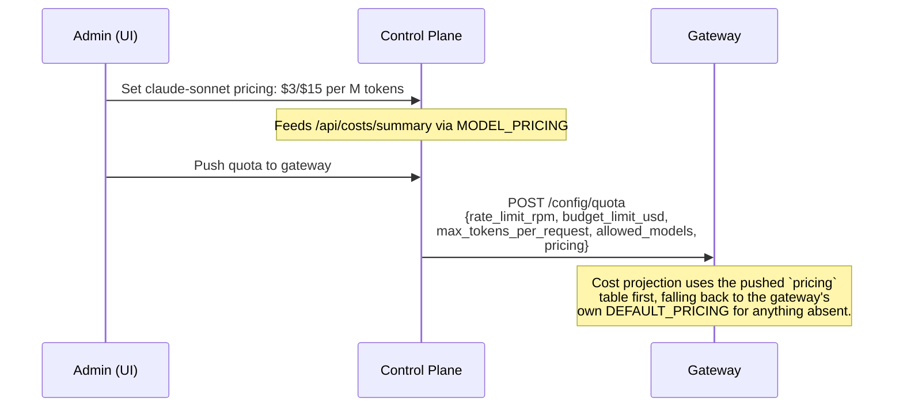

`control_plane/routers/costs.py::MODEL_PRICING` (5 models, priced per token) is
still a separate table from the pushed one — it backs the Costs dashboard's
historical reporting, not runtime enforcement, and it doesn't read the registry.
The gateway's `DEFAULT_PRICING` (8 models, per 1k tokens) is now only a fallback
for models the pushed table doesn't cover.

---

## Step 11: Quotas (Runtime Enforcement)

Quotas are now **enforced at runtime on the gateway** — not just informational numbers in the control plane. When you create a quota and push it, the gateway actively blocks requests that exceed limits.

### What changed

Previously, quotas in the control plane were informational only — they showed spending relative to a budget but didn't actually stop requests. Now:

- **Rate limits** — hard-enforced with a 429 whose body carries `limit_type:
  "rate_limit"` and the reason (there is **no** `Retry-After` header — see below)
- **Budget caps** — pre-request projection blocks before the LLM call is made,
  and reserves the estimate in flight so concurrent calls can't all pass on the
  same stale total
- **Model allowlists** — refused with `limit_type: "model_restriction"`
- **Max tokens cap** — silently reduced (agent never errors, just gets shorter responses)

> **Every quota refusal is a 429, including the model allowlist.** The enforcer
> returns one `QuotaDecision`, and each caller maps a failed decision to a single
> status: `/tool/{action}` answers 429 (`server.py:742`), and the `/v1/chat` and
> `/v1/messages` shims answer 429 with an OpenAI/Anthropic-shaped
> `rate_limit_error`. `/invoke` doesn't fail the request at all — it returns 200
> with `response: "Request blocked by quota: …"`. Distinguish the cases by
> reading `limit_type` from the body, not the status code.

### Creating a quota

#### Via the UI

1. Go to the **Quotas** page (under **Control** in the sidebar)
2. Click **Create Quota**
3. Fill in:
   - **Quota name:** "CRM Agent Daily Budget"
   - **Scope:** gateway (or agent/project)
   - **Scope ID:** crm-agent
   - **Rate limit (requests/min):** 30
   - **Budget limit (USD):** 50.00
   - **Max tokens per request:** 2048
4. Click **Create**
5. Click the **push** icon on the quota row to activate enforcement on the gateway

#### Via the API

```bash
# Create a quota
curl -X POST http://localhost:8400/api/quotas \
  -H "Content-Type: application/json" \
  -d '{
    "name": "CRM Agent Daily Budget",
    "scope": "gateway",
    "scope_id": "crm-agent",
    "rate_limit_rpm": 30,
    "budget_limit_usd": 50.00,
    "max_tokens_per_request": 2048,
    "allowed_models": ["claude-sonnet-4-6", "claude-haiku-4-5"]
  }'

# Push the quota to the gateway (activates enforcement)
curl -X POST http://localhost:8400/api/quotas/1/push
```

A quota targets a `scope` (`gateway` or `agent`) plus the `scope_id` it applies
to — that's the field pair, not a `gateway_id`. All four limits are optional;
omit one to leave it unlimited.

> **Only gateway-scoped quotas can be pushed.** `POST /api/quotas/{id}/push`
> checks `quota.scope != "gateway"` and returns
> `{"status": "skipped", "reason": "Only gateway-scoped quotas can be pushed
> directly"}` — a **200**, not an error. An agent-scoped quota you create on the
> "Quotas (per agent)" page is therefore never handed to an enforcer by this
> route; per-agent budget caps reach the gateway through `agent_auth`
> (`budget_usd` per agent) instead. Check for `status: "pushed"` rather than
> assuming a 200 means enforcement is live.

### Enforcement behavior

The order below is the order in `QuotaEnforcer.check()` — rate limit, then
budget, then model allowlist — and the `limit_type` in each box is the literal
value the body carries:

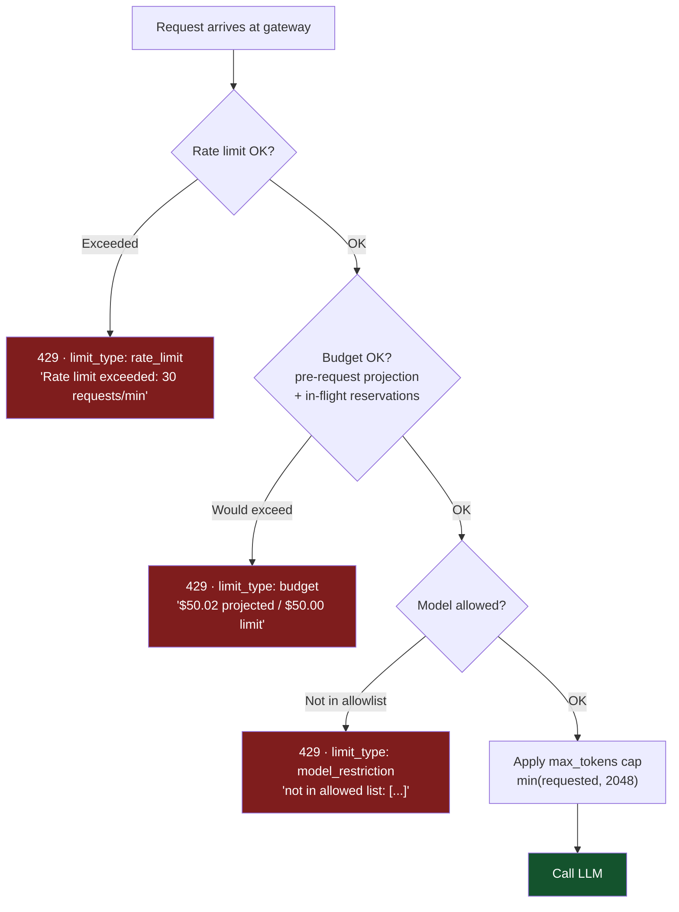

The budget projection uses a heuristic of ~800 input + ~400 output tokens
(`AVG_INPUT_TOKENS` / `AVG_OUTPUT_TOKENS`) priced from the pushed pricing table,
falling back to `DEFAULT_PRICING` for 8 well-known models and then to a fuzzy
substring match. With `REDIS_ENDPOINT` set, the reservation is atomic in Redis so
one budget holds across a scaled fleet instead of N× per process.

### Important: Push activates enforcement

Creating a quota in the control plane does NOT enforce it. You must **push** it to the gateway:

```bash
# This only saves the quota in the database:
POST /api/quotas

# This activates enforcement on the gateway:
POST /api/quotas/{id}/push
```

The UI has a "Push to Gateway" button that does this in one click.

---

## Step 12: Sandbox

The Sandbox is a testing environment built into the control plane UI. It lets you interact with gateways directly — send LLM prompts, run pre-built scenarios, or write custom agent code — all without deploying an agent.

### Why a Sandbox?

- **Developers** need to test tool configurations before writing agent code
- **Platform teams** need to verify policies work correctly
- **Demos** need a quick way to show the system in action
- **Debugging** is faster when you can interact directly

### Four tabs

> **Every tab is pinned to the `crm-agent` gateway.** `Sandbox.tsx:5` hardcodes
> `GATEWAY_PROXY = ${API_BASE}/api/proxy/gateway/crm-agent` — there is no gateway
> selector. To exercise a different gateway, call
> `/api/proxy/gateway/{gateway_id}/…` directly with `curl` (Step 7), or point
> `crm-agent` at the config you want to test.

#### Chat Tab

An interactive chat interface that sends messages to the gateway's `/invoke` endpoint (via the gateway proxy to avoid CORS):

1. Type a message (e.g., "Send an email to test@example.com saying hello")
2. The gateway routes to the configured LLM, executes tools, and returns the response
3. See the full trace of what happened (which tools were called, which were blocked)

This is the fastest way to test whether your tools and policies are configured correctly. The browser never calls the gateway directly — requests go through `/api/proxy/gateway/crm-agent/invoke` on the control plane.

#### Scenarios Tab

One-click pre-built demos that exercise common patterns. Each fires a fixed
sequence of `POST /tool/{action}` calls with a scenario-specific `X-Agent-Id` and
prints the status of each:

| Scenario | Calls it fires | What it tests |
|----------|----------------|---------------|
| Basic Tools | `db_query`, `send_email`, `db_delete` | Policy enforcement — the third should come back 403 |
| Multi-Step | `db_query`, `github.search_code`, `github.create_issue`, `drawio.create_diagram`, `drawio.add_shape`, `send_email` | Span grouping — sends `X-Session-Id`, `X-Plan`, `X-Step` so the six calls nest under one span |
| Blocked Action | `db_delete`, `github.delete_repo`, `drawio.delete_diagram` | Distinguishes 403 (blocked by policy) from 404 (filtered at the MCP layer) |
| MCP Tools | `github.list_repos`, `github.search_code`, `drawio.list_diagrams`, `drawio.create_diagram` | MCP server discovery and execution |

These are direct tool calls, not LLM-driven — no model decides anything, so they
work without LLM credentials. Only the Chat tab needs keys.

#### A2A Tab

Agent-to-agent delegation. Paste a peer agent's URL and the tab registers it via
`POST /config/a2a-agents` on the gateway, falling back to fetching
`/.well-known/agent.json` directly if the gateway declines. Registered agents show
their advertised skills, and you can invoke a tool as the peer
(`X-Agent-Id: sandbox-a2a`, `X-Framework: a2a`) to watch the delegation gate
decide.

#### Code Tab

The editor executes JavaScript control flow in a disposable, opaque-origin
Worker. Select a gateway, then use the injected `ostiari.tool` function:

```javascript
const query = await ostiari.tool("db_query", {
  sql: "SELECT * FROM users",
});
console.log(query.status, query.body);

if (query.ok) {
  const deletion = await ostiari.tool("db_delete", { table: "users" });
  console.log(deletion.status, deletion.body);
}
```

The worker has no DOM, browser storage, credentials, direct network access, or
host filesystem. Its parent iframe has an opaque origin and `connect-src 'none'`.
Every `ostiari.tool` call goes through `/api/sandbox/runs/{id}/tools/{tool}` and
then the selected gateway as `X-Agent-Id: sandbox-code`, so normal policies,
quotas, approvals, and traces still apply. `403` and `429` are returned to the
program as ordinary tool results (`status`, `ok`, `body`) so code can branch on
them.

The control plane stores run metadata and a source digest, never the source or
output. Server-issued limits bound runtime, source size, output, payload size,
concurrent runs, and tool-call count. Stop removes the execution container and
aborts outstanding browser requests; a downstream tool already executing may
still finish.

### Sandbox uses real enforcement

The Sandbox sends real requests to real gateways. This means:
- Policies apply (you'll see blocks)
- Quotas count (budget decreases)
- Traces appear in the Live Trace Viewer
- Costs are recorded

This makes it a true integration test, not a mock.

---

## Step 13: A/B Experiments

A/B experiments let you split traffic between two models by percentage and compare their performance side-by-side. This helps answer questions like: "Is GPT-4o-mini good enough for this task, or do we need Claude Sonnet?"

> **How an experiment reaches its gateway.** Creating, toggling, or deleting an
> experiment pushes the **complete** experiment set for that gateway to
> `POST /config/ab-experiments` on it. Sending the whole set rather than a delta is
> what makes a delete take effect — the gateway endpoint replaces
> `LLMConfig.ab_experiments` wholesale, so an experiment's absence from the pushed
> document is how it ends.
>
> It is a *partial* config endpoint on purpose. `POST /config/llm` is a
> whole-document replace, so pushing experiments through it would wipe the provider
> credentials the gateway loaded at startup.
>
> The push is **reported, not enforced**. Every mutating response carries
> `pushed` and `push_error`:
>
> ```json
> {"name": "sonnet-vs-mini", "...": "...", "pushed": false,
>  "push_error": "All connection attempts failed"}
> ```
>
> A gateway that was down when you created the experiment keeps the experiment
> stored but not live — so the UI can say "saved, not live" instead of implying the
> split is running. Re-push it once the gateway is back:
>
> ```bash
> curl -X POST localhost:8400/api/experiments/sonnet-vs-mini/push
> ```
>
> That route returns `502` if the push fails, unlike the create/toggle/delete
> routes which succeed with `pushed: false`.
>
> Experiments also ride the registration bundle (`push_service::_build_config`
> adds an `ab_experiments` key when the gateway has any), so a gateway restart
> doesn't silently end a running experiment. The key is omitted entirely when
> there are none.
>
> Two limits worth knowing. The control-plane model has no per-agent scoping, so
> every pushed experiment applies to **all** of the gateway's agents (`agents: []`
> is sent explicitly). And `/results` queries `usage_records` by model name, so it
> reports on all traffic those two models saw — including traffic that reached them
> for reasons other than this experiment.

### How it works

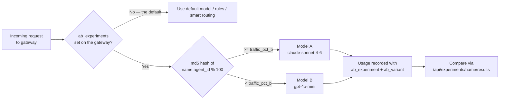

The split is **not random** — it's a consistent `md5("{name}:{agent_id}") % 100`,
so a given agent always lands in the same bucket across requests. That makes
results reproducible, but it also means with a small number of agent ids the
actual split can be far off the nominal percentage: five agents can't divide into
10/90. An experiment can be scoped with an `agents` list; out-of-scope requests
fall through to the next experiment, then to rules / smart routing / the default.
Only the first in-scope enabled experiment applies.

### Creating an experiment

#### Via the UI

1. Go to the **Experiments** page
2. Click **New Experiment**
3. Fill in:
   - **Name:** `sonnet-vs-mini`
   - **Model A (control):** `claude-sonnet-4-6`
   - **Model B (challenger):** `gpt-4o-mini`
   - **Traffic % to B:** `10` (sends 10% of requests to Model B)
   - **Gateway:** `crm-agent`
4. Click **Create**

#### Via the API

```bash
curl -X POST http://localhost:8400/api/experiments \
  -H "Content-Type: application/json" \
  -d '{
    "name": "sonnet-vs-mini",
    "model_a": "claude-sonnet-4-6",
    "model_b": "gpt-4o-mini",
    "traffic_pct_b": 10,
    "gateway_id": "crm-agent"
  }'
```

### Viewing results

After the experiment has been running for a while, check the results:

```bash
curl "http://localhost:8400/api/experiments/sonnet-vs-mini/results?period_days=7"
```

Response:

```json
{
  "experiment_name": "sonnet-vs-mini",
  "period_days": 7,
  "model_a": {
    "model": "claude-sonnet-4-6",
    "requests": 900,
    "total_tokens": 1800000,
    "total_cost": 28.50,
    "avg_tokens": 2000,
    "avg_cost": 0.031667
  },
  "model_b": {
    "model": "gpt-4o-mini",
    "requests": 100,
    "total_tokens": 210000,
    "total_cost": 0.16,
    "avg_tokens": 2100,
    "avg_cost": 0.0016
  }
}
```

In this example, Model B (gpt-4o-mini) costs 20x less per request. If quality is acceptable, you could switch to it entirely.

`period_days` is capped at 30. Both blocks come back as all-zeros
(`{"requests": 0, "total_tokens": 0, ...}`) when no `usage_records` match — which
is what you'll see if the gateway isn't recording usage, or if the experiment was
only created while its gateway was unreachable. Results use the immutable
`experiment_id` and `experiment_variant` written into each usage event, so
unrelated traffic using either model is excluded and fallback calls stay in the
cohort originally assigned.

### Managing experiments

```bash
# Toggle an experiment on/off and push the gateway's complete experiment set
curl -X PATCH http://localhost:8400/api/experiments/sonnet-vs-mini/toggle

# Delete an experiment and push its absence
curl -X DELETE http://localhost:8400/api/experiments/sonnet-vs-mini

# Retry a push after an offline gateway reconnects
curl -X POST http://localhost:8400/api/experiments/sonnet-vs-mini/push

# List all experiments
curl http://localhost:8400/api/experiments
```

Creating a duplicate name returns **409**. Experiments write through to SQL and
are restored into the hot cache on startup, including after an ungraceful stop.

---

## Step 14: Agents Page

The Agents page provides a centralized registry of all AI agents connected to your gateways. It shows which agents exist, what framework they use, which tools they have access to, and which gateway they are assigned to.

> **This registry is descriptive, not enforcing.** An agent's `tools` list here is
> documentation — it doesn't grant or restrict anything. Actual per-agent tool
> authorization is the gateway's `agent_auth` config (see
> [Per-Agent Tool Authorization](#per-agent-tool-authorization) below); the two are
> maintained separately and nothing reconciles them. Deleting an agent from this
> page does not revoke its access.

### Why an Agents Page?

In multi-tenant deployments with many gateways, operators need to answer:
- How many agents are in my fleet?
- What framework is each agent built with?
- Which gateway is each agent routing through?
- What tools does each agent have access to?

The Agents page answers all of these at a glance.

### What You See

Each agent card displays:
- **Agent name** and description
- **Framework badge** — OpenAI, Anthropic, Strands, Bedrock, AgentCore, CrewAI, or LangGraph
- **Model** — which LLM the agent uses (e.g., claude-sonnet-4-6)
- **Tools** — list of tools available to this agent
- **Gateway assignment** — which gateway this agent routes through

### Current Demo Fleet

The demo environment includes 9 agents across 8 frameworks, defined in
`control_plane/routers/agents.py::DEMO_AGENTS`. They are loaded **only** by the
demo seeder, which is gated by `OSTIARI_NO_DEMO` — unlike the model registry, a
clean install really does start with an empty agent list:

| Agent | Framework | Model | Gateway |
|-------|-----------|-------|---------|
| research-agent | openai | gpt-4o | crm-agent |
| ops-agent | strands | claude-sonnet-4-6 | ops-agent |
| claude-agent | anthropic | claude-sonnet-4-6 | crm-agent |
| bedrock-agent | bedrock | bedrock/anthropic.claude-3-5-sonnet | crm-agent |
| agentcore-agent | agentcore | bedrock/anthropic.claude-3-5-sonnet | crm-agent |
| crewai-agent | crewai | gpt-4o | crm-agent |
| langgraph-agent | langgraph | gpt-4o | crm-agent |
| planner-bot | gateway-invoke | claude-sonnet-4-6 | crm-agent |
| smart-router-bot | gateway-invoke | auto (routed) | crm-agent |

`gateway-invoke` is the eighth framework: `planner-bot` and `smart-router-bot`
call the gateway's `/invoke` endpoint directly rather than going through a
framework SDK. `smart-router-bot` leaves the model to AxonLLM's classifier.

### Via the API

```bash
# List all agents
curl http://localhost:8400/api/agents

# Get details for one agent — the path is the agent NAME, not a gateway id
curl http://localhost:8400/api/agents/research-agent

# Register an agent
curl -X POST http://localhost:8400/api/agents \
  -H "Content-Type: application/json" \
  -d '{
    "name": "billing-agent",
    "framework": "openai",
    "gateway_id": "crm-agent",
    "tools": ["db_query", "send_email"],
    "description": "Reconciles invoices",
    "model": "gpt-4o-mini"
  }'

# Remove one
curl -X DELETE http://localhost:8400/api/agents/billing-agent
```

`POST` is an upsert keyed by `name` — re-posting an existing name silently
replaces the record (no 409). The live registry is a hot cache over SQL, and
registered or discovery-onboarded agents are persisted in the same transaction
as their audit event.

### Via the UI

1. Open the sidebar
2. Under the **Overview** section, click **Agents**
3. Browse the agent registry with framework badges and tool lists

---

## Step 15: Live Trace Viewer

The Live Trace Viewer shows tool calls happening across all your gateways in real time. It is useful for debugging, monitoring, and understanding how your agents are behaving. Traces now include tool calls from `/invoke` (LLM-driven tool use), session/plan/step context, tool call parameters, and the **model used** for each request.

### How it works

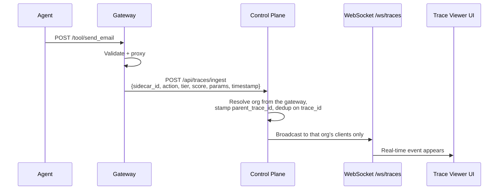

Gateways send a trace event to the control plane after every tool call. The
control plane buffers it (200 most recent per org) and broadcasts it to the
WebSocket clients connected **for that org** — fan-out is tenant-scoped, so a
consumer never sees another org's traces.

### Using the Trace Viewer

1. Open the **Traces** page in the UI
2. Events appear as they happen (newest at top)
3. Each trace row shows an **indigo model badge** (e.g., "claude-sonnet-4-6") so you can see at a glance which model served each request
4. Click a row to see the detail panel, which includes the full model name, parameters, session context, and timing
5. Controls:
   - **Pause** — stop scrolling, freeze the view to inspect events
   - **Resume** — start receiving events again
   - **Clear** — remove all events from the view

### What a trace event looks like

The decision lives in **`tier`** (`allow` / `intervene` / `block`), not a `status`
field, and the explanation lives in **`blocked_reason`**, not `reason`. There is no
`request` or `response_status` — the call's arguments are in `params`.
`timestamp` is a **float** (Unix epoch seconds), not an ISO string. This is the
exact set of keys `trace_reporter.report()` sends:

```json
{
  "trace_id": "9f1c2d5e7a4b48c0b8e3f6a1d2c4b5e6",
  "sidecar_id": "crm-agent",
  "gateway_id": "crm-agent",
  "action": "send_email",
  "tier": "allow",
  "score": 25,
  "duration_ms": 45.2,
  "agent_id": "crm-main",
  "framework": "openai",
  "is_mcp": false,
  "blocked_reason": null,
  "endpoint": "/tool/send_email",
  "session_id": "sess-4471",
  "plan": "",
  "step": "",
  "params": {"to": "user@example.com", "subject": "Report"},
  "model": "claude-sonnet-4-6",
  "shadow": false,
  "would_block": false,
  "delegation_chain": [],
  "limit_type": null,
  "timestamp": 1751552581.456
}
```

Or for a blocked call:

```json
{
  "trace_id": "3b7e10ac9d224f6ab1c85f0e77d29a41",
  "sidecar_id": "ops-agent",
  "gateway_id": "ops-agent",
  "action": "db_delete",
  "tier": "block",
  "score": 100,
  "duration_ms": 1.2,
  "agent_id": "ops-main",
  "blocked_reason": "Matched block pattern: *delete*",
  "params": {"table": "customers"},
  "shadow": false,
  "would_block": true,
  "timestamp": 1751552585.789
}
```

Ingest adds two fields the gateway never sends: **`org_id`** (derived from the
reporting gateway, and any value you send is overwritten — a caller can't choose
its own tenant) and **`parent_trace_id`** (the first trace in a `session_id`
becomes the parent span; later ones point at it, and a trace with no session is
its own root). Ingest is idempotent on `trace_id` — a gateway retry replaces the
buffered entry rather than appending a second copy.

### Connecting via WebSocket (programmatic)

If you want to build your own trace consumer (e.g., pipe to a SIEM or alerting system):

```python
import asyncio
import websockets
import json

async def watch_traces():
    async with websockets.connect("ws://localhost:8400/ws/traces") as ws:
        # On connect, you'll receive the last 50 events for your org as catch-up
        while True:
            event = json.loads(await ws.recv())
            if event.get("tier") == "block":
                reason = event.get("blocked_reason") or "no reason given"
                print(f"BLOCKED: {event['gateway_id']}/{event['action']} — {reason}")

asyncio.run(watch_traces())
```

Use `.get()` rather than `event["…"]`: optional keys (`blocked_reason`,
`limit_type`, `model`) are omitted or `null` on most events, and the socket also
replays demo-seeded traces that carry a slightly narrower key set.

The stream is **per-org**. Fan-out is confined to the clients connected for that
tenant, so a consumer only ever sees its own org's traces.

### Getting recent traces via REST

For non-real-time needs (e.g., loading initial page state):

```bash
curl "http://localhost:8400/api/traces/recent?limit=50"
```

```json
{
  "traces": [
    {"trace_id": "9f1c…", "gateway_id": "crm-agent", "action": "send_email", "tier": "allow", ...},
    {"trace_id": "3b7e…", "gateway_id": "ops-agent", "action": "db_delete", "tier": "block", ...}
  ],
  "total": 2
}
```

> **`total` is the length of the slice you just got, not a fleet-wide count.**
> It's `len(traces)` after applying `limit`, so it never exceeds `limit` and
> tells you nothing about how many traces exist. Don't paginate on it.

> Traces are sanitized and upserted into `trace_records` before entering the
> bounded per-org hot cache used for WebSocket fan-out. A restart rebuilds that
> cache from SQL. Configure the OTLP exporter when you also need an external
> retention, search, or SIEM backend.

---

## Per-Agent Tool Authorization

When multiple agents share a gateway (shared gateway or NAT gateway mode), you need to control which agent can access which tools. The gateway enforces **least privilege** — each agent can only call tools explicitly granted to it.

### How it works

- **The whole gate is off unless `enabled: true` is pushed.** `configure()` reads
  `config.get("enabled", False)` — the default is *off*, so a gateway with no
  `agent_auth` config enforces nothing per-agent.
- **Unregistered agents** fall back to `default_grants`. If that list is empty
  (the default), they're denied every tool.
- **Registered agents** get explicit tool grants (exact names or wildcards)
- Agent identity is determined by the `X-Agent-Id` header or API key

**Wildcards here are not fnmatch** — `can_access` implements two special cases and
nothing else:

| Grant | Matches |
|---|---|
| `*` | everything |
| `github.*` | anything starting `github.` — the prefix + dot is required |
| `db_query` | exactly `db_query` |
| `*delete*` | **nothing** — mid-string globs don't work here (unlike policies) |
| `github*` | **nothing** — only the `.*` suffix form is honored |

That's the opposite trap from policy patterns: policies use real fnmatch,
`agent_auth` doesn't. A grant that works in a policy may silently grant nothing here.

### Example configuration (pushed from control plane)

Grants cover tools, models, providers, and a per-agent dollar cap:

```yaml
agent_auth:
  enabled: true                 # required — defaults to false
  default_grants: []            # unregistered agents denied by default
  default_models: ["*"]
  default_providers: ["*"]
  agents:
    research-agent:
      allowed_tools: ["web_search", "file_read", "db_query"]
      allowed_models: ["claude-haiku-4-5", "gpt-4o-mini"]
      allowed_providers: ["anthropic", "openai"]
      budget_usd: 10.00
      description: "Cheap models only"
    ops-agent:
      allowed_tools: ["db_query", "db_delete", "send_email", "github.*"]
    gov-bot:
      allowed_tools: ["*"]
      allowed_providers: ["bedrock"]   # AWS only — no data leaves the account
    admin-agent:
      allowed_tools: ["*"]             # full access
```

Omitting `allowed_models` or `allowed_providers` means *unrestricted*, not empty —
`None` short-circuits the check to `True`. Only an explicit list restricts.

`budget_usd` is how you get a **per-agent** budget; quotas can only be pushed at
gateway scope (Step 11). With the production-required Redis store, spend and
reservations are shared across replicas and survive a gateway restart. A
development gateway without Redis keeps only process-local spend.

### Future: JWT Override

The current system is policy-based (static config). A future enhancement will add JWT-based authorization where a signed token can override or supplement the policy grants — useful for temporary elevated access or cross-team collaboration.

---

## Full Cost Enforcement

The gateway calculates LLM cost locally (no round-trip to control plane) and enforces budgets in real-time:

1. **Pre-request budget projection** — estimates cost BEFORE calling the LLM using
   the `AVG_INPUT_TOKENS = 800` / `AVG_OUTPUT_TOKENS = 400` heuristic. If projected
   spend exceeds budget, returns 429 immediately.
2. **Local pricing table** — `DEFAULT_PRICING` covers **8 models**
   (`claude-sonnet-4-6`, `claude-haiku-4-5`, `claude-opus-4-6`, `gpt-4o`,
   `gpt-4o-mini`, `o4-mini`, `command-r-plus`, `gemini-2.5-flash`), priced per 1k
   tokens. An unknown model name first gets a fuzzy substring match against those
   keys; if that misses too, it falls back to a flat `$0.003 / $0.015` mid-range
   guess. Bedrock model ids are not listed by name and rely on the substring match.
3. **Budget alert thresholds** — crossing 80%, 90%, or 100%
   (`BUDGET_ALERT_THRESHOLDS`) emits a `log.warning` **once** per threshold and
   invokes every callback registered via `on_budget_alert`.
4. **Silent max_tokens cap** — if quota limits output to 2048 tokens but the agent
   requests 4096, the gateway silently uses 2048 (no error, just a shorter response).

> **Where a budget alert goes.** The gateway subscribes to `on_budget_alert` at
> startup and reports each crossing to the control plane at
> `POST /api/quotas/alerts` using its rotating workload OIDC credential. The org is
> resolved from the reporting gateway's row, never from the payload.
> `record_spend` is synchronous, so the report is handed to the
> running event loop as a task; if there's no loop (a sync script or test), the
> alert is logged and the spend still books.
>
> Alerts are SQL-backed and restored into a bounded newest-first hot cache.
> Clearing the alert list deletes the durable notification records; the spend
> behind them remains in `usage_records`.
>
> ```bash
> curl localhost:8400/api/quotas/alerts            # list this org's alerts
> curl -X DELETE localhost:8400/api/quotas/alerts  # acknowledge (clear) them
> ```
>
> There is still no webhook or email — to page someone, poll that endpoint or
> register your own additional callback at gateway startup.
>
> One thing to expect: a single large spend can cross **two** thresholds at once
> (a $9 charge against a $10 budget fires both 80% and 90%), so you may see two
> alerts from one call. Each threshold still fires only once per budget period.

> **The `max_tokens` cap only applies on `/invoke`.** `cap_max_tokens` is called
> from one place — `executor.py:162`, the agentic loop. The `/v1/chat/completions`
> and `/v1/messages` shims take `max_tokens` straight from the request body and
> never cap it, so a request through those paths can exceed
> `max_tokens_per_request`. Budget enforcement still applies there; only the
> per-request token ceiling doesn't.

Budgets are protected without waiting for the LLM response — the agent is blocked
before expensive calls are made. Note the projection is a *heuristic*: a request
with a 100k-token context is projected at 800 input tokens, so a single very large
call can overshoot the budget before the post-call `record_spend` catches up.
Redis (`REDIS_ENDPOINT`) makes the in-flight reservation atomic fleet-wide, which
closes the concurrent-overshoot window but not the estimation one.

---

## Audit Log

The audit log records configuration changes across every mutating router — anything
that changes what an agent is allowed to do, or what it costs:

| `resource_type` | `action` values | Logged from |
|---|---|---|
| `gateway` | `create`, `update`, `delete`, `set_mode`, `push`, `push_all`, plus an auto-register entry | `routers/gateways.py` |
| `policy` | `create`, `update`, `delete`, `push` | `routers/policies.py` |
| `tool` | `create`, `delete`, `import_openapi` | `routers/tools.py` |
| `mcp_server` | `create`, `delete`, `discover` | `routers/mcp_servers.py` |
| `quota` | `create`, `delete`, `push` | `routers/quotas.py` |
| `model` | `create`, `update`, `delete` | `routers/model_config.py` |
| `agent` | `register`, `update` | `routers/agents.py` |
| `experiment` | `create`, `toggle`, `delete` | `routers/experiments.py` |

A few of these deserve their reasoning stated, because the action name is a
judgment call rather than a mechanical mapping:

- **`mcp_server` / `discover`** is logged even though no control-plane row changes.
  A rediscovery changes the set of tools an agent can call, which is a change in
  privilege whether or not it's a change in stored state.
- **`agent` / `update`** rather than a second `register`: re-registering an existing
  name with a different tool list is a privilege change, and the trail should say
  so rather than showing two identical `register` lines.
- **`tool` / `import_openapi`** writes **one** entry for the whole import, carrying
  the count and the tool names, not one entry per generated tool. The operator
  performed one action.
- **`model` / `update`** records only the fields that actually changed, as
  `{field: {from, to}}`. The Models page PUTs the whole record, so logging the full
  body would bury the one price edit that mattered.

Entries are written inside the same transaction as the change they describe, so an
action that fails to commit leaves no audit entry — and the hash chain stays
verifiable (`GET /api/audit/verify`) across all of these call sites.

> **Deletes record what was there.** A delete route captures the details it needs
> (name, gateway, prices) *before* the row is removed — otherwise the entry would
> describe a resource by an id that no longer resolves to anything.

### Viewing the audit log

Open the **Audit** page in the UI, or query via the API:

```bash
# All recent entries
curl "http://localhost:8400/api/audit?limit=50"

# Filter by resource type
curl "http://localhost:8400/api/audit?resource_type=policy"

# Filter by actor
curl "http://localhost:8400/api/audit?actor=admin@company.com"

# Filter by action
curl "http://localhost:8400/api/audit?action=update"

# Filter by a specific resource
curl "http://localhost:8400/api/audit?resource_id=crm-agent"
```

`limit` defaults to 100 and is capped at 500. Results are newest-first and scoped
to the caller's org.

Example response:

```json
[
  {
    "id": 42,
    "timestamp": "2026-07-03T14:20:00Z",
    "actor": "admin@company.com",
    "action": "update",
    "resource_type": "policy",
    "resource_id": "1",
    "details": {"block": {"from": ["*.drop"], "to": ["*delete*", "*.drop"]}}
  },
  {
    "id": 41,
    "timestamp": "2026-07-03T14:15:00Z",
    "actor": "admin@company.com",
    "action": "push",
    "resource_type": "gateway",
    "resource_id": "crm-agent",
    "details": {"status": "success"}
  }
]
```

### Tamper detection: the hash chain

Entries are hash-chained, so an after-the-fact edit to the SQLite row is
detectable. Each row stores `prev_hash` and
`entry_hash = SHA-256(prev_hash + "|" + canonical(actor, action, resource_type, resource_id, details, timestamp))`;
the first row chains from an empty `prev_hash`.

```bash
curl "http://localhost:8400/api/audit/verify"
# {"valid": true, "checked": 42}
```

If someone alters a row or splices one out, verification points at the first
break:

```json
{"valid": false, "checked": 17, "broken_at_id": 18,
 "reason": "entry_hash mismatch (content altered)"}
```

The other failure mode is `"prev_hash does not match preceding entry_hash"`,
which is what a deleted row looks like. Note the chain proves *integrity*, not
*completeness* of coverage — it can't tell you about a change that was never
logged in the first place (see the coverage table above). Both endpoints require
an audit-reader role.

---

## Data Persistence

The control plane has one durable source of truth:

- **PostgreSQL in production**, required by startup posture checks.
- **SQLite in development**, normally at `control-plane/data/control_plane.db`.

Fleet resources, runtime configuration, encrypted credentials, approvals,
sanitized traces, SSO state, audit entries, and offline config updates are all
SQL-backed. Small in-memory structures accelerate reads and WebSocket fan-out.
Older `state.json` files are imported once only when the runtime-state table is
empty; the application no longer writes them.

For production, back up PostgreSQL with PITR and test restores. Export traces to
OTLP as well when an external retention/search system is required.

---

## Agent Gateway Deployment Model

The UI calls the component an **Agent Gateway**, not a sidecar. That naming reflects the fact that it supports three distinct deployment modes — the per-pod "sidecar" pattern is only one of them.

> **What the code still calls it:** the control-plane API routes are `/api/gateways/*`, but the gateway's own internals kept the older name — the CLI flag is `--sidecar-id`, `GET /health` returns a `sidecar_id` field, and trace ingest carries `sidecar_id`. Those are the same identifier under a different label.

### Why the naming matters

"Sidecar" implies a single deployment model: one container per pod in Kubernetes. But this component works in all three of these configurations:

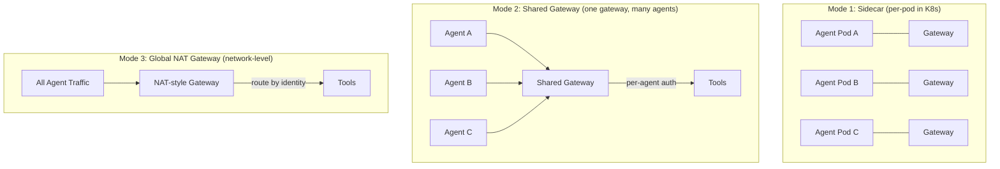

| Mode | How it works | Best for |
|------|-------------|----------|
| **Sidecar** | One gateway per pod, co-located with the agent. Network policy ensures agent can ONLY reach its gateway. | Strong isolation, per-agent network policies, K8s environments |
| **Shared gateway** | One gateway instance serves multiple agents. Per-agent tool authorization controls who can do what. | Dev environments, small teams, cost efficiency |
| **Global NAT gateway** | Network-level proxy that all agents route through. Like a NAT gateway but for AI tool calls. | Enterprise-wide governance, zero per-agent config needed |

All three modes use the same Docker image, the same APIs, and the same control plane. The only difference is deployment topology and network routing.

---

## Gateway Proxy (Browser-to-Gateway Communication)

The control plane includes a built-in proxy that forwards UI requests to gateways:

```
/api/proxy/gateway/{gateway_id}/{path}
```

**Why this exists:** The browser cannot call gateways directly due to CORS restrictions and network isolation (gateways may be on private networks). The proxy makes the Sandbox and future features work without exposing gateways to the public internet.

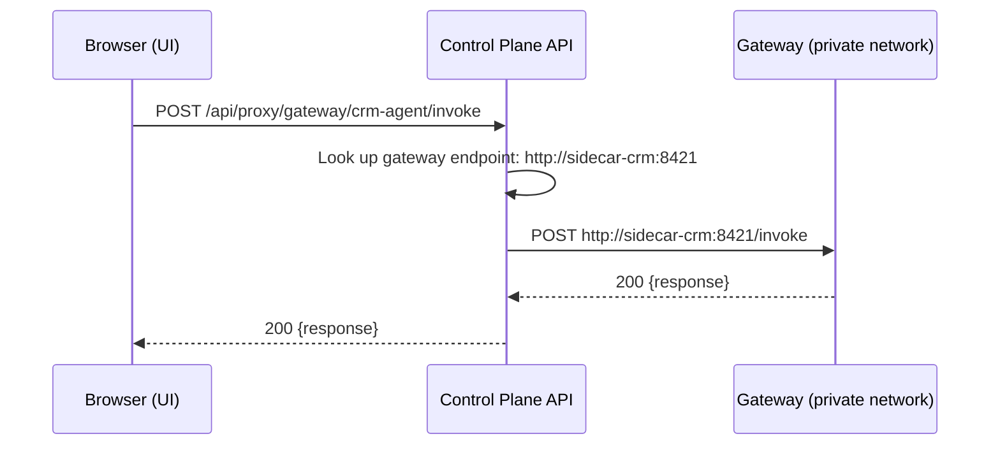

The proxy:
- Looks up the gateway's registered endpoint (404 if the gateway has no
  control-plane record)
- Forwards the request — POST carries method, headers, and body; the GET handler
  forwards the path only, no headers
- Returns the gateway's status code and JSON body to the browser, or `502` when
  the gateway is unreachable / `504` on timeout (60s for POST, 30s for GET)
- Eliminates CORS issues entirely

It expects a JSON response body: a gateway that answers with something else
surfaces as a 500 rather than being passed through.

---

## Troubleshooting

| Problem | Cause | Fix |
|---------|-------|-----|
| Push fails: "Unreachable" | Gateway is down or endpoint is wrong | Check gateway is running, verify endpoint URL |
| Push fails: "Timeout" | Gateway is slow to respond | Increase push timeout or check gateway resources |
| Agent gets 404 from gateway | Tool not registered | Push config from control plane, check `/tools` |
| Agent gets 403 unexpectedly | Policy is blocking the action, or per-agent auth doesn't grant the tool | Check policy in UI, look at the `reason` and `rule_id` fields in the body |
| Gateway shows "policy_loaded: false" | No policy pushed yet | Create a policy and push it |
| Health shows "unreachable" | Network issue between control plane and gateway | Check firewall rules, ensure ports are open |
| MCP tools not appearing | MCP server failed to connect | Check gateway logs, verify package installed or URL reachable |
| MCP embedded: ImportError | Package not installed in gateway | `pip install {package}` in the gateway container |
| MCP remote: connection refused | MCP server not running | Start the MCP server, verify URL |
| MCP stdio: command not found | Binary not in PATH | Install the MCP server binary in the gateway image |
| Cost dashboard shows $0 | LLM Gateway not enabled on gateways | Enable `llm_gateway` module in gateway config |
| Traces not appearing | Gateway is not reporting, its workload token cannot be refreshed, or its identity is not bound to the named gateway | Verify the control-plane URL, workload issuer/audience, per-gateway OAuth client or projected token file, and the gateway registration response. Production rejects legacy shared ingest keys. |
| Traces vanished after a restart | The database migration was not applied or the application is pointed at a different database | Run `alembic upgrade head`, verify `DATABASE_URL`, and confirm the `trace_records` table is populated |
| Traces missing /invoke tool calls | Old gateway version | Update gateway — trace reporter in executor is now automatic |
| Experiment results empty | Not enough time elapsed | Wait for traffic to accumulate, check period_days |
| Quota not enforced | Quota created but not pushed, **or** it isn't gateway-scoped | Click "Push to Gateway"; a non-gateway scope returns 200 `{"status": "skipped"}` — use `agent_auth.budget_usd` for per-agent budgets |
| Agent gets 429 unexpectedly | Rate limit, budget, **or** a disallowed model — all three are 429 | Read `limit_type` in the body (`rate_limit` / `budget` / `model_restriction`); check quota config and budget usage in Costs |
| Budget looks exhausted after a gateway restart, or resets unexpectedly | Spend lives in the gateway, not the control plane | Set `REDIS_ENDPOINT` so spend and reservations survive restarts and are shared fleet-wide |
| No 80% budget warning reached Slack/email | There's no webhook or email integration — alerts land in the control plane, not in a chat client | Poll `GET /api/quotas/alerts` and clear with `DELETE`; for paging, register your own `on_budget_alert` callback at gateway startup |
| Two budget alerts from one call | A single spend can cross two thresholds at once ($9 on a $10 budget crosses 80% and 90%) | Expected — each threshold still fires only once per budget period |
| Budget alerts stopped once Redis was enabled | Fixed — the threshold check used to read the process-local spend, which stays `0.0` when a shared store is booking it | Update the gateway; verify with `GET /config/quota` reporting `spend_scope: "fleet"` |
| Agent gets shorter responses | Max tokens cap is active | Check quota's `max_tokens_per_request` (silent cap, not an error). Only applies on `/invoke` — the `/v1/*` shims aren't capped |
| `/invoke` returns 200 but the answer says "Request blocked by quota" | `/invoke` reports quota refusals in the body, not the status code | Don't gate on status alone for `/invoke`; check the `response` text or use `/tool/{action}`, which does return 429 |
| Sandbox Chat/Scenarios/A2A not connecting | The selected gateway is offline or lacks the requested module/tool | Select a healthy registered gateway and push its LLM, tool, MCP, or A2A configuration |
| Sandbox Code reports `Sandbox runtime failed to initialize` | Browser CSP or enterprise policy blocked the nested Blob Worker | Allow scripts and Blob Workers for the dashboard origin; network access remains denied inside the run |
| Sandbox Code returns 403/429 | Gateway policy or quota rejected `sandbox-code` | Grant that agent only the intended tools/limits, then rerun |
| Sandbox Code times out | The server-issued runtime limit elapsed | Reduce work or raise `OSTIARI_SANDBOX_TIMEOUT_MS` within its 60-second cap |

---

## Available Features

These features are already built and ready to use:

### LLM Gateway Module

Enable in the gateway config to get:
- **Smart model routing** — the embedded Axon router picks a healthy, policy-allowed model for each prompt
- **Fallback chains** — if primary model fails, auto-retry with next model
- **PII redaction** — strips emails, SSNs, credit cards before LLM sees them (reversible)
- **Prompt injection detection** — blocks suspicious prompts
- **The `/invoke` endpoint** — agents send one message, get a full answer (no tool loop code)

```yaml
# Add to gateway config:
modules:
  llm_gateway: true
llm:
  default_model: claude-sonnet-4-6
  fallback_chain: ["claude-sonnet-4-6", "gpt-4o"]
  security:
    pii_redaction: true
    injection_detection: true
```

Powered by AxonLLM (imported in-process, zero extra network hop).

### MCP Server Integration

Connect MCP tool servers to gateways with three modes:
- **Embedded** — runs in-process (fastest, zero network hop)
- **Remote** — connects to external MCP server via HTTP
- **Stdio** — spawns local subprocess

Configured via the MCP Servers page in the control plane UI.

### Multiple Policies

Global + gateway-specific policies merge automatically. Create a global policy (no gateway assigned) and it applies to all gateways. Create a gateway-specific policy to override or tighten rules for that gateway.

### OpenTelemetry Tracing

The gateway propagates trace context end-to-end. Configure export via environment variables:
```bash
OTEL_EXPORTER_OTLP_ENDPOINT=http://jaeger:4317
OTEL_SERVICE_NAME=ostiari-gateway
```

---

## Demo Fleet Summary

The demo environment ships with a complete fleet to showcase all features:

| Resource | Count | Details |
|----------|-------|---------|
| Agent Gateways | 4 | `crm-agent`:8421, `ops-agent`:8422, `devops-agent`:8424, `analytics-agent`:8425 |
| Agents | 9 | Across 8 frameworks (OpenAI, Anthropic, Strands, Bedrock, AgentCore, CrewAI, LangGraph, gateway-invoke) |
| Tools | 23 | 12 crm-agent, 4 ops-agent, 4 devops-agent, 3 analytics-agent — all pointed at the demo tools server on :9300 |
| Policies | 2 | `block-destructive` (crm-agent), `ops-guard` (ops-agent) |
| Quotas | 4 | One per gateway; spend summed from real usage records |
| MCP Servers | 2 | Real stdio servers via `npx`: draw.io + filesystem |
| Models | 18 | Pre-seeded; 4 (claude-sonnet, claude-haiku, gpt-4o, gpt-4o-mini) appear in metered usage |
| Wallets | 8 | Varied balances — one nearly drained so payments actually block |
| Approvals | 8 | 4 pending, 4 decided |
| Experiments | 3 | `haiku-vs-sonnet`, `gpt4o-vs-o3`, `cost-routing-test` |
| Broker Pools | 2 | One healthy, one under its low-water mark |
| Usage Records | 647 | Across 8 agents and 4 models, feeding Costs / Metering / ROI |
| Live traces | Seeded + live | Session grouping; real Sandbox/gateway calls stream in |

Nothing is checked in. Seeders run on first start
(`control_plane/demo_seed.py`, plus the `gateway/register_demo_*.py` scripts the
Makefile runs), and state persists across restarts via SQLite + the JSON state
file. `OSTIARI_NO_DEMO=1` skips every seeder.

---

## What's Next

The core platform is complete — model registry, runtime quota enforcement,
sandbox testing, and full cost tracking with local gateway calculation.

Since this list was first written, three of its items have shipped:

- **Authentication and SSO** — local accounts with `admin | operator | viewer`
  roles, plus an OIDC flow with IdP claim→role mapping. See the **Users** and
  **LLM Providers** pages (admin-only) and `control_plane/auth/`.
- **Multi-tenant support** — every tenant-scoped table carries an `org_id` and
  routers scope through `models/scoping.py`. Single-org (`default`) in the demo.
- **Approval workflows** — the **Approvals** page is the human-in-the-loop queue
  for the *intervene* band. Enable the gateway gate with `OSTIARI_HITL=on`; it
  answers 202 with an approval id and the caller re-submits with `X-Approval-Id`.

Still planned:

- **Slack / PagerDuty alerting** — notify channels when a gateway goes unhealthy,
  costs spike, or blocked calls exceed a threshold. The gateway has the hook for
  the cost half — `QuotaEnforcer.on_budget_alert()` registers a callback fired at
  80 / 90 / 100% — but nothing registers one, so today a budget alert is only a
  log line
- **Policy versioning UI** — the Guard's policy engine already validates,
  diff-logs, and atomically swaps on reload; what's missing is git-style history
  with a diff view and one-click rollback in the control plane
- **Terraform / Pulumi provider** — manage control plane resources as
  infrastructure-as-code
