# Getting Started: Ostiari Control Plane + Sidecars

## What is the Control Plane?

The Ostiari Control Plane is a centralized admin console that lets you manage all your Ostiari sidecars from one place. Think of it like a router admin panel, but instead of managing network traffic, you manage AI agent safety.

**Without the control plane:** You would need to SSH into each sidecar, manually edit config files, and restart processes. If you have 20 agents, that means 20 manual deployments every time a policy changes.

**With the control plane:** You open a web UI, change a policy, click "Push," and every sidecar reloads in under a second. No restarts. No code changes. No deploying anything.

The control plane itself is a React frontend (for the UI) backed by a FastAPI server (for the API and database). It communicates with sidecars over HTTP, pushing configuration to them and receiving telemetry back.

---

## Features Overview

The control plane provides twelve core capabilities:

| # | Feature | What it does |
|---|---------|-------------|
| 1 | **Agent Gateway Registry** | Register gateways (formerly "sidecars"), monitor their health, and push configuration to one or all at once. Supports sidecar, shared, and NAT deployment modes |
| 2 | **Tool Management** | Define the HTTP endpoints (tools) each sidecar proxies to, so agents can call them |
| 3 | **Policy Management** | Create safety policies with allow/block/risk-score rules that sidecars enforce in real time |
| 4 | **MCP Server Management** | Connect MCP-compatible tool servers (embedded, remote, or stdio) that auto-discover tools |
| 5 | **Model Configuration** | Central registry of LLM models with pricing, capabilities, providers, and routing strategies. 14 models pre-seeded. |
| 6 | **Quotas (Runtime Enforced)** | Rate limits, budget caps, model allowlists, and max_tokens caps — pushed to sidecars and enforced at runtime |
| 7 | **Sandbox** | Interactive testing: Chat with LLMs, run pre-built scenarios, or write/execute agent code — all through a real sidecar |
| 8 | **Cost Dashboard** | Track LLM spend across your fleet, broken down by model, sidecar, agent, and day |
| 9 | **A/B Experiments** | Split traffic between two models by percentage and compare cost/token/request metrics |
| 10 | **Live Trace Viewer** | Watch tool calls happen in real time across all sidecars via WebSocket streaming (now includes /invoke tool calls, session grouping, and parameters) |
| 11 | **Audit Log** | Immutable history of every config change — who did what, when, to which resource |
| 12 | **Agent Registry** | View all agents across your fleet — framework badges, tools, model, and sidecar assignment. 9 agents across 7 frameworks in demo |

---

### Sidebar Navigation

The UI sidebar is organized into labeled sections, each with a colored left border accent and a colored section label:

| Section | Color | Pages |
|---------|-------|-------|
| **Overview** | Violet | Dashboard |
| **Infrastructure** | Sky | Agent Gateways, Agents, Tools, MCP Servers |
| **Safety** | Rose | Policies, Quotas, Audit Log |
| **Intelligence** | Indigo | Models, Costs, A/B Tests, Efficiency |
| **Monitor** | Emerald | Live Traces |
| **Develop** | Fuchsia | Sandbox |

This grouping follows the operator's mental model: "what's happening" (Overview) -> "what exists" (Infrastructure) -> "what's enforced" (Safety) -> "LLM intelligence and cost" (Intelligence) -> "real-time observability" (Monitor) -> "test and build" (Develop).

> **Note:** The page previously called "Sidecars" is now displayed as "Agent Gateways" in the UI. See the [Agent Gateway Deployment Model](#agent-gateway-deployment-model) section below for why.

---

## System Architecture

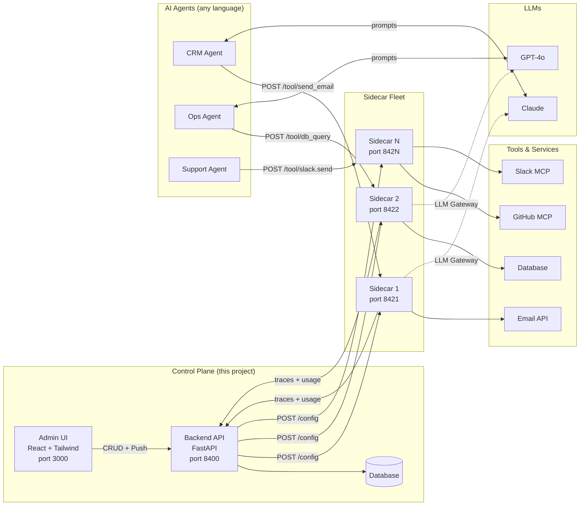

**Data flow:**
1. Platform team configures tools, policies, and MCP servers via the UI
2. Control plane pushes config to sidecars over HTTP
3. Agents call tools through their sidecar (the sidecar enforces policies)
4. Sidecars report usage and traces back to the control plane
5. Platform team monitors costs, traces, and experiments in the UI

---

## What This Guide Covers

This guide walks you through the complete setup — from zero to a fully managed AI agent safety infrastructure:

1. Deploy sidecars alongside your agents
2. Start the control plane (this project)
3. Register sidecars in the control plane
4. Configure tools and policies via the UI
5. Push configuration to sidecars
6. Connect your agents to the sidecars
7. Add MCP servers for auto-discovered tools
8. Monitor costs and set up budgets
9. Configure the model registry
10. Create quotas with runtime enforcement
11. Test everything in the Sandbox
12. Run A/B experiments between models
13. Monitor live traces with session context
14. View the agent registry

By the end, you'll have a centralized dashboard managing all your agent sidecars, with safety policies, cost budgets, and rate limits enforced without any code changes to your agents.

---

## The Big Picture


---

## Prerequisites

- Python 3.11+ (for the backend and sidecars)
- Node.js 18+ (for the frontend)
- Docker (optional, for containerized deployment)

---

## Step 1: Deploy a Sidecar

The sidecar is the runtime proxy that sits between your agent and its tools. You deploy one sidecar per agent (or per group of agents).

### Option A: Run directly (development)

```bash
# Clone the Ostiari repo (contains the sidecar)
git clone https://github.com/hk-775/Ostiari.git
cd Ostiari/sidecar

# Install
pip install -e .

# Start (empty — will be configured via control plane)
ostiari-sidecar --sidecar-id crm-agent --port 8421
```

You should see:

```
Ostiari Sidecar [crm-agent]: http://0.0.0.0:8421
  POST /tool/{action}       — validate & proxy to remote endpoint
  POST /validate            — validate only
  POST /config              — apply full config (control plane)
  POST /config/tools        — hot-reload tools
  POST /config/tools/{name} — add/update single tool
  POST /config/policy       — hot-reload policy
  GET  /config              — view current config
  GET  /tools               — list registered tools
  GET  /health              — health check
```

### Option B: Run with Docker (production)

```bash
# Build the sidecar image
cd Ostiari/sidecar
docker build -t ostiari-sidecar .

# Run it
docker run -d \
  --name sidecar-crm \
  -p 8421:8421 \
  ostiari-sidecar \
  --sidecar-id crm-agent
```

### Option C: Run with initial config (skip control plane for testing)

```bash
ostiari-sidecar \
  --sidecar-id crm-agent \
  --config example-config.yaml \
  --port 8421
```

The `example-config.yaml` pre-configures tools and policies so you can test immediately without the control plane.

### Verify the sidecar is running

```bash
curl http://localhost:8421/health
```

Expected response:
```json
{
  "status": "ok",
  "sidecar_id": "crm-agent",
  "tools_registered": 0,
  "policy_loaded": false,
  "modules_active": [],
  "modules_available": [{"name": "llm_gateway", "description": "..."}]
}
```

---

## Step 2: Start the Control Plane

The control plane is THIS project. It's the admin console that manages all your sidecars.

### Backend

```bash
cd ostiari-control-plane/backend
pip install -e .
python main.py
```

The API starts at `http://localhost:8400`. Verify:

```bash
curl http://localhost:8400/api/health
# {"status": "ok", "service": "control-plane"}
```

### Frontend

```bash
cd ostiari-control-plane/frontend
npm install
npm run dev
```

The UI starts at `http://localhost:3000`. Open it in your browser.

---

## Step 3: Register a Sidecar in the Control Plane

### Via the UI

1. Open `http://localhost:3000`
2. Click **Sidecars** in the nav
3. Click **Register Sidecar**
4. Fill in:
   - **Sidecar ID:** `crm-agent`
   - **Name:** `CRM Agent Sidecar`
   - **Endpoint:** `http://localhost:8421`
5. Click **Register**

<!-- Screenshot placeholder -->
```
┌──────────────────────────────────────────────────────────┐
│  Ostiari  │  Dashboard  │  Sidecars  │  Tools  │  ... │
├──────────────────────────────────────────────────────────┤
│                                                           │
│  Sidecars                          [Push All] [+ Register]│
│  Register and manage your sidecar instances               │
│                                                           │
│  ┌─────────────────────────────────────────────────────┐ │
│  │  Sidecar ID:  [crm-agent                         ]  │ │
│  │  Name:        [CRM Agent Sidecar                  ]  │ │
│  │  Endpoint:    [http://localhost:8421               ]  │ │
│  │                                                      │ │
│  │  [Register]  [Cancel]                                │ │
│  └─────────────────────────────────────────────────────┘ │
│                                                           │
│  ┌─────────────────────────────────────────────────────┐ │
│  │  Name          │ Endpoint              │ Status │ ... │
│  │─────────────────────────────────────────────────────│ │
│  │  CRM Agent     │ http://localhost:8421  │ ● reg  │ ↑🗑│ │
│  └─────────────────────────────────────────────────────┘ │
└──────────────────────────────────────────────────────────┘
```

### Via the API (curl)

```bash
curl -X POST http://localhost:8400/api/sidecars \
  -H "Content-Type: application/json" \
  -d '{
    "id": "crm-agent",
    "name": "CRM Agent Sidecar",
    "endpoint": "http://localhost:8421"
  }'
```

---

## Step 4: Add Tools to the Sidecar

Tools are the remote services that the sidecar proxies to. They're what your agent will call through the sidecar.

### Via the UI

1. Go to the **Sidecars** page
2. (Tools are managed per sidecar via the API for now)

### Via the API

```bash
# Add send_email tool
curl -X POST http://localhost:8400/api/tools/crm-agent \
  -H "Content-Type: application/json" \
  -d '{
    "name": "send_email",
    "endpoint": "http://email-service:8080/send",
    "method": "POST",
    "description": "Send an email to a recipient",
    "timeout_seconds": 10
  }'

# Add db_query tool
curl -X POST http://localhost:8400/api/tools/crm-agent \
  -H "Content-Type: application/json" \
  -d '{
    "name": "db_query",
    "endpoint": "http://db-service:8080/query",
    "method": "POST",
    "description": "Execute a database query",
    "timeout_seconds": 30
  }'
```

After adding, verify on the **Tools** page:

```
┌──────────────────────────────────────────────────────────┐
│  Tools                                                    │
│  All tools registered across sidecars                     │
│                                                           │
│  ┌─────────────────────────────────────────────────────┐ │
│  │ Tool       │ Endpoint                │ Method │ Side │ │
│  │──────────────────────────────────────────────────────│ │
│  │ send_email │ http://email-svc:8080   │ POST   │ crm  │ │
│  │ db_query   │ http://db-svc:8080      │ POST   │ crm  │ │
│  └─────────────────────────────────────────────────────┘ │
└──────────────────────────────────────────────────────────┘
```

---

## Step 5: Create a Policy

Policies define what's allowed, what's blocked, and what needs human approval.

### Via the UI

1. Go to the **Policies** page
2. Click **New Policy**
3. Enter a name: `CRM Safety Policy`
4. Enter the policy JSON:

```json
{
  "block": ["*.delete", "*.drop"],
  "allow": ["db_query"],
  "rules": [
    {
      "type": "risk_adjust",
      "action": "send_email",
      "risk_adjust": 25,
      "description": "Email has moderate risk"
    }
  ],
  "thresholds": {
    "global": {
      "allow_max": 30,
      "intervene_max": 70
    }
  }
}
```

5. Click **Create**

```
┌──────────────────────────────────────────────────────────┐
│  Policies                                    [+ New Policy]│
│  Define safety rules for your agents                      │
│                                                           │
│  ┌─────────────────────────────────────────────────────┐ │
│  │  📄 CRM Safety Policy                         [↑] [🗑] │
│  │  Global policy · Active                              │ │
│  │  ┌────────────────────────────────────────────────┐  │ │
│  │  │ {                                              │  │ │
│  │  │   "block": ["*.delete", "*.drop"],             │  │ │
│  │  │   "allow": ["db_query"],                       │  │ │
│  │  │   "rules": [                                   │  │ │
│  │  │     {"type": "risk_adjust",                    │  │ │
│  │  │      "action": "send_email",                   │  │ │
│  │  │      "risk_adjust": 25}                        │  │ │
│  │  │   ]                                            │  │ │
│  │  │ }                                              │  │ │
│  │  └────────────────────────────────────────────────┘  │ │
│  └─────────────────────────────────────────────────────┘ │
└──────────────────────────────────────────────────────────┘
```

### What the policy means

| Rule | Effect |
|------|--------|
| `block: ["*.delete", "*.drop"]` | Any action containing "delete" or "drop" is immediately blocked (score 100) |
| `allow: ["db_query"]` | `db_query` is always allowed (score 0) |
| `rules: send_email → +25` | `send_email` gets +25 risk score (total 25, under allow_max of 30 → allowed) |
| `thresholds: allow_max=30` | Score ≤ 30 = allowed |
| `thresholds: intervene_max=70` | Score 31-70 = needs human approval |
| Score > 70 | Blocked automatically |

---

## Step 6: Push Configuration to the Sidecar

This is the key step — sending the tools + policy you configured in the control plane to the actual running sidecar.

### Via the UI

1. Go to the **Sidecars** page
2. Click the **↑** (upload/push) icon next to your sidecar
3. Or click **Push All** to sync all sidecars at once

### Via the API

```bash
# Push to one sidecar
curl -X POST http://localhost:8400/api/sidecars/crm-agent/push

# Push to all sidecars
curl -X POST http://localhost:8400/api/sidecars/push-all
```

Expected response:
```json
{"sidecar_id": "crm-agent", "status": "success"}
```

### What happens during a push

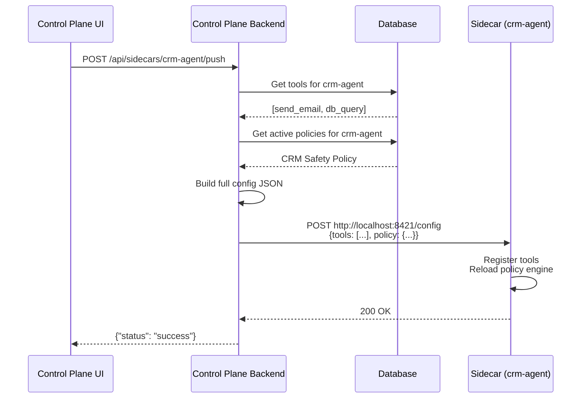

After pushing, verify the sidecar received the config:

```bash
curl http://localhost:8421/tools
# {"tools": [{"name": "send_email", ...}, {"name": "db_query", ...}]}

curl http://localhost:8421/health
# {"status": "ok", "tools_registered": 2, "policy_loaded": true, ...}
```

---

## Step 7: Connect Your Agent to the Sidecar

Now your sidecar is configured. Point your agent at it.

### Python Agent

```python
import requests

SIDECAR = "http://localhost:8421"

def call_tool(action: str, params: dict) -> dict:
    resp = requests.post(f"{SIDECAR}/tool/{action}", json=params)
    if resp.status_code == 403:
        return {"blocked": True, "reason": resp.json()["reason"]}
    if resp.status_code == 404:
        return {"error": "Unknown tool"}
    return resp.json()["result"]

# Example: this will work (db_query is in the allow list)
result = call_tool("db_query", {"sql": "SELECT * FROM customers LIMIT 10"})
print(result)

# Example: this will be BLOCKED (*.delete matches the block list)
result = call_tool("db_delete", {"table": "customers"})
print(result)  # {"blocked": True, "reason": "Blocked by policy"}
```

### Java Agent

```java
String SIDECAR = "http://localhost:8421";
HttpClient client = HttpClient.newHttpClient();

// Allowed: db_query
HttpResponse<String> resp = client.send(
    HttpRequest.newBuilder()
        .uri(URI.create(SIDECAR + "/tool/db_query"))
        .header("Content-Type", "application/json")
        .POST(BodyPublishers.ofString("{\"sql\": \"SELECT * FROM users\"}"))
        .build(),
    BodyHandlers.ofString());
System.out.println(resp.statusCode()); // 200

// Blocked: delete action
resp = client.send(
    HttpRequest.newBuilder()
        .uri(URI.create(SIDECAR + "/tool/db_delete"))
        .header("Content-Type", "application/json")
        .POST(BodyPublishers.ofString("{\"table\": \"users\"}"))
        .build(),
    BodyHandlers.ofString());
System.out.println(resp.statusCode()); // 403
```

### curl (for testing)

```bash
# Allowed
curl -X POST http://localhost:8421/tool/db_query \
  -H "Content-Type: application/json" \
  -d '{"sql": "SELECT * FROM users"}'
# → 200 {"result": {...}, "action": "db_query", "duration_ms": 45.2}

# Blocked
curl -X POST http://localhost:8421/tool/db_delete \
  -H "Content-Type: application/json" \
  -d '{"table": "users"}'
# → 403 {"blocked": true, "action": "db_delete", "score": 100, "reason": "..."}
```

---

## Complete Workflow Diagram

Here's everything connected end-to-end:


---

## Deploying Multiple Sidecars

For production, you'll have one sidecar per agent (or per agent group):

```bash
# Sidecar for CRM agent
docker run -d --name sidecar-crm -p 8421:8421 ostiari-sidecar --sidecar-id crm-agent

# Sidecar for Ops agent
docker run -d --name sidecar-ops -p 8422:8421 ostiari-sidecar --sidecar-id ops-agent

# Sidecar for Support agent
docker run -d --name sidecar-support -p 8423:8421 ostiari-sidecar --sidecar-id support-agent
```

Then register all three in the control plane:

```bash
curl -X POST http://localhost:8400/api/sidecars -d '{"id":"crm-agent","name":"CRM","endpoint":"http://sidecar-crm:8421"}'
curl -X POST http://localhost:8400/api/sidecars -d '{"id":"ops-agent","name":"Ops","endpoint":"http://sidecar-ops:8421"}'
curl -X POST http://localhost:8400/api/sidecars -d '{"id":"support-agent","name":"Support","endpoint":"http://sidecar-support:8421"}'
```

Each sidecar can have different tools and policies — configure them independently via the UI.

---

## Updating Policies Without Restarting Anything

This is the killer feature. To change what your agents can do:

1. Edit the policy in the UI (or via API)
2. Click Push
3. Done. The sidecar hot-reloads. The agent doesn't restart. No code changes.

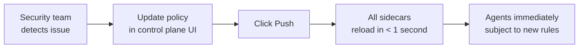

**Real-world scenario:** It's 2 AM. An agent is spamming emails due to a bug. The on-call:
1. Opens the control plane UI on their phone
2. Adds `send_email` to the block list
3. Clicks Push
4. Problem stopped. No deploy. No code change. No agent restart.

---

## Health Monitoring

The control plane polls sidecars for health:

```bash
# Check one sidecar
curl http://localhost:8400/api/sidecars/crm-agent/health
```

Response:
```json
{
  "sidecar_id": "crm-agent",
  "status": "healthy",
  "details": {
    "status": "ok",
    "tools_registered": 3,
    "policy_loaded": true,
    "modules_active": ["llm_gateway"]
  }
}
```

The dashboard shows real-time status for all sidecars:

```
┌──────────────────────────────────────────────────────────┐
│  Control Plane                                            │
│  Manage your Ostiari sidecar fleet                     │
│                                                           │
│  ┌──────────┐  ┌──────────┐  ┌──────────┐               │
│  │    3     │  │    8     │  │    2     │               │
│  │ Sidecars │  │  Tools   │  │ Policies │               │
│  └──────────┘  └──────────┘  └──────────┘               │
│                                                           │
│  Sidecar Fleet                                            │
│  ┌─────────────────────────────────────────────────────┐ │
│  │  CRM Agent Sidecar                                   │ │
│  │  http://sidecar-crm:8421           3 tools  ● healthy│ │
│  │─────────────────────────────────────────────────────│ │
│  │  Ops Agent Sidecar                                   │ │
│  │  http://sidecar-ops:8421           2 tools  ● healthy│ │
│  │─────────────────────────────────────────────────────│ │
│  │  Support Agent Sidecar                               │ │
│  │  http://sidecar-support:8421       3 tools ● unreachable│ │
│  └─────────────────────────────────────────────────────┘ │
└──────────────────────────────────────────────────────────┘
```

---

## Step 8: Add MCP Servers (Auto-Discover Tools)

MCP servers are services that expose tools via the Model Context Protocol. Instead of manually registering each tool, you add an MCP server and the sidecar **auto-discovers all its tools**.

### What is MCP? (Simple Explanation)

Think of MCP like USB for AI tools:
- Plug in a USB device → computer discovers what it can do
- Add an MCP server → sidecar discovers what tools it has

A GitHub MCP server might expose 15+ tools (create_issue, list_repos, search_code, create_pr, etc.). Without MCP, you'd register each one manually. With MCP, you point the sidecar at the server and it discovers them all automatically.

### Adding an MCP Server via the UI

1. Go to the **MCP Servers** page (in the nav bar)
2. Click **Add MCP Server**
3. Fill in the form:

```
┌──────────────────────────────────────────────────────────┐
│  MCP Servers                              [+ Add MCP Server]│
│  Connect MCP tool servers to sidecars                     │
│                                                           │
│  ┌─────────────────────────────────────────────────────┐ │
│  │  Server name: [github                             ]  │ │
│  │  Sidecar:     [CRM Agent Sidecar           ▼      ]  │ │
│  │                                                      │ │
│  │  [📦 Embedded (in-process)]  [🌐 Remote]  [💻 Stdio]  │ │
│  │       ↑ selected                                     │ │
│  │                                                      │ │
│  │  Package: [mcp-server-github                      ]  │ │
│  │  Prefix:  [github                                 ]  │ │
│  │  Blocked: [delete_repo, delete_branch             ]  │ │
│  │  Config:  [{"token": "ghp_xxxx"}                  ]  │ │
│  │                                                      │ │
│  │  [Add Server]  [Cancel]                              │ │
│  └─────────────────────────────────────────────────────┘ │
└──────────────────────────────────────────────────────────┘
```

### Three Modes Explained

Choose based on where the MCP server should run:

| Mode | Select when... | Example |
|------|---------------|---------|
| **📦 Embedded** | MCP server is a Python package you can `pip install` | `mcp-server-github`, `mcp-server-postgres` |
| **🌐 Remote** | MCP server is already running somewhere as a service | `http://mcp-server:3000/mcp` |
| **💻 Stdio** | MCP server is a Node.js/Go binary you want to run locally | `npx @modelcontextprotocol/server-filesystem /data` |

**Embedded is fastest** (zero network hop) — use it when possible.

### Via the API

```bash
# Embedded: Python MCP server runs inside the sidecar
curl -X POST http://localhost:8400/api/mcp-servers/crm-agent \
  -H "Content-Type: application/json" \
  -d '{
    "name": "github",
    "mode": "embedded",
    "package": "mcp-server-github",
    "config": {"token": "ghp_your_token_here"},
    "blocked_tools": ["delete_repo"],
    "prefix": "github"
  }'

# Remote: connects to an external MCP server
curl -X POST http://localhost:8400/api/mcp-servers/crm-agent \
  -H "Content-Type: application/json" \
  -d '{
    "name": "slack",
    "mode": "remote",
    "url": "http://slack-mcp-server:3000/mcp",
    "prefix": "slack"
  }'

# Stdio: spawns a local subprocess
curl -X POST http://localhost:8400/api/mcp-servers/crm-agent \
  -H "Content-Type: application/json" \
  -d '{
    "name": "filesystem",
    "mode": "stdio",
    "command": ["npx", "@modelcontextprotocol/server-filesystem", "/data"],
    "prefix": "fs"
  }'
```

### After Adding: Push Config

After adding MCP servers, **push the config** to the sidecar (same as tools and policies):

```bash
curl -X POST http://localhost:8400/api/sidecars/crm-agent/push
```

The sidecar will:
1. Connect to each MCP server (load package / connect via HTTP / spawn process)
2. Call `tools/list` to discover available tools
3. Register them as `{prefix}.{tool_name}`
4. Apply any `blocked_tools` / `allowed_tools` filters

### Verify Tools Were Discovered

```bash
curl http://localhost:8421/tools
```

```json
{
  "tools": [
    {"name": "send_email", "endpoint": "http://email-svc:8080/send", ...}
  ],
  "mcp_tools": [
    {"name": "github.create_issue", "description": "Create a GitHub issue", "server": "github"},
    {"name": "github.list_repos", "description": "List repositories", "server": "github"},
    {"name": "github.search_code", "description": "Search code", "server": "github"},
    {"name": "github.create_pr", "description": "Create a pull request", "server": "github"},
    {"name": "slack.send_message", "description": "Send a Slack message", "server": "slack"},
    {"name": "fs.read_file", "description": "Read a file", "server": "filesystem"}
  ]
}
```

### Calling MCP Tools from Your Agent

MCP tools use the exact same `/tool/{action}` endpoint as HTTP tools:

```bash
# Call a GitHub tool (MCP)
curl -X POST http://localhost:8421/tool/github.create_issue \
  -d '{"repo": "myorg/myapp", "title": "Fix login bug", "body": "Steps to reproduce..."}'

# Call a Slack tool (MCP)
curl -X POST http://localhost:8421/tool/slack.send_message \
  -d '{"channel": "#alerts", "text": "Deploy complete"}'

# Call an HTTP tool (regular)
curl -X POST http://localhost:8421/tool/send_email \
  -d '{"to": "boss@co.com", "body": "Report attached"}'
```

**The agent doesn't know the difference.** All tools use the same interface.

### Policy Applies to MCP Tools Too

You can block, allow, or score MCP tools in your policy — just use their qualified name:

```json
{
  "block": ["github.delete_repo", "*.delete"],
  "allow": ["github.list_repos", "github.search_code"],
  "rules": [
    {"type": "risk_adjust", "action": "github.create_pr", "risk_adjust": 40}
  ]
}
```

### Complete MCP Workflow

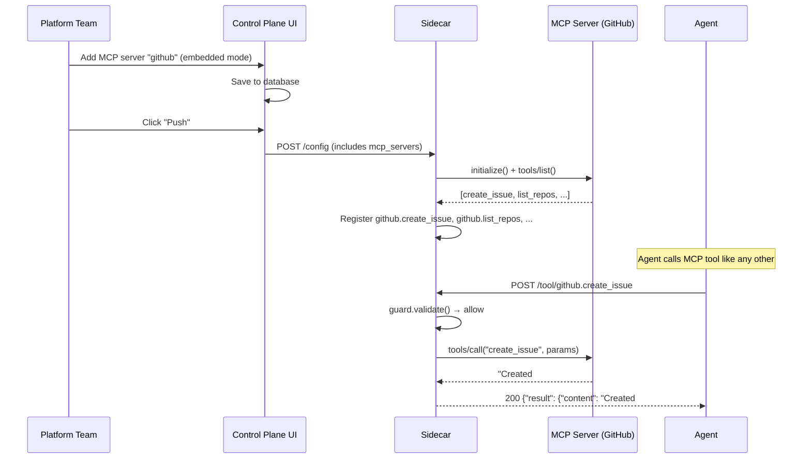

---

## Step 9: Cost Dashboard

The Cost Dashboard tracks LLM spending across your entire sidecar fleet. It shows total cost, broken down by model, sidecar, agent, and day.

### Where the data comes from

When sidecars have the LLM Gateway module enabled, every LLM call is reported to the control plane:

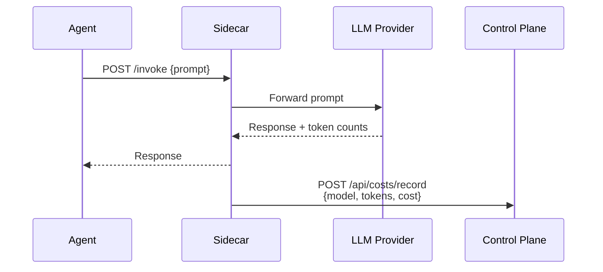

The control plane estimates cost using built-in pricing tables (Claude Sonnet, Opus, Haiku, GPT-4o, GPT-4o-mini). If a sidecar sends an explicit `cost_usd`, that value is used instead.

### Viewing the dashboard

Open the **Costs** page in the UI. You can:

- **Select a time period** — 1 day, 7 days, 30 days, or 90 days
- **Filter by sidecar** — see costs for just one sidecar
- **View breakdowns** — by model (which LLM costs most), by sidecar (which agent costs most), by agent ID, and by day (trending)

### Via the API

```bash
# Get cost summary for the last 7 days
curl "http://localhost:8400/api/costs/summary?period_days=7"

# Filter by sidecar
curl "http://localhost:8400/api/costs/summary?period_days=30&sidecar_id=crm-agent"

# Get raw records
curl "http://localhost:8400/api/costs/records?limit=50"
```

Example summary response:

```json
{
  "total_cost_usd": 42.87,
  "total_tokens": 2850000,
  "total_requests": 1240,
  "by_model": [
    {"model": "claude-sonnet-4-6", "cost": 28.50, "tokens": 1900000, "requests": 800},
    {"model": "gpt-4o", "cost": 14.37, "tokens": 950000, "requests": 440}
  ],
  "by_sidecar": [
    {"sidecar_id": "crm-agent", "cost": 30.12, "tokens": 2010000, "requests": 900},
    {"sidecar_id": "ops-agent", "cost": 12.75, "tokens": 840000, "requests": 340}
  ],
  "by_agent": [
    {"agent_id": "crm-main", "cost": 30.12, "tokens": 2010000, "requests": 900}
  ],
  "daily_costs": [
    {"date": "2026-06-27", "cost": 5.20, "tokens": 350000, "requests": 180},
    {"date": "2026-06-28", "cost": 6.10, "tokens": 410000, "requests": 195}
  ]
}
```

### Recording usage manually (for testing)

If you want to populate the dashboard without running actual LLM calls:

```bash
curl -X POST http://localhost:8400/api/costs/record \
  -H "Content-Type: application/json" \
  -d '{
    "sidecar_id": "crm-agent",
    "agent_id": "crm-main",
    "model": "claude-sonnet-4-6",
    "input_tokens": 1500,
    "output_tokens": 500,
    "total_tokens": 2000,
    "cost_usd": 0.0,
    "action": "generate_report"
  }'
```

When `cost_usd` is `0.0`, the backend automatically estimates cost from the token counts and model pricing.

---

## Step 10: Model Configuration

The Model Configuration page is a central registry for all LLM models available in your fleet. It controls which models sidecars can route to, their pricing (for cost calculation), capabilities, and provider mappings.

### Why a model registry?

Without a central registry:
- Each sidecar has hardcoded model lists that drift out of sync
- Pricing tables need manual updates across every sidecar
- No visibility into which models are available across the fleet
- Adding a new model means touching every sidecar config

With the registry:
- One source of truth for all model metadata
- Pricing automatically pushed to sidecars (enables local cost calculation)
- Routing strategies configured per model
- Capabilities (tool use, vision) declared centrally

### Pre-seeded models

The control plane ships with 14 models pre-seeded from AxonLLM:

| Model | Provider | Category | Capabilities |
|-------|----------|----------|-------------|
| claude-sonnet-4-6 | Anthropic | General | Tools, Vision |
| claude-opus-4-6 | Anthropic | Reasoning | Tools, Vision |
| claude-haiku-4-5 | Anthropic | Speed | Tools, Vision |
| gpt-4o | OpenAI | General | Tools, Vision |
| gpt-4o-mini | OpenAI | Speed | Tools, Vision |
| gpt-4.1 | OpenAI | General | Tools |
| gemini-2.5-pro | Google | Reasoning | Tools, Vision |
| gemini-2.5-flash | Google | Speed | Tools, Vision |
| command-r-plus | Cohere | General | Tools |
| command-r | Cohere | Speed | Tools |
| llama-3.1-405b | Bedrock | Reasoning | Tools |
| llama-3.1-70b | Bedrock | General | Tools |
| mistral-large | Bedrock | General | Tools |
| titan-text-premier | Bedrock | Speed | - |

### Managing models via the UI

1. Go to the **Models** page (indigo icon in sidebar)
2. View all registered models with their pricing, provider, and capabilities
3. Click a model to edit its routing strategy, pricing, or capabilities
4. Click **Add Model** to register a custom or fine-tuned model

### Via the API

```bash
# List all models
curl http://localhost:8400/api/models

# Get one model
curl http://localhost:8400/api/models/claude-sonnet-4-6

# Add a custom model
curl -X POST http://localhost:8400/api/models \
  -H "Content-Type: application/json" \
  -d '{
    "id": "my-fine-tuned-model",
    "provider": "openai",
    "category": "general",
    "capabilities": ["tools"],
    "pricing": {"input": 5.00, "output": 20.00},
    "routing_strategy": "direct"
  }'

# Update pricing
curl -X PUT http://localhost:8400/api/models/my-fine-tuned-model \
  -H "Content-Type: application/json" \
  -d '{
    "pricing": {"input": 4.00, "output": 16.00}
  }'

# Delete a model
curl -X DELETE http://localhost:8400/api/models/my-fine-tuned-model
```

### Routing strategies

Each model can have a routing strategy that determines how the sidecar reaches the provider:

| Strategy | Description | When to use |
|----------|-------------|-------------|
| `direct` | Call the provider's API directly | Default for most models |
| `bedrock` | Route through AWS Bedrock | AWS-hosted, IAM auth |
| `azure` | Route through Azure OpenAI | Azure-hosted, AAD auth |
| `vertex` | Route through Google Vertex AI | GCP-hosted, service account |
| `fallback` | Try primary, fall back to secondary | High-availability setups |

### How model pricing feeds cost enforcement

When the sidecar's quota system calculates cost, it uses pricing from the model registry:

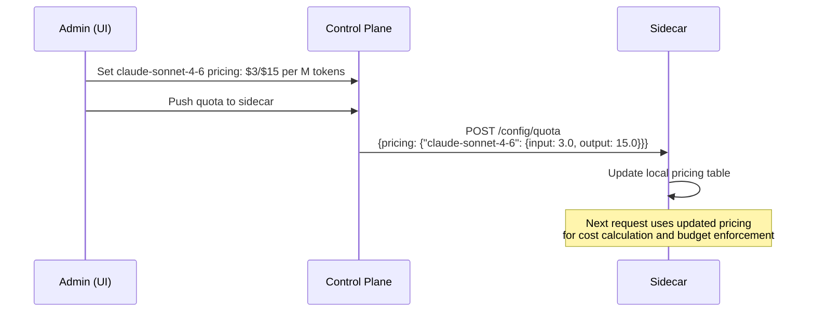

---

## Step 11: Quotas (Runtime Enforcement)

Quotas are now **enforced at runtime on the sidecar** — not just informational numbers in the control plane. When you create a quota and push it, the sidecar actively blocks requests that exceed limits.

### What changed

Previously, quotas in the control plane were informational only — they showed spending relative to a budget but didn't actually stop requests. Now:

- **Rate limits** — hard-enforced with 429 responses and retry_after headers
- **Budget caps** — pre-request projection blocks before the LLM call is made
- **Model allowlists** — 403 if agent tries to use a restricted model
- **Max tokens cap** — silently reduced (agent never errors, just gets shorter responses)

### Creating a quota

#### Via the UI

1. Go to the **Quotas** page (emerald icon in sidebar)
2. Click **Create Quota**
3. Configure:
   - **Name:** "CRM Agent Daily Budget"
   - **Sidecar:** crm-agent
   - **Rate Limit:** 30 req/min, 500 req/hour
   - **Budget:** $50/day
   - **Model Allowlist:** claude-sonnet-4-6, claude-haiku-4-5
   - **Max Tokens:** 2048
4. Click **Create**
5. Click **Push to Sidecar** to activate enforcement

#### Via the API

```bash
# Create a quota
curl -X POST http://localhost:8400/api/quotas \
  -H "Content-Type: application/json" \
  -d '{
    "name": "CRM Agent Daily Budget",
    "sidecar_id": "crm-agent",
    "rate_limit": {
      "requests_per_minute": 30,
      "requests_per_hour": 500
    },
    "budget": {
      "limit_usd": 50.00,
      "period": "daily"
    },
    "model_allowlist": ["claude-sonnet-4-6", "claude-haiku-4-5"],
    "max_tokens": 2048
  }'

# Push the quota to the sidecar (activates enforcement)
curl -X POST http://localhost:8400/api/quotas/1/push
```

### Enforcement behavior

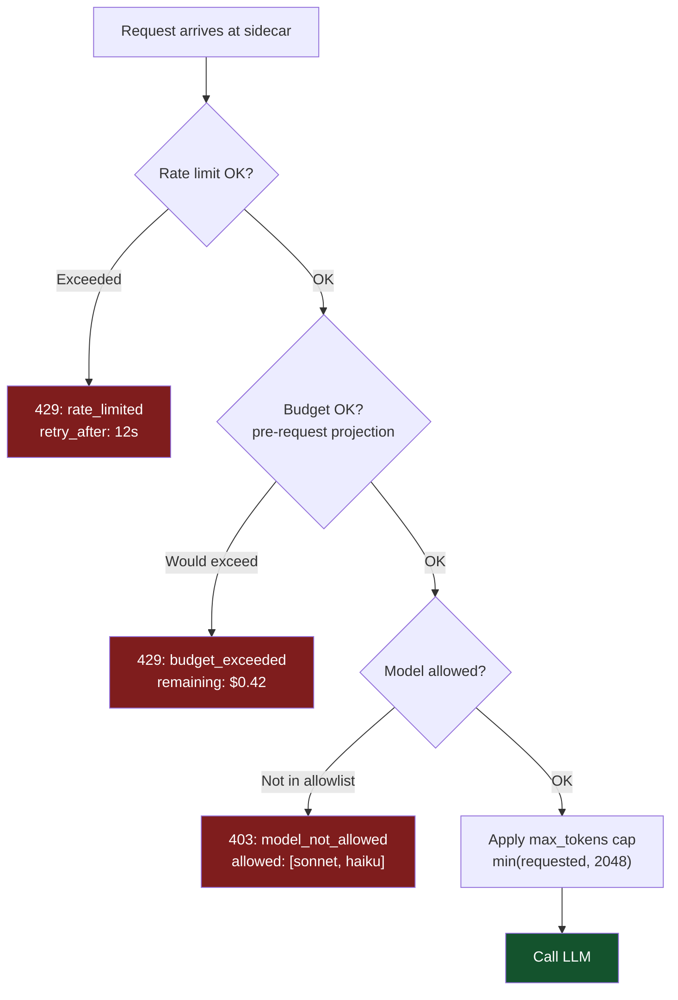

### Important: Push activates enforcement

Creating a quota in the control plane does NOT enforce it. You must **push** it to the sidecar:

```bash
# This only saves the quota in the database:
POST /api/quotas

# This activates enforcement on the sidecar:
POST /api/quotas/{id}/push
```

The UI has a "Push to Sidecar" button that does this in one click.

---

## Step 12: Sandbox

The Sandbox is a testing environment built into the control plane UI. It lets you interact with sidecars directly — send LLM prompts, run pre-built scenarios, or write custom agent code — all without deploying an agent.

### Why a Sandbox?

- **Developers** need to test tool configurations before writing agent code
- **Platform teams** need to verify policies work correctly
- **Demos** need a quick way to show the system in action
- **Debugging** is faster when you can interact directly

### Three tabs

#### Chat Tab

An interactive chat interface that sends messages to a gateway's `/invoke` endpoint (via the sidecar proxy to avoid CORS):

1. Select an Agent Gateway from the dropdown
2. Type a message (e.g., "Send an email to test@example.com saying hello")
3. The gateway routes to the configured LLM, executes tools, and returns the response
4. See the full trace of what happened (which tools were called, which were blocked)

This is the fastest way to test whether your tools and policies are configured correctly. The browser never calls the gateway directly — requests go through `/api/proxy/sidecar/{id}/invoke` on the control plane.

#### Scenarios Tab

One-click pre-built demos that exercise common patterns:

| Scenario | What it tests |
|----------|--------------|
| Basic Tools | Simple tool call + policy enforcement |
| Multi-Step | LLM choosing multiple tools in sequence |
| Blocked Action | Policy blocking a dangerous action |
| MCP Tools | MCP server tool discovery and execution |

Each scenario runs with one click and shows the full trace (what the LLM decided, what was allowed/blocked, final response).

#### Code Tab

A code editor with an output panel where you write and run agent code:

```python
# Write code that interacts with the gateway
import requests

SIDECAR = "http://localhost:8421"

# Test the full /invoke flow
response = requests.post(f"{SIDECAR}/invoke", json={
    "messages": [{"role": "user", "content": "List my GitHub repos"}]
})

print(f"Response: {response.json()['response']}")
print(f"Tools used: {response.json().get('tool_calls', [])}")
```

Code runs in a sandboxed backend executor. Output (stdout, stderr, return values) appears in the output panel beside the editor.

### Sandbox uses real enforcement

The Sandbox sends real requests to real sidecars. This means:
- Policies apply (you'll see blocks)
- Quotas count (budget decreases)
- Traces appear in the Live Trace Viewer
- Costs are recorded

This makes it a true integration test, not a mock.

---

## Step 13: A/B Experiments

A/B experiments let you split traffic between two models by percentage and compare their performance side-by-side. This helps answer questions like: "Is GPT-4o-mini good enough for this task, or do we need Claude Sonnet?"

### How it works

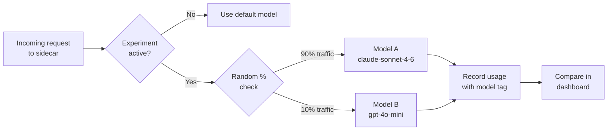

### Creating an experiment

#### Via the UI

1. Go to the **Experiments** page
2. Click **New Experiment**
3. Fill in:
   - **Name:** `sonnet-vs-mini`
   - **Model A (control):** `claude-sonnet-4-6`
   - **Model B (challenger):** `gpt-4o-mini`
   - **Traffic % to B:** `10` (sends 10% of requests to Model B)
   - **Sidecar:** `crm-agent`
4. Click **Create**

#### Via the API

```bash
curl -X POST http://localhost:8400/api/experiments \
  -H "Content-Type: application/json" \
  -d '{
    "name": "sonnet-vs-mini",
    "model_a": "claude-sonnet-4-6",
    "model_b": "gpt-4o-mini",
    "traffic_pct_b": 10,
    "sidecar_id": "crm-agent"
  }'
```

### Viewing results

After the experiment has been running for a while, check the results:

```bash
curl "http://localhost:8400/api/experiments/sonnet-vs-mini/results?period_days=7"
```

Response:

```json
{
  "experiment_name": "sonnet-vs-mini",
  "period_days": 7,
  "model_a": {
    "model": "claude-sonnet-4-6",
    "requests": 900,
    "total_tokens": 1800000,
    "total_cost": 28.50,
    "avg_tokens": 2000,
    "avg_cost": 0.031667
  },
  "model_b": {
    "model": "gpt-4o-mini",
    "requests": 100,
    "total_tokens": 210000,
    "total_cost": 0.16,
    "avg_tokens": 2100,
    "avg_cost": 0.0016
  }
}
```

In this example, Model B (gpt-4o-mini) costs 20x less per request. If quality is acceptable, you could switch to it entirely.

### Managing experiments

```bash
# Toggle an experiment on/off
curl -X PATCH http://localhost:8400/api/experiments/sonnet-vs-mini/toggle

# Delete an experiment
curl -X DELETE http://localhost:8400/api/experiments/sonnet-vs-mini

# List all experiments
curl http://localhost:8400/api/experiments
```

---

## Step 14: Agents Page

The Agents page provides a centralized registry of all AI agents connected to your sidecars. It shows which agents exist, what framework they use, which tools they have access to, and which sidecar they are assigned to.

### Why an Agents Page?

In multi-tenant deployments with many sidecars, operators need to answer:
- How many agents are in my fleet?
- What framework is each agent built with?
- Which sidecar is each agent routing through?
- What tools does each agent have access to?

The Agents page answers all of these at a glance.

### What You See

Each agent card displays:
- **Agent name** and description
- **Framework badge** — OpenAI, Anthropic, Strands, Bedrock, AgentCore, CrewAI, or LangGraph
- **Model** — which LLM the agent uses (e.g., claude-sonnet-4-6)
- **Tools** — list of tools available to this agent
- **Sidecar assignment** — which sidecar this agent routes through

### Current Demo Fleet

The demo environment includes 9 agents across 7 frameworks:

| Agent | Framework | Model | Sidecar |
|-------|-----------|-------|---------|
| CRM Agent | OpenAI | gpt-4o | crm-agent |
| Ops Agent | Strands | claude-sonnet-4-6 | ops-agent |
| Support Agent | Anthropic | claude-haiku-4-5 | support-agent |
| DevOps Agent | Bedrock | us.anthropic.claude-sonnet-4-6 | devops-agent |
| Analytics Agent | LangGraph | gpt-4o | analytics-agent |
| Security Agent | AgentCore | claude-sonnet-4-6 | security-agent |
| Finance Agent | CrewAI | gpt-4o-mini | finance-agent |

### Via the API

```bash
# List all agents
curl http://localhost:8400/api/agents

# Get details for one agent
curl http://localhost:8400/api/agents/crm-agent
```

### Via the UI

1. Open the sidebar
2. Under the **Overview** section, click **Agents**
3. Browse the agent registry with framework badges and tool lists

---

## Step 15: Live Trace Viewer

The Live Trace Viewer shows tool calls happening across all your sidecars in real time. It is useful for debugging, monitoring, and understanding how your agents are behaving. Traces now include tool calls from `/invoke` (LLM-driven tool use), session/plan/step context, tool call parameters, and the **model used** for each request.

### How it works

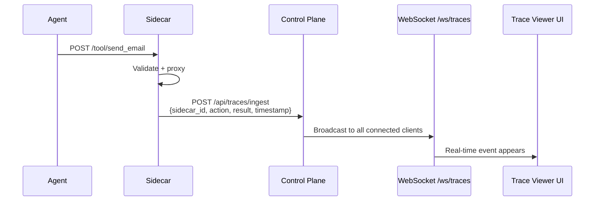

Sidecars send a trace event to the control plane after every tool call. The control plane broadcasts it to all connected WebSocket clients (the Trace Viewer page in the UI).

### Using the Trace Viewer

1. Open the **Traces** page in the UI
2. Events appear as they happen (newest at top)
3. Each trace row shows an **indigo model badge** (e.g., "claude-sonnet-4-6") so you can see at a glance which model served each request
4. Click a row to see the detail panel, which includes the full model name, parameters, session context, and timing
5. Controls:
   - **Pause** — stop scrolling, freeze the view to inspect events
   - **Resume** — start receiving events again
   - **Clear** — remove all events from the view

### What a trace event looks like

Each event sent by a sidecar contains (note the `model` field):

```json
{
  "sidecar_id": "crm-agent",
  "action": "send_email",
  "timestamp": "2026-07-03T14:23:01.456Z",
  "duration_ms": 45.2,
  "status": "allowed",
  "score": 25,
  "model": "claude-sonnet-4-6",
  "agent_id": "crm-main",
  "request": {"to": "user@example.com", "subject": "Report"},
  "response_status": 200
}
```

Or for a blocked call:

```json
{
  "sidecar_id": "ops-agent",
  "action": "db_delete",
  "timestamp": "2026-07-03T14:23:05.789Z",
  "duration_ms": 1.2,
  "status": "blocked",
  "score": 100,
  "agent_id": "ops-main",
  "reason": "Matched block pattern: *.delete"
}
```

### Connecting via WebSocket (programmatic)

If you want to build your own trace consumer (e.g., pipe to a SIEM or alerting system):

```python
import asyncio
import websockets
import json

async def watch_traces():
    async with websockets.connect("ws://localhost:8400/ws/traces") as ws:
        # On connect, you'll receive the last 50 events as catch-up
        while True:
            event = json.loads(await ws.recv())
            if event["status"] == "blocked":
                print(f"BLOCKED: {event['sidecar_id']}/{event['action']} — {event['reason']}")

asyncio.run(watch_traces())
```

### Getting recent traces via REST

For non-real-time needs (e.g., loading initial page state):

```bash
curl "http://localhost:8400/api/traces/recent?limit=50"
```

```json
{
  "traces": [
    {"sidecar_id": "crm-agent", "action": "send_email", "status": "allowed", ...},
    {"sidecar_id": "ops-agent", "action": "db_delete", "status": "blocked", ...}
  ],
  "total": 50
}
```

---

## Per-Agent Tool Authorization

When multiple agents share a gateway (shared gateway or NAT gateway mode), you need to control which agent can access which tools. The sidecar enforces **least privilege** — each agent can only call tools explicitly granted to it.

### How it works

- **Unregistered agents** are denied all tools by default
- **Registered agents** get explicit tool grants (exact names or wildcards)
- Wildcards support patterns: `*` (all tools), `github.*` (all GitHub tools)
- Agent identity is determined by the `X-Agent-Id` header or API key

### Example configuration (pushed from control plane)

```yaml
agent_auth:
  enabled: true
  default_grants: []  # unregistered agents denied by default
  agents:
    research-agent:
      allowed_tools: ["web_search", "file_read", "db_query"]
    ops-agent:
      allowed_tools: ["db_query", "db_delete", "send_email", "github.*"]
    admin-agent:
      allowed_tools: ["*"]  # full access
```

### Future: JWT Override

The current system is policy-based (static config). A future enhancement will add JWT-based authorization where a signed token can override or supplement the policy grants — useful for temporary elevated access or cross-team collaboration.

---

## Full Cost Enforcement

The sidecar calculates LLM cost locally (no round-trip to control plane) and enforces budgets in real-time:

1. **Pre-request budget projection** — estimates cost BEFORE calling the LLM using a heuristic (~800 input + ~400 output tokens). If projected spend exceeds budget, returns 429 immediately.
2. **Local pricing table** — per-model pricing for all supported models (Claude, GPT-4o, Bedrock, etc.)
3. **Budget alert thresholds** — fires callbacks at 80% (warning), 90% (critical), and 100% (exhausted)
4. **Silent max_tokens cap** — if quota limits output to 2048 tokens but agent requests 4096, the sidecar silently uses 2048 (no error, just shorter response)

This means budgets are protected without waiting for the LLM response — the agent is blocked before expensive calls are made.

---

## Audit Log

Every configuration change in the control plane is recorded in the audit log. This includes creating/updating/deleting sidecars, tools, policies, MCP servers, and experiments.

### Viewing the audit log

Open the **Audit** page in the UI, or query via the API:

```bash
# All recent entries
curl "http://localhost:8400/api/audit?limit=50"

# Filter by resource type
curl "http://localhost:8400/api/audit?resource_type=policy"

# Filter by actor
curl "http://localhost:8400/api/audit?actor=admin@company.com"

# Filter by action
curl "http://localhost:8400/api/audit?action=update"
```

Example response:

```json
[
  {
    "id": 42,
    "timestamp": "2026-07-03T14:20:00Z",
    "actor": "admin@company.com",
    "action": "update",
    "resource_type": "policy",
    "resource_id": "1",
    "details": {"field": "block", "added": ["send_email"]}
  },
  {
    "id": 41,
    "timestamp": "2026-07-03T14:15:00Z",
    "actor": "admin@company.com",
    "action": "push",
    "resource_type": "sidecar",
    "resource_id": "crm-agent",
    "details": {"tools": 3, "policy": "CRM Safety Policy"}
  }
]
```

---

## Data Persistence

The control plane persists all data in two places:

- **SQLite database** at `backend/data/control_plane.db` — stores sidecars, tools, policies, MCP servers, quotas, agents, cost records, traces, audit log, and experiments
- **JSON state file** at `backend/data/state.json` — mirrors in-memory stores (quotas, models, experiments) for quick recovery on restart

**How it works:**
- On graceful shutdown (Ctrl+C or SIGTERM), the backend writes all in-memory state to `state.json`
- On startup, it restores from `state.json` — no re-seeding of demo data needed
- SQLite tables are the source of truth for relational data (sidecars, tools, policies, agents, traces, audit, costs)
- The JSON file captures runtime-only stores that live in memory during normal operation

This means your configuration, cost data, and trace history survive backend restarts. No manual backup is needed for development; for production, back up the SQLite database file.

---

## Agent Gateway Deployment Model

The UI now refers to sidecars as **Agent Gateways**. This rename reflects the fact that the component supports three distinct deployment modes — not just the per-pod "sidecar" pattern.

> **API backward compatibility:** The API routes still use `/api/sidecars` for now. The rename is UI-only and will propagate to the API in a future release.

### Why the rename matters

"Sidecar" implies a single deployment model: one container per pod in Kubernetes. But this component works in all three of these configurations:

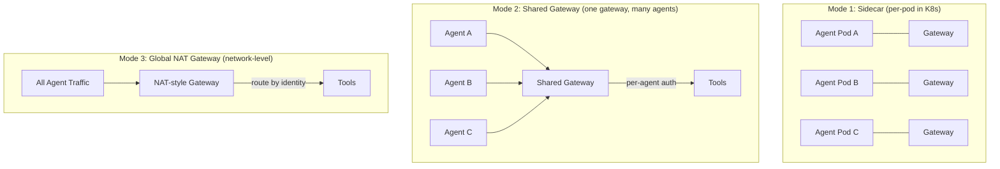

| Mode | How it works | Best for |
|------|-------------|----------|
| **Sidecar** | One gateway per pod, co-located with the agent. Network policy ensures agent can ONLY reach its gateway. | Strong isolation, per-agent network policies, K8s environments |
| **Shared gateway** | One gateway instance serves multiple agents. Per-agent tool authorization controls who can do what. | Dev environments, small teams, cost efficiency |
| **Global NAT gateway** | Network-level proxy that all agents route through. Like a NAT gateway but for AI tool calls. | Enterprise-wide governance, zero per-agent config needed |

All three modes use the same Docker image, the same APIs, and the same control plane. The only difference is deployment topology and network routing.

---

## Sidecar Proxy (Browser-to-Sidecar Communication)

The control plane includes a built-in proxy that forwards UI requests to sidecars:

```
/api/proxy/sidecar/{sidecar_id}/{path}
```

**Why this exists:** The browser cannot call sidecars directly due to CORS restrictions and network isolation (sidecars may be on private networks). The proxy makes the Sandbox and future features work without exposing sidecars to the public internet.

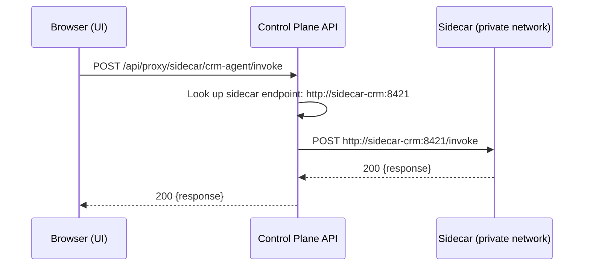

The proxy:
- Looks up the sidecar's registered endpoint
- Forwards the request (method, headers, body)
- Returns the response to the browser
- Eliminates CORS issues entirely

---

## Troubleshooting

| Problem | Cause | Fix |
|---------|-------|-----|
| Push fails: "Unreachable" | Sidecar is down or endpoint is wrong | Check sidecar is running, verify endpoint URL |
| Push fails: "Timeout" | Sidecar is slow to respond | Increase push timeout or check sidecar resources |
| Agent gets 404 from sidecar | Tool not registered | Push config from control plane, check `/tools` |
| Agent gets 403 unexpectedly | Policy is blocking the action | Check policy in UI, look at the `reason` field |
| Sidecar shows "policy_loaded: false" | No policy pushed yet | Create a policy and push it |
| Health shows "unreachable" | Network issue between control plane and sidecar | Check firewall rules, ensure ports are open |
| MCP tools not appearing | MCP server failed to connect | Check sidecar logs, verify package installed or URL reachable |
| MCP embedded: ImportError | Package not installed in sidecar | `pip install {package}` in the sidecar container |
| MCP remote: connection refused | MCP server not running | Start the MCP server, verify URL |
| MCP stdio: command not found | Binary not in PATH | Install the MCP server binary in the sidecar image |
| Cost dashboard shows $0 | LLM Gateway not enabled on sidecars | Enable `llm_gateway` module in sidecar config |
| Traces not appearing | Sidecar not reporting to control plane | Verify sidecar knows the control plane URL |
| Traces missing /invoke tool calls | Old sidecar version | Update sidecar — trace reporter in executor is now automatic |
| Experiment results empty | Not enough time elapsed | Wait for traffic to accumulate, check period_days |
| Quota not enforced | Quota created but not pushed | Click "Push to Sidecar" or call `POST /api/quotas/{id}/push` |
| Agent gets 429 unexpectedly | Rate limit or budget exceeded | Check quota config, view budget usage in Costs page |
| Agent gets shorter responses | Max tokens cap is active | Check quota's max_tokens setting (silent cap, not an error) |
| Model not allowed (403) | Model not in quota allowlist | Add the model to the quota's model_allowlist and re-push |
| Sandbox not connecting | No sidecar selected | Select a sidecar in the Sandbox dropdown before sending |

---

## Available Features

These features are already built and ready to use:

### LLM Gateway Module

Enable in the sidecar config to get:
- **Smart model routing** — TaskClassifier picks the best model for each prompt (code → Sonnet, simple QA → Haiku)
- **Fallback chains** — if primary model fails, auto-retry with next model
- **PII redaction** — strips emails, SSNs, credit cards before LLM sees them (reversible)
- **Prompt injection detection** — blocks suspicious prompts
- **The `/invoke` endpoint** — agents send one message, get a full answer (no tool loop code)

```yaml
# Add to sidecar config:
modules:
  llm_gateway: true
llm:
  default_model: claude-sonnet-4-6
  fallback_chain: ["claude-sonnet-4-6", "gpt-4o"]
  security:
    pii_redaction: true
    injection_detection: true
```

Powered by AxonLLM (imported in-process, zero extra network hop).

### MCP Server Integration

Connect MCP tool servers to sidecars with three modes:
- **Embedded** — runs in-process (fastest, zero network hop)
- **Remote** — connects to external MCP server via HTTP
- **Stdio** — spawns local subprocess

Configured via the MCP Servers page in the control plane UI.

### Multiple Policies

Global + sidecar-specific policies merge automatically. Create a global policy (no sidecar assigned) and it applies to all sidecars. Create a sidecar-specific policy to override or tighten rules for that sidecar.

### OpenTelemetry Tracing

The sidecar propagates trace context end-to-end. Configure export via environment variables:
```bash
OTEL_EXPORTER_OTLP_ENDPOINT=http://jaeger:4317
OTEL_SERVICE_NAME=ostiari-sidecar
```

---

## Demo Fleet Summary

The demo environment ships with a complete fleet to showcase all features:

| Resource | Count | Details |
|----------|-------|---------|
| Agent Gateways | 7 | crm, ops, support, devops, analytics, security, finance |
| Agents | 9 | Across 7 frameworks (OpenAI, Anthropic, Strands, Bedrock, AgentCore, CrewAI, LangGraph) |
| Tools | 22 | Across all gateways |
| Policies | 5 | Global + gateway-specific |
| Quotas | 5 | Rate limits + budgets per gateway |
| Models (cost tracked) | 5 | claude-sonnet, claude-haiku, gpt-4o, gpt-4o-mini, bedrock |
| Live traces | Active | From all agents with session grouping |

All demo data persists across restarts (SQLite + JSON state file).

---

## What's Next

The core platform is complete — including model registry, runtime quota enforcement, sandbox testing, and full cost tracking with local sidecar calculation. Planned future enhancements:

- **Authentication and SSO** — OIDC/SAML login for the control plane UI, role-based access control
- **Multi-tenant support** — isolate teams/orgs with their own sidecars, policies, and cost budgets
- **Slack / PagerDuty alerting** — notify channels when a sidecar goes unhealthy, costs spike, or blocked calls exceed a threshold (budget alert thresholds on the sidecar already support webhook callbacks)
- **Policy versioning** — git-style history with diff view and one-click rollback
- **Approval workflows** — human-in-the-loop UI for actions in the "intervene" risk band
- **Terraform / Pulumi provider** — manage control plane resources as infrastructure-as-code
