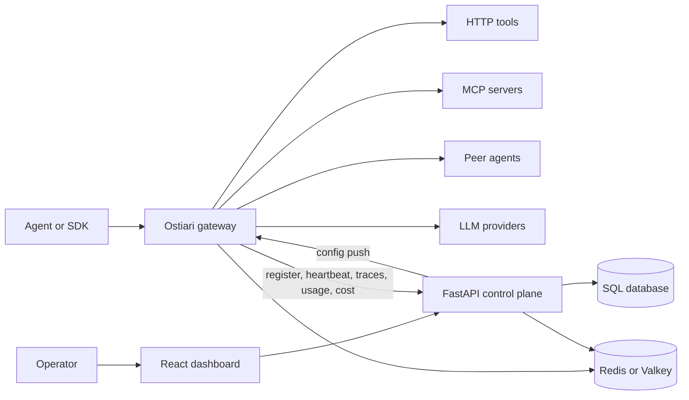
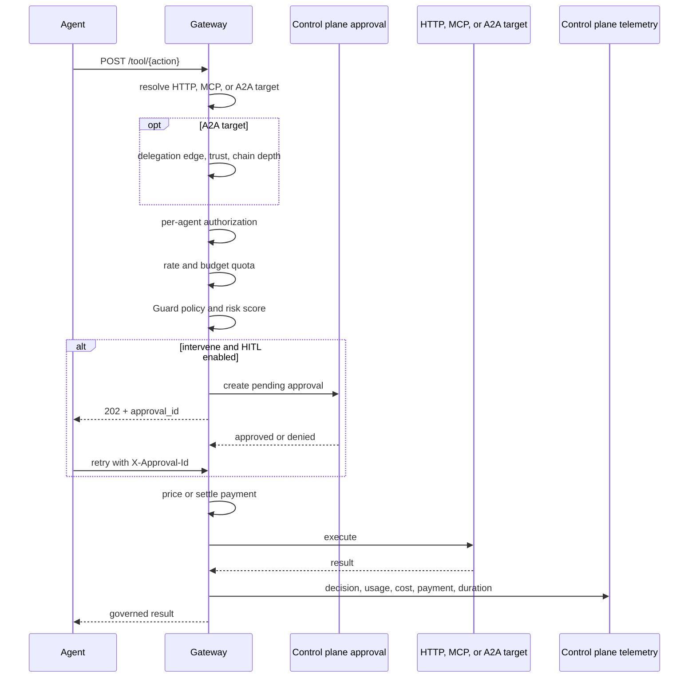
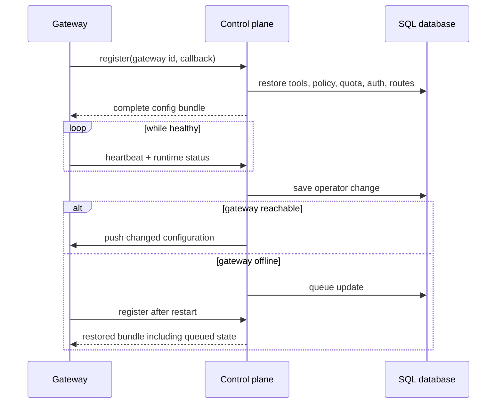
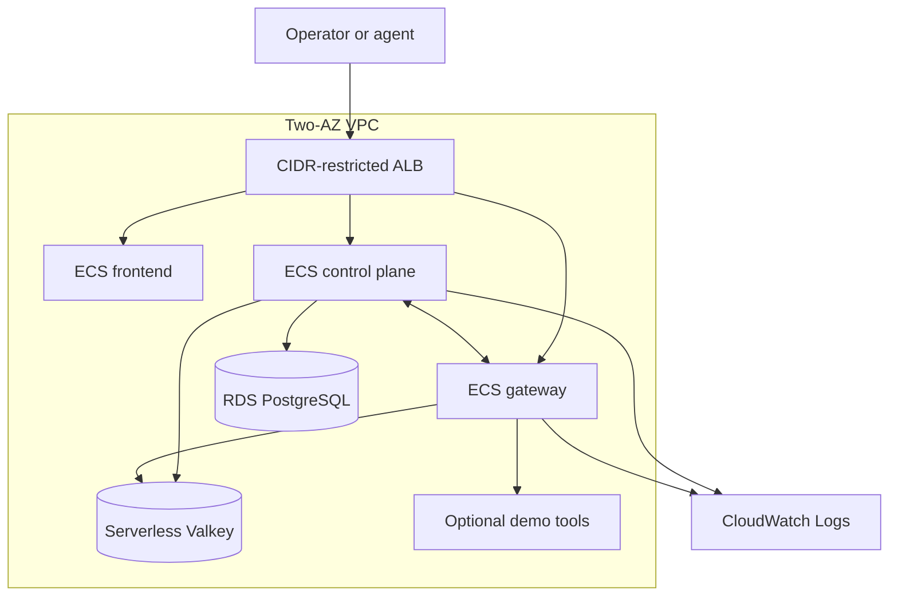
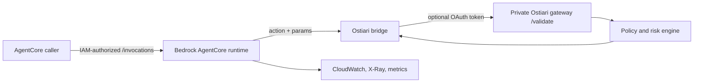

# Ostiari Architecture

This document describes the architecture implemented by the current repository.
It covers the runtime governance path, control-plane lifecycle, local demos, and
the CDK deployment profiles exposed by `./deploy/ostiari`.

The standalone landing site under `site/` is a separate S3 and CloudFront
deployment. CloudFront, S3, API Gateway, Lambda, and DynamoDB are not the
architecture of the main Ostiari platform stack.

## System Boundaries

Ostiari has three independently usable layers:

| Layer | Source | Responsibility |
|---|---|---|
| Guard library | `src/ostiari/` | In-process policy, scoring, anomaly detection, tracing, checkpoints, and circuit breaking |
| Agent gateway | `gateway/ostiari_gateway/` | Governed HTTP, MCP, A2A, and LLM ingress with authorization, quotas, approvals, payments, execution, and telemetry |
| Control plane | `control-plane/` | Fleet configuration, durable state, reporting, approvals, audit, and the React operator UI |



The Guard library can run without the gateway or control plane when an
application owns execution and only needs a local decision engine.

## Governed Tool Flow

`POST /tool/{action}` is the complete governed execution path. The target is
resolved before gates run so A2A calls can add their delegation check.



The implemented order is:

1. A2A delegation policy when the action targets a peer.
2. Per-agent authorization.
3. Request and budget quota.
4. Guard policy, parameter risk, and anomaly scoring.
5. Human approval for the raw `intervene` tier when HITL is enabled.
6. Metered pricing or x402 settlement.
7. HTTP, MCP, or A2A execution.
8. Durable trace, usage, cost, and payment delivery.

Denials return before target execution. Shadow mode runs the ordered delegation,
authorization, quota, and Guard checks until a check would block, then records
the would-block outcome and returns a synthetic result. It exits before HITL,
payment, or target execution.

## LLM Gateway Flow

The embedded AxonLLM integration adds `/invoke`, Anthropic Messages, OpenAI Chat
Completions, and a constrained OpenAI Responses surface.

For `/invoke`, the gateway:

1. authorizes the endpoint, model, provider, and agent token limits;
2. applies input security and reserves projected cost;
3. applies operator routing, experiments, provider availability, and fallback;
4. calls the selected provider;
5. applies per-tool authorization, quota, and Guard policy to generated tool
   calls;
6. executes allowed HTTP or MCP tools;
7. continues provider rounds until a final response or the configured limit;
8. reports tokens, route, experiment, cost, tools, and blocks.

AxonLLM is embedded in the gateway process. It is not a replacement for the
gateway: Ostiari still owns identity, policy, approvals, quotas, payment, and
telemetry.

## Control-Plane Lifecycle

The control plane is the durable source of fleet configuration. A gateway
registers an advertised callback address, receives its full configuration, and
heartbeats while healthy.



Production uses PostgreSQL for control-plane state and authenticated Redis or
Valkey for shared enforcement and durable gateway event outboxes. SQLite and
in-memory fallbacks are development-only.

## Demo Topologies

The repository intentionally has two local demos with different scope.

| Demo | Command | What actually runs |
|---|---|---|
| Launcher demo | `./deploy/ostiari local up --profile local-demo` | One gateway, control plane, React UI, Valkey, functional HTTP demo tools, and an idempotent seed job |
| Source demo | `make demo-full` | Four gateways, nine seeded agent records, role-specific HTTP tools, a real A2A demo agent, and real draw.io/filesystem MCP subprocesses started with `npx` |

Both demos use simulated external payment movement. The launcher demo does not
claim the source demo's four-gateway, A2A, or stdio MCP topology.

`local-empty` starts the launcher topology without seeded data or demo tools.

## Deployment Profile Matrix

| Profile | Seeded data | AgentCore | Production posture | Application placement |
|---|---:|---:|---:|---|
| `local-demo` | Yes | No | No | Docker Compose |
| `local-empty` | No | No | No | Docker Compose |
| `aws-demo` | Yes | No | No | Fargate in public subnets with public IPs |
| `aws-empty` | No | No | No | Fargate in public subnets with public IPs |
| `aws-agentcore-demo` | Yes | Yes | No | Fargate and AgentCore in private application subnets |
| `aws-agentcore-empty` | No | Yes | No | Fargate and AgentCore in private application subnets |
| `production` | No | No | Yes | Private Fargate services |
| `production-agentcore` | No | Yes | Yes | Private Fargate services and AgentCore runtime |

All six AWS profiles synthesize through `deploy/aws/stack.py` and are validated
by `deploy/aws/validate.py`.

## AWS Evaluation Architecture

Every AWS profile creates:

- a two-AZ VPC;
- public load-balancer subnets;
- isolated data subnets;
- private Cloud Map service discovery;
- ECS/Fargate services for the frontend, control plane, and gateway;
- an optional Fargate demo-tools service;
- an internet-facing ALB restricted to configured CIDRs;
- encrypted RDS PostgreSQL;
- ElastiCache Serverless for Valkey;
- generated Secrets Manager values for non-production credentials;
- CloudWatch logs and ECS deployment circuit breakers.



The cost-aware `aws-demo` and `aws-empty` profiles do not create NAT gateways.
Their Fargate tasks use public subnets and public IPs while security groups limit
ingress through the ALB and internal service relationships.

## AgentCore Integration

AgentCore profiles add an HTTP runtime that is a validation bridge, not a
replacement control plane or gateway.



The launcher reads the checked-in AgentCore availability-zone registry, selects
two supported zone IDs, and maps them to this account's AZ names. AgentCore
profiles require exactly those two explicit zones. They create private
application subnets and one NAT gateway for egress.

The runtime:

- uses an ARM64 image;
- uses IAM runtime authorization;
- runs in the VPC with an AgentCore-specific security group;
- reaches the gateway over private Cloud Map DNS;
- emits CloudWatch logs, metrics, and X-Ray traces;
- can obtain a dedicated OAuth client-credentials token in production.

AWS owns the runtime's `agentic_ai` network interfaces. Runtime deletion can
finish before those interfaces disappear. During that delay CloudFormation
cannot remove their subnets or security group; `aws destroy` detects this state
and asks the operator to retry after AWS releases the interfaces.

## Production Architecture

Production adds or changes the following controls:

- private application subnets and two NAT gateways;
- minimum two tasks for each core Fargate service plus CPU autoscaling;
- multi-AZ PostgreSQL, deletion protection, backups, and retained snapshots;
- retained serverless Valkey state;
- TLS-only ALB ingress using an issued ACM certificate;
- optional Route 53 aliases;
- WAF IP rate limiting;
- retained, encrypted ALB access logs in S3;
- Secrets Manager references instead of generated development credentials;
- browser, workload, gateway-agent, and optional AgentCore identity contracts;
- fail-closed gateway posture, HITL, authenticated Redis, and required AxonLLM;
- alarms with optional SNS delivery;
- stack termination protection.

Production images are published before deployment:

- ECS images target `linux/amd64`;
- the AgentCore image targets `linux/arm64`;
- ECR repositories are immutable and scan on push;
- build provenance and SBOM attestations are emitted;
- deployment configuration uses manifest-digest image URIs;
- CDK imports the exact ECR repositories and grants the task execution roles the
  pull permissions required for those images.

Production deployment prepares a CloudFormation change set but does not execute
it automatically. Replacement changes require an explicit
`--allow-replacements` decision.

## Deployment Lifecycle

The adopter-facing lifecycle is:

```text
profiles -> preflight -> plan -> deploy/change set -> readiness verification
                                                   -> status
                                                   -> destroy (non-production)
```

Preflight checks include:

- credentials and required local tools;
- known failed or in-progress CloudFormation states;
- VPC quota when the stack needs a new VPC;
- additional Elastic IP quota for NAT gateways;
- Docker daemon and Buildx for non-production image assets;
- Secrets Manager, ACM, and digest-pinned ECR artifacts for production.

After non-production deployment, the launcher waits for the dashboard
`/api/ready` endpoint and gateway `/ready` endpoint. Production execution uses
the same verification unless explicitly disabled.

Production destruction remains an approved manual recovery procedure because
stateful resources, deletion protection, and retention policies require an
intentional data decision.

## Source-of-Truth Index

| Contract | Source |
|---|---|
| Deployment profiles and lifecycle | `deploy/ostiari_deploy.py` |
| AWS resources and subnet placement | `deploy/aws/stack.py` |
| AWS configuration validation | `deploy/aws/config.py` |
| AgentCore bridge behavior | `deploy/agentcore/app.py` |
| Tool gate order | `gateway/ostiari_gateway/server.py` |
| LLM invocation flow | `gateway/ostiari_gateway/modules/llm_gateway/` |
| Fleet registration and push | `control-plane/backend/control_plane/routers/gateways.py` |
| Demo contents | `deploy/docker/`, `Makefile`, `control_plane/demo_seed.py`, `gateway/register_demo_*.py` |
| UI routes | `control-plane/frontend/src/App.tsx` |
| Feature-to-test evidence | `config/feature-test-matrix.json` |
