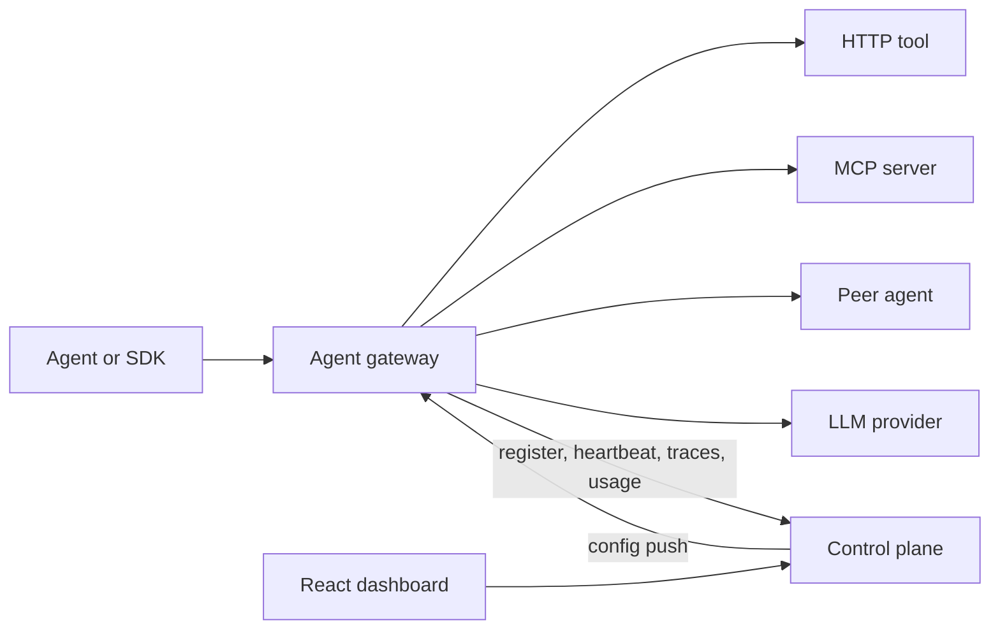
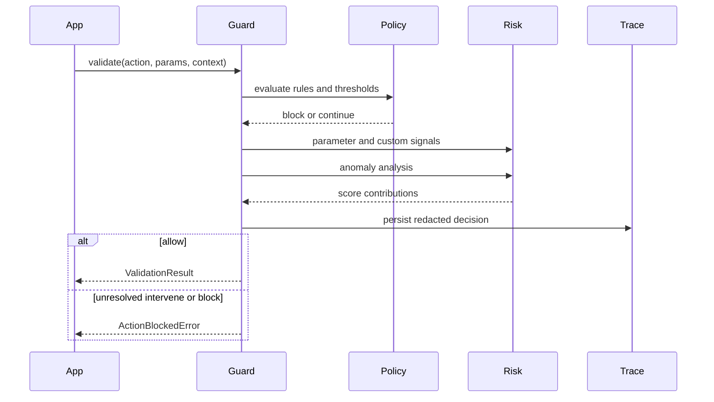
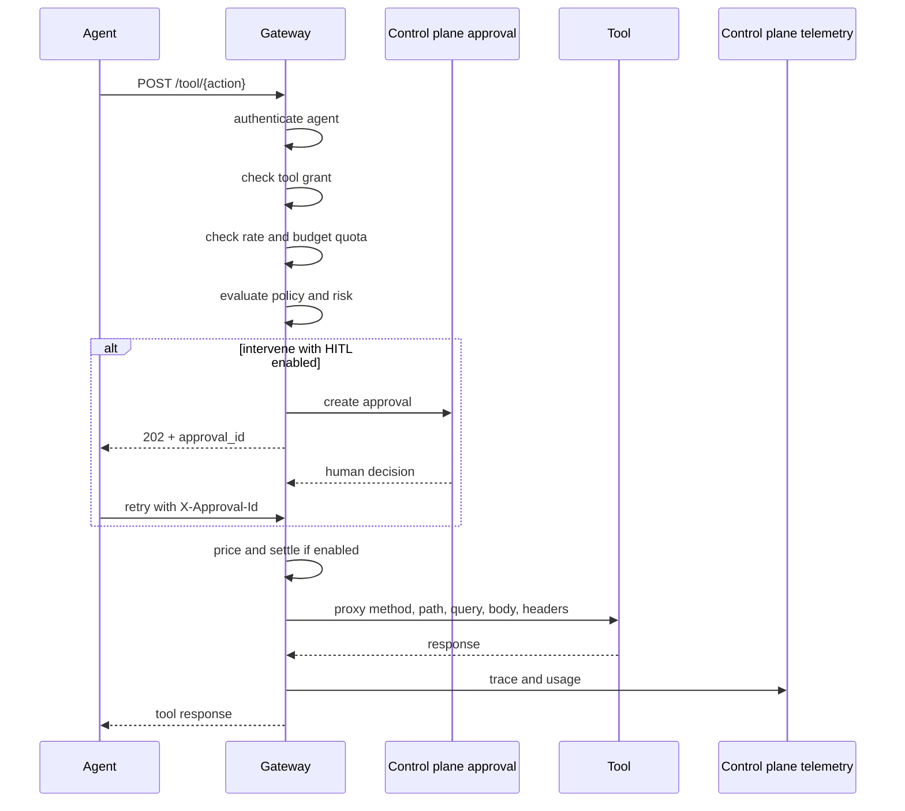
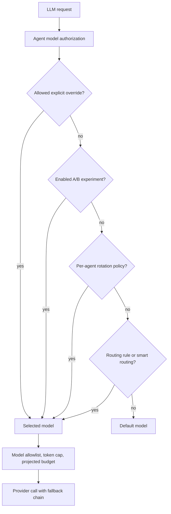
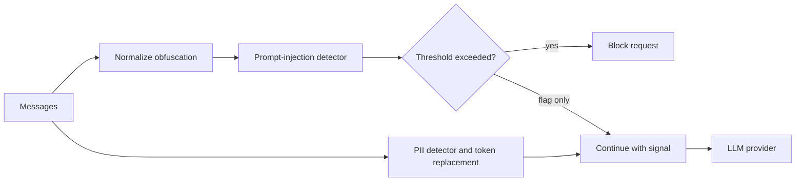
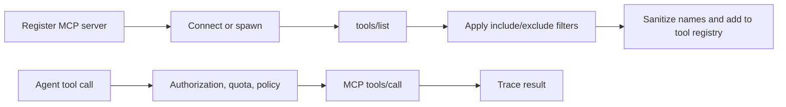
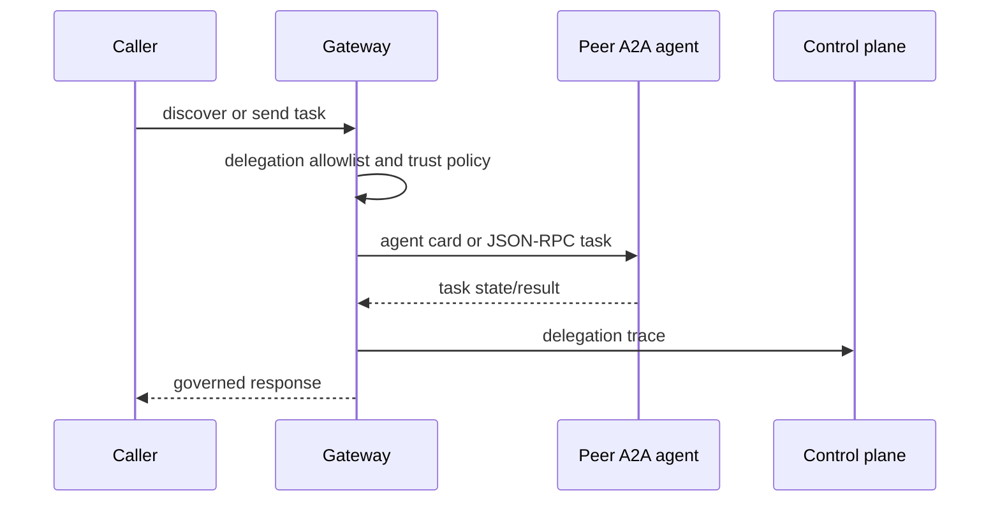
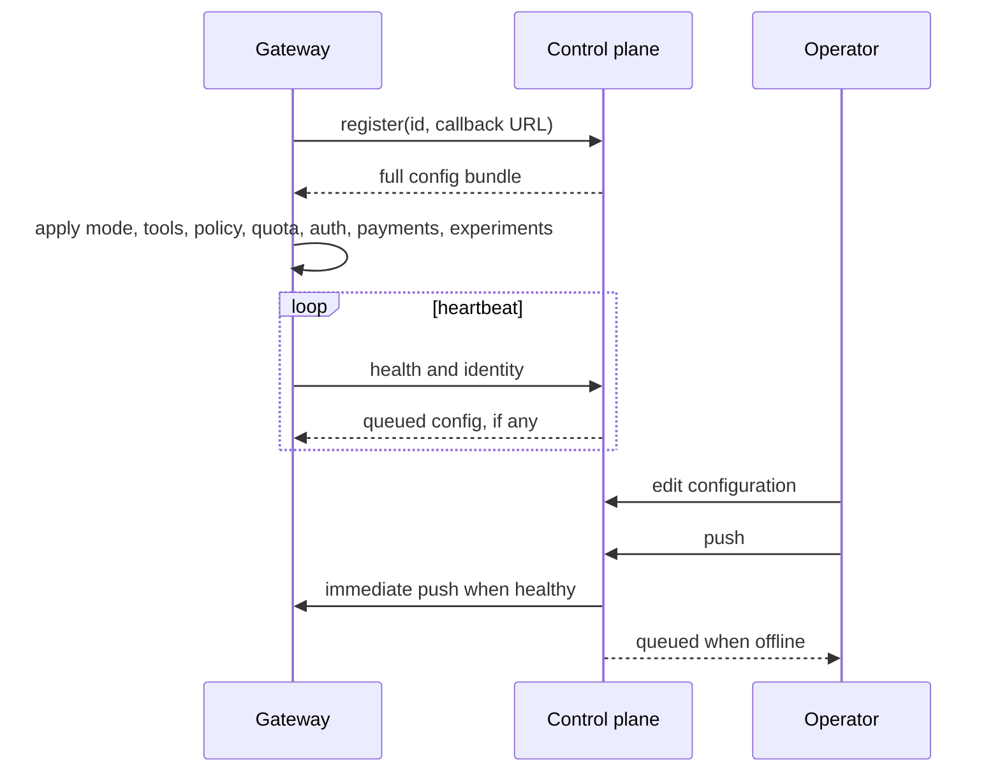
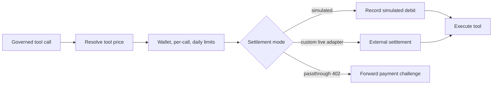

# Ostiari Features and Flows

This document is the canonical map of capabilities implemented in the Ostiari
repository. It describes what each feature does, where it runs, and how data
moves through it. The generated OpenAPI documents exposed by a running gateway
and control plane remain authoritative for exact request schemas.

## 1. System Map

Ostiari has three independently usable layers:

| Layer | Location | Responsibility |
|---|---|---|
| Guard library | `src/ostiari/` | In-process policy, risk, anomaly, tracing, checkpoint, and circuit-breaker engine |
| Agent gateway | `gateway/ostiari_gateway/` | Runtime proxy for tool, LLM, MCP, and A2A traffic |
| Control plane | `control-plane/` | Fleet configuration, persistence, telemetry, reporting, and operator UI |

The Guard library can also run directly inside an application without either
the gateway or control plane.

## 2. Capability Summary

| Area | Features | Primary implementation |
|---|---|---|
| Runtime decisions | Allow, intervene, block; score thresholds; explicit policy rules; parameter-aware risk | `src/ostiari/guard.py`, `src/ostiari/policy/`, `src/ostiari/signals/` |
| Reliability | Loop, drift, hallucination, and contradiction detectors; circuit breakers; checkpoints | `src/ostiari/anomaly/`, `breaker.py`, `checkpoint.py` |
| Tool governance | Tool registry, authorization, quota, policy, approval, payment, proxy, trace | `gateway/ostiari_gateway/server.py` |
| LLM governance | Agentic invocation, provider fallback, routing rules, per-agent rotation, A/B experiments, quotas | `gateway/ostiari_gateway/modules/llm_gateway/` |
| LLM-compatible APIs | Anthropic Messages and OpenAI Chat Completions shims | `/v1/messages`, `/v1/chat/completions` |
| LLM security | PII redaction and prompt-injection detection | `src/ostiari/detect.py`, LLM gateway security layer |
| MCP | Embedded, remote, and stdio servers; discovery; filtering; governed execution | `gateway/ostiari_gateway/mcp/` |
| A2A | Agent cards, JSON-RPC tasks, peer registration, delegation policy, trust reports | `gateway/ostiari_gateway/a2a/`, control-plane A2A and trust routers |
| Human approval | Asynchronous intervene queue and decision resubmission | Gateway HITL path, `/api/approvals` |
| Cost control | RPM limits, token caps, model allowlists, projected budgets, alerts, optional Redis sharing | `quota_enforcer.py`, `/api/quotas` |
| Payments | Tool pricing, wallets, limits, ledger, simulated settlement, and a live-settlement extension point | `gateway/ostiari_gateway/payments/`, `/api/payments` |
| Observability | Governance traces, spans, WebSocket stream, OTLP export, shadow and delegation reports | Trace reporter, `/api/traces/*`, `/ws/traces` |
| Fleet operations | Registration, heartbeat, config bundles, immediate push, queued push | Gateway lifecycle, `/api/gateways/*` |
| Administration | Local login, users, roles, optional OIDC SSO, provider credentials | Control-plane auth and provider routers |
| Reporting | Costs, metering export, compliance, audit verification, ROI, token broker | Control-plane reporting routers |
| Deployment | Local, Docker Compose, Kubernetes, Helm, ECS, and limited Lambda | `deploy/` |

## 3. Embedded Guard Flow

Use this path when the application owns tool execution and only needs a local
decision engine.

The in-process result separates the original risk tier from the enforced tier.
An intervention callback may resolve an intervene decision synchronously.
Asynchronous human queues should use the gateway HITL flow instead.

Supported embedded features:

- Strict YAML policy parsing with glob-based allow/block rules
- Risk adjustment, threshold override, and context rules
- Per-tool and global thresholds
- Parameter-sensitive risk signals
- Framework adapters for OpenAI, Anthropic, Bedrock, and Strands
- Synchronous and asynchronous `@protect()` wrappers
- SQLite storage, trace redaction, reports, and health
- Checkpoints and configurable retention
- Circuit breakers with automatic retry, notification, or termination modes
- Custom anomaly detectors and signal providers

## 4. Governed Tool Call Flow

Agents call `POST /tool/{action}` with `X-Agent-Id`. The gateway does not
automatically prevent direct access to the underlying service; production
deployments must enforce network routing so the agent can reach the tool only
through the gateway.

Important outcomes:

- Authorization, quota, policy, and payment denials return without calling the
  tool.
- In `shadow` mode, gates evaluate and produce a would-block trace, but the real
  tool is not executed. The synthetic response avoids side effects while testing
  policy.
- If HITL is disabled, intervene is advisory in development and refused in
  production.
- OpenTelemetry context is extracted from inbound headers and propagated to the
  tool call.

## 5. LLM and Agentic Execution Flows

The LLM module is optional (`modules.llm_gateway`). It exposes three traffic
surfaces:

| Endpoint | Use |
|---|---|
| `POST /invoke` | Ostiari-native agentic loop with governed tool execution |
| `POST /v1/messages` | Anthropic-compatible API for Claude Code and SDK clients |
| `POST /v1/chat/completions` | OpenAI-compatible API for Codex and SDK clients |

### 5.1 Model Selection

Per-agent routing currently supports round-robin selection with request or
session scope. A/B experiments split in-scope traffic between two models.
AxonLLM, when installed, supplies embedded smart routing, ensemble behavior, and
cost-aware execution. Without it, the gateway warns and uses direct-provider
fallback; `/health` reports that routing governance and Axon cost tracking are
inactive. Set `OSTIARI_REQUIRE_AXON=1` to fail startup instead.

### 5.2 `/invoke` Agentic Loop

1. Validate the request and agent authorization.
2. Redact configured PII and evaluate prompt-injection signals.
3. Select a model and reserve projected budget.
4. Call the provider.
5. Validate every requested tool through the same Guard policy used by direct
   tool calls.
6. Execute allowed HTTP or MCP tools.
7. Append tool results and continue until the model returns text or the
   configured tool-round limit is reached.
8. Reconcile actual token cost, release the reservation, report traces, and
   return model, tool, token, round, cache, and experiment metadata.

Intent caching is scoped by agent and session. Exact or template-based matches
can reuse a tool plan, but tools are still governed and executed again.

## 6. LLM Security Flow

PII support includes common email, phone, card, SSN, IP, and credential-shaped
values. Replacement tokens are stable within a request. This is pattern-based
detection, not a guarantee that all sensitive information or adversarial
prompts will be found.

## 7. MCP Flow

MCP servers can run in three modes:

- `embedded`: tools are implemented in the gateway process.
- `remote`: the gateway connects to an HTTP MCP endpoint.
- `stdio`: the gateway starts and communicates with a subprocess.

The control plane stores MCP definitions and can request discovery. Gateway
endpoints support hot registration, deletion, listing, and refresh.

## 8. Agent-to-Agent Flow

Ostiari supports both outbound peer calls and an inbound A2A server.

The inbound server exposes `/.well-known/agent.json` and `/a2a`, supporting
`tasks/send`, `tasks/get`, `tasks/cancel`, and `tasks/sendSubscribe`. The control
plane registers peers per gateway, computes delegation reports, and can apply or
disable trust-derived policy.

## 9. Configuration Lifecycle

Configuration can be applied directly to a gateway under `/config/*` or managed
through the control plane. The fleet path persists supported state and rebuilds
a bundle when the gateway registers or reconnects. The stored enforcement mode
is included in that bundle and restored after restart.

The generic control-plane `push-config` endpoint forwards a caller-supplied
partial document to gateway `POST /config`. Feature-specific gateway endpoints,
such as `/config/quota`, are preferable when changing one subsystem because
`POST /config` primarily rebuilds `SidecarConfig` and the Guard/tool registry.

## 10. Quota and Budget Flow

Gateway quotas can enforce:

- Requests per minute
- Maximum budget in USD
- Maximum tokens per request
- Allowed model list
- Per-model pricing

Before an LLM request, the gateway estimates token cost and reserves budget.
After the provider responds, it replaces that reservation with actual spend.
Reservations close the concurrent-request overspend window and expire if a
request fails before reconciliation. Budget alerts fire at 80%, 90%, and 100%.

Without Redis, counters are process-local. With the optional shared store,
replicas can use atomic shared rate and budget state.

## 11. Payments and Monetization Flow

The control plane manages wallets, funding, limits, pricing, ledger views, and
summaries. The token broker adds pool inventory, configurable markup, low-water
tracking, and reconciliation reports. External money movement in the demo is
simulated. The included `X402Settler` is a stub, so live USDC settlement requires
implementing the facilitator and signer integration.

## 12. Tracing, Audit, and Reporting

The gateway reports governance decisions to `/api/traces/ingest`. Operators can
consume:

- Recent traces and detailed spans
- Live WebSocket updates
- Shadow-mode would-block reports
- A2A delegation reports
- Cost records and summaries
- Per-agent metering with CSV or JSON export
- Compliance-oriented reports
- Configurable prevented-damage ROI reports

Gateway tracing and control-plane audit are separate:

- A trace records runtime activity and decisions.
- The audit log records configuration changes and links entries with hashes.
  `/api/audit/verify` verifies the chain.

OTLP export is optional and configured through standard OpenTelemetry
environment variables.

## 13. Control-Plane Features

The React UI and FastAPI backend provide these operator surfaces:

| Group | Surfaces |
|---|---|
| Observe | Dashboard, live traces, shadow report, approvals, costs, metering, audit, compliance, ROI |
| Control | Models, policies, gateway quotas, agent quotas, routing |
| Monetize | Payments, wallets, pricing, token broker |
| Configure | Discovery, gateways, agents, tools, MCP servers, A2A protocol governance |
| Test | Sandbox, A/B experiments, architecture view |
| Admin | Providers, users, local authentication, OIDC SSO |

The Sandbox exercises real gateway routes. Its Chat tab requires configured LLM
credentials; tool scenarios and the other fleet views do not.

## 14. Security and Production Posture

Development defaults favor a zero-credential demo. Production must explicitly
enable and configure controls:

- Set `OSTIARI_REQUIRE_AUTH` for control-plane API authentication.
- Set a strong JWT secret and configure OIDC if used.
- Require gateway OIDC authentication instead of trusting `X-Agent-Id`.
- Set `OSTIARI_CONFIG_ADMIN_KEY` to protect `/config/*`.
- Set `OSTIARI_ENCRYPTION_KEY` so stored provider keys survive restarts.
- Set a trace ingest key after wiring the same value into gateway trace
  reporting; the current reporter does not send `X-Ingest-Key` automatically.
- Restrict CORS origins.
- Use TLS and network policy so agents cannot bypass the gateway.
- Use PostgreSQL and Redis where durable or shared state is required.
- Consider `OSTIARI_STRICT=1`, `OSTIARI_REQUIRE_AXON=1`, and fail-closed behavior.

Provider credentials returned by gateway config APIs are redacted. Production
startup can warn or refuse when important controls remain open.

## 15. Persistence Boundaries

The control plane uses SQLAlchemy-backed storage for durable fleet resources and
`state.json` for selected in-memory configuration. Other runtime views are
bounded in-memory stores or are reconstructed from demo seed data. Consult
`control-plane/README.md` before relying on a specific resource across process
restarts.

The gateway is primarily an enforcement process. Unless Redis or an external
control-plane store is configured, counters and hot configuration are local to
that process and should be restored by registration and config push.

## 16. Deployment Flows

| Mode | Shape | Intended use |
|---|---|---|
| Local demo | Control plane, React UI, four gateways, demo tools and A2A agent | Evaluation |
| Clean local | Empty control plane and one gateway | Connecting real agents |
| Sidecar | Gateway beside one agent | Strong per-agent isolation |
| Shared gateway | Multiple agents use one gateway with `X-Agent-Id` | Centralized operations |
| Docker Compose | Control plane, frontend, gateway, database/Redis options | Small deployment |
| Kubernetes/Helm | Sidecar or shared gateway patterns | Production orchestration |
| ECS | Containerized control plane and gateway services | AWS deployment |
| Lambda | Limited stateless gateway handler | Narrow serverless use cases |

See [`STARTUP.md`](../STARTUP.md) for end-to-end deployment instructions and
[`deploy/README.md`](../deploy/README.md) for manifest-specific configuration.

## 17. Source-of-Truth Index

| Question | Source |
|---|---|
| Exact API schemas | Gateway `/docs` and control-plane `/docs` |
| Guard and policy semantics | `src/ostiari/`, root tests |
| Gateway gate ordering | `gateway/ostiari_gateway/server.py`, gateway tests |
| LLM routing and shims | `gateway/ostiari_gateway/modules/llm_gateway/` |
| Fleet API behavior | `control-plane/backend/control_plane/routers/` |
| UI routes | `control-plane/frontend/src/App.tsx` |
| Local commands | [`Makefile`](../Makefile), [`QUICKSTART.md`](../QUICKSTART.md) |
| Production settings | [`STARTUP.md`](../STARTUP.md), [`deploy/README.md`](../deploy/README.md), [`auth/README.md`](../auth/README.md) |
