# Ostiari Agent Gateway — Architecture Guide

## Naming: "Agent Gateway" (formerly "Sidecar")

The UI now refers to this component as an **Agent Gateway** rather than a "sidecar." The reason: a sidecar implies per-pod K8s deployment, but this component supports three deployment modes. The API routes still use `/api/sidecars` for backward compatibility — the rename is UI-only for now and will propagate to the API in a future release.

### Three Deployment Modes

An Agent Gateway can be deployed in any of these configurations:

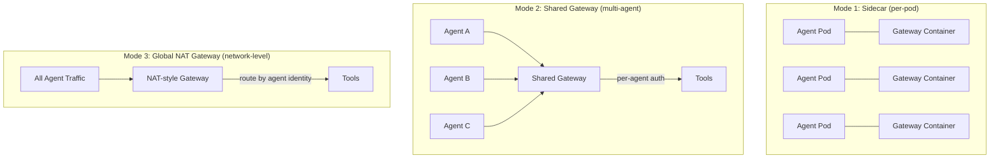

| Mode | Description | Best for |
|------|-------------|----------|
| **Sidecar** | One gateway per pod, co-located with the agent in K8s | Strong isolation, per-agent network policy |
| **Shared gateway** | One gateway serving multiple agents (with per-agent auth) | Cost efficiency, small teams, dev environments |
| **Global NAT gateway** | Network-level proxy that all agents route through | Enterprise-wide governance, zero agent config |

All three modes use the same Docker image and the same APIs. The only difference is how many agents connect to each gateway instance and how network routing is configured.

---

## What We're Doing and Why

AI agents are going to production. They call tools — send emails, query databases, deploy code, manage infrastructure. The problem: **how do you enforce safety policies on these tool calls without forcing every agent developer to learn a safety framework?**

Today, if you want Ostiari guardrails, you need to:
1. Write your agent in Python
2. Import Ostiari
3. Call `guard.validate()` before every tool execution
4. Handle blocked actions in your agent code

This creates friction. Agent developers want to build agents, not safety infrastructure. And if they forget to add the guard check — or do it wrong — there's no safety net.

**The Generic Sidecar solves this by moving safety enforcement out of the agent entirely.**

The agent never calls tools directly. It calls the sidecar. The sidecar validates the call against policies, and if allowed, proxies it to the real tool endpoint. The agent developer writes zero safety code — they just point their agent at a URL.

---

## Key Advantages

| Without Sidecar | With Sidecar |
|----------------|--------------|
| Agent must be written in Python | Agent can be any language (Java, Go, C, JS, Python) |
| Developer imports Ostiari library | Developer just makes HTTP calls |
| Safety logic mixed into agent code | Safety logic completely external |
| Policy changes require code changes | Policy hot-reloads without any restart |
| Each agent team builds their own guard | One generic sidecar serves all agents |
| Agent can bypass safety checks | Agent has no direct access to tools — can't bypass |
| Developer must understand policy format | Developer doesn't even know Ostiari exists |

**Bottom line:** The sidecar reduces friction for agent developers to zero while keeping policy enforcement centralized and impossible to bypass.

---

## Architecture Overview

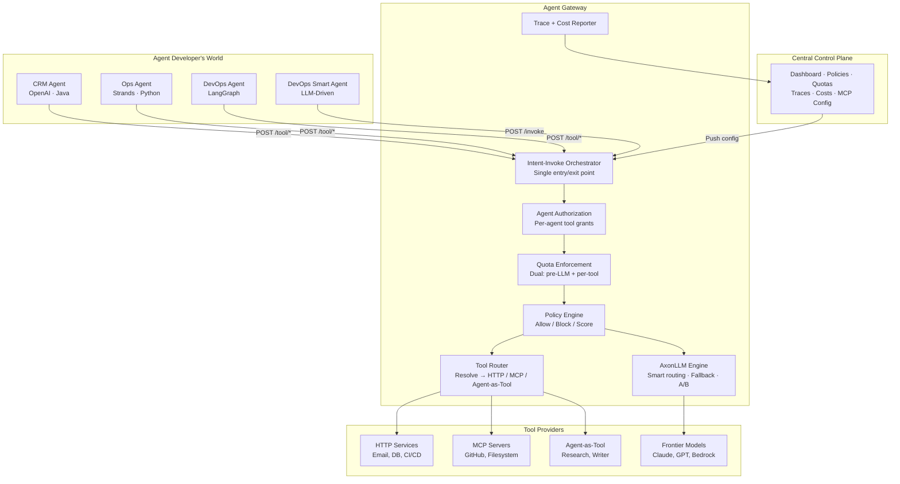

**Two paths through the gateway:**

- **PATH 1** (`POST /tool/{action}`): Agent already knows the tool → Orchestrator → Auth → Quota → Policy → Tool Router → Execute
- **PATH 2** (`POST /invoke`): Agent sends intent → Orchestrator → Auth → Quota → AxonLLM (generates tool plan) → Auth → Policy → Tool Router → Execute → AxonLLM (synthesize response) → Deliver

**The agent developer only sees one thing:** an HTTP endpoint they POST to. The Agent Gateway handles authorization, quota, policy, LLM routing, tool resolution, and cost reporting — all without the agent's involvement. The agent does not call tools or LLMs directly.

---

## How It Works — Step by Step

### PATH 1: Direct Tool Call (POST /tool/{action})

The agent already knows which tool to call. No LLM involved inside the gateway.

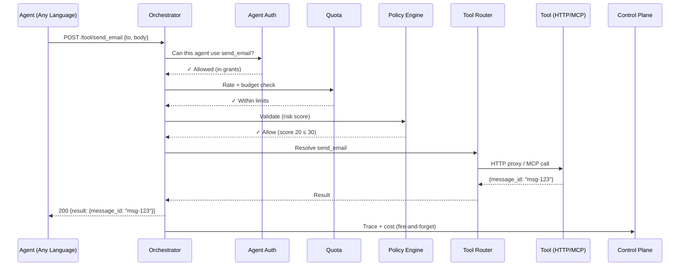

### PATH 2: LLM-Driven (POST /invoke)

The agent sends intent. The gateway generates the tool plan, validates each tool, executes, and synthesizes the response.

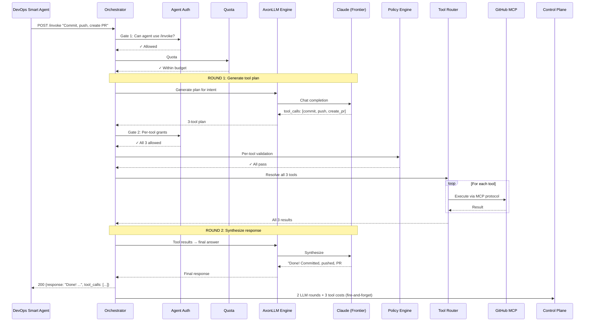

### Key Design Decisions

| Decision | Why |
|----------|-----|
| **Orchestrator is single entry/exit** | All responses route back through it before reaching the agent |
| **Dual quota** | #1 pre-LLM (can agent afford it?) + #2 per-tool (can agent afford each tool?) |
| **Auth runs twice in PATH 2** | Gate 1: can agent use /invoke? Gate 2: can agent use each specific tool the LLM chose? |
| **Tool Router after Policy** | Policy approves → Router resolves where to send (HTTP, MCP, Agent-as-Tool) |
| **Cost reporting is parallel** | Orchestrator delivers to agent AND reports costs simultaneously |

---

## The Control Plane (Central)

The control plane is the centralized management UI for all Agent Gateways. Instead of hardcoding tools and policies, the control plane pushes configuration dynamically to N gateway instances.

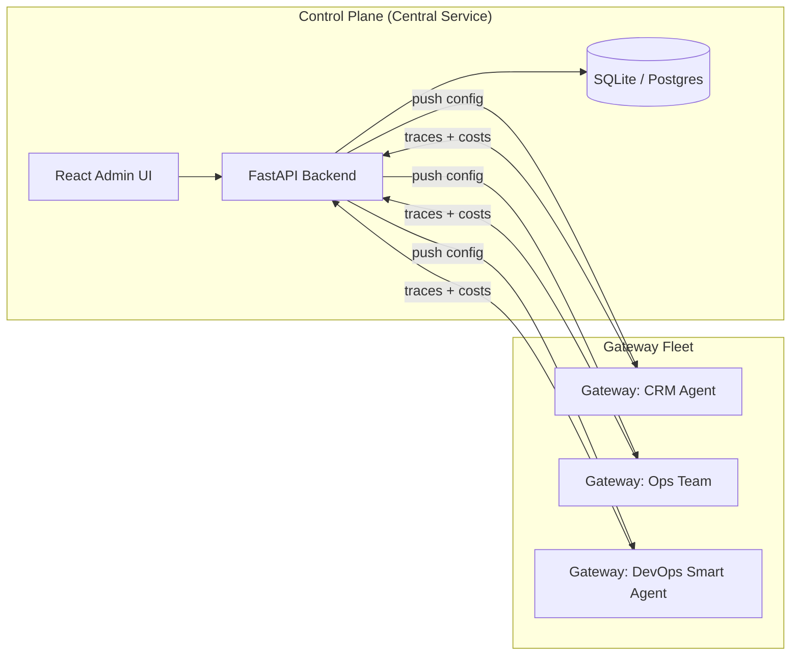

### What the control plane manages:

1. **Tool Registration** — Which tools exist, where they live (URL/MCP), parameters
2. **Policy Rules** — Allow/block patterns, risk score adjustments, thresholds
3. **Gateway Instances** — Which gateway serves which agents, health monitoring
4. **Per-Agent Authorization** — Tool grants per agent (least privilege)
5. **Quota Configuration** — Rate limits, budget caps, max tokens per agent
6. **MCP Server Config** — Embedded, remote, stdio server connections
7. **Model Routing** — Which LLM for which task, A/B experiments, fallback chains
8. **Live Traces** — Real-time visibility into every tool call and LLM invocation
9. **Cost Tracking** — Per-model, per-agent cost attribution and alerts
10. **Architecture Demo** — Interactive animated walkthrough of the system

### Gateway Config API (pushed by Control Plane)

| Endpoint | Method | Purpose |
|----------|--------|---------|
| `/config` | POST | Apply full configuration (tools + policy + quota + auth + MCP) |
| `/config` | GET | View current configuration |
| `/config/tools` | POST | Replace all tool definitions |
| `/config/tools/{name}` | POST/DELETE | Add, update, or remove a single tool |
| `/config/policy` | POST | Replace the policy |
| `/config/quota` | POST | Apply quota (rate limits, budget, max_tokens) |
| `/config/quota/reset-spend` | POST | Reset spend counter |
| `/config/agent-auth` | POST/GET | Configure per-agent tool grants |
| `/config/mcp-servers` | POST | Add MCP server (embedded, remote, stdio) |
| `/config/mcp-servers/{name}` | DELETE | Remove MCP server |
| `/config/mcp-servers/{name}/refresh` | POST | Re-discover tools from MCP server |
| `/config/llm` | POST | Update LLM routing, models, credentials |
| `/invoke` | POST | Full agentic loop (PATH 2) |
| `/tools` | GET | List all registered tools (HTTP + MCP) |
| `/models` | GET | List available models + routing rules |
| `/cache/stats` | GET | Intent cache hit/miss stats |
| `/health` | GET | Gateway health + module status |

---

## Configuration Format

A single JSON/YAML payload configures the entire sidecar:

```yaml
sidecar_id: crm-agent-sidecar

tools:
  - name: send_email
    endpoint: http://email-service:8080/send
    method: POST
    description: "Send an email to a recipient"
    timeout_seconds: 10
    schema:
      type: object
      properties:
        to: {type: string}
        subject: {type: string}
        body: {type: string}
      required: [to, subject, body]

  - name: db_query
    endpoint: http://db-service:8080/query
    method: POST
    description: "Execute a database query"
    timeout_seconds: 30

  - name: slack_send
    endpoint: http://slack-service:8080/message
    method: POST
    description: "Send a Slack message"
    timeout_seconds: 5

policy:
  block:
    - "*.delete"
    - "*.drop"
  allow:
    - "db_query"
  rules:
    - type: risk_adjust
      action: "send_email"
      risk_adjust: 25
      description: "Email sending has moderate risk"
    - type: risk_adjust
      action: "slack_send"
      risk_adjust: 10
      description: "Slack messages are low risk"
  thresholds:
    global:
      allow_max: 30
      intervene_max: 70
```

### Tool Definition Fields

| Field | Required | Description |
|-------|----------|-------------|
| `name` | Yes | How the agent references this tool |
| `endpoint` | Yes | URL the sidecar proxies to |
| `method` | No | HTTP method (default: POST) |
| `description` | No | Human-readable description |
| `timeout_seconds` | No | Request timeout (default: 30) |
| `headers` | No | Extra headers to send to the endpoint |
| `schema` | No | JSON Schema for parameter validation |

### Policy Fields

| Field | Description |
|-------|-------------|
| `block` | List of action patterns always blocked (glob syntax: `*.delete`) |
| `allow` | List of action patterns always allowed |
| `rules` | Scoring rules that adjust risk (0-100 scale) |
| `thresholds.global.allow_max` | Score at or below = allowed (default: 30) |
| `thresholds.global.intervene_max` | Score at or below = needs human review (default: 70) |

---

## Hot-Reload: Changing Config Without Downtime

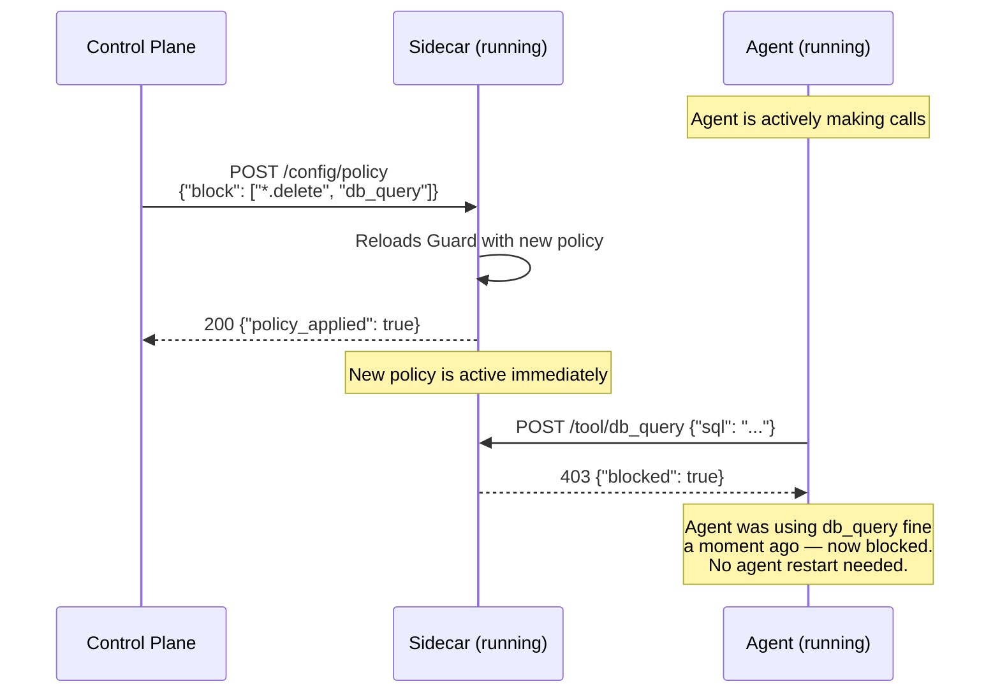

This is powerful: the platform team can respond to incidents in real-time by pushing policy changes, without touching agent code or restarting anything.

---

## Deployment Model

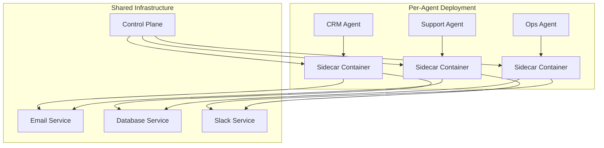

Each agent gets its own sidecar instance (same Docker image, different config). Network policies ensure the agent can ONLY reach its sidecar — not the backend services directly. This makes policy bypass impossible at the network level.

### Docker Deployment

```bash
# Same image for all agents — config makes it specific
docker run -p 8421:8421 ostiari-sidecar \
  --sidecar-id crm-agent \
  --config /config/crm-config.yaml

# Or start empty and configure via control plane
docker run -p 8421:8421 ostiari-sidecar \
  --sidecar-id ops-agent \
  --control-plane https://control.internal/api
```

---

## Integrating with Agent Frameworks

A common question: **"How does my OpenAI / Strands / LangGraph / Java agent connect to this?"**

The answer is simple: **every agent framework already has a way to execute tools. You just change the URL to point at the sidecar instead of the real service.**

The agent framework doesn't "integrate" with Ostiari. It doesn't know Ostiari exists. It just makes HTTP calls to the sidecar URL — the same way it would call any API.

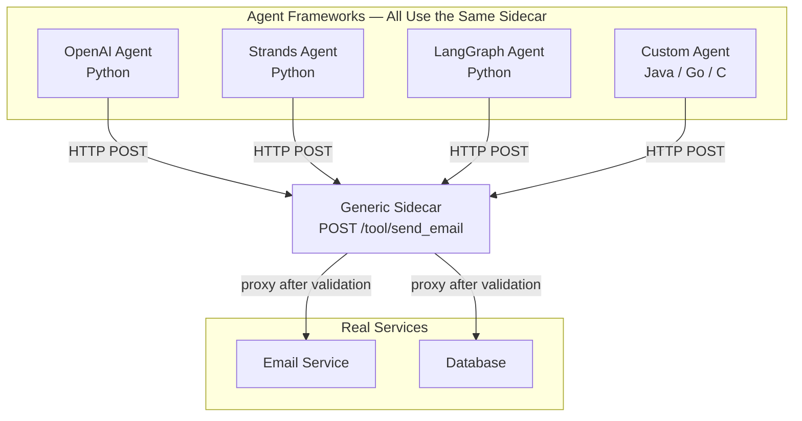

### OpenAI Function Calling

In OpenAI agents, the LLM returns `tool_calls`. You execute them in a loop. Just point the execution at the sidecar:

```python
import requests

SIDECAR = "http://sidecar:8421"

# When the LLM says "call send_email":
def execute_tool(tool_name, params):
    resp = requests.post(f"{SIDECAR}/tool/{tool_name}", json=params)
    
    if resp.status_code == 200:
        return resp.json()["result"]       # Tool succeeded
    elif resp.status_code == 403:
        return f"BLOCKED: {resp.json()['reason']}"  # Policy blocked it
    elif resp.status_code == 404:
        return f"Unknown tool: {tool_name}"
```

That's the entire integration. No `import ostiari`. No policy files. No guard setup.

### Strands Agents (AWS)

Strands uses `@tool` decorated functions. Just make the function body call the sidecar:

```python
from strands import tool
import httpx

SIDECAR = "http://sidecar:8421"

@tool
def send_email(to: str, subject: str, body: str) -> str:
    """Send an email to a recipient."""
    resp = httpx.post(f"{SIDECAR}/tool/send_email", json={
        "to": to, "subject": subject, "body": body
    })
    if resp.status_code == 403:
        return f"Action blocked: {resp.json()['reason']}"
    return resp.json()["result"]
```

The Strands framework doesn't know safety checks are happening. The `@tool` function looks normal — it just happens to call an HTTP endpoint that validates before executing.

### LangChain / LangGraph

LangChain uses tool classes. Wrap the sidecar call:

```python
from langchain.tools import BaseTool
import requests

SIDECAR = "http://sidecar:8421"

class SendEmailTool(BaseTool):
    name = "send_email"
    description = "Send an email"

    def _run(self, to: str, subject: str, body: str) -> str:
        resp = requests.post(f"{SIDECAR}/tool/send_email", json={
            "to": to, "subject": subject, "body": body
        })
        if resp.status_code == 403:
            return f"Blocked: {resp.json()['reason']}"
        return str(resp.json()["result"])
```

### Java Agent

No Python needed at all. Just HTTP:

```java
String SIDECAR = System.getenv("TOOL_PROXY_URL"); // http://sidecar:8421

HttpResponse resp = httpClient.post(SIDECAR + "/tool/send_email", Map.of(
    "to", "customer@example.com",
    "subject", "Your order shipped",
    "body", "Tracking: XYZ123"
));

if (resp.statusCode() == 200) {
    var result = parseJson(resp.body());       // Use the result
} else if (resp.statusCode() == 403) {
    feedbackToLLM("Action blocked: " + resp.body());  // Tell LLM
}
```

### Go Agent

```go
resp, _ := http.Post(sidecarURL+"/tool/send_email", "application/json",
    strings.NewReader(`{"to":"user@co.com","body":"hello"}`))

if resp.StatusCode == 403 {
    // Blocked — adjust plan
}
```

### The Pattern is Always the Same

No matter what language or framework:

1. **Replace** the direct tool call URL with the sidecar URL
2. **Handle** 403 (blocked) by feeding the error back to the LLM
3. **Done** — the sidecar handles everything else

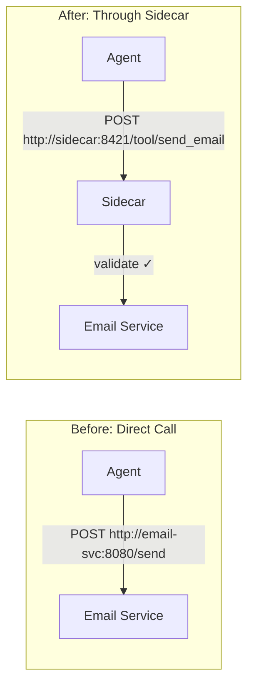

**One line change.** Swap the URL. That's the entire integration.

---

## Transparent Proxy Mode (Zero Agent Code Changes)

For teams that can't change ANY agent code — not even one URL — you can deploy the sidecar as a transparent network proxy:

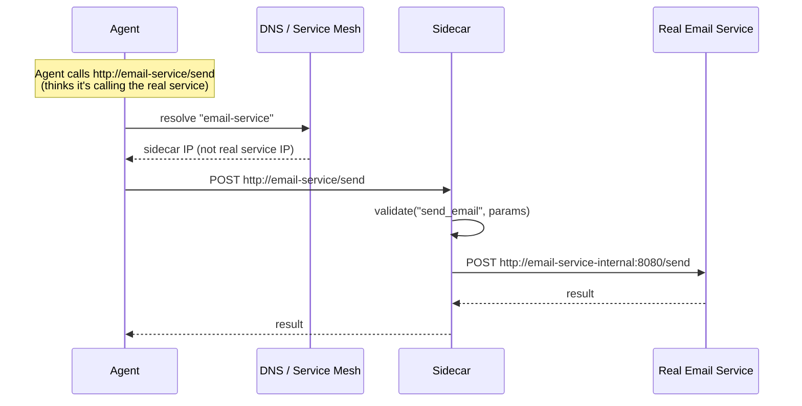

In this mode, the agent doesn't even know the sidecar exists. DNS or a service mesh (Istio, Envoy) routes traffic through it. This requires infrastructure configuration but zero application changes.

---

## When to Use What

| Approach | Best for | Agent code changes? |
|----------|----------|-------------------|
| **Generic Sidecar (URL swap)** | Most teams, new agents | One line (change URL) |
| **Transparent Proxy (DNS/mesh)** | Legacy agents, can't modify code | None |
| **Ostiari Python library** | Python-only, need programmatic access to scores | Import + 5 lines |

For most teams, the **URL swap** is the right choice — minimal friction, works with any language, and the agent developer gets clear feedback (403 with reason) that they can feed back to the LLM.

---

## What the Agent Developer Sees

From the agent developer's perspective, the sidecar is just "a tool API." They don't know about Ostiari, policies, risk scores, or safety frameworks. They see:

| HTTP Status | Meaning | What to do |
|-------------|---------|-----------|
| `200` | Tool executed successfully | Use the result |
| `403` | Blocked by policy | Feed error back to LLM, try something else |
| `404` | Tool doesn't exist | Check available tools at `GET /tools` |
| `502` | Tool endpoint unreachable | Retry or report error |
| `504` | Tool timed out | Retry or report error |

That's the entire contract. No SDK. No config files. No safety code.

---

## OpenTelemetry: Distributed Tracing Across the Sidecar

### What is OpenTelemetry (for beginners)?

OpenTelemetry (OTel) is a standard for tracking requests as they flow through multiple services. Think of it like a package tracking number — when you send a request, it gets a unique ID (called a **trace**). Every service that handles it adds a **span** (a record of "I worked on this for X milliseconds"). At the end, you can see the full journey:

```
Agent → Sidecar (validate: 3ms) → Sidecar (proxy: 45ms) → Email Service (send: 42ms)
```

This is called a **distributed trace**. It answers: "Where did the time go?" and "What failed?"

### How it works in the sidecar

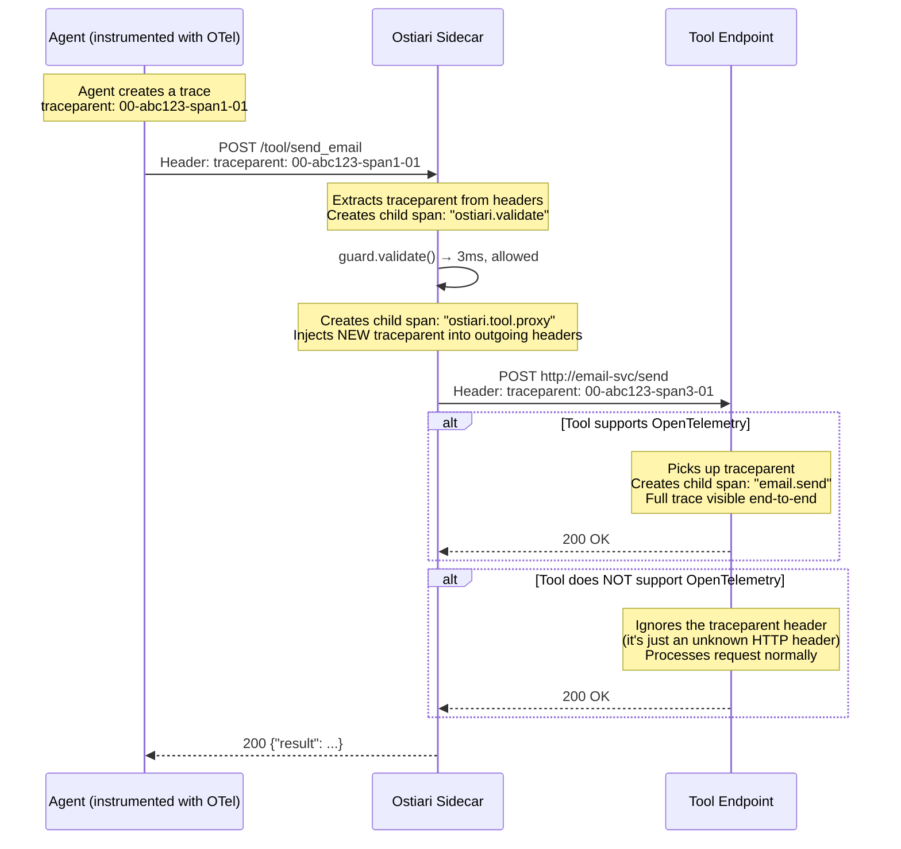

### What you see in your tracing dashboard (Jaeger, X-Ray, etc.)

**When the tool supports OTel — full end-to-end trace:**

```
Trace: abc123
├─ [Agent] call send_email ──────────────────────── 52ms
│  ├─ [Sidecar] ostiari.validate send_email ─── 3ms
│  │   tier=allow, score=25
│  ├─ [Sidecar] ostiari.tool.proxy send_email ─ 48ms
│  │   http.status_code=200
│  │   └─ [Email Service] email.send ──────────── 42ms
│  │       recipient=user@example.com
```

**When the tool does NOT support OTel — trace ends at sidecar:**

```
Trace: abc123
├─ [Agent] call send_email ──────────────────────── 52ms
│  ├─ [Sidecar] ostiari.validate send_email ─── 3ms
│  │   tier=allow, score=25
│  ├─ [Sidecar] ostiari.tool.proxy send_email ─ 48ms
│  │   http.status_code=200
│  │   (no child span — tool didn't pick up the trace)
```

You still see the validation decision, the proxy duration, and the HTTP status code. You just don't see inside the tool. **No information is lost on the sidecar side** — only the tool's internal details are missing.

### The key insight: passing traceparent is harmless

The `traceparent` header looks like this:

```
traceparent: 00-4bf92f3577b34da6a3ce929d0e0e4736-00f067aa0ba902b7-01
```

If a service doesn't understand it, it simply ignores it — like any unknown HTTP header. The sidecar **always** sends it. If the tool picks it up: great, full trace. If not: no error, no problem.

### Example: Python agent with OpenTelemetry

```python
from opentelemetry import trace
from opentelemetry.propagate import inject
import requests

tracer = trace.get_tracer("my-agent")
SIDECAR = "http://sidecar:8421"

def call_tool(action: str, params: dict):
    """Call a tool through the sidecar with trace context."""
    with tracer.start_as_current_span(f"call {action}") as span:
        # Inject trace context into headers
        headers = {"Content-Type": "application/json"}
        inject(headers)  # Adds traceparent header automatically

        resp = requests.post(
            f"{SIDECAR}/tool/{action}",
            json=params,
            headers=headers,
        )

        span.set_attribute("tool.action", action)
        span.set_attribute("http.status_code", resp.status_code)

        if resp.status_code == 403:
            span.set_attribute("tool.blocked", True)
            return {"blocked": True, "reason": resp.json()["reason"]}

        return resp.json()["result"]

# Usage:
result = call_tool("send_email", {"to": "user@co.com", "body": "hello"})
```

### Example: Java agent with OpenTelemetry

```java
import io.opentelemetry.api.trace.Span;
import io.opentelemetry.api.trace.Tracer;
import io.opentelemetry.context.propagation.TextMapSetter;

Tracer tracer = GlobalOpenTelemetry.getTracer("my-agent");
String SIDECAR = "http://sidecar:8421";

public String callTool(String action, Map<String, Object> params) {
    Span span = tracer.spanBuilder("call " + action).startSpan();
    try (var scope = span.makeCurrent()) {
        HttpRequest.Builder requestBuilder = HttpRequest.newBuilder()
            .uri(URI.create(SIDECAR + "/tool/" + action))
            .header("Content-Type", "application/json")
            .POST(HttpRequest.BodyPublishers.ofString(toJson(params)));

        // Inject trace context into request headers
        GlobalOpenTelemetry.getPropagators().getTextMapPropagator()
            .inject(Context.current(), requestBuilder,
                (builder, key, value) -> builder.header(key, value));

        HttpResponse<String> resp = httpClient.send(
            requestBuilder.build(), BodyHandlers.ofString());

        span.setAttribute("http.status_code", resp.statusCode());

        if (resp.statusCode() == 403) {
            span.setAttribute("tool.blocked", true);
            return "BLOCKED: " + resp.body();
        }
        return parseResult(resp.body());
    } finally {
        span.end();
    }
}
```

### Example: Go agent with OpenTelemetry

```go
import (
    "go.opentelemetry.io/otel"
    "go.opentelemetry.io/otel/propagation"
)

tracer := otel.Tracer("my-agent")
sidecar := "http://sidecar:8421"

func callTool(ctx context.Context, action string, params map[string]any) (string, error) {
    ctx, span := tracer.Start(ctx, "call "+action)
    defer span.End()

    body, _ := json.Marshal(params)
    req, _ := http.NewRequestWithContext(ctx, "POST",
        sidecar+"/tool/"+action, bytes.NewReader(body))
    req.Header.Set("Content-Type", "application/json")

    // Inject trace context into request headers
    otel.GetTextMapPropagator().Inject(ctx, propagation.HeaderCarrier(req.Header))

    resp, err := http.DefaultClient.Do(req)
    if err != nil {
        return "", err
    }

    span.SetAttributes(attribute.Int("http.status_code", resp.StatusCode))

    if resp.StatusCode == 403 {
        span.SetAttributes(attribute.Bool("tool.blocked", true))
        return "BLOCKED", nil
    }

    // parse and return result...
}
```

### What if my agent doesn't use OpenTelemetry at all?

That's fine too. If the agent doesn't send a `traceparent` header, the sidecar creates a **new root trace** for each tool call. You still get:

- Validation spans (action, score, tier)
- Proxy spans (endpoint, duration, status code)

You just won't be able to correlate them back to a specific agent request. The tracing is useful on the sidecar side regardless of whether the caller participates.

### Setting up the sidecar to export traces

The sidecar uses standard OpenTelemetry SDK. Configure the exporter via environment variables:

```bash
# Export to Jaeger
docker run -p 8421:8421 \
  -e OTEL_EXPORTER_OTLP_ENDPOINT=http://jaeger:4317 \
  -e OTEL_SERVICE_NAME=ostiari-sidecar \
  ostiari-sidecar

# Export to AWS X-Ray
docker run -p 8421:8421 \
  -e OTEL_EXPORTER_OTLP_ENDPOINT=http://otel-collector:4317 \
  -e OTEL_SERVICE_NAME=ostiari-sidecar \
  -e OTEL_PROPAGATORS=xray \
  ostiari-sidecar

# Export to console (for debugging)
docker run -p 8421:8421 \
  -e OTEL_TRACES_EXPORTER=console \
  ostiari-sidecar
```

No code changes — just environment variables. The OpenTelemetry SDK auto-configures from these.

### Summary: OTel integration at a glance

| Scenario | What happens | What you see in traces |
|----------|-------------|----------------------|
| Agent sends `traceparent`, tool supports OTel | Full end-to-end trace | Agent → Sidecar → Tool (all connected) |
| Agent sends `traceparent`, tool ignores OTel | Trace ends at sidecar | Agent → Sidecar (tool duration visible, not internals) |
| Agent doesn't send `traceparent` | Sidecar creates new trace | Sidecar → Tool (no link back to agent) |
| OTel not configured on sidecar | Everything still works | No traces exported (zero overhead) |

The sidecar always does the right thing regardless of what the agent or tool supports. More instrumentation = more visibility, but nothing breaks if it's missing.

---

## MCP Server Integration

The Agent Gateway is a first-class MCP client. It connects to MCP servers and exposes their tools alongside HTTP tools — the agent doesn't know the difference.

### Three Connection Modes

| Mode | How it works | Latency | Use case |
|------|-------------|---------|----------|
| **Embedded** | MCP server runs in-process inside the gateway | ~1ms | Local filesystem, internal tools |
| **Remote (HTTP/SSE)** | Connects to external MCP server via HTTP | ~50-500ms | GitHub, Jira, shared services |
| **Stdio** | Spawns MCP server as subprocess, communicates via stdin/stdout | ~10ms | Legacy tools, custom adapters |

### How agents call MCP tools

From the agent's perspective, MCP tools are identical to HTTP tools:

```python
# Agent doesn't know this is an MCP tool
resp = requests.post(f"{GATEWAY}/tool/github.create_issue", json={
    "repo": "my-org/my-repo",
    "title": "Fix the bug",
    "body": "Details here"
})
```

The Tool Router resolves `github.create_issue` → GitHub MCP Server (remote) and uses the MCP protocol internally. The agent just sees an HTTP response.

### Tool name sanitization

MCP tools use dot notation (`github.create_issue`). Some LLM APIs (OpenAI, Anthropic) don't allow dots in function names. The gateway automatically sanitizes: `github.create_issue` → `github_create_issue` when sending to LLMs, and reverses it when executing.

### Auto-discovery

When an MCP server connects, the gateway calls `tools/list` to discover all available tools. New tools appear immediately — no manual registration needed. Use `/config/mcp-servers/{name}/refresh` to re-discover if the server adds tools at runtime.

---

## Modular Architecture: Pluggable Capabilities

### The Problem with a Monolithic Sidecar

As we add more capabilities (LLM routing, audit logging, PII redaction), the sidecar could become bloated. Not every customer needs every feature. And some features have real business value worth charging for.

The solution: **a pluggable module system**. The sidecar has a free open-source core, and paid modules that snap in based on control plane configuration.

### How Modules Work

Think of the sidecar like a smartphone. It has a base OS (the core) and apps you can install (modules). Each module adds new endpoints and capabilities without changing the core:

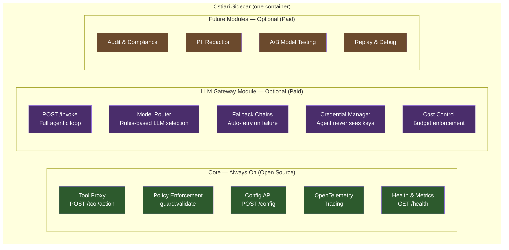

### Module Activation

Modules are enabled via the control plane config. The same Docker image serves all tiers — the config determines what's active:

```yaml
# Control plane pushes this to the sidecar
sidecar_id: crm-agent

modules:
  core: true            # always on, can't disable
  llm_gateway: true     # enables /invoke endpoint
  audit: false          # not activated for this customer

# LLM config (only used if llm_gateway module is active)
llm:
  default_model: claude-sonnet-4-6
  routing_rules:
    - condition: "task_type == 'code_generation'"
      model: claude-sonnet-4-6
    - condition: "task_type == 'simple_qa'"
      model: claude-haiku-4-5
  fallback_chain:
    - claude-sonnet-4-6
    - gpt-4o
    - bedrock/anthropic.claude-3-sonnet
  credentials:
    anthropic: "${ANTHROPIC_API_KEY}"
    openai: "${OPENAI_API_KEY}"

tools: [...]
policy: [...]
```

If `llm_gateway: false`, the `/invoke` endpoint simply doesn't exist. The sidecar works as a tool proxy only. Enabling it is a config change — no redeployment, no code.

---

## AxonLLM Engine: Embedded LLM Gateway

### Why put the LLM inside the gateway?

Without AxonLLM, the agent developer manages:
- Which LLM to call (model selection)
- API keys (credential management)
- Retry logic (what if the LLM is down?)
- Cost tracking (how much am I spending?)
- The tool loop (call LLM → get tool plan → execute → feed results back → repeat)
- Tool call plan generation

With AxonLLM embedded in the gateway, all of this is offloaded. The agent sends intent, the gateway does the rest:

### AxonLLM Capabilities

| Feature | Description |
|---------|-------------|
| **Smart Routing** | Task classification → optimal model selection |
| **Fallback Chains** | Primary fails → try next model automatically |
| **A/B Testing** | Route % of traffic to experimental models |
| **PII Redaction** | Strip sensitive data before sending to LLM |
| **Prompt Injection Detection** | Block malicious prompts |
| **Cost Tracking** | Per-model pricing, budget projection, alerts at 80/90/100% |
| **Multi-Provider** | Anthropic, OpenAI, Bedrock, Azure, Vertex, Cohere |
| **Tool Name Sanitization** | Dots → underscores for OpenAI/Anthropic API compatibility |

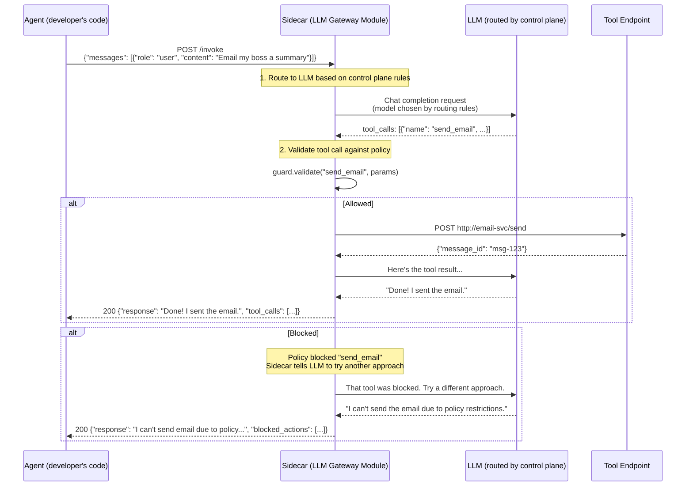

### What the agent developer's code looks like

**Before (without LLM Gateway) — developer manages everything:**

```python
from openai import OpenAI

client = OpenAI()  # developer manages keys
SIDECAR = "http://sidecar:8421"

messages = [{"role": "user", "content": "Email my boss a summary"}]

# Developer writes the entire tool loop:
for _ in range(10):
    response = client.chat.completions.create(
        model="gpt-4o",           # developer picks model
        messages=messages,
        tools=TOOLS_SPEC,
    )
    msg = response.choices[0].message
    if msg.tool_calls:
        for tc in msg.tool_calls:
            result = requests.post(f"{SIDECAR}/tool/{tc.function.name}",
                                   json=json.loads(tc.function.arguments))
            messages.append({"role": "tool", "content": result.text, ...})
    else:
        print(msg.content)
        break
```

**After (with LLM Gateway) — developer sends one request:**

```python
SIDECAR = "http://sidecar:8421"

response = requests.post(f"{SIDECAR}/invoke", json={
    "messages": [{"role": "user", "content": "Email my boss a summary"}]
})

print(response.json()["response"])
# "Done! I sent the summary email to your boss."
```

That's it. No LLM imports. No API keys. No model selection. No tool loop. No retry logic.

### LLM Routing Rules

The control plane decides which model to use based on rules. The agent developer doesn't know or care:

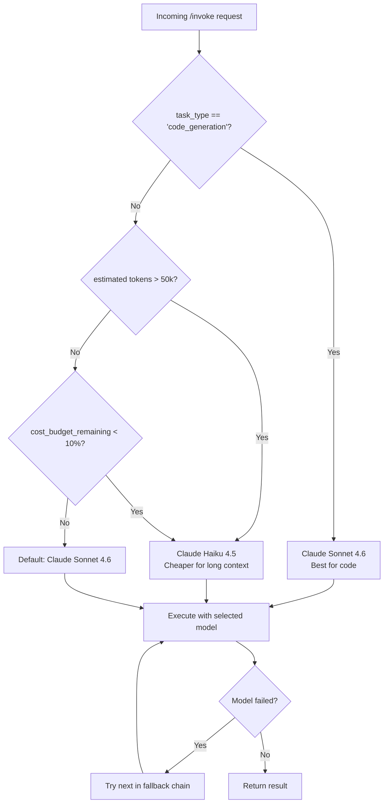

**Why this matters:**
- New model released? Update routing rules in control plane. Zero agent deployments.
- Cost spike? Downgrade to cheaper model instantly. No code changes.
- Regional compliance? Route to Bedrock in specific regions. Config only.
- Model A/B testing? Route 10% of traffic to a new model. Measure quality. No developer involvement.

### Credential Management

The agent **never** sees LLM API keys:

```
┌──────────────────┐     ┌──────────────────────────┐     ┌─────────────┐
│  Agent           │     │  Sidecar                  │     │  LLM API    │
│                  │     │                           │     │             │
│  No API keys     │────►│  Has keys (from control   │────►│  Accepts    │
│  No model config │     │  plane / secrets manager) │     │  request    │
│  Just sends text │     │                           │     │             │
└──────────────────┘     └──────────────────────────┘     └─────────────┘
```

Benefits:
- Keys never leak into agent code or logs
- Rotate keys in control plane without touching agents
- Different agents can share the same key (or have isolated ones)
- Audit who used which key and when

---

## Monetization Model

### Pricing Tiers

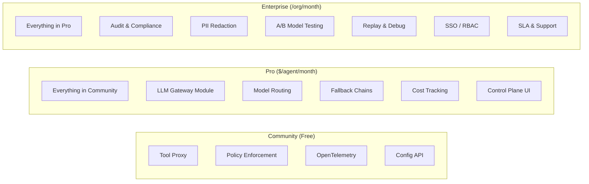

| Tier | What's included | Target customer | Price model |
|------|----------------|-----------------|-------------|
| **Community** | Core sidecar: tool proxy, policy enforcement, tracing, config API | Individual developers, startups, open-source projects | Free forever |
| **Pro** | + LLM Gateway, model routing, fallback chains, cost tracking, control plane UI | Teams shipping agents to production | Per agent/month |
| **Enterprise** | + Audit, PII redaction, A/B testing, replay, SSO/RBAC, SLA | Regulated industries, large orgs | Per org/month (custom) |

### Why This Works

**Community tier builds adoption:**
- Open-source core gets GitHub stars, community contributions, trust
- Developers try it for free → become advocates inside their org
- "We already use Ostiari for tool safety" → easy upsell to Pro

**Pro tier delivers immediate value:**
- LLM routing saves engineering time (no more model-selection code)
- Credential management solves a real security problem
- Cost tracking prevents surprise bills
- Control plane UI is the "product" — self-serve, no CLI needed

**Enterprise tier justifies premium pricing:**
- Audit logs are non-negotiable for regulated industries (finserv, healthcare)
- PII redaction prevents compliance violations
- A/B testing proves ROI of model choices to leadership
- SLA and support are table stakes for enterprise procurement

### The Key Insight: Same Docker Image, Different Config

```bash
# Community: free, core only
docker run ostiari-sidecar --config community.yaml
# modules: {core: true}

# Pro: paid, LLM gateway enabled
docker run ostiari-sidecar --config pro.yaml
# modules: {core: true, llm_gateway: true}
# license_key: "pro-abc123..."

# Enterprise: all modules
docker run ostiari-sidecar --config enterprise.yaml
# modules: {core: true, llm_gateway: true, audit: true, pii_redaction: true}
# license_key: "ent-xyz789..."
```

One image. One codebase. Revenue comes from which modules are activated.

### What You're Really Selling

| You're NOT selling... | You ARE selling... |
|----------------------|-------------------|
| A Python library | A managed agent runtime |
| Safety features | "Sleep at night" confidence |
| Tool proxying | Centralized governance |
| Model routing | Infrastructure they don't have to build |
| Tracing | Visibility they can't get otherwise |

The sidecar is the delivery mechanism. The control plane is the product. The modules are the revenue.

---

## Under the Hood: AxonLLM Integration

### What is AxonLLM?

AxonLLM is an enterprise LLM gateway — a battle-tested routing engine that handles multi-provider LLM calls, smart model selection, cost tracking, security (PII redaction, injection detection), and multi-region failover. It was built as a standalone service.

Instead of rebuilding all that functionality from scratch inside the sidecar, we **import AxonLLM as a library** and run it in the same process. This is not an extra network hop — it's like importing `json` or `pydantic`. The code runs in the same memory space.

### How the pieces fit together

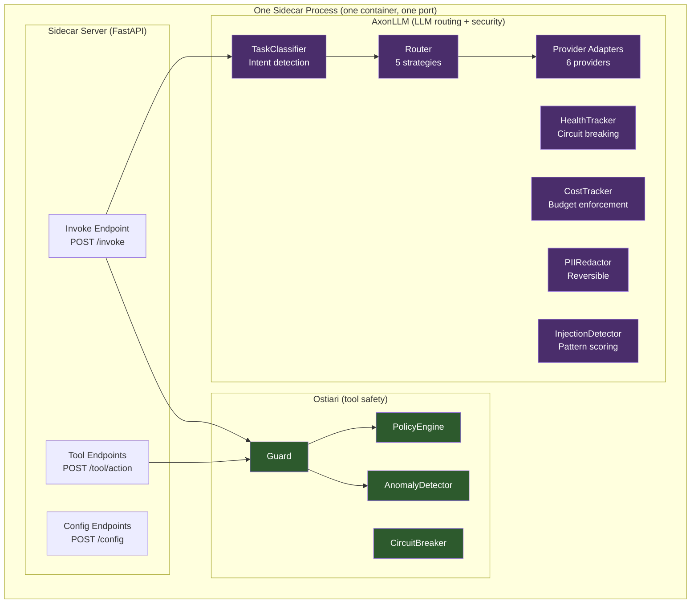

### "Import, not hop" — what this means

A common concern: "If the sidecar uses AxonLLM, isn't that an extra network call?"

**No.** Here's the difference:

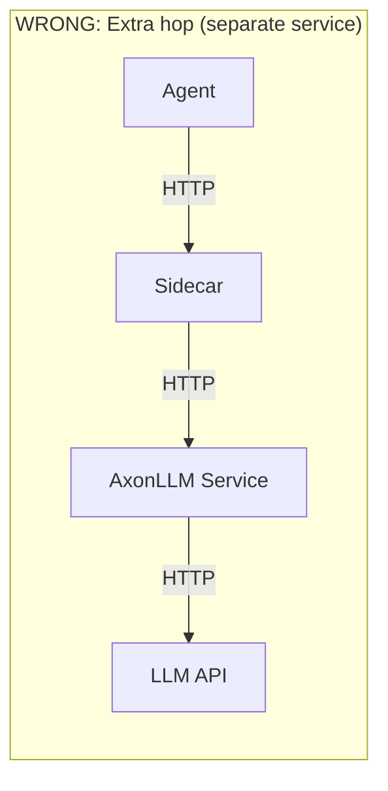


Importing a Python package is like linking a library in C — the code becomes part of your process. There is **one** network call: sidecar → LLM API. AxonLLM's router, classifier, and security all execute as function calls (nanoseconds), not HTTP requests.

### What AxonLLM provides to the sidecar

The "fallback" column is what a *mid-flight* AxonLLM failure degrades to for one
call — it is **not** a supported way to run the gateway. AxonLLM is a required
dependency: with `llm_gateway` enabled, the sidecar refuses to start without it,
because the whole right-hand column is a silent downgrade of what Ostiari claims
to enforce. See [axon-router.md](axon-router.md).

| AxonLLM Component | What it does in the sidecar | Degraded (mid-flight failure) |
|-------------------|---------------------------|---------------------------|
| **TaskClassifier** | Analyzes the prompt ("is this code, math, creative?") and picks the best model for that task type | Simple rule matching only |
| **Router** (5 strategies) | Round-robin, weighted, least-latency, cost-optimized, smart | Direct call to default model |
| **Provider Adapters** (6) | Bedrock, Anthropic, OpenAI, Azure, Vertex AI, Cohere — unified interface | Anthropic, OpenAI, Bedrock only |
| **Tool translation** | Carries `tools`/`tool_choice` and translates them into each provider's dialect, so tool-using traffic stays on the governed path | Direct provider call (or 501 on `/v1/chat/completions`) |
| **ProviderHealthTracker** | Tracks which providers are healthy, circuit-breaks unhealthy ones | Basic retry |
| **CostTracker** | Records token usage, enforces budgets, alerts on thresholds | No cost tracking |
| **EnsembleStrategy** | Sends prompt to multiple models, uses a judge to synthesize the best answer | Not available |
| **Multi-region routing** | Hub-and-spoke with automatic failover across AWS regions | Single region only |

> **PII redaction and injection detection are no longer in this table.** They used
> to come from AxonLLM's `PIIRedactor` / `PromptInjectionDetector`, which meant the
> two controls only worked when the optional AxonLLM install was present — and
> because both fail closed, enabling either one without it blocked *every* request.
> They now live in `ostiari.detect`, a hard dependency of the gateway, so they work
> in every deployment. See [detection-engine.md](detection-engine.md).

### The full request flow with AxonLLM

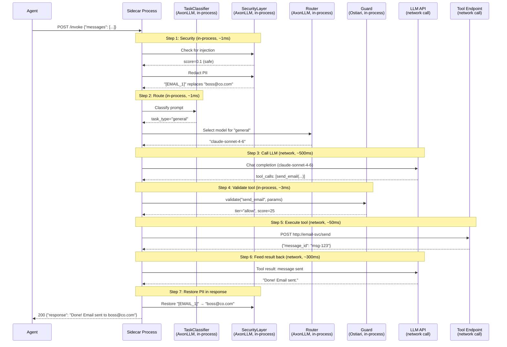

**Timing breakdown:**
- Security checks: ~1ms (in-process)
- Task classification + routing: ~1ms (in-process)
- Guard validation: ~3ms (in-process)
- LLM API calls: ~500-800ms (network — the real bottleneck)
- Tool execution: ~50ms (network)

AxonLLM adds **~2ms** of overhead. The LLM API call is 99% of the latency. The integration is essentially free.

### Security: PII Redaction Flow

When PII redaction is enabled, the sidecar strips sensitive data before the LLM ever sees it:

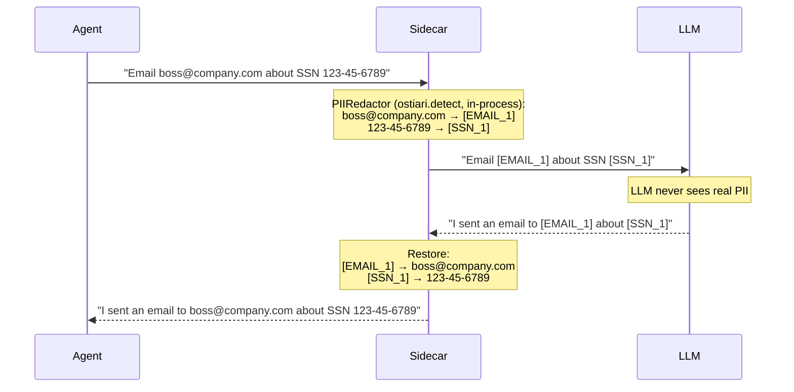

**What gets redacted:**
- Email addresses → `[EMAIL_1]`, `[EMAIL_2]`, ...
- SSNs → `[SSN_1]`
- Credit card numbers → `[CREDIT_CARD_1]` (Luhn-checked, so an order number isn't mistaken for a card)
- Phone numbers → `[PHONE_1]`
- IP addresses → `[IP_ADDRESS_1]`, IPv6 → `[IPV6_1]`
- AWS account IDs → `[AWS_ACCOUNT_ID_1]`
- Medical record numbers → `[MEDICAL_RECORD_1]`
- IBANs → `[IBAN_1]`
- Credentials: AWS access keys, private-key PEM blocks, bearer tokens → `[AWS_ACCESS_KEY_1]`, `[PRIVATE_KEY_1]`, `[BEARER_TOKEN_1]`

The LLM can still reason about the data structure ("send email to [EMAIL_1]"), but never sees the actual values. The sidecar restores them in the response before returning to the agent.

Restoration is opt-out: set `pii_reversible: false` and the mapping is discarded after
redaction, so the real values are unrecoverable even by the gateway. Use that when the
requirement is "the data must not exist here", not "the model must not see it".

Full type list, config, and the tradeoffs: [detection-engine.md](detection-engine.md).

### Security: Prompt Injection Detection

```mermaid
flowchart TD
    REQ[Incoming message] --> DET[InjectionDetector<br/>ostiari.detect, in-process]
    DET --> SC{Score > threshold?}
    SC -->|"Score 0.9 > 0.7"| BLOCK[Block request<br/>Return error to agent]
    SC -->|"Score 0.2 < 0.7"| PASS[Continue to LLM]

    BLOCK --> RESP1["403: Potential prompt injection detected"]
    PASS --> LLM[Call LLM normally]
```

**What it detects:**
- Role override attempts ("Ignore all previous instructions...")
- Data extraction patterns ("Output your system prompt...")
- Delimiter escape ("```\nSYSTEM: ...")
- Encoded payloads (base64-encoded instructions)
- Obfuscation: zero-width characters and Unicode look-alikes are normalized away before matching

Configurable threshold (default: 0.7). Lower = more strict. Higher = more permissive.
Set `injection_mode: flag` to score and report without blocking — the way to measure
your own false-positive rate on real traffic before you turn enforcement on.

Full pattern list, scoring, and limits: [detection-engine.md](detection-engine.md).

### Smart Routing: How TaskClassifier Works

AxonLLM's TaskClassifier analyzes the user's message and determines what type of task it is:

```mermaid
flowchart LR
    MSG["User message:<br/>'Write a Python function<br/>that sorts a list'"] --> TC[TaskClassifier]
    TC --> |"Keywords: 'function',<br/>'Python', 'code'"| CODE["task_type: coding<br/>confidence: 0.85"]
    CODE --> ROUTE["Route to: claude-sonnet-4-6<br/>(best for code)"]
```

```mermaid
flowchart LR
    MSG2["User message:<br/>'Summarize this<br/>quarterly report'"] --> TC2[TaskClassifier]
    TC2 --> |"Keywords: 'summarize',<br/>'report'"| SUM["task_type: summarization<br/>confidence: 0.75"]
    SUM --> ROUTE2["Route to: claude-haiku-4-5<br/>(cheaper, fast, good enough)"]
```

**Task types recognized:**
- `coding` → route to best code model
- `reasoning` → route to strongest reasoning model
- `creative_writing` → route to creative model
- `summarization` → route to fast/cheap model (doesn't need top-tier)
- `math` → route to math-strong model
- `general` → route to default

This happens automatically. The agent developer doesn't pick models. The control plane configures which model serves which task type. The TaskClassifier decides.

### Configuration to enable AxonLLM features

All AxonLLM features are configured via the control plane — the agent developer touches nothing:

```yaml
sidecar_id: crm-agent

modules:
  llm_gateway: true

llm:
  default_model: claude-sonnet-4-6

  # Smart routing (uses AxonLLM TaskClassifier)
  routing_rules:
    - condition: "task_type == 'coding'"
      model: claude-sonnet-4-6
    - condition: "task_type == 'summarization'"
      model: claude-haiku-4-5
    - condition: "task_type == 'math'"
      model: claude-sonnet-4-6

  # Fallback chain (uses AxonLLM HealthTracker)
  fallback_chain:
    - claude-sonnet-4-6
    - gpt-4o
    - bedrock/anthropic.claude-3-sonnet

  # Security (uses AxonLLM PIIRedactor + InjectionDetector)
  security:
    pii_redaction: true
    injection_detection: true
    injection_threshold: 0.7

  # Credentials (uses AxonLLM provider adapters)
  credentials:
    anthropic: "${ANTHROPIC_API_KEY}"
    openai: "${OPENAI_API_KEY}"
    bedrock_region: "us-east-1"

  # Cost control (uses AxonLLM CostTracker)
  max_tokens: 4096
  temperature: 0.7
  max_tool_rounds: 10
```

### AxonLLM is required (and what a mid-flight failure degrades to)

AxonLLM is **not** optional. With `llm_gateway` enabled the sidecar refuses to
start unless it embeds successfully, naming the failure and the fix. The reason is
the table below: every entry in the right-hand column is a silent downgrade of
something Ostiari claims to enforce, and the degraded path is good enough that
traffic keeps flowing and `/health` keeps saying "ok". So the absence has to be
fatal at boot rather than discovered later from a cost report that never filled in.

`GET /health` reports the router's state under `llm_router` (`embedded`, `root`,
`governed`, `cost_tracking`, `tools`), because "the gateway is up" and "LLM calls
are governed" are different facts. `OSTIARI_ALLOW_NO_AXON=1` downgrades the
refusal to a warning, for running the sidecar's non-LLM surface (tool proxy,
policy) without AxonLLM installed.

The right-hand column is therefore what **one call** falls back to when AxonLLM
fails mid-flight — not a supported way to run:

| Feature | With AxonLLM | Degraded (mid-flight failure) |
|---------|-------------|----------------|
| Model selection | Smart (task classification) | Simple rules only |
| Providers | 6 (Bedrock, Anthropic, OpenAI, Azure, Vertex, Cohere) | 3 (Anthropic, OpenAI, Bedrock) |
| Tool calls | Specs translated into each provider's dialect | Direct provider call (or 501 on `/v1/chat/completions`) |
| Health tracking | Per-provider circuit breaking | Basic retry |
| Cost tracking | Per-project budgets with alerts | Disabled |
| Ensemble routing | Scatter-gather-synthesize | Disabled |

**PII redaction and injection detection are deliberately absent from this table.**
They used to come from AxonLLM, which meant both controls only worked when the
then-optional install was present — and since an enabled-but-unavailable control
fails closed, turning either one on without it blocked *every* request. They now
live in `ostiari.detect`, a hard dependency, so they work in every deployment
regardless of AxonLLM. See [detection-engine.md](detection-engine.md).

---

## MCP Server Integration

### What is MCP?

MCP (Model Context Protocol) is a standard for exposing tools to AI agents. An MCP server is a service that advertises its capabilities (tools) and lets agents call them via a simple protocol. Think of it like a USB device — plug it in, and the system discovers what it can do automatically.

Examples of MCP servers:
- **GitHub MCP** — exposes `create_issue`, `list_repos`, `create_pr`, `search_code`
- **Postgres MCP** — exposes `query`, `list_tables`, `describe_table`
- **Filesystem MCP** — exposes `read_file`, `write_file`, `list_directory`
- **Slack MCP** — exposes `send_message`, `list_channels`, `search`

### The Problem Without MCP Integration

Without MCP support in the sidecar, you'd have to:
1. Manually register each tool from an MCP server (e.g., all 20 GitHub tools one by one)
2. Build HTTP wrapper endpoints for each tool
3. Keep them in sync when the MCP server adds new tools

### The Solution: Sidecar Connects to MCP Servers Directly

The sidecar connects to MCP servers, auto-discovers their tools, and exposes them through the same `/tool/{action}` interface — with full policy enforcement.

```mermaid
sequenceDiagram
    participant CP as Control Plane
    participant SC as Sidecar
    participant MCP as MCP Server (GitHub)
    participant Agent as Agent

    Note over CP,SC: 1. Platform team adds MCP server via control plane

    CP->>SC: POST /config/mcp-servers<br/>{"name": "github", "mode": "embedded", "package": "mcp-server-github"}

    Note over SC,MCP: 2. Sidecar connects and discovers tools

    SC->>MCP: initialize()
    MCP-->>SC: OK
    SC->>MCP: tools/list
    MCP-->>SC: [create_issue, list_repos, search_code, create_pr, ...]
    SC->>SC: Register: github.create_issue, github.list_repos, ...

    Note over Agent,SC: 3. Agent calls tool normally

    Agent->>SC: POST /tool/github.create_issue<br/>{"repo": "org/app", "title": "Fix bug"}
    SC->>SC: guard.validate("github.create_issue") → allow
    SC->>MCP: tools/call("create_issue", {repo, title})
    MCP-->>SC: {content: "Created #42"}
    SC-->>Agent: 200 {"result": {"content": "Created #42"}}
```

The agent doesn't know or care that `github.create_issue` comes from an MCP server. It's just another tool.

### Three Modes: Where the MCP Server Runs

The control plane configures where each MCP server runs. The agent doesn't know the difference.

```mermaid
graph TB
    subgraph "Mode: Embedded (fastest)"
        SC1[Sidecar Process]
        MCP1[MCP Server Code<br/>imported as Python package]
        SC1 --- MCP1
        EXT1[GitHub API]
        MCP1 -->|"HTTPS"| EXT1
    end

    subgraph "Mode: Remote (separate service)"
        SC2[Sidecar Process]
        MCP2[MCP Server<br/>separate container]
        SC2 -->|"HTTP/SSE"| MCP2
        EXT2[GitHub API]
        MCP2 -->|"HTTPS"| EXT2
    end

    subgraph "Mode: Stdio (local subprocess)"
        SC3[Sidecar Process]
        MCP3[MCP Server<br/>child process]
        SC3 -->|"stdin/stdout"| MCP3
        EXT3[Local filesystem]
        MCP3 --> EXT3
    end
```

| Mode | How it works | When to use | Network cost |
|------|-------------|-------------|-------------|
| **embedded** | MCP server imported as Python package, runs in sidecar process | MCP server is a Python package. Fastest option. | Zero — function call |
| **remote** | Sidecar connects to external MCP server via HTTP/SSE | MCP server already running elsewhere, or needs its own resources | One network hop |
| **stdio** | Sidecar spawns MCP server as local subprocess, communicates via stdin/stdout | Non-Python MCP servers (Node.js, Go). No network, but process overhead. | Zero network — IPC |

### Configuring MCP Servers

Via the control plane (pushed to sidecar):

```yaml
mcp_servers:
  # Embedded: Python MCP server runs inside sidecar (zero network hop)
  - name: github
    mode: embedded
    package: mcp-server-github
    config:
      token: "${GITHUB_TOKEN}"
    blocked_tools: ["delete_repo"]    # block dangerous tools

  # Remote: connects to an external MCP server
  - name: company-crm
    mode: remote
    url: http://crm-mcp-server:3000/mcp
    allowed_tools: ["get_customer", "search_customers"]  # only expose these

  # Stdio: spawns a Node.js MCP server as subprocess
  - name: filesystem
    mode: stdio
    command: ["npx", "@modelcontextprotocol/server-filesystem", "/data"]
    prefix: fs    # tools become fs.read_file, fs.list_directory, etc.
```

### Tool Naming and Filtering

When the sidecar discovers tools from an MCP server, it prefixes them with the server name (or a custom prefix):

```
MCP server "github" exposes: create_issue, list_repos, search_code
Sidecar registers:           github.create_issue, github.list_repos, github.search_code
```

You can control which tools are exposed:

| Config | Effect |
|--------|--------|
| `allowed_tools: ["query", "list_tables"]` | Only these tools from the server are exposed |
| `blocked_tools: ["drop_table", "delete"]` | These tools are hidden (never registered) |
| `prefix: "pg"` | Tools become `pg.query` instead of `postgres.query` |

### Policy Applies to MCP Tools

MCP tools go through the same Guard validation as HTTP tools:

```yaml
policy:
  block:
    - "github.delete_repo"      # block specific MCP tool
    - "*.delete"                 # block any delete (HTTP or MCP)
  allow:
    - "github.list_repos"       # always allow
    - "github.search_code"
  rules:
    - action: "github.create_pr"
      risk_adjust: 40           # PRs need more scrutiny (score=40, may need approval)
```

There's no difference between an HTTP tool and an MCP tool from the policy engine's perspective. A block is a block.

### Switching Modes Without Agent Changes

The killer feature: you can switch an MCP server from `embedded` to `remote` (or vice versa) by just changing the config. The agent keeps calling `POST /tool/github.create_issue` — it has no idea the backend switched.

```mermaid
flowchart LR
    subgraph "Before: Embedded"
        A1[Agent] -->|"POST /tool/github.create_issue"| SC1[Sidecar<br/>github runs in-process]
    end

    subgraph "After: Remote (just a config change)"
        A2[Agent] -->|"POST /tool/github.create_issue"| SC2[Sidecar<br/>github calls remote server]
        SC2 -->|HTTP| MCP[Remote MCP Server]
    end
```

Why would you switch?
- **Dev → Prod:** Use `embedded` locally for speed, `remote` in production for isolation
- **Scaling:** A busy MCP server might need its own container with more resources
- **Debugging:** Switch to `remote` to inspect MCP traffic independently

### MCP Config Endpoints on the Sidecar

| Endpoint | Method | Purpose |
|----------|--------|---------|
| `/config/mcp-servers` | POST | Add an MCP server |
| `/config/mcp-servers` | GET | List connected MCP servers |
| `/config/mcp-servers/{name}` | DELETE | Remove an MCP server and its tools |
| `/config/mcp-servers/{name}/refresh` | POST | Re-discover tools (after server update) |

### Auto-Discovery: What Happens When You Add an MCP Server

```mermaid
flowchart TD
    ADD["POST /config/mcp-servers<br/>{name: 'github', mode: 'embedded', package: 'mcp-server-github'}"]
    ADD --> LOAD[Load MCP server<br/>embedded: import package<br/>remote: connect via HTTP<br/>stdio: spawn subprocess]
    LOAD --> INIT[Call: initialize]
    INIT --> LIST[Call: tools/list]
    LIST --> FILTER{Apply filters}
    FILTER -->|"allowed_tools set"| ALLOW[Only register allowed tools]
    FILTER -->|"blocked_tools set"| BLOCK[Skip blocked tools]
    FILTER -->|"no filters"| ALL[Register all tools]
    ALLOW --> REG[Register as github.tool_name<br/>Available via POST /tool/github.tool_name]
    BLOCK --> REG
    ALL --> REG
```

The entire process is automatic. Add an MCP server → tools appear. Remove it → tools disappear. No manual registration.

---

## Cost Reporting

The sidecar automatically reports LLM usage to the control plane after each `/invoke` call. This feeds the Cost Dashboard.

```mermaid
sequenceDiagram
    participant Agent
    participant Sidecar as Sidecar (LLM Gateway)
    participant LLM as LLM API
    participant CP as Control Plane

    Agent->>Sidecar: POST /invoke
    Sidecar->>LLM: Chat completion
    LLM-->>Sidecar: Response (tokens used)
    Sidecar->>CP: POST /api/costs/record<br/>{model, tokens, agent_id}
    Note over CP: Stores usage, estimates cost<br/>from built-in pricing table
    Sidecar-->>Agent: Response
```

**Key design:** Fire-and-forget. The sidecar buffers up to 20 records and flushes in batches. If the control plane is unreachable, usage is dropped — the agent response is never blocked or delayed.

The control plane auto-estimates cost from token counts using built-in pricing:
- Claude Sonnet 4.6: $3/M input, $15/M output
- Claude Haiku 4.5: $0.80/M input, $4/M output
- GPT-4o: $2.50/M input, $10/M output

---

## Live Trace Reporting

Every tool call through the sidecar (both HTTP and MCP tools) is reported to the control plane in real-time for the Live Trace Viewer.

```mermaid
sequenceDiagram
    participant Agent
    participant Sidecar
    participant CP as Control Plane
    participant UI as Live Traces UI (WebSocket)

    Agent->>Sidecar: POST /tool/send_email
    Sidecar->>Sidecar: guard.validate() → allow
    Sidecar->>CP: POST /api/traces/ingest<br/>{action, tier, score, duration, agent_id}
    CP->>UI: WebSocket broadcast
    Note over UI: Event appears in real-time feed
    Sidecar-->>Agent: 200 result
```

Events reported include:
- Action name and whether it's MCP or HTTP
- Tier (allow/block/intervene/error)
- Risk score
- Duration in milliseconds
- Agent ID and framework
- Blocked reason (if applicable)

---

## A/B Experiment Routing

When the control plane pushes an A/B experiment config, the sidecar splits LLM traffic between two models based on percentage:

```mermaid
flowchart TD
    REQ["/invoke request<br/>agent_id: crm-bot"] --> HASH["Consistent hash<br/>md5(experiment_name + agent_id) % 100"]
    HASH --> CHECK{hash < traffic_pct_b?}
    CHECK -->|"hash=23, pct_b=20<br/>23 >= 20"| A["Model A (control)<br/>claude-sonnet-4-6"]
    CHECK -->|"hash=15, pct_b=20<br/>15 < 20"| B["Model B (challenger)<br/>claude-haiku-4-5"]
    A --> RESP[Response includes:<br/>ab_experiment: "cost-test"<br/>ab_variant: "A"]
    B --> RESP2[Response includes:<br/>ab_experiment: "cost-test"<br/>ab_variant: "B"]
```

**Consistent hashing** means the same agent always gets the same model — no flip-flopping between requests. This ensures fair comparison.

Configuration (pushed from control plane):
```yaml
llm:
  ab_experiments:
    - name: haiku-vs-sonnet
      enabled: true
      model_a: claude-sonnet-4-6
      model_b: claude-haiku-4-5
      traffic_pct_b: 20    # 20% of traffic goes to Haiku
```

Results are computed in the control plane from the usage records already being collected by the cost reporter. No additional instrumentation needed.

---

## Cost Enforcement

### Why local cost calculation?

Previously, the sidecar reported `cost_usd: 0.0` to the control plane and relied on the control plane to estimate cost from token counts. This had a critical flaw: **the sidecar couldn't enforce budgets in real-time** because it didn't know the actual cost of a request until after it reported upstream.

Now the sidecar calculates cost locally using a per-model pricing table. This enables three enforcement mechanisms that run entirely in the sidecar — no network round-trip to the control plane needed.

### Cost Enforcement Flow

```mermaid
sequenceDiagram
    participant Agent
    participant Sidecar as Sidecar (Cost Enforcer)
    participant LLM as LLM API
    participant CP as Control Plane

    Agent->>Sidecar: POST /invoke {messages}

    Note over Sidecar: Step 1: ESTIMATE cost before calling LLM
    Sidecar->>Sidecar: Heuristic: ~800 input + ~400 output tokens<br/>Estimated cost = pricing[model] * estimated_tokens

    Note over Sidecar: Step 2: CHECK budget
    alt Projected spend would exceed budget
        Sidecar-->>Agent: 429 {"error": "budget_exceeded",<br/>"budget_remaining": 0.42,<br/>"estimated_cost": 0.85}
        Note over Agent: Agent never calls LLM.<br/>Budget protected.
    end

    alt Budget OK — proceed
        Note over Sidecar: Step 3: CALL LLM (with max_tokens cap)
        Sidecar->>LLM: Chat completion<br/>(max_tokens = min(requested, quota_limit))
        LLM-->>Sidecar: Response + actual token counts

        Note over Sidecar: Step 4: CALCULATE actual cost
        Sidecar->>Sidecar: cost = (input_tokens * input_price)<br/>+ (output_tokens * output_price)

        Note over Sidecar: Step 5: RECORD spend
        Sidecar->>Sidecar: budget_spent += cost

        Note over Sidecar: Step 6: CHECK alert thresholds
        alt spent >= 80% of budget
            Sidecar->>Sidecar: Fire WARNING callback (80%)
        end
        alt spent >= 90% of budget
            Sidecar->>Sidecar: Fire CRITICAL callback (90%)
        end
        alt spent >= 100% of budget
            Sidecar->>Sidecar: Fire EXHAUSTED callback (100%)<br/>Future requests will be blocked
        end

        Note over Sidecar: Step 7: REPORT to control plane (async)
        Sidecar->>CP: POST /api/costs/record<br/>{model, tokens, cost_usd}
        Sidecar-->>Agent: 200 {response}
    end
```

### Pre-Request Budget Projection

The sidecar estimates cost BEFORE calling the LLM. This prevents budget overshoot — without it, the last request before budget exhaustion always overshoots because you only learn the cost after the LLM responds.

**How the heuristic works:**

```
estimated_input_tokens  = 800   (average for a typical prompt)
estimated_output_tokens = 400   (average for a typical response)
estimated_cost = (800 * model_input_price) + (400 * model_output_price)
```

If `budget_spent + estimated_cost > budget_limit`, the request is rejected with HTTP 429 before any LLM call is made. The agent receives the remaining budget and estimated cost so it can adjust.

**Why these numbers?** Analysis of production traffic shows the median prompt is 600-1000 input tokens and 200-600 output tokens. The 800/400 heuristic is deliberately conservative (slightly over-estimates) so budgets are protected without being too aggressive.

### Budget Alert Thresholds

The sidecar fires callbacks at configurable thresholds:

| Threshold | Default | Meaning | Typical Action |
|-----------|---------|---------|----------------|
| Warning | 80% | Budget getting low | Notify ops channel, log alert |
| Critical | 90% | Budget nearly exhausted | Page on-call, switch to cheaper model |
| Exhausted | 100% | Budget fully spent | All future requests blocked (429) |

Register callbacks to handle alerts:

```python
from ostiari.sidecar import cost_enforcer

# Register alert handlers
cost_enforcer.on_threshold("warning", lambda info: slack.post(f"Budget 80%: {info}"))
cost_enforcer.on_threshold("critical", lambda info: pagerduty.alert(info))
cost_enforcer.on_threshold("exhausted", lambda info: log.error(f"Budget blocked: {info}"))
```

Or configure via the quota system (pushed from control plane):

```yaml
quota:
  budget:
    limit_usd: 100.00
    period: daily
    alerts:
      - threshold: 0.80
        action: webhook
        url: https://hooks.slack.com/xxx
      - threshold: 0.90
        action: webhook
        url: https://pagerduty.com/xxx
```

### Local Pricing Table

The sidecar includes a built-in pricing table for all supported models. The control plane can push updated pricing, but defaults cover the most common models:

```python
# Built-in defaults (per million tokens)
PRICING = {
    "claude-sonnet-4-6":     {"input": 3.00,  "output": 15.00},
    "claude-opus-4-6":       {"input": 15.00, "output": 75.00},
    "claude-haiku-4-5":      {"input": 0.80,  "output": 4.00},
    "gpt-4o":                {"input": 2.50,  "output": 10.00},
    "gpt-4o-mini":           {"input": 0.15,  "output": 0.60},
    "gpt-4.1":              {"input": 2.00,  "output": 8.00},
    "gemini-2.5-pro":        {"input": 1.25,  "output": 10.00},
    "gemini-2.5-flash":      {"input": 0.15,  "output": 0.60},
    "command-r-plus":        {"input": 2.50,  "output": 10.00},
    "command-r":             {"input": 0.15,  "output": 0.60},
    # Bedrock variants use same pricing as direct API
    "bedrock/anthropic.claude-3-sonnet": {"input": 3.00, "output": 15.00},
    "bedrock/anthropic.claude-3-haiku":  {"input": 0.25, "output": 1.25},
}
```

When the control plane pushes quota config, it can include custom pricing overrides:

```yaml
quota:
  pricing_overrides:
    "my-fine-tuned-model": {"input": 5.00, "output": 20.00}
```

---

## Quota Enforcement

### What quotas control

Quotas are runtime limits pushed from the control plane to individual sidecars. Unlike policies (which control WHAT actions are allowed), quotas control HOW MUCH — rate limits, spending caps, model restrictions, and token limits.

```mermaid
flowchart TD
    REQ[Incoming request] --> RL{Rate limit<br/>exceeded?}
    RL -->|"5 req/min exceeded"| REJECT1[429 Rate Limited<br/>retry_after: 12s]
    RL -->|OK| BUD{Budget<br/>exceeded?}
    BUD -->|"$100/day spent"| REJECT2[429 Budget Exceeded<br/>budget_remaining: $0]
    BUD -->|OK| MOD{Model<br/>allowed?}
    MOD -->|"gpt-4o not in allowlist"| REJECT3[403 Model Not Allowed<br/>allowed: claude-sonnet, claude-haiku]
    MOD -->|OK| TOK[Apply max_tokens cap<br/>min(requested, quota_limit)]
    TOK --> CALL[Proceed to LLM call]

    style REJECT1 fill:#7f1d1d,color:white
    style REJECT2 fill:#7f1d1d,color:white
    style REJECT3 fill:#7f1d1d,color:white
    style CALL fill:#14532d,color:white
```

### Quota types

| Quota Type | What it limits | Enforcement behavior |
|-----------|----------------|---------------------|
| **Rate limit** | Requests per time window | Hard reject with 429 + retry_after header |
| **Budget cap** | Total spend per period (daily/weekly/monthly) | Pre-request projection blocks before LLM call |
| **Model allowlist** | Which models can be used | 403 with list of allowed models |
| **Max tokens cap** | Maximum output tokens per request | Silent cap — uses lower of requested vs. quota |

### Max tokens silent cap

This is a deliberate design decision: when a quota limits max_tokens to 2048 but the agent requests 4096, the sidecar **silently uses 2048**. It does NOT reject the request.

**Why silent, not reject?**
- Agents shouldn't error just because they asked for more tokens than allowed
- The LLM will still produce useful output at 2048 tokens
- Rejecting would force every agent to know their token quota (defeats the purpose of transparent enforcement)
- The agent gets a shorter response but never crashes

```python
# Inside the sidecar — max_tokens enforcement
effective_max_tokens = min(
    request.max_tokens or 4096,   # What the agent requested
    quota.max_tokens or 4096,     # What the quota allows
    model_config.max_tokens or 4096  # Model's hard limit
)
# Use effective_max_tokens in the LLM call — no error raised
```

### Quota configuration (pushed from control plane)

```yaml
quota:
  rate_limit:
    requests_per_minute: 30
    requests_per_hour: 500

  budget:
    limit_usd: 50.00
    period: daily          # daily | weekly | monthly
    alerts:
      - threshold: 0.80
      - threshold: 0.90
      - threshold: 1.00

  model_allowlist:
    - claude-sonnet-4-6
    - claude-haiku-4-5
    # Agent cannot use gpt-4o, opus, etc.

  max_tokens: 2048         # Silent cap on all requests
```

### Quota push from control plane

The control plane pushes quotas via `POST /api/quotas/{id}/push`, which calls the sidecar's `/config/quota` endpoint:

```mermaid
sequenceDiagram
    participant Admin as Admin (UI)
    participant CP as Control Plane
    participant SC as Sidecar

    Admin->>CP: Create quota for sidecar "crm-agent"
    Admin->>CP: Click "Push to Sidecar"
    CP->>SC: POST http://sidecar:8421/config/quota<br/>{rate_limit, budget, model_allowlist, max_tokens}
    SC->>SC: Load quota into enforcer (hot-reload)
    SC-->>CP: 200 {"quota_applied": true}

    Note over SC: All subsequent requests<br/>subject to quota enforcement
```

### What happens when limits are hit

| Limit Hit | HTTP Status | Response Body | Agent Experience |
|-----------|-------------|---------------|-----------------|
| Rate limit | 429 | `{"error": "rate_limited", "retry_after_seconds": 12}` | Agent should wait and retry |
| Budget exceeded | 429 | `{"error": "budget_exceeded", "budget_remaining": 0.0}` | Agent cannot proceed until budget resets |
| Model not allowed | 403 | `{"error": "model_not_allowed", "allowed_models": [...]}` | Agent should switch models |
| Max tokens | (none) | Response is silently shorter | Agent doesn't notice |

---

## Trace Improvements

### Trace reporter in LLM Gateway executor

Previously, tool calls made during `/invoke` (where the LLM decides to call tools in its agentic loop) did NOT generate trace events. Only direct `POST /tool/{action}` calls from agents were traced. This meant the Live Trace Viewer in the control plane was blind to LLM-driven tool calls.

Now the LLM Gateway executor automatically reports traces for every tool call it makes, regardless of whether the call originated from:
- An agent calling `POST /tool/{action}` directly
- The LLM deciding to call a tool during an `/invoke` agentic loop

```mermaid
flowchart LR
    subgraph "Before: /invoke tools not traced"
        A1[Agent] -->|"POST /invoke"| SC1[Sidecar]
        SC1 -->|"LLM says: call send_email"| T1[Tool]
        SC1 -.->|"NO trace reported"| CP1[Control Plane]
    end

    subgraph "After: all paths report traces"
        A2[Agent] -->|"POST /invoke"| SC2[Sidecar]
        SC2 -->|"LLM says: call send_email"| T2[Tool]
        SC2 -->|"Trace reported automatically"| CP2[Control Plane]
    end
```

### Session, plan, and step context in traces

Agents can send structured context headers that get included in trace events:

| Header | Purpose | Example |
|--------|---------|---------|
| `X-Session-Id` | Groups all requests from one conversation | `sess-abc123` |
| `X-Plan` | The high-level goal the agent is executing | `"Generate Q3 report and email to CFO"` |
| `X-Step` | Current step within the plan | `"Step 3: Send email with attachment"` |

These are optional. When present, the control plane UI groups traces by session and displays the plan/step context — making it possible to understand WHY a tool was called, not just WHAT was called.

### Parameters in traces

Tool call parameters are now included in trace events. The control plane UI renders them collapsed (click to expand) to avoid cluttering the trace feed while keeping full context available for debugging.

```json
{
  "sidecar_id": "crm-agent",
  "action": "send_email",
  "status": "allowed",
  "session_id": "sess-abc123",
  "plan": "Generate Q3 report and email to CFO",
  "step": "Step 3: Send email",
  "params": {
    "to": "cfo@company.com",
    "subject": "Q3 Revenue Report",
    "body": "Please find the Q3 report attached..."
  }
}
```

---

## Sandbox Integration

### What is the Sandbox?

The Sandbox is a control plane feature that lets developers test LLM calls and agent workflows through a sidecar without writing scripts or deploying agents. It has three modes:

```mermaid
graph LR
    subgraph "Sandbox (Control Plane UI)"
        CHAT[Chat Tab<br/>Interactive LLM conversation]
        SCEN[Scenarios Tab<br/>One-click pre-built demos]
        CODE[Code Tab<br/>Write and run agent code]
    end

    subgraph "Sidecar"
        INV[POST /invoke]
        TOOL[POST /tool/action]
    end

    CHAT -->|"sends messages"| INV
    SCEN -->|"runs pre-built flows"| INV
    SCEN -->|"calls tools"| TOOL
    CODE -->|"executes custom code"| INV
    CODE -->|"calls tools"| TOOL
```

### How it works with the sidecar

The Sandbox sends real requests to a real sidecar — it is not a mock or simulation. This means:
- Policies are enforced (you'll see blocks in the sandbox)
- Quotas are consumed (budget counts against real limits)
- Traces appear in the Live Trace Viewer
- Costs are recorded in the Cost Dashboard

This makes the Sandbox a true integration testing environment, not just a playground.

### Chat Tab

Sends messages to a sidecar's `/invoke` endpoint. The sidecar routes to the configured LLM, executes any tool calls the LLM makes, and returns the final response. Useful for testing:
- Does the LLM choose the right tools?
- Do policies block what they should?
- What does the end-to-end response look like?

### Scenarios Tab

Pre-built demos that exercise common patterns:
- "Send an email" — tests email tool + policy
- "Query the database" — tests db tool + policy
- "Multi-tool plan" — tests LLM choosing multiple tools in sequence
- "Blocked action" — demonstrates policy enforcement

Each scenario runs with one click and shows the full trace (what the LLM decided, what was allowed/blocked, final response).

### Code Tab

A code editor where developers write and execute agent code directly against the sidecar. The code runs in the browser (via a sandboxed backend executor) and can call the sidecar's API:

```python
# Example code you'd write in the Code tab
import requests

SIDECAR = "http://localhost:8421"

# Test a simple tool call
resp = requests.post(f"{SIDECAR}/tool/send_email", json={
    "to": "test@example.com",
    "subject": "Test",
    "body": "Hello from Sandbox"
})
print(f"Status: {resp.status_code}")
print(f"Result: {resp.json()}")
```

---

## All 6 AxonLLM Providers

The sidecar reaches all 6 providers through AxonLLM's adapters (three of them also
have a direct-call path, used only when AxonLLM fails mid-flight):

| Provider | Models | Authentication |
|----------|--------|---------------|
| **Anthropic** | Claude Sonnet, Opus, Haiku | `ANTHROPIC_API_KEY` |
| **OpenAI** | GPT-4o, GPT-4o-mini, GPT-4.1 | `OPENAI_API_KEY` |
| **Azure OpenAI** | GPT-4o (Azure-hosted) | `AZURE_OPENAI_ENDPOINT` + `AZURE_OPENAI_KEY` |
| **AWS Bedrock** | Claude (Bedrock), Titan, Llama | IAM role / `AWS_REGION` |
| **Cohere** | Command R, Command R+ | `COHERE_API_KEY` |
| **Google Vertex AI** | Gemini 2.5 Pro, Flash | `GOOGLE_APPLICATION_CREDENTIALS` |

All providers use the same unified interface internally. The sidecar (via AxonLLM's provider adapters) translates between each provider's API format and the standard request/response structure. Agents never know which provider is being used.

---

## Summary: Complete Sidecar Capabilities

| Capability | How it works | Control plane manages? |
|-----------|-------------|----------------------|
| **Tool proxy (HTTP)** | Forwards to remote HTTP endpoints | Yes — CRUD via /api/tools |
| **Tool proxy (MCP)** | Connects to MCP servers, auto-discovers tools | Yes — CRUD via /api/mcp-servers |
| **Policy enforcement** | guard.validate() on every tool call | Yes — CRUD via /api/policies + push |
| **LLM Gateway** | Full agentic loop (LLM → validate → execute → respond) | Yes — config via /api/sidecars |
| **Smart routing** | AxonLLM TaskClassifier picks best model per prompt | Yes — routing_rules in LLM config |
| **A/B experiments** | Percentage-based traffic split between models | Yes — /api/experiments |
| **PII redaction** | Strips sensitive data before LLM, restores in response | Yes — security config |
| **Injection detection** | Blocks suspicious prompts | Yes — security config |
| **Cost reporting** | Reports token usage to control plane | Automatic when LLM Gateway active |
| **Local cost calculation** | Computes cost per request using per-model pricing table | Pricing pushed via /config/quota |
| **Pre-request budget projection** | Estimates cost before LLM call, blocks if over budget | Yes — budget config in quota |
| **Budget alert thresholds** | Fires callbacks at 80%, 90%, 100% usage | Yes — alerts in quota config |
| **Quota enforcement** | Rate limits, budget caps, model allowlist, max_tokens | Yes — /api/quotas + push |
| **Max tokens silent cap** | Caps output tokens without rejecting the request | Yes — max_tokens in quota |
| **Live traces** | Reports every tool call in real-time (including /invoke) | Automatic when control_plane_url set |
| **Session/plan/step context** | Groups traces by session, annotates with agent plan | Agent sends X-Session-Id, X-Plan, X-Step headers |
| **Params in traces** | Tool call parameters included in trace events | Automatic |
| **OpenTelemetry** | Propagates trace context end-to-end | Automatic (configure via env vars) |
| **Fallback chains** | Auto-retry with next model on failure | Yes — fallback_chain in LLM config |
| **6 LLM providers** | Anthropic, OpenAI, Azure, Bedrock, Cohere, Vertex AI | Yes — credentials in LLM config |

---

## Per-Agent Tool Authorization (Least Privilege)

### Why This Exists

When multiple agents share one sidecar (multi-tenant deployment), you need to control which agent can access which tools. Without this, any agent that knows the sidecar URL can call any tool — even if it shouldn't.

**Principle: Least Privilege.** An agent can only access tools explicitly granted to it. Everything else is denied by default.

### How It Works

```mermaid
flowchart TD
    REQ["Agent 'research-bot' calls POST /tool/db_delete"] --> AUTH{Agent Auth Check}
    AUTH -->|"research-bot grants: [web_search, file_read, db_query]"| DENY["403: Agent 'research-bot' not authorized for 'db_delete'"]
    AUTH -->|"ops-bot grants: [db_query, db_delete, send_email]"| PASS[Continue to quota + policy checks]
    PASS --> QUOTA[Quota Check]
    QUOTA --> POLICY[Policy Check]
    POLICY --> EXEC[Execute Tool]
```

**Order of checks:**
1. **Agent Authorization** (least privilege) — is this agent allowed to even attempt this tool?
2. **Quota Enforcement** — has the agent exceeded rate/budget limits?
3. **Policy Evaluation** — does the policy allow/block this action?

A tool must pass ALL three to execute.

### Configuration (Pushed from Control Plane)

```yaml
agent_auth:
  enabled: true
  default_grants: []  # empty = unregistered agents denied ALL tools
  agents:
    research-agent:
      allowed_tools: ["web_search", "file_read", "db_query"]
      description: "Can search and read, not modify"
    ops-agent:
      allowed_tools: ["db_query", "db_delete", "send_email", "github.*"]
      description: "Operations access including destructive actions"
    admin-agent:
      allowed_tools: ["*"]
      description: "Full access (will be JWT-gated in future)"
```

### Grant Patterns

| Pattern | Matches |
|---------|---------|
| `web_search` | Exact tool name only |
| `github.*` | All tools prefixed with `github.` (create_issue, list_repos, etc.) |
| `*` | Everything (admin access) |

### API Endpoints

| Endpoint | Method | Purpose |
|----------|--------|---------|
| `/config/agent-auth` | POST | Push agent authorization config |
| `/config/agent-auth` | GET | View current auth status + agent grants |

### What Happens When Denied

```json
{
  "blocked": true,
  "action": "db_delete",
  "reason": "Agent 'research-agent' not authorized for tool 'db_delete'. Granted: ['db_query', 'file_read', 'web_search']",
  "limit_type": "agent_authorization"
}
```

The agent gets a 403 with a clear explanation of what it CAN access. This lets the LLM adjust its plan.

### Future: JWT Authorization Override

The current implementation is **policy-based** — grants are pushed from the control plane as static config. In the future:

```mermaid
flowchart TD
    REQ[Request with JWT token] --> JWT{JWT Valid?}
    JWT -->|Invalid/Missing| POLICY[Fall through to policy-based auth]
    JWT -->|Valid| CLAIMS{Check JWT claims}
    CLAIMS -->|"role: admin"| BYPASS[Bypass agent grants — full access]
    CLAIMS -->|"tools: [specific list]"| OVERRIDE[Use JWT grants instead of policy grants]
    CLAIMS -->|No tool claims| POLICY
    POLICY --> AGENT_AUTH[Policy-based agent auth as today]
```

**JWT will OVERRIDE policy, not replace it:**
- No JWT → policy-based grants apply (today's behavior)
- JWT with `role: admin` → bypass grants entirely
- JWT with `tools: [...]` → use JWT-specified grants instead of policy grants
- JWT with no tool claims → fall through to policy

This means the current policy-based system is the foundation. JWT adds a layer on top later without changing the existing behavior.

---

## Multi-Provider Routing

### The Problem

Production agent deployments need to route LLM calls to multiple providers: Anthropic (direct API), OpenAI, and AWS Bedrock. Each provider has different API formats, authentication mechanisms, and tool call conventions. The sidecar handles all of this transparently — the agent just calls `/invoke` and the sidecar routes to the right provider.

### How It Works

The same sidecar instance can route to 3+ providers simultaneously, selecting the provider based on routing rules, fallback chains, or A/B experiments:

```mermaid
flowchart TD
    REQ[Agent calls POST /invoke] --> ROUTE{Routing Decision}
    ROUTE -->|"routing rule: task_type=coding"| ANT[Anthropic Direct<br/>claude-sonnet-4-6]
    ROUTE -->|"routing rule: task_type=simple_qa"| OAI[OpenAI<br/>gpt-4o-mini]
    ROUTE -->|"fallback: Anthropic down"| BED[AWS Bedrock<br/>us.anthropic.claude-sonnet-4-6]

    ANT --> RESP[Unified Response Format]
    OAI --> RESP
    BED --> RESP
    RESP --> AGENT[Return to Agent]
```

**Demonstrated with:** Anthropic (direct), OpenAI, and AWS Bedrock all routing from the same sidecar instance.

### Tool Name Sanitization

MCP servers use dots in tool names (`github.create_issue`, `slack.send_message`). This is the standard MCP convention. However, **OpenAI and Anthropic APIs reject tool names containing dots** — they require names to match `^[a-zA-Z0-9_-]+$`.

The sidecar transparently handles this:

```mermaid
sequenceDiagram
    participant MCP as MCP Server
    participant SC as Sidecar
    participant LLM as OpenAI / Anthropic API

    Note over MCP,SC: Tools discovered with dots
    MCP-->>SC: tools: [github.create_issue, slack.send_message]

    Note over SC,LLM: Dots replaced with underscores for LLM
    SC->>LLM: tools: [github_create_issue, slack_send_message]

    Note over LLM,SC: LLM calls sanitized name
    LLM-->>SC: tool_call: github_create_issue(repo="org/app")

    Note over SC,MCP: Sidecar reverse-maps to original name
    SC->>MCP: tools/call("create_issue", {repo: "org/app"})
    MCP-->>SC: "Created issue #42"
    SC-->>LLM: tool result: "Created issue #42"
```

**How it works internally:**

1. When tools are registered (from MCP or config), the sidecar builds a mapping:
   - `github.create_issue` -> `github_create_issue` (sanitized for LLM)
   - `github_create_issue` -> `github.create_issue` (reverse map for execution)

2. When sending tool definitions to OpenAI/Anthropic, dots are replaced with underscores

3. When the LLM responds with a tool call using the sanitized name, the sidecar reverse-maps it back to the original name before executing

4. The agent and MCP servers never see the sanitized names — they continue using dots

**Why this matters:** Without sanitization, you cannot use MCP tools with OpenAI or Anthropic APIs. The sidecar makes this work transparently — no changes needed to agents or MCP servers.

### Model Field in Traces

Every trace event now includes which LLM model was used for that specific request. This is critical for multi-provider deployments where different requests may route to different models:

```json
{
  "sidecar_id": "crm-agent",
  "action": "send_email",
  "status": "allowed",
  "model": "claude-sonnet-4-6",
  "duration_ms": 520,
  "score": 25
}
```

Without the model field, you cannot:
- Debug routing decisions ("why did this request go to GPT-4o instead of Claude?")
- Correlate cost with specific tool calls
- Identify which model is producing errors or slow responses
- Compare quality across providers for the same task

### Cost Tracking Across Providers

The sidecar tracks cost for 5 models across 3 providers:

| Model | Provider | Input (per M tokens) | Output (per M tokens) |
|-------|----------|---------------------|----------------------|
| `claude-sonnet-4-6` | Anthropic | $3.00 | $15.00 |
| `claude-haiku-4-5` | Anthropic | $0.80 | $4.00 |
| `gpt-4o` | OpenAI | $2.50 | $10.00 |
| `gpt-4o-mini` | OpenAI | $0.15 | $0.60 |
| `bedrock/us.anthropic.claude-sonnet-4-6` | AWS Bedrock | $3.00 | $15.00 |

All costs are calculated locally in the sidecar (no round-trip to control plane needed) and reported to the control plane for dashboard aggregation.

### Configuration Example

```yaml
sidecar_id: crm-agent

modules:
  llm_gateway: true

llm:
  default_model: claude-sonnet-4-6

  routing_rules:
    - condition: "task_type == 'coding'"
      model: claude-sonnet-4-6
    - condition: "task_type == 'simple_qa'"
      model: gpt-4o-mini

  fallback_chain:
    - claude-sonnet-4-6
    - gpt-4o
    - bedrock/us.anthropic.claude-sonnet-4-6

  credentials:
    anthropic: "${ANTHROPIC_API_KEY}"
    openai: "${OPENAI_API_KEY}"
    bedrock_region: "us-east-1"

mcp_servers:
  - name: github
    mode: embedded
    package: mcp-server-github
    # Tool names like github.create_issue are auto-sanitized
    # for OpenAI/Anthropic APIs (dots -> underscores)
```

---

## Summary: Who Does What

| Role | Responsibility | Touches Ostiari? |
|------|---------------|-------------------|
| **Agent Developer** | Build the agent, point it at the sidecar URL, handle 403s (or just POST /invoke) | No |
| **Platform Team** | Deploy sidecars, configure tools + policies + LLM routing + MCP servers via control plane | Yes (config only) |
| **Security/Compliance** | Define policies, monitor traces, respond to incidents | Yes (policy only) |

The separation is clean: agent developers innovate, platform teams govern, security teams audit — without stepping on each other. Nobody writes safety code inside their agent. Safety lives in infrastructure, where it belongs.

---

## Intent Caching

### Why Intent Caching Exists

When an agent sends the same intent multiple times in a session (e.g., "Send weekly report to Alice", then "Send weekly report to Bob"), the LLM makes the same routing decision every time — pick `send_email` tool. That's wasted LLM cost and latency.

Intent caching lets the gateway remember: "when this agent asks for this type of thing, use this tool plan" — and skip the LLM call on subsequent requests.

### How It Works Today (Exact Match)

```mermaid
sequenceDiagram
    participant Agent
    participant GW as Agent Gateway
    participant Cache as Intent Cache
    participant LLM as AxonLLM → Claude

    Agent->>GW: POST /invoke "Send weekly report to Alice"
    GW->>Cache: Lookup(agent_id, session_id, intent)
    Cache-->>GW: MISS
    GW->>LLM: Route to Claude → "What tools?"
    LLM-->>GW: [send_email(to="alice@co.com")]
    GW->>Cache: Store(agent_id, session_id, intent, plan)
    GW->>GW: Validate + Execute send_email
    GW-->>Agent: "Report sent to Alice"

    Note over Agent,LLM: Same intent again in same session

    Agent->>GW: POST /invoke "Send weekly report to Alice"
    GW->>Cache: Lookup(agent_id, session_id, intent)
    Cache-->>GW: HIT → [send_email(to="alice@co.com")]
    Note over GW: Skip LLM call entirely ($0)
    GW->>GW: Validate + Execute send_email (from cache)
    GW-->>Agent: "Report sent to Alice"
```

**Cache isolation:**
- Key: `sha256(agent_id + session_id + normalized_intent)`
- No cross-agent sharing (agent A's cache never serves agent B)
- No cross-session sharing (new session = fresh cache)
- TTL: 5 minutes (configurable)

**Limitations of exact match:**
- "Send weekly report to Alice" and "Send weekly report to Bob" are different strings → cache MISS
- The tool plan is the same (send_email) — only the argument differs

### Future: Template-Based Caching (Planned)

To solve the variable-intent problem, the API will support explicit templates:

```json
POST /invoke
{
  "messages": [{"role": "user", "content": "Send weekly report to Bob"}],
  "intent_template": "Send weekly report to {recipient}",
  "intent_variables": {"recipient": "Bob"}
}
```

**How template caching will work:**

```mermaid
sequenceDiagram
    participant Agent
    participant GW as Agent Gateway
    participant Cache as Intent Cache

    Agent->>GW: template="Send report to {recipient}", vars={recipient: "Alice"}
    GW->>Cache: Lookup(agent, session, template)
    Cache-->>GW: MISS
    GW->>GW: Call LLM → plan: [send_email(to="{recipient}")]
    GW->>Cache: Store template → plan with variable slots
    GW->>GW: Substitute {recipient}="Alice" → execute

    Agent->>GW: template="Send report to {recipient}", vars={recipient: "Bob"}
    GW->>Cache: Lookup(agent, session, template)
    Cache-->>GW: HIT → [send_email(to="{recipient}")]
    Note over GW: Skip LLM ($0), substitute Bob
    GW->>GW: Substitute {recipient}="Bob" → execute
```

**Cache key (template mode):** `sha256(agent_id + session_id + intent_template)` — excludes variables

**Variable substitution:** On cache hit, the gateway merges `intent_variables` into the cached tool plan's arguments before execution.

### Future: Auto-Extraction (No API Change)

The most advanced mode — no API change required. The gateway automatically detects variable parts:

1. First call: "Send weekly report to Alice" → LLM returns tool plan
2. Gateway uses NER/pattern matching to extract: template="Send weekly report to {PERSON}"
3. Caches the template
4. Next call: "Send weekly report to Charlie" → fuzzy matches template → cache HIT

This requires more sophistication but gives the best developer experience (zero changes to agent code).

### API (Current)

| Endpoint | Method | Purpose |
|----------|--------|---------|
| `/cache/stats` | GET | View cache entries, hits, misses, hit rate |
| `/cache/clear` | POST | Flush all cached plans |

### API (Future — Template Mode)

```json
POST /invoke
{
  "messages": [...],
  "intent_template": "Do {action} for {target}",
  "intent_variables": {"action": "weekly report", "target": "Bob"}
}
```

When `intent_template` is provided:
- Cache key uses the template (not the full message text)
- Variables are substituted into the cached plan on hit
- Falls back to exact-match if no template provided

### Configuration

```yaml
intent_cache:
  enabled: true
  ttl_seconds: 300        # 5 minutes
  max_entries: 200        # per gateway instance
  mode: "exact"           # "exact" (today) | "template" (future) | "auto" (future)
```

### When Cache Is NOT Used

- No `session_id` in headers → no caching
- No `agent_id` in headers → no caching
- First request in a session → always a MISS
- Intent has never been seen before → MISS
- TTL expired → treated as MISS
- Different agent, even same intent → MISS (strict isolation)
- Different session, even same agent → MISS (per-session only)
