# Ostiari Agent Gateway — Architecture Guide

## Naming: "Agent Gateway" (formerly "Sidecar")

This component is an **Agent Gateway**, not a "sidecar." The reason: a sidecar implies per-pod K8s deployment, but this component supports three deployment modes.

**The rename is complete on the control-plane side.** Routes are `/api/gateways/*`
and `/api/proxy/gateway/{gateway_id}/*`; filter query params are `?gateway_id=`.
There is **no** `/api/sidecars` alias — it returns 404.

**The gateway's own internals still say "sidecar,"** and more broadly than a single
flag. Same identifier, older label — worth knowing when you're reading a payload or
a log line:

| Where | What it's called |
|---|---|
| CLI flag (`main.py`) | `--sidecar-id`, default `sidecar-1` (env var is `OSTIARI_GATEWAY_ID`) |
| FastAPI app title | `Ostiari Sidecar` |
| `GET /health` response | `sidecar_id` field |
| Trace/usage ingest payloads | `sidecar_id` field |
| `GatewayConfig` model + config bundle | `sidecar_id` |
| Package docstring | "Ostiari Sidecar — generic policy-enforcing proxy…" |

Inside the process the value is threaded through as `gateway_id` in places
(`init_telemetry`, the OTel span attributes), so both names appear in the same
codebase. Whichever name you see, it must match the gateway's control-plane record
id or the control plane can't push it tools and policy.

### Three Deployment Modes

An Agent Gateway can be deployed in any of these configurations:

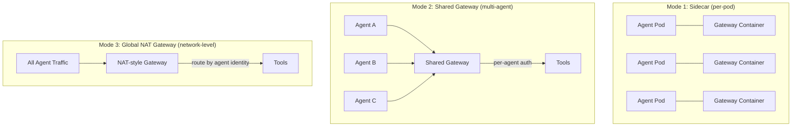
```mermaid
graph TB
    subgraph "Mode 1: Sidecar (per-pod)"
        A1[Agent Pod] --- SC1[Gateway Container]
        A2[Agent Pod] --- SC2[Gateway Container]
        A3[Agent Pod] --- SC3[Gateway Container]
    end

    subgraph "Mode 2: Shared Gateway (multi-agent)"
        AG1[Agent A] --> SG[Shared Gateway]
        AG2[Agent B] --> SG
        AG3[Agent C] --> SG
        SG -->|per-agent auth| TOOLS1[Tools]
    end

    subgraph "Mode 3: Global NAT Gateway (network-level)"
        NET[All Agent Traffic] --> NAT[NAT-style Gateway]
        NAT -->|route by agent identity| TOOLS2[Tools]
    end
```

| Mode | Description | Best for | Manifest |
|------|-------------|----------|---|
| **Sidecar** | One gateway per pod, co-located with the agent in K8s | Strong isolation, per-agent network policy | `deploy/kubernetes/gateway-sidecar.yaml` |
| **Shared gateway** | One gateway serving multiple agents (with per-agent auth) | Cost efficiency, small teams, dev environments | `deploy/kubernetes/gateway-shared.yaml` |
| **Global NAT gateway** | Network-level proxy that all agents route through | Enterprise-wide governance, zero agent config | none — see below |

The first two modes are the same Docker image and the same APIs; the only difference is how many agents connect to each instance and how the network routes to it. Both ship as Kubernetes manifests.

**Mode 3 is a deployment pattern, not a feature.** There is no network-level interception code in the gateway — it serves `POST /tool/{action}` and nothing else, so "all agent traffic routes through it" requires your mesh to rewrite each agent's real tool URL into that route. The mechanics and the caveats (per-tool rewrite rules, injected `X-Agent-Id`, the response envelope) are in [Transparent Proxy Mode](#transparent-proxy-mode-zero-agent-code-changes). Don't plan on "zero agent config" without reading it.

---

## What We're Doing and Why

AI agents are going to production. They call tools — send emails, query databases, deploy code, manage infrastructure. The problem: **how do you enforce safety policies on these tool calls without forcing every agent developer to learn a safety framework?**

Today, if you want Ostiari guardrails, you need to:
1. Write your agent in Python
2. Import Ostiari
3. Call `guard.validate()` before every tool execution
4. Handle blocked actions in your agent code

This creates friction. Agent developers want to build agents, not safety infrastructure. And if they forget to add the guard check — or do it wrong — there's no safety net.

**The Agent Gateway solves this by moving safety enforcement out of the agent entirely.**

The agent never calls tools directly. It calls the gateway. The gateway validates the call against policies, and if allowed, proxies it to the real tool endpoint. The agent developer writes zero safety code — they just point their agent at a URL and send one header.

---

## Key Advantages

| Without the gateway | With the gateway |
|----------------|--------------|
| Agent must be written in Python | Agent can be any language (Java, Go, C, JS, Python) |
| Developer imports Ostiari library | Developer just makes HTTP calls |
| Safety logic mixed into agent code | Safety logic completely external |
| Policy changes require code changes | Policy hot-reloads without any restart |
| Each agent team builds their own guard | One gateway image serves all agents |
| Nothing stands between the agent and the tool | The gateway stands in the path — *if* the network makes it the only route |
| Developer must understand policy format | Developer doesn't even know Ostiari exists |

**Bottom line:** the gateway reduces friction for agent developers to near zero while keeping policy enforcement centralized.

One caveat, stated up front because the rest of this document assumes it: **the gateway cannot make itself unbypassable.** It enforces what flows through it, and nothing about it prevents an agent from opening a socket to the email service directly. Unbypassability is a property of your *network* — egress rules, a `NetworkPolicy`, a sidecar-only namespace — not of this code. See [Deployment Model](#deployment-model).

---

## Architecture Overview

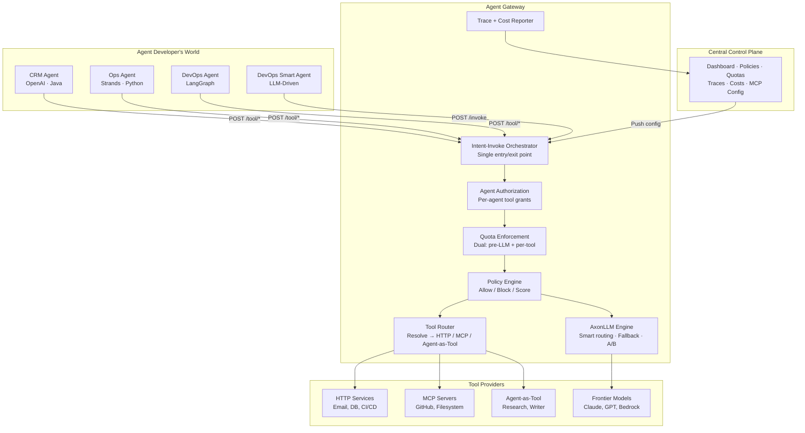
```mermaid
graph TB
    subgraph "Agent Developer's World"
        A1[CRM Agent<br/>OpenAI · Java]
        A2[Ops Agent<br/>Strands · Python]
        A3[DevOps Agent<br/>LangGraph]
        A4[DevOps Smart Agent<br/>LLM-Driven]
    end

    subgraph "Agent Gateway"
        ORCH[Intent-Invoke Orchestrator<br/>Single entry/exit point]
        AUTH[Agent Authorization<br/>Per-agent tool grants]
        QUOTA[Quota Enforcement<br/>Dual: pre-LLM + per-tool]
        POLICY[Policy Engine<br/>Allow / Block / Score]
        AXON[AxonLLM Engine<br/>Smart routing · Fallback · A/B]
        ROUTER[Tool Router<br/>Resolve → HTTP / MCP / Agent-as-Tool]
        TRACE[Trace + Cost Reporter]
    end

    subgraph "Tool Providers"
        HTTP[HTTP Services<br/>Email, DB, CI/CD]
        MCP[MCP Servers<br/>GitHub, Filesystem]
        AAT[Agent-as-Tool<br/>Research, Writer]
        LLM[Frontier Models<br/>Claude, GPT, Bedrock]
    end

    subgraph "Central Control Plane"
        CP[Dashboard · Policies · Quotas<br/>Traces · Costs · MCP Config]
    end

    A1 -->|"POST /tool/*"| ORCH
    A2 -->|"POST /tool/*"| ORCH
    A3 -->|"POST /tool/*"| ORCH
    A4 -->|"POST /invoke"| ORCH
    ORCH --> AUTH --> QUOTA --> POLICY
    POLICY --> AXON
    AXON --> LLM
    POLICY --> ROUTER
    ROUTER --> HTTP
    ROUTER --> MCP
    ROUTER --> AAT
    TRACE --> CP
    CP -->|"Push config"| ORCH
```

**Two paths through the gateway:**

- **PATH 1** (`POST /tool/{action}`): Agent already knows the tool → Orchestrator → Auth → Quota → Policy → Tool Router → Execute
- **PATH 2** (`POST /invoke`): Agent sends intent → Orchestrator → Auth → Quota → AxonLLM (generates tool plan) → Auth → Policy → Tool Router → Execute → AxonLLM (synthesize response) → Deliver

**The agent developer only sees one thing:** an HTTP endpoint they POST to. The Agent Gateway handles authorization, quota, policy, LLM routing, tool resolution, and cost reporting — all without the agent's involvement. The agent does not call tools or LLMs directly.

---

## How It Works — Step by Step

### PATH 1: Direct Tool Call (POST /tool/{action})

The agent already knows which tool to call. No LLM involved inside the gateway.

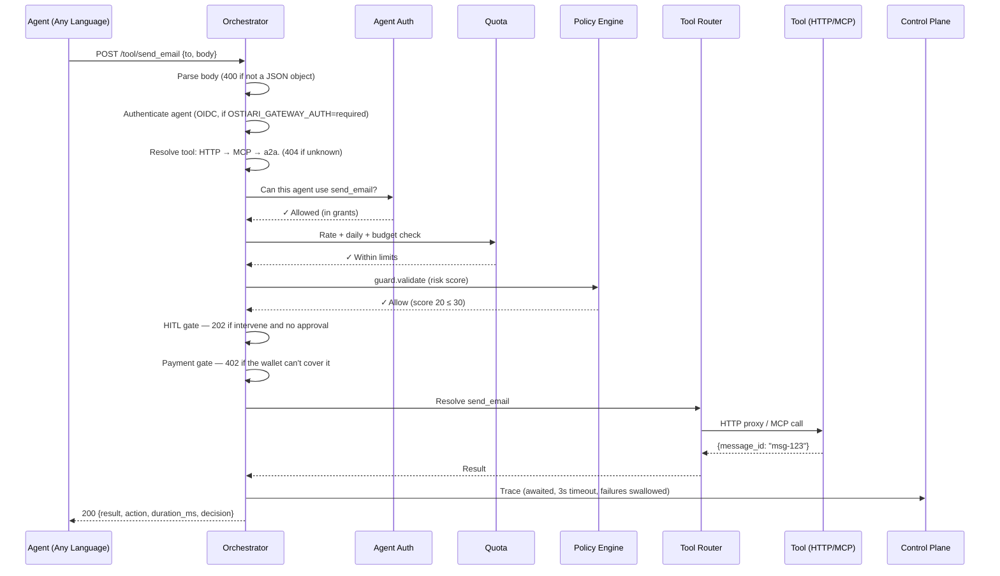
```mermaid
sequenceDiagram
    participant Agent as Agent (Any Language)
    participant Orch as Orchestrator
    participant Auth as Agent Auth
    participant Quota as Quota
    participant Policy as Policy Engine
    participant Router as Tool Router
    participant Tool as Tool (HTTP/MCP)
    participant CP as Control Plane

    Agent->>Orch: POST /tool/send_email {to, body}
    Orch->>Orch: Parse body (400 if not a JSON object)
    Orch->>Orch: Authenticate agent (OIDC, if OSTIARI_GATEWAY_AUTH=required)
    Orch->>Orch: Resolve tool: HTTP → MCP → a2a. (404 if unknown)
    Orch->>Auth: Can this agent use send_email?
    Auth-->>Orch: ✓ Allowed (in grants)
    Orch->>Quota: Rate + daily + budget check
    Quota-->>Orch: ✓ Within limits
    Orch->>Policy: guard.validate (risk score)
    Policy-->>Orch: ✓ Allow (score 20 ≤ 30)
    Orch->>Orch: HITL gate — 202 if intervene and no approval
    Orch->>Orch: Payment gate — 402 if the wallet can't cover it
    Orch->>Router: Resolve send_email
    Router->>Tool: HTTP proxy / MCP call
    Tool-->>Router: {message_id: "msg-123"}
    Router-->>Orch: Result
    Orch->>CP: Trace (awaited, 3s timeout, failures swallowed)
    Orch-->>Agent: 200 {result, action, duration_ms, decision}
```

**The exact PATH 1 order** (`server.py:617`), since the diagram still compresses it:

1. Parse the JSON body — **400** on a decode failure or a body that isn't an object
2. Read `X-Agent-Id` (defaulting to `unknown`), `X-Framework`, `X-Session-Id`, `X-Plan`, `X-Step`
3. `_authenticate_agent` — a no-op unless `OSTIARI_GATEWAY_AUTH=required`, in which case a valid OIDC token whose identity matches `X-Agent-Id` is required
4. Extend the delegation chain from `X-Delegation-Chain`
5. Resolve the tool: HTTP tools, then MCP tools, then `a2a.` agents — **404** with the full `available` list if none match
6. For `a2a.` calls only: the **cross-agent delegation** gate (edge rules + callee trust + chain depth) → **403**
7. `agent_auth.check(agent_id, action)` — deny-by-default tool grants → **403**
8. `quota_enforcer.check()` → **429**, then `record_request()`
9. `guard.validate(action, params, context)` — the risk score and tier → **403** on block
10. **HITL**: if enabled and the raw tier is `intervene`, either honor an approved `X-Approval-Id`, return **403** on a denial, or create a pending approval and return **202**
11. **Payment gate** (metered mode): price and settle before execution → **402**
12. Execute — A2A, MCP, or HTTP proxy — with a passthrough x402 retry if an HTTP tool answers 402
13. Report the trace, then return `{result, action, duration_ms, decision}`

Two things this order encodes. The **quota check precedes validation**, so a rate-limited agent never reaches the Guard. And **payment settles after every safety gate**, so an agent is never charged for a call that would have been refused.

In **shadow mode** (`mode: shadow`) the gates all still evaluate and report with `shadow=true` / `would_block`, but nothing is refused and *no tool actually executes* — a synthetic response comes back instead. That's what makes shadow safe to run against production traffic, and also why a shadow gateway's results tell you nothing about whether the tools themselves work.

### PATH 2: LLM-Driven (POST /invoke)

The agent sends intent. The gateway generates the tool plan, validates each tool, executes, and synthesizes the response.


```mermaid
sequenceDiagram
    participant Agent as DevOps Smart Agent
    participant Orch as Orchestrator
    participant Auth as Agent Auth
    participant Quota as Quota
    participant Axon as AxonLLM Engine
    participant LLM as Claude (Frontier)
    participant Policy as Policy Engine
    participant Router as Tool Router
    participant MCP as GitHub MCP
    participant CP as Control Plane

    Agent->>Orch: POST /invoke "Commit, push, create PR"
    Orch->>Auth: Gate 1: Can agent use /invoke?
    Auth-->>Orch: ✓ Allowed
    Orch->>Quota: Quota #1 (pre-LLM): estimate cost
    Quota-->>Orch: ✓ Within budget

    Note over Orch,LLM: ROUND 1: Generate tool plan
    Orch->>Axon: Generate plan for intent
    Axon->>LLM: Chat completion
    LLM-->>Axon: tool_calls: [commit, push, create_pr]
    Axon-->>Orch: 3-tool plan

    Orch->>Auth: Gate 2: Per-tool grants
    Auth-->>Orch: ✓ All 3 allowed
    Orch->>Policy: Per-tool validation
    Policy-->>Orch: ✓ All pass
    Orch->>Router: Resolve all 3 tools

    loop For each tool
        Router->>MCP: Execute via MCP protocol
        MCP-->>Router: Result
    end
    Router-->>Orch: All 3 results

    Note over Orch,LLM: ROUND 2: Synthesize response
    Orch->>Axon: Tool results → final answer
    Axon->>LLM: Synthesize
    LLM-->>Axon: "Done! Committed, pushed, PR #47 created."
    Axon-->>Orch: Final response

    Orch-->>Agent: 200 {response: "Done! ...", tool_calls: [...]}
    Orch->>CP: 2 LLM rounds + 3 tool costs (buffered, flushed every 20)
```

**The exact PATH 2 order**, since the diagram compresses it. The `/invoke`
handler (`module.py`) runs first:

1. 503 if the module isn't initialized; 400 on malformed JSON or a non-object body
2. `agent_auth.check(agent_id, "/invoke")` — the tool name checked here is the
   literal string `/invoke`, so granting it means listing `/invoke` (or `*`) in
   `allowed_tools`
3. 422-style validation of the body into `InvokeRequest`

Then `LLMExecutor.invoke` runs, in this order:

4. `select_model` (routing policy → A/B → rules → smart → default) + resolve the fallback chain
5. `authorize_llm(agent_id, model, provider)` — budget, then model, then provider
6. Build tool specs
7. Security: injection detection + PII redaction, fail-closed
8. `cap_max_tokens` — a silent cap, never a rejection
9. Pre-request budget projection: `estimate_cost` → `quota.check`
10. Intent cache lookup
11. The tool loop — per tool call: `agent_auth.check(agent_id, tool_name)`, then a
    per-tool quota check, then policy validation, then execute

Note that steps 5–10 return a **200** with `response: "Request blocked: …"` and
`rounds: 0` — only the handler's gates (2 and 3) produce a non-2xx status. A
client that checks `resp.status_code` alone will read a quota or PII block as
success; check the response body.

There is no single in-flight budget reservation across the loop. Spend is booked
per round via the cost reporter, so the concurrency window is one round rather
than the whole call — unlike the shims, which do hold a reservation.

### Key Design Decisions

| Decision | Why |
|----------|-----|
| **Orchestrator is single entry/exit** | All responses route back through it before reaching the agent |
| **Dual quota** | #1 pre-LLM (can agent afford it?) + #2 per-tool (can agent afford each tool?) |
| **Auth runs twice in PATH 2** | Gate 1: can agent use /invoke? Gate 2: can agent use each specific tool the LLM chose? |
| **Tool Router after Policy** | Policy approves → Router resolves where to send (HTTP, MCP, Agent-as-Tool) |
| **Quota check precedes validation** | Never spend CPU scoring a call the agent can't afford — and never let a blocked agent exhaust the Guard |
| **Payment gate runs after the safety gates** | So the agent is never charged for a call that would have been blocked anyway |
| **Cost reporting is buffered** | Cost events accumulate and flush in batches of 20 to `POST /api/costs/record/batch`, so per-call latency doesn't pay for a control-plane round trip |
| **Trace reporting is not buffered** | Sent immediately, one POST per event, for real-time visibility in the trace viewer |

> **"Fire-and-forget" in `TraceReporter`'s docstring overstates it.** Every `trace_reporter.report(...)` call in the request path is **awaited inline**, on a client with a 3-second timeout, so a slow or unreachable control plane adds up to 3s to the agent's response — and refusal paths report *before* returning, so blocked calls pay it too. Failures are swallowed at DEBUG (`Failed to report trace`), which is the "forget" half and is genuine: a down control plane never breaks a request. But it is not off the critical path. Reporting is skipped entirely when no control-plane URL is configured (`TraceReporter.enabled` is false), which is why this never shows up in standalone testing.

---

## The Control Plane (Central)

The control plane is the centralized management UI for all Agent Gateways. Instead of hardcoding tools and policies, the control plane pushes configuration dynamically to N gateway instances.

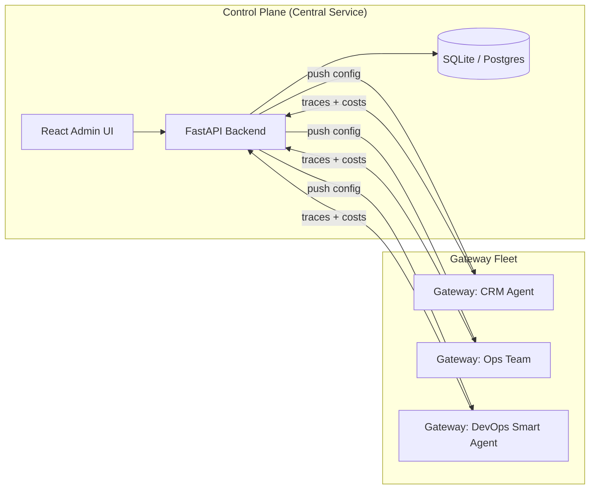
```mermaid
graph LR
    subgraph "Control Plane (Central Service)"
        UI[React Admin UI]
        API[FastAPI Backend]
        DB[(SQLite / Postgres)]
    end

    subgraph "Gateway Fleet"
        G1[Gateway: CRM Agent]
        G2[Gateway: Ops Team]
        G3[Gateway: DevOps Smart Agent]
    end

    UI --> API --> DB
    API -->|push config| G1
    API -->|push config| G2
    API -->|push config| G3
    G1 -->|traces + costs| API
    G2 -->|traces + costs| API
    G3 -->|traces + costs| API
```

### What the control plane manages:

1. **Tool Registration** (`/tools`) — Which tools exist, where they live (URL/MCP), parameters, OpenAPI import
2. **Policy Rules** (`/policies`) — Allow/block patterns, risk score adjustments, thresholds
3. **Gateway Instances** (`/gateways`) — Which gateway serves which agents, health monitoring
4. **Per-Agent Authorization** (`/agents`) — Tool, model, provider, and budget grants per agent
5. **Quota Configuration** (`/quotas`, `/agent-quotas`) — Rate limits, budget caps, max tokens
6. **MCP Server Config** (`/mcp-servers`) — Embedded, remote, stdio server connections
7. **Model Routing** (`/models`, `/experiments`, `/providers`) — Which LLM for which task, A/B experiments, fallback chains, provider credentials
8. **Live Traces** (`/traces`) — Real-time visibility into every tool call and LLM invocation
9. **Cost Tracking** (`/costs`, `/efficiency`, `/roi`) — Per-model, per-agent cost attribution and alerts
10. **Human Approvals** (`/approvals`) — The HITL queue for intervene-tier calls
11. **Shadow Reports** (`/shadow-report`) — What a policy *would* have blocked, before you enforce it
12. **Audit & Compliance** (`/audit`, `/compliance`) — Decision history and control attestation
13. **Protocol Governance** (`/protocol-governance`) — Cross-agent delegation rules and A2A agents
14. **Payments & Metering** (`/payments`, `/metering`, `/token-broker`) — x402 wallets, per-call pricing, credential brokering
15. **Discovery** (`/discovery`) — Agents and tools seen in traffic but not registered
16. **Sandbox** (`/sandbox`) — Send governed calls through a real gateway from the UI
17. **Architecture Demo** (`/architecture`) — Interactive animated walkthrough of the system

`/providers` and `/users` are **admin-only** (wrapped in `RequireAdmin`); everything else is available to any authenticated role. Roles and their permissions are in [control-plane-guide.md](control-plane-guide.md).

### Gateway Config API (pushed by Control Plane)

Always present (`server.py`):

| Endpoint | Method | Purpose |
|----------|--------|---------|
| `/config` | GET/POST | View or apply full configuration. **`POST` is a whole-document replace, and it only applies tools + policy** — see [the partial-push trap](#the-config-partial-push-trap) |
| `/config/tools` | POST | Replace all tool definitions |
| `/config/tools/{name}` | POST/DELETE | Add, update, or remove a single tool |
| `/config/tools/import-openapi` | POST | Generate tools from an OpenAPI spec ([openapi-import.md](openapi-import.md)) |
| `/config/policy` | POST | Replace the policy |
| `/config/quota` | GET/POST | View or apply quota (rate limits, budget, max_tokens) |
| `/config/quota/reset-spend` | POST | Reset spend counter |
| `/config/budget-reset` | GET/POST | Scheduled budget-reset window |
| `/config/agent-auth` | GET/POST | Per-agent tool/model/provider grants and budgets |
| `/config/cross-agent` | GET/POST | A2A delegation policy |
| `/config/a2a-agents` | GET/POST, DELETE `{name}` | A2A peer registry |
| `/config/mcp-servers` | GET/POST, DELETE `{name}`, POST `{name}/refresh` | MCP server connections + re-discovery |
| `/config/llm` | GET/POST | LLM routing, models, credentials |
| `/config/routing-overrides` | GET/POST | Manual routing overrides |
| `/config/task-classification` | GET/POST | Task-classifier settings |
| `/config/payments` | GET/POST | Payment/metering config |
| `/config/mode` | GET/POST | `enforce` vs `shadow` |
| `/tool/{action}` | POST | Governed tool call (PATH 1) |
| `/validate` | POST | Evaluate a call through the gates **without** executing it |
| `/tools` | GET | List all registered tools (HTTP + MCP) |
| `/modules` | GET | Which modules are available and active |
| `/health` | GET | Gateway health + module status + `llm_router` state |

Registered only when `llm_gateway: true` (`modules/llm_gateway/module.py`):

| Endpoint | Method | Purpose |
|----------|--------|---------|
| `/invoke` | POST | Full agentic loop (PATH 2) |
| `/v1/messages` | POST | Claude Code shim ([claude-code-shim.md](claude-code-shim.md)) |
| `/v1/chat/completions` | POST | Codex shim ([codex-shim.md](codex-shim.md)) |
| `/models` | GET | Available models + routing rules |
| `/cache/stats` | GET | Intent cache hit/miss stats |
| `/cache/clear` | POST | Flush cached plans |
| `/config/agent-routing` | GET/POST | Per-agent model-rotation policies |
| `/config/llm` | POST | Same path as above; the module re-registers it so a push resyncs the live router |

Every path starting with `/config` is gated by `OSTIARI_CONFIG_ADMIN_KEY` when
it's set — present it as `X-Config-Admin-Key` or `Authorization: Bearer <key>`,
compared with `hmac.compare_digest`; a mismatch is 401. (The middleware's
docstring says `GET /config/mode` stays readable, but the prefix check gates that
too. `/tools`, `/modules`, and `/health` are outside `/config` and genuinely
remain open.) When the variable is **unset** the whole surface is
unauthenticated, so an open gateway lets any caller rewrite policy or register
tools.

### The `/config` partial-push trap

`POST /config` reads the body into a fresh `SidecarConfig` and hands it to
`ConfigManager.apply_config`. Two consequences follow, and together they are the
most surprising behavior on the config surface:

**1. It is a whole-document replace, not a merge.** Every field absent from the
body takes its `SidecarConfig` default — `tools: []`, an empty `PolicyConfig`,
`mode: "enforce"`. So a body containing only `{"policy": {...}}` clears the tool
registry, and a body that omits `mode` silently flips a shadow gateway back to
enforce:

```
$ curl -s $GW/health | jq .tools_registered          # 1
$ curl -sX POST $GW/config/mode -d '{"mode":"shadow"}'
$ curl -sX POST $GW/config -d '{"policy":{"block":["*delete*"]}}'
  {"status":"applied","tools_registered":0,"policy_applied":true,"sidecar_id":""}
$ curl -s $GW/health | jq .tools_registered          # 0   ← tools gone
$ curl -s $GW/config/mode                            # {"mode":"enforce"}  ← un-shadowed
```

**2. `apply_config` only wires up tools and policy.** It stores the whole config
object, but the quota, agent-auth, cross-agent, and payment gates are configured
*outside* it — at startup from `initial_config`, in `_apply_bundle` for the
lifecycle path, and in the dedicated `/config/<gate>` endpoints. Nothing in
`apply_config` calls `quota_enforcer.configure()` or its siblings, so those keys
are **stored and not applied**:

```
$ curl -sX POST $GW/config -d '{"quota":{"rate_limit_rpm":1},
                                "agent_auth":{"enabled":true,"agents":{"a1":{"allowed_tools":["x"]}}},
                                "payments":{"mode":"metered"}}'
$ curl -s $GW/config/quota       | jq .rate_limit_rpm   # null   ← not enforced
$ curl -s $GW/config/agent-auth  | jq .enabled          # false  ← not enforced
$ curl -s $GW/config/payments    | jq .mode             # "off"  ← not enforced
$ curl -s $GW/config             | jq .quota            # {"rate_limit_rpm":1}  ← but stored
```

`GET /config` echoes the values back, so the gateway *reports* a quota it is not
enforcing. That's the dangerous half: the config surface and the enforcement
surface disagree and only the gate endpoints tell the truth.

**Which control-plane paths are affected.** The distinction is which endpoint the
UI calls:

| Path | Endpoint | Applies |
|---|---|---|
| Gateways page → **Push** / **Push All** | `push_service` → `POST /config` | Tools + policy only. The bundle it builds carries no `quota`/`agent_auth`, so nothing is silently cleared beyond the replace semantics. |
| Policies page → **Push** | `POST /api/gateways/{id}/push-config` → `POST /config` with `{policy}` | Policy applies; **registered tools are cleared** and `mode` resets to enforce. |
| Quotas page → **Push** | same, with `{quota: {...}}` | **Nothing.** Stored, echoed by `GET /config`, never enforced. Tools are cleared as a side effect. |
| Quotas API → `POST /api/quotas/{id}/push` | `POST /config/quota` | Works — this is the gate endpoint. |
| Agent Quotas / Models pages | `POST /config/agent-auth` | Works — gate endpoint. |
| Gateway registration + heartbeat | `_apply_bundle` (not `/config`) | Works — it configures each gate explicitly and touches only the keys present, including `mode` and `ab_experiments`. |

So the Quotas page's **Push** button does not enforce the quota it just pushed,
and nothing in the UI calls `POST /api/quotas/{id}/push` — the endpoint that
*would* work is reachable only from the API. Until this is reconciled, push a
quota with `POST /api/quotas/{id}/push`, or call the gateway's `/config/quota`
directly. Verify with `GET /config/quota`, not `GET /config`, because the latter
echoes back a stored value the enforcer never saw.

> **Rule of thumb: `/config` is for a full bundle from a system that owns the
> whole document. Use the `/config/<gate>` endpoints for anything partial.** The
> lifecycle path gets this right because `_apply_bundle` merges key-by-key; the
> raw endpoint does not.

---

## Configuration Format

A single JSON/YAML payload configures the entire gateway:

```yaml
sidecar_id: crm-agent   # the config key is still sidecar_id — see Naming above

tools:
  - name: send_email
    endpoint: http://email-service:8080/send
    method: POST
    description: "Send an email to a recipient"
    timeout_seconds: 10
    schema:
      type: object
      properties:
        to: {type: string}
        subject: {type: string}
        body: {type: string}
      required: [to, subject, body]

  - name: db_query
    endpoint: http://db-service:8080/query
    method: POST
    description: "Execute a database query"
    timeout_seconds: 30

  - name: slack_send
    endpoint: http://slack-service:8080/message
    method: POST
    description: "Send a Slack message"
    timeout_seconds: 5

policy:
  block:
    - "*delete*"
    - "*.drop"
  allow:
    - "db_query"
  rules:
    - type: risk_adjust
      action: "send_email"
      risk_adjust: 25
      description: "Email sending has moderate risk"
    - type: risk_adjust
      action: "slack_send"
      risk_adjust: 10
      description: "Slack messages are low risk"
  thresholds:
    global:
      allow_max: 30
      intervene_max: 70
```

### Tool Definition Fields

| Field | Required | Description |
|-------|----------|-------------|
| `name` | Yes | How the agent references this tool |
| `endpoint` | Yes | URL the gateway proxies to |
| `method` | No | HTTP method (default: POST) |
| `description` | No | Human-readable description |
| `timeout_seconds` | No | Request timeout (default: 30) |
| `headers` | No | Extra headers to send to the endpoint |
| `schema` | No | JSON Schema for parameter validation |
| `path_params` | No | Param names substituted into the URL (set by the OpenAPI importer) |
| `query_params` | No | Param names sent as query string (set by the OpenAPI importer) |

`timeout_seconds` is a float, and when `path_params` and `query_params` are both
empty — the default for hand-registered tools — every parameter is sent as a JSON
body. See [openapi-import.md](openapi-import.md).

### Policy Fields

| Field | Description |
|-------|-------------|
| `block` | List of action patterns always blocked (`fnmatch` syntax: `*.delete`) |
| `allow` | List of action patterns always allowed |
| `rules` | Typed rules — `type` is required on each (see [Policy Applies to MCP Tools](#policy-applies-to-mcp-tools)) |
| `thresholds.global.allow_max` | Score at or below = allowed (default: 30) |
| `thresholds.global.intervene_max` | Score at or below = needs human review (default: 70) |

Both thresholds are validated `0 ≤ n ≤ 100`, and `allow_max` must be strictly
less than `intervene_max` — an equal pair is a validation error, not a
zero-width intervene band.

---

## Hot-Reload: Changing Config Without Downtime

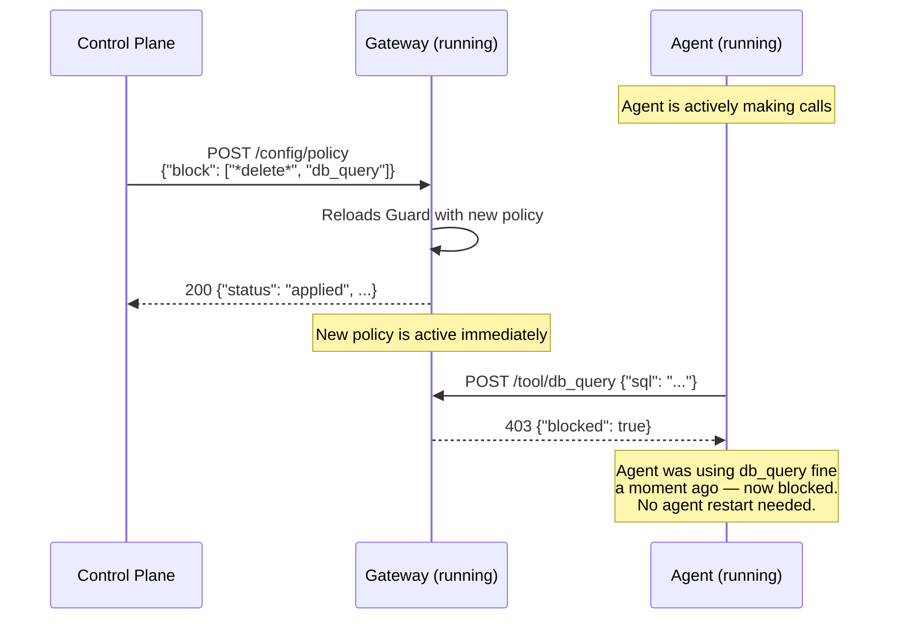
```mermaid
sequenceDiagram
    participant CP as Control Plane
    participant SC as Gateway (running)
    participant Agent as Agent (running)

    Note over Agent: Agent is actively making calls

    CP->>SC: POST /config/policy<br/>{"block": ["*delete*", "db_query"]}
    SC->>SC: Reloads Guard with new policy
    SC-->>CP: 200 {"status": "applied", ...}

    Note over SC: New policy is active immediately

    Agent->>SC: POST /tool/db_query {"sql": "..."}
    SC-->>Agent: 403 {"blocked": true}

    Note over Agent: Agent was using db_query fine<br/>a moment ago — now blocked.<br/>No agent restart needed.
```

This is powerful: the platform team can respond to incidents in real-time by pushing policy changes, without touching agent code or restarting anything.

---

## Deployment Model

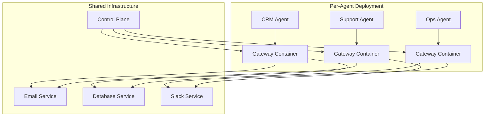
```mermaid
graph TB
    subgraph "Per-Agent Deployment"
        A1[CRM Agent] --> SC1[Gateway Container]
        A2[Ops Agent] --> SC2[Gateway Container]
        A3[Support Agent] --> SC3[Gateway Container]
    end

    subgraph "Shared Infrastructure"
        CP[Control Plane]
        ES[Email Service]
        DBS[Database Service]
        SS[Slack Service]
    end

    SC1 --> ES
    SC1 --> DBS
    SC2 --> DBS
    SC2 --> SS
    SC3 --> ES
    SC3 --> SS
    CP --> SC1
    CP --> SC2
    CP --> SC3
```

Each agent gets its own gateway instance (same Docker image, different config).

> **The network isolation is yours to build, not something the gateway does.** Nothing in this repo restricts an agent's egress; if the agent process can reach the email service directly, it will, and the gateway never sees the call. The sidecar model only closes that hole when you *also* deny the agent's container everything but the gateway — a Kubernetes `NetworkPolicy`, a security-group rule, or a sidecar-only network namespace. `deploy/kubernetes/gateway-sidecar.yaml` runs the gateway as a same-pod sidecar (so `localhost:8421` reaches it) but ships no `NetworkPolicy`. Treat "policy bypass is impossible at the network level" as the goal of your deployment, not a property you inherit.

### Docker Deployment

The image is built from the **repo root** as its context, because the gateway package depends on the local `ostiari` core package, which is not on PyPI:

```bash
docker build -f deploy/docker/Dockerfile.gateway -t ostiari-gateway:latest .
```

The entrypoint is the `ostiari-gateway` console script (`gateway/pyproject.toml:41`), and the image's `CMD` is `--host 0.0.0.0`, so flags you pass to `docker run` **replace** that default — include `--host 0.0.0.0` yourself or the container binds a host it can't be reached on:

```bash
# Same image for all agents — config makes it specific
docker run -p 8421:8421 ostiari-gateway:latest \
  --host 0.0.0.0 \
  --sidecar-id crm-agent \
  --config /config/crm-config.yaml

# Or start empty and configure via control plane
docker run -p 8421:8421 ostiari-gateway:latest \
  --host 0.0.0.0 \
  --sidecar-id ops-agent \
  --control-plane https://control.internal
```

Note the control-plane URL is the **bare origin** — the gateway appends `/api/...` itself (`trace_reporter.py:111`), so passing `https://control.internal/api` produces `/api/api/traces/ingest` and every report 404s silently.

The image prefers env vars over flags, which is what the compose file and the Kubernetes manifests use: `OSTIARI_GATEWAY_ID` (equivalent to `--sidecar-id`, default `sidecar-1`), `OSTIARI_CONTROL_PLANE_URL`, `OSTIARI_PORT`, and `OSTIARI_ADVERTISE_HOST`.

**`OSTIARI_ADVERTISE_HOST` matters more than it looks.** The gateway tells the control plane where to push config back to, and it derives that callback URL from its own bind host — which is `0.0.0.0`, not an address anything can reach. It substitutes `localhost` in that case, which is correct on a single box and wrong everywhere else. On a container network or in Kubernetes, set `OSTIARI_ADVERTISE_HOST` to the reachable service name or the gateway registers a callback URL that resolves to the control plane itself, and policy pushes silently never arrive.

The image runs as uid `10001` with a root-owned `site-packages`, so a compromised gateway can't rewrite its own code. It writes exactly one path at runtime — the rendered policy tempfile under `/tmp` — so if you set `read_only: true` you must also mount a `/tmp` tmpfs, or the container starts healthy and then 500s on the first config push. `deploy/docker/docker-compose.yml` does both.

The full local stack (`cd deploy/docker && docker compose up --build`) brings up the gateway on 8421, the control-plane backend on 8400, the frontend on 9000, and Redis on 6379. It runs in **dev posture** by default: `OSTIARI_ENV` is unset, so controls fail *open*, and `OSTIARI_HITL` is `off`. Both are deliberate — the demo flows — and both are wrong for production. See §7.4 and §9 of [control-plane-guide.md](control-plane-guide.md).

---

## Integrating with Agent Frameworks

A common question: **"How does my OpenAI / Strands / LangGraph / Java agent connect to this?"**

The answer is simple: **every agent framework already has a way to execute tools. You just change the URL to point at the gateway instead of the real service.**

The agent framework doesn't "integrate" with Ostiari. It doesn't know Ostiari exists. It just makes HTTP calls to the gateway URL — the same way it would call any API.

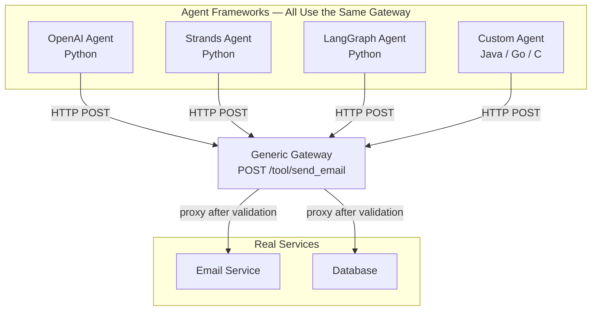
```mermaid
graph TB
    subgraph "Agent Frameworks — All Use the Same Gateway"
        OA[OpenAI Agent<br/>Python]
        SA[Strands Agent<br/>Python]
        LG[LangGraph Agent<br/>Python]
        JA[Custom Agent<br/>Java / Go / C]
    end

    SC[Generic Gateway<br/>POST /tool/send_email]

    OA -->|HTTP POST| SC
    SA -->|HTTP POST| SC
    LG -->|HTTP POST| SC
    JA -->|HTTP POST| SC

    subgraph "Real Services"
        E[Email Service]
        DB[Database]
    end

    SC -->|proxy after validation| E
    SC -->|proxy after validation| DB
```

### OpenAI Function Calling

In OpenAI agents, the LLM returns `tool_calls`. You execute them in a loop. Just point the execution at the gateway:

```python
import requests

GATEWAY = "http://gateway:8421"

# When the LLM says "call send_email":
def execute_tool(tool_name, params, agent_id="crm-agent"):
    resp = requests.post(
        f"{GATEWAY}/tool/{tool_name}",
        json=params,
        headers={"X-Agent-Id": agent_id},   # omit and you are agent "unknown"
    )

    if resp.status_code == 200:
        return resp.json()["result"]       # Tool succeeded
    elif resp.status_code == 403:
        return f"BLOCKED: {resp.json()['reason']}"  # Policy blocked it
    elif resp.status_code == 404:
        return f"Unknown tool: {tool_name}"
```

**`X-Agent-Id` is not optional in practice.** Omit it and every request is attributed to the literal agent id `unknown` (`server.py:636`) — which collapses per-agent authorization, quotas, budgets, and A/B bucketing onto one shared identity. Send it, and send `X-Session-Id` too if you want traces grouped into conversations.

That's the entire integration on the happy path. No `import ostiari`. No policy files. No guard setup. But `403` is not the only refusal the gateway can return, and a client that only branches on 200/403 will misread the rest:

| Status | Meaning | Body |
|---|---|---|
| `200` | Allowed and executed | `{"result", "action", "duration_ms", "decision"}` |
| `202` | **Awaiting human approval** (HITL + intervene tier) — not a failure; re-submit the same call with `X-Approval-Id` once a human approves | `{"pending_approval": true, "approval_id", "score", "decision"}` |
| `400` | Malformed JSON body, or a body that isn't a JSON object | `{"error"}` |
| `402` | Payment gate — the agent wallet couldn't cover the call, or a downstream tool demanded payment and settlement failed | `{"blocked": true, "reason", "limit_type": "payment", "amount_usdc", "wallet_balance_usdc"}` |
| `403` | Blocked — policy, agent authorization, cross-agent delegation, or a human denial | `{"blocked": true, "action", "reason", "limit_type"}` (policy blocks also carry `score` and `rule_id`) |
| `404` | Unknown tool, or an unconnected `a2a.` agent | `{"error", "available": [...]}` — the full list of registered tools |
| `429` | **Quota exhausted** — rate, daily, or budget limit | `{"blocked": true, "reason", "limit_type"}` |
| `4xx`/`5xx` | Passed through **from the downstream tool** — the gateway allowed the call and the real service failed | the proxy result verbatim |

The `202` is the one that bites: it is the human-in-the-loop path, and a client treating any non-200 as a permanent failure turns "waiting for approval" into "the tool doesn't work." The `429` is the second: quota exhaustion is a *governance* outcome the LLM should hear about, not a transport error to retry blindly.

### Strands Agents (AWS)

Strands uses `@tool` decorated functions. Just make the function body call the gateway:

```python
from strands import tool
import httpx

GATEWAY = "http://gateway:8421"
HEADERS = {"X-Agent-Id": "crm-agent"}

@tool
def send_email(to: str, subject: str, body: str) -> str:
    """Send an email to a recipient."""
    resp = httpx.post(f"{GATEWAY}/tool/send_email", headers=HEADERS, json={
        "to": to, "subject": subject, "body": body
    })
    if resp.status_code in (403, 429, 402):
        return f"Action blocked: {resp.json()['reason']}"
    if resp.status_code == 202:
        return "Awaiting human approval — do not retry; a human must approve this."
    return resp.json()["result"]
```

The Strands framework doesn't know safety checks are happening. The `@tool` function looks normal — it just happens to call an HTTP endpoint that validates before executing. Returning the reason as the tool's *result* (rather than raising) is deliberate: the LLM reads it, and can adjust its plan instead of retrying the same blocked call.

### LangChain / LangGraph

LangChain uses tool classes. Wrap the gateway call:

```python
from langchain.tools import BaseTool
import requests

GATEWAY = "http://gateway:8421"

class SendEmailTool(BaseTool):
    name = "send_email"
    description = "Send an email"

    def _run(self, to: str, subject: str, body: str) -> str:
        resp = requests.post(
            f"{GATEWAY}/tool/send_email",
            headers={"X-Agent-Id": "crm-agent"},
            json={"to": to, "subject": subject, "body": body},
        )
        if resp.status_code in (403, 429, 402):
            return f"Blocked: {resp.json()['reason']}"
        return str(resp.json()["result"])
```

### Java Agent

No Python needed at all. Just HTTP:

```java
String GATEWAY = System.getenv("TOOL_PROXY_URL"); // http://gateway:8421

HttpResponse resp = httpClient.post(GATEWAY + "/tool/send_email",
    Map.of("X-Agent-Id", "crm-agent"),
    Map.of(
        "to", "customer@example.com",
        "subject", "Your order shipped",
        "body", "Tracking: XYZ123"
    ));

if (resp.statusCode() == 200) {
    var result = parseJson(resp.body());       // Use the result
} else if (resp.statusCode() == 202) {
    awaitApproval(parseJson(resp.body()).get("approval_id"));  // Human must approve
} else if (resp.statusCode() == 403 || resp.statusCode() == 429) {
    feedbackToLLM("Action blocked: " + resp.body());  // Tell LLM
}
```

### Go Agent

```go
req, _ := http.NewRequest("POST", gatewayURL+"/tool/send_email",
    strings.NewReader(`{"to":"user@co.com","body":"hello"}`))
req.Header.Set("Content-Type", "application/json")
req.Header.Set("X-Agent-Id", "crm-agent")
resp, _ := http.DefaultClient.Do(req)

switch resp.StatusCode {
case 403, 429, 402:
    // Blocked — feed the reason back to the LLM and adjust plan
case 202:
    // Pending human approval — re-submit later with X-Approval-Id
}
```

### The Pattern is Always the Same

No matter what language or framework:

1. **Replace** the direct tool call URL with the gateway URL
2. **Send** `X-Agent-Id` so the call is governed as that agent rather than as `unknown`
3. **Handle** the refusal statuses (`403`/`429`/`402`) by feeding the `reason` back to the LLM, and `202` by waiting for a human rather than retrying
4. **Done** — the gateway handles everything else

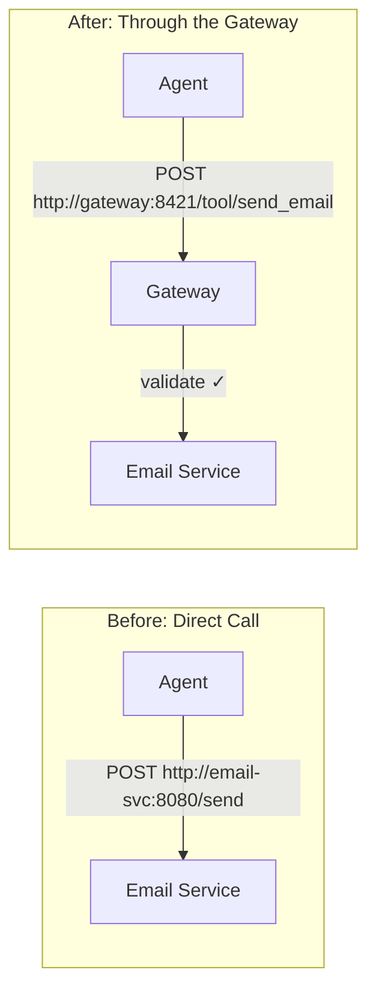
```mermaid
flowchart LR
    subgraph "Before: Direct Call"
        A1[Agent] -->|"POST http://email-svc:8080/send"| T1[Email Service]
    end

    subgraph "After: Through the Gateway"
        A2[Agent] -->|"POST http://gateway:8421/tool/send_email"| SC[Gateway]
        SC -->|validate ✓| T2[Email Service]
    end
```

**Swap the URL, add one header, branch on four statuses.** That's the entire integration — no SDK, no policy files, no in-process guard.

---

## Transparent Proxy Mode (Zero Agent Code Changes)

> **This is a deployment pattern you build in your mesh, not a mode the gateway implements.** There is no transparent-proxy code in the repo (`grep -ri transparent gateway/ostiari_gateway` returns nothing). The gateway exposes exactly one tool route — `POST /tool/{action}` — so DNS alone is not enough: an agent that calls `POST http://email-service/send` and lands on the gateway gets a **404**, because `/send` is not a route. Something in the path has to rewrite the URL.

What *is* achievable with zero agent code changes is DNS/mesh interception **plus a path rewrite** in the mesh:

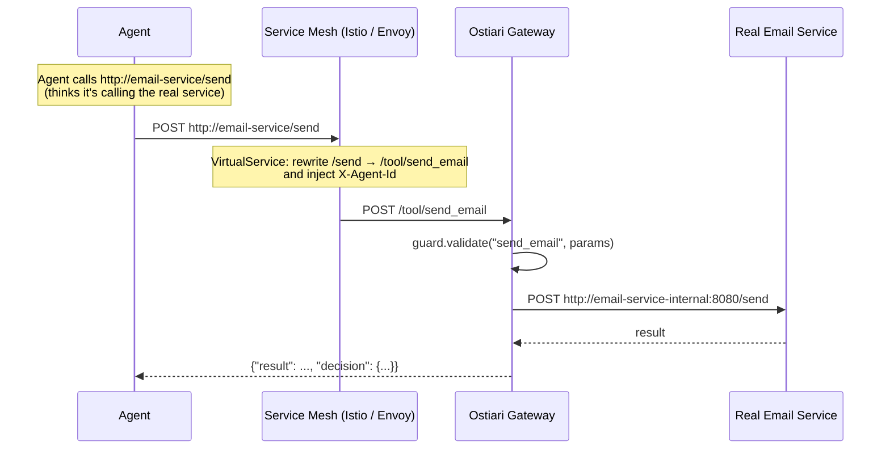
```mermaid
sequenceDiagram
    participant Agent
    participant Mesh as Service Mesh (Istio / Envoy)
    participant Gateway as Ostiari Gateway
    participant RealService as Real Email Service

    Note over Agent: Agent calls http://email-service/send<br/>(thinks it's calling the real service)
    Agent->>Mesh: POST http://email-service/send
    Note over Mesh: VirtualService: rewrite /send → /tool/send_email<br/>and inject X-Agent-Id
    Mesh->>Gateway: POST /tool/send_email
    Gateway->>Gateway: guard.validate("send_email", params)
    Gateway->>RealService: POST http://email-service-internal:8080/send
    RealService-->>Gateway: result
    Gateway-->>Agent: {"result": ..., "decision": {...}}
```

Two things the rewrite has to carry that the agent won't send on its own:

- **The tool name**, as the URL path. One rewrite rule per tool — the mesh becomes the mapping from real endpoints to governed tool names.
- **`X-Agent-Id`**, injected by the mesh. Without it every intercepted call is attributed to `unknown`, and per-agent authorization, quotas, and budgets all collapse onto a single identity.

There is also a **response-shape mismatch** this pattern can't hide: the gateway wraps the tool's response as `{"result": ..., "action": ..., "duration_ms": ..., "decision": {...}}`. An agent that believes it is talking to the email service directly will parse the envelope, not the payload. So "zero agent code changes" holds for the *call*, not necessarily for the *response* — unless the mesh unwraps `result` on the way back, or the agent is tolerant of extra fields.

Weigh that honestly against the one-line URL swap. The swap is a line of code; this is a per-tool mesh config, an injected header, and possibly a response transform — all of it outside the repo and unversioned with the policy it enforces.

---

## When to Use What

| Approach | Best for | Agent code changes? | Implemented in-repo? |
|----------|----------|-------------------|---|
| **Gateway URL swap** | Most teams, new agents | One line + `X-Agent-Id` header | Yes |
| **Transparent proxy (mesh)** | Legacy agents, can't modify code | None in the agent — but per-tool rewrite rules in your mesh | No — a pattern you build |
| **Ostiari Python library** | Python-only, need programmatic access to scores | Import + a few lines | Yes (`src/ostiari/`) |

For most teams, the **URL swap** is the right choice — minimal friction, works with any language, and the agent developer gets a clear, machine-readable refusal (`reason` + `limit_type`) to feed back to the LLM. Reach for the mesh pattern only when you genuinely cannot touch the agent, and read the caveats above first.

---

## What the Agent Developer Sees

From the agent developer's perspective, the gateway is just "a tool API." They don't know about Ostiari, policies, risk scores, or safety frameworks. They see:

| HTTP Status | Meaning | What to do |
|-------------|---------|-----------|
| `200` | Tool executed successfully | Use `result` |
| `202` | Waiting on a human (HITL + intervene tier) | Don't retry blindly — re-submit with `X-Approval-Id` after approval |
| `400` | Body wasn't a JSON object | Fix the call |
| `402` | Payment gate — wallet couldn't cover it | Surface to the LLM; top up the wallet |
| `403` | Blocked — policy, agent authorization, delegation, or human denial | Feed `reason` back to the LLM, try something else |
| `404` | Tool doesn't exist | The body's `available` list has every registered tool; also `GET /tools` |
| `429` | Quota exhausted (rate, daily, or budget) | Governance outcome, not a transport error — tell the LLM, back off |
| `500` | An MCP tool returned an error | Report |
| `502` | Tool endpoint unreachable (`httpx.ConnectError`), or an A2A agent errored | Retry or report |
| `504` | Tool timed out (`httpx.TimeoutException`) | Retry or report |

Every refusal the gateway itself generates carries `{"blocked": true, "action", "reason", "limit_type"}`, so a client can branch on `limit_type` rather than on status alone. Downstream `4xx`/`5xx` from the real tool pass through with the proxy result verbatim — those are the tool's failures, not governance decisions.

That's the entire contract. No SDK. No config files. No safety code.

---

## OpenTelemetry: Distributed Tracing Across the Gateway

### What is OpenTelemetry (for beginners)?

OpenTelemetry (OTel) is a standard for tracking requests as they flow through multiple services. Think of it like a package tracking number — when you send a request, it gets a unique ID (called a **trace**). Every service that handles it adds a **span** (a record of "I worked on this for X milliseconds"). At the end, you can see the full journey:

```
Agent → Gateway (validate: 3ms) → Gateway (proxy: 45ms) → Email Service (send: 42ms)
```

This is called a **distributed trace**. It answers: "Where did the time go?" and "What failed?"

### Scope: this covers `POST /tool/{action}` only

> The gateway's OTel spans are created in exactly one place — the tool proxy handler. `/invoke`, `/v1/messages`, and `/v1/chat/completions` emit **no OTel spans at all**; their observability goes through Ostiari's own trace reporter to the control plane instead (see [Live Traces](#live-traces) and [otlp-export.md](otlp-export.md)). So this section is about tool calls, not LLM calls.

Two separate export paths exist and it's worth keeping them straight:

| | Gateway OTel (this section) | Control-plane OTLP export ([otlp-export.md](otlp-export.md)) |
|---|---|---|
| What it exports | tool-call spans (`ostiari.validate`, `ostiari.tool.proxy`) | *every* Ostiari trace event from *every* gateway, including LLM calls |
| Wire protocol | OTLP/**gRPC** (default port `4317`) | OTLP/**HTTP** (default port `4318`) |
| Where it runs | in each gateway process | once, at the control plane's `/api/traces/ingest` |
| Package needed | `opentelemetry-exporter-otlp` — **not a gateway dependency**, install it yourself | `opentelemetry-exporter-otlp-proto-http`, via the control-plane `otlp` extra |
| Service name | `OTEL_SERVICE_NAME`, default `ostiari-gateway` | `OTEL_SERVICE_NAME`, default `ostiari` |

The gateway declares only `opentelemetry-api` and `opentelemetry-sdk`. If you set `OTEL_EXPORTER_OTLP_ENDPOINT` without installing the exporter, the gateway logs `OTLP exporter not installed (pip install opentelemetry-exporter-otlp)` once at startup and **runs with no export** — spans are created and dropped. That warning is the only symptom, so check for it before concluding your collector is misconfigured.

### How it works in the gateway

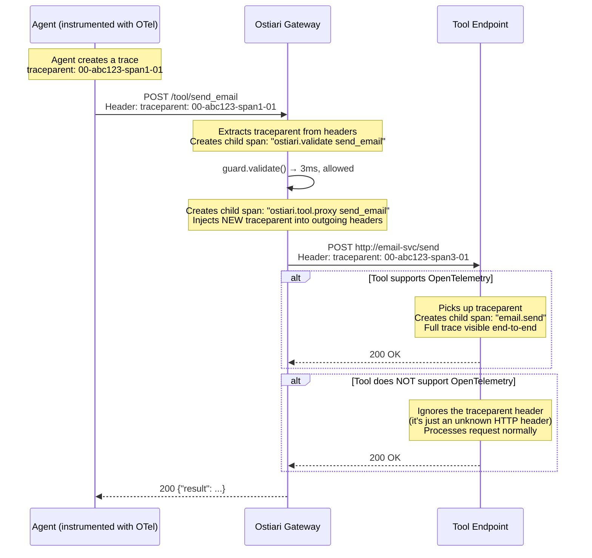
```mermaid
sequenceDiagram
    participant Agent as Agent (instrumented with OTel)
    participant Gateway as Ostiari Gateway
    participant Tool as Tool Endpoint

    Note over Agent: Agent creates a trace<br/>traceparent: 00-abc123-span1-01

    Agent->>Gateway: POST /tool/send_email<br/>Header: traceparent: 00-abc123-span1-01

    Note over Gateway: Extracts traceparent from headers<br/>Creates child span: "ostiari.validate send_email"
    Gateway->>Gateway: guard.validate() → 3ms, allowed

    Note over Gateway: Creates child span: "ostiari.tool.proxy send_email"<br/>Injects NEW traceparent into outgoing headers
    Gateway->>Tool: POST http://email-svc/send<br/>Header: traceparent: 00-abc123-span3-01

    alt Tool supports OpenTelemetry
        Note over Tool: Picks up traceparent<br/>Creates child span: "email.send"<br/>Full trace visible end-to-end
        Tool-->>Gateway: 200 OK
    end

    alt Tool does NOT support OpenTelemetry
        Note over Tool: Ignores the traceparent header<br/>(it's just an unknown HTTP header)<br/>Processes request normally
        Tool-->>Gateway: 200 OK
    end

    Gateway-->>Agent: 200 {"result": ...}
```

**Context propagation is HTTP-tools-only.** `inject_context_into_headers` is called on the HTTP proxy branch and nowhere else (`server.py:1007`), so a **remote MCP** tool call and an **A2A delegation** get their own `ostiari.tool.proxy` span but no `traceparent` on the wire — the downstream service starts a fresh root trace and the two never link. For A2A that's a real gap: delegation *provenance* is propagated (`X-Agent-Id`, `X-Delegation-Chain`) so the audit trail is intact, but the OTel trace is not, so a multi-agent chain shows up as N disconnected traces in your dashboard rather than one tree.

### Span names and attributes

| Span | Kind | Attributes |
|---|---|---|
| `ostiari.validate {action}` | `INTERNAL` | `ostiari.action`, `ostiari.agent_id`, `ostiari.framework`, `ostiari.component=guard`, then `ostiari.tier`, `ostiari.score`, `ostiari.blocked` |
| `ostiari.tool.proxy {action}` | `CLIENT` | `ostiari.action`, `ostiari.tool.endpoint`, `ostiari.tool.method`, `http.method`, `http.url`, then `http.status_code`, `ostiari.tool.duration_ms`, and `ostiari.tool.error` when the call failed |

Resource attributes: `service.name` (from `OTEL_SERVICE_NAME`, default `ostiari-gateway`) and `service.instance.id` (the gateway id, falling back to `OSTIARI_GATEWAY_ID` then `gateway-1`).

**A blocked call is not an error span.** `record_validate_result` sets `StatusCode.OK` even when `blocked=True`, with the description `Blocked: score=N`. That's deliberate — the gateway did its job correctly — but it means **you cannot find blocked calls by filtering for span errors**. Filter on `ostiari.blocked=true` or `ostiari.tier=block` instead. Only a genuine downstream failure (`ostiari.tool.error`) produces `StatusCode.ERROR`.

Note also that when a call is refused *before* validation — agent authorization, quota, cross-agent delegation — no validate span is created at all, because the handler returns first. Those refusals appear in Ostiari's own traces (the control plane) but leave no OTel span. So a drop between "requests the agent made" and "validate spans you see" is expected, and its size is your pre-validation block rate.

### What you see in your tracing dashboard (Jaeger, X-Ray, etc.)

**When the tool supports OTel — full end-to-end trace:**

```
Trace: abc123
├─ [Agent] call send_email ──────────────────────── 52ms
│  ├─ [Gateway] ostiari.validate send_email ─── 3ms
│  │   ostiari.tier=allow, ostiari.score=25, ostiari.blocked=false
│  ├─ [Gateway] ostiari.tool.proxy send_email ─ 48ms
│  │   http.status_code=200, ostiari.tool.duration_ms=48
│  │   └─ [Email Service] email.send ──────────── 42ms
│  │       recipient=user@example.com
```

**When the tool does NOT support OTel — trace ends at the gateway:**

```
Trace: abc123
├─ [Agent] call send_email ──────────────────────── 52ms
│  ├─ [Gateway] ostiari.validate send_email ─── 3ms
│  │   ostiari.tier=allow, ostiari.score=25
│  ├─ [Gateway] ostiari.tool.proxy send_email ─ 48ms
│  │   http.status_code=200
│  │   (no child span — tool didn't pick up the trace)
```

You still see the validation decision, the proxy duration, and the HTTP status code. You just don't see inside the tool. **No information is lost on the gateway side** — only the tool's internal details are missing.

Both spans are siblings under the agent's span, not nested — validation ends before the proxy span starts, so the two durations sum rather than overlap.

### The key insight: passing traceparent is harmless

The `traceparent` header looks like this:

```
traceparent: 00-4bf92f3577b34da6a3ce929d0e0e4736-00f067aa0ba902b7-01
```

If a service doesn't understand it, it simply ignores it — like any unknown HTTP header. The gateway sends it on every **HTTP** tool call (not on MCP or A2A calls, as noted above). If the tool picks it up: great, full trace. If not: no error, no problem.

### Example: Python agent with OpenTelemetry

```python
from opentelemetry import trace
from opentelemetry.propagate import inject
import requests

tracer = trace.get_tracer("my-agent")
GATEWAY = "http://gateway:8421"

def call_tool(action: str, params: dict, agent_id: str = "crm-agent"):
    """Call a tool through the gateway with trace context."""
    with tracer.start_as_current_span(f"call {action}") as span:
        # Inject trace context into headers
        headers = {"Content-Type": "application/json", "X-Agent-Id": agent_id}
        inject(headers)  # Adds traceparent header automatically

        resp = requests.post(
            f"{GATEWAY}/tool/{action}",
            json=params,
            headers=headers,
        )

        span.set_attribute("tool.action", action)
        span.set_attribute("http.status_code", resp.status_code)

        if resp.status_code in (403, 429, 402):
            span.set_attribute("tool.blocked", True)
            body = resp.json()
            span.set_attribute("tool.limit_type", body.get("limit_type", ""))
            return {"blocked": True, "reason": body["reason"]}

        return resp.json()["result"]

# Usage:
result = call_tool("send_email", {"to": "user@co.com", "body": "hello"})
```

### Example: Java agent with OpenTelemetry

```java
import io.opentelemetry.api.trace.Span;
import io.opentelemetry.api.trace.Tracer;
import io.opentelemetry.context.propagation.TextMapSetter;

Tracer tracer = GlobalOpenTelemetry.getTracer("my-agent");
String GATEWAY = "http://gateway:8421";

public String callTool(String action, Map<String, Object> params) {
    Span span = tracer.spanBuilder("call " + action).startSpan();
    try (var scope = span.makeCurrent()) {
        HttpRequest.Builder requestBuilder = HttpRequest.newBuilder()
            .uri(URI.create(GATEWAY + "/tool/" + action))
            .header("Content-Type", "application/json")
            .header("X-Agent-Id", "crm-agent")
            .POST(HttpRequest.BodyPublishers.ofString(toJson(params)));

        // Inject trace context into request headers
        GlobalOpenTelemetry.getPropagators().getTextMapPropagator()
            .inject(Context.current(), requestBuilder,
                (builder, key, value) -> builder.header(key, value));

        HttpResponse<String> resp = httpClient.send(
            requestBuilder.build(), BodyHandlers.ofString());

        span.setAttribute("http.status_code", resp.statusCode());

        if (resp.statusCode() == 403 || resp.statusCode() == 429) {
            span.setAttribute("tool.blocked", true);
            return "BLOCKED: " + resp.body();
        }
        return parseResult(resp.body());
    } finally {
        span.end();
    }
}
```

### Example: Go agent with OpenTelemetry

```go
import (
    "go.opentelemetry.io/otel"
    "go.opentelemetry.io/otel/propagation"
)

tracer := otel.Tracer("my-agent")
gateway := "http://gateway:8421"

func callTool(ctx context.Context, action string, params map[string]any) (string, error) {
    ctx, span := tracer.Start(ctx, "call "+action)
    defer span.End()

    body, _ := json.Marshal(params)
    req, _ := http.NewRequestWithContext(ctx, "POST",
        gateway+"/tool/"+action, bytes.NewReader(body))
    req.Header.Set("Content-Type", "application/json")
    req.Header.Set("X-Agent-Id", "crm-agent")

    // Inject trace context into request headers
    otel.GetTextMapPropagator().Inject(ctx, propagation.HeaderCarrier(req.Header))

    resp, err := http.DefaultClient.Do(req)
    if err != nil {
        return "", err
    }

    span.SetAttributes(attribute.Int("http.status_code", resp.StatusCode))

    if resp.StatusCode == 403 || resp.StatusCode == 429 {
        span.SetAttributes(attribute.Bool("tool.blocked", true))
        return "BLOCKED", nil
    }

    // parse and return result...
}
```

### What if my agent doesn't use OpenTelemetry at all?

That's fine too. If the agent doesn't send a `traceparent` header, the gateway creates a **new root trace** for each tool call. You still get:

- Validation spans (action, score, tier)
- Proxy spans (endpoint, duration, status code)

You just won't be able to correlate them back to a specific agent request. The tracing is useful on the gateway side regardless of whether the caller participates.

### Setting up the gateway to export traces

The gateway uses the standard OpenTelemetry SDK. Configure the exporter via environment variables — but **install the exporter package first**, because the gateway doesn't depend on it:

```bash
pip install opentelemetry-exporter-otlp     # gRPC exporter — not a gateway dependency
```

Then:

```bash
# Export to Jaeger (OTLP/gRPC — port 4317, not 4318)
docker run -p 8421:8421 \
  -e OTEL_EXPORTER_OTLP_ENDPOINT=http://jaeger:4317 \
  -e OTEL_SERVICE_NAME=ostiari-gateway \
  ostiari-gateway:latest --host 0.0.0.0

# Export to AWS X-Ray via a collector
docker run -p 8421:8421 \
  -e OTEL_EXPORTER_OTLP_ENDPOINT=http://otel-collector:4317 \
  -e OTEL_SERVICE_NAME=ostiari-gateway \
  -e OTEL_PROPAGATORS=xray \
  ostiari-gateway:latest --host 0.0.0.0

# Export to console (for debugging) — no exporter package needed
docker run -p 8421:8421 \
  -e OTEL_TRACES_EXPORTER=console \
  ostiari-gateway:latest --host 0.0.0.0
```

Three things worth knowing about this configuration:

- **The base image can't export over OTLP.** `Dockerfile.gateway` installs only the gateway's declared dependencies, so `opentelemetry-exporter-otlp` is absent and the `ImportError` path fires. To export from a container, add the package to your own image layer. `OTEL_TRACES_EXPORTER=console` works out of the box because `ConsoleSpanExporter` ships with the SDK.
- **The endpoint is gRPC.** The gateway imports `otlp.proto.grpc.trace_exporter`, so point it at `:4317`. Sending it to `:4318` (the HTTP port, which the *control plane's* exporter uses) fails. Two exporters, two protocols, two ports.
- **`OTEL_PROPAGATORS=xray` needs its own package too** (`opentelemetry-propagator-aws-xray`); it's read by the SDK, not by Ostiari.
- **Setting only `OTEL_TRACES_EXPORTER=otlp` with no endpoint does nothing.** The gateway requires both — the exporter type *and* a non-empty `OTEL_EXPORTER_OTLP_ENDPOINT` — before it installs a span processor.

### Summary: OTel integration at a glance

| Scenario | What happens | What you see in traces |
|----------|-------------|----------------------|
| Agent sends `traceparent`, HTTP tool supports OTel | Full end-to-end trace | Agent → Gateway → Tool (all connected) |
| Agent sends `traceparent`, HTTP tool ignores OTel | Trace ends at the gateway | Agent → Gateway (tool duration visible, not internals) |
| Agent sends `traceparent`, tool is **MCP or A2A** | Gateway span created, but no `traceparent` propagated | Agent → Gateway; the downstream service starts a separate root trace |
| Agent doesn't send `traceparent` | Gateway creates a new root trace | Gateway → Tool (no link back to the agent) |
| Call is an LLM call (`/invoke`, shims) | No OTel spans emitted | Nothing here — see the control plane's traces and [otlp-export.md](otlp-export.md) |
| `OTEL_EXPORTER_OTLP_ENDPOINT` set, exporter package missing | One startup warning, spans created and dropped | Nothing exported |
| OTel not configured | Everything still works | No traces exported (near-zero overhead — spans are still constructed, just never shipped) |

The gateway degrades quietly in every case: nothing breaks if the agent, the tool, or the collector doesn't participate. The cost of that quietness is the row above — a missing exporter package looks identical to a working setup unless you read the startup log.

---

## MCP Server Integration (overview)

The Agent Gateway is a first-class MCP client. It connects to MCP servers and exposes their tools alongside HTTP tools — the agent doesn't know the difference.

This is the short version; [§MCP Server Integration](#mcp-server-integration) further down covers configuration, filtering, policy, and mode switching in full.

### Three Connection Modes

`MCPServerConfig.mode` accepts exactly three values — anything else raises `ValueError: Unknown MCP mode: …` at `add_server` time:

| Mode | How it works | Latency | Use case |
|------|-------------|---------|----------|
| **`embedded`** (default) | MCP server runs in-process inside the gateway | ~1ms | Local filesystem, internal tools |
| **`remote`** | Connects to an external MCP server over HTTP | ~50–500ms | GitHub, Jira, shared services |
| **`stdio`** | Spawns the MCP server as a subprocess, speaks JSON-RPC over stdin/stdout | ~10ms | Legacy tools, custom adapters |

### How agents call MCP tools

From the agent's perspective, MCP tools are identical to HTTP tools:

```python
# Agent doesn't know this is an MCP tool
resp = requests.post(f"{GATEWAY}/tool/github.create_issue",
    headers={"X-Agent-Id": "crm-agent"},
    json={
        "repo": "my-org/my-repo",
        "title": "Fix the bug",
        "body": "Details here",
    })
```

The gateway resolves `github.create_issue` → the GitHub MCP server and speaks MCP internally. The agent just sees an HTTP response. The `github.` prefix comes from the server's `prefix` (falling back to its `name`), so the qualified name is `{prefix}.{tool}`.

One asymmetry with HTTP tools: an MCP tool that errors returns **500** with the raw MCP error, and its `traceparent` is not propagated downstream (see [Scope](#scope-this-covers-post-toolaction-only)).

### Tool name sanitization

MCP tools use dot notation (`github.create_issue`), and some LLM APIs won't accept dots in function names, so the gateway rewrites `github.create_issue` → `github_create_issue` before sending tool specs to the model and restores the dotted name before executing.

**This is not applied on every provider path.** Three of the eight paths sanitize; the rest either pass dots straight through or drop tool specs entirely. The per-path table is in [§Tool calls route through AxonLLM](#tool-calls-route-through-axonllm) — read it before assuming a dotted MCP tool works with your provider.

### Auto-discovery

When an MCP server connects, the gateway calls `tools/list` and registers everything it finds, honoring the server's `allowed_tools` allowlist and `blocked_tools` denylist. New tools appear immediately — no manual registration. `POST /config/mcp-servers/{name}/refresh` re-discovers if the server gains tools at runtime.

Discovery failures are **non-fatal and quiet**: if `tools/list` raises, the gateway logs `Failed to discover tools from '<name>'` at WARNING and registers zero tools, leaving the server "connected" with an empty tool set. Calls to its tools then 404 with an `available` list that doesn't include them — so an empty tool list after adding a server means read the log, not the config.

---

## Modular Architecture: Pluggable Capabilities

### The Problem with a Monolithic Gateway

As we add more capabilities (LLM routing, audit logging, PII redaction), the gateway could become bloated. Not every customer needs every feature. And some features have real business value worth charging for.

The solution: **a pluggable module system**. The gateway has a free open-source core, and paid modules that snap in based on control plane configuration.

### How Modules Work

Think of the gateway like a smartphone. It has a base OS (the core) and apps you can install (modules). Each module adds new endpoints and capabilities without changing the core:

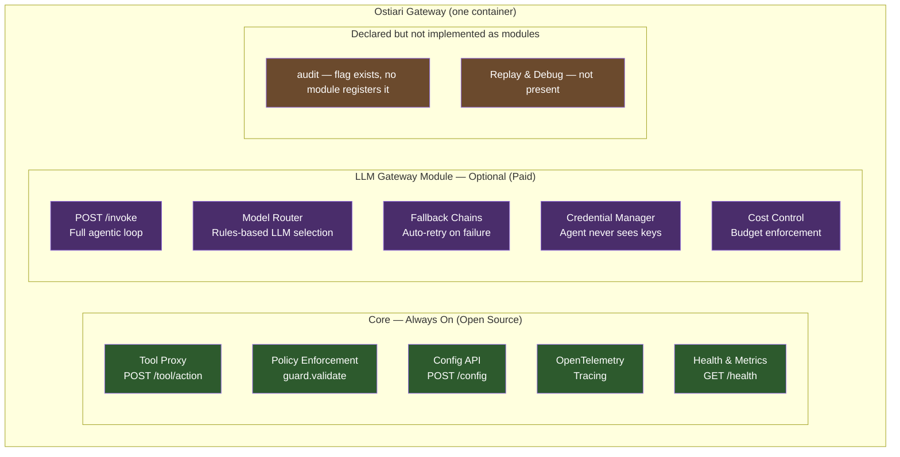
```mermaid
graph TB
    subgraph "Ostiari Gateway (one container)"
        subgraph "Core — Always On (Open Source)"
            TP[Tool Proxy<br/>POST /tool/action]
            PE[Policy Enforcement<br/>guard.validate]
            CP_API[Config API<br/>POST /config]
            OT[OpenTelemetry<br/>Tracing]
            HE[Health & Metrics<br/>GET /health]
        end

        subgraph "LLM Gateway Module — Optional (Paid)"
            INV[POST /invoke<br/>Full agentic loop]
            MR[Model Router<br/>Rules-based LLM selection]
            FC[Fallback Chains<br/>Auto-retry on failure]
            CM[Credential Manager<br/>Agent never sees keys]
            CC[Cost Control<br/>Budget enforcement]
        end

        subgraph "Declared but not implemented as modules"
            AU["audit — flag exists, no module registers it"]
            RP["Replay & Debug — not present"]
        end
    end

    style TP fill:#2d5a2d,color:white
    style PE fill:#2d5a2d,color:white
    style CP_API fill:#2d5a2d,color:white
    style OT fill:#2d5a2d,color:white
    style HE fill:#2d5a2d,color:white
    style INV fill:#4a2d6b,color:white
    style MR fill:#4a2d6b,color:white
    style FC fill:#4a2d6b,color:white
    style CM fill:#4a2d6b,color:white
    style CC fill:#4a2d6b,color:white
    style AU fill:#6b4a2d,color:white
    style RP fill:#6b4a2d,color:white
```

**PII redaction and A/B testing are not modules** — PII redaction is the
`pii_redaction` key under `llm:` and works on any gateway
([detection-engine.md](detection-engine.md)); A/B experiments are
`llm.ab_experiments`, part of the LLM Gateway module rather than separate. There
is exactly **one** module in `ModuleRegistry.discover`: `llm_gateway`.

### Module Activation

Modules are enabled via the control plane config. The same Docker image serves all tiers — the config determines what's active:

```yaml
# Control plane pushes this to the gateway
sidecar_id: crm-agent

modules:
  core: true            # always on, can't disable
  llm_gateway: true     # enables /invoke endpoint
  audit: false          # not activated for this customer

# LLM config (only used if llm_gateway module is active)
llm:
  default_model: claude-sonnet-4-6
  routing_rules:
    - condition: "task_type == 'code_generation'"
      model: claude-sonnet-4-6
    - condition: "task_type == 'simple_qa'"
      model: claude-haiku-4-5
  fallback_chain:
    - claude-sonnet-4-6
    - gpt-4o
    - bedrock/anthropic.claude-3-sonnet
  credentials:
    anthropic: "${ANTHROPIC_API_KEY}"
    openai: "${OPENAI_API_KEY}"

tools: [...]
policy: [...]
```

If `llm_gateway: false`, the `/invoke` endpoint simply doesn't exist. The gateway works as a tool proxy only. Enabling it is a config change — no redeployment, no code.

---

## AxonLLM Engine: Embedded LLM Gateway

### Why put the LLM inside the gateway?

Without AxonLLM, the agent developer manages:
- Which LLM to call (model selection)
- API keys (credential management)
- Retry logic (what if the LLM is down?)
- Cost tracking (how much am I spending?)
- The tool loop (call LLM → get tool plan → execute → feed results back → repeat)
- Tool call plan generation

With AxonLLM embedded in the gateway, all of this is offloaded. The agent sends intent, the gateway does the rest:

### AxonLLM Capabilities

| Feature | Description |
|---------|-------------|
| **Smart Routing** | Task classification → optimal model selection |
| **Fallback Chains** | Primary fails → try next model automatically |
| **A/B Testing** | Route % of traffic to experimental models |
| **Cost Tracking** | Per-model pricing, budget projection, alerts at 80/90/100% |
| **Multi-Provider** | 13 adapters — see [Providers](#providers) |
| **Tool Name Sanitization** | Dots → underscores, but only on the Anthropic and OpenAI paths ([details](#tool-name-sanitization)) |

PII redaction and prompt-injection detection used to be in this table and are
deliberately out of it: they now live in `ostiari.detect`, a hard dependency, so
they work with or without AxonLLM. See
[detection-engine.md](detection-engine.md).

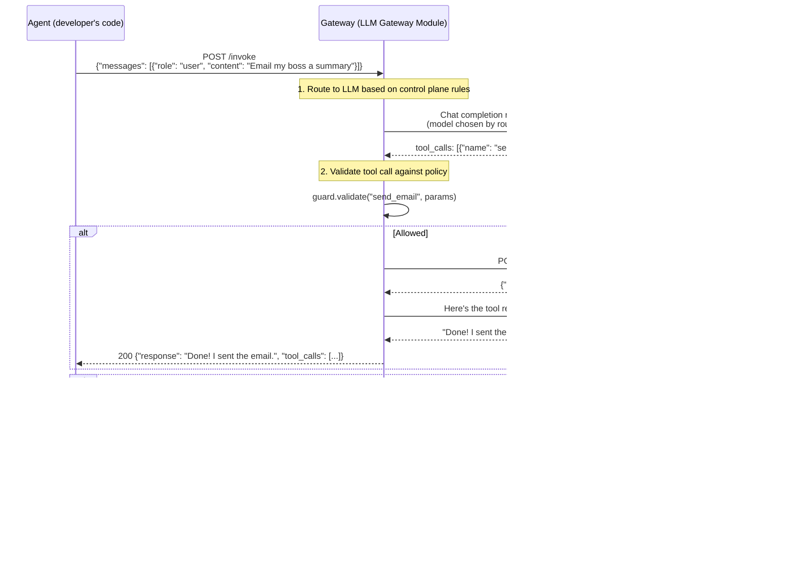
```mermaid
sequenceDiagram
    participant Agent as Agent (developer's code)
    participant SC as Gateway (LLM Gateway Module)
    participant LLM as LLM (routed by control plane)
    participant Tool as Tool Endpoint

    Agent->>SC: POST /invoke<br/>{"messages": [{"role": "user", "content": "Email my boss a summary"}]}

    Note over SC: 1. Route to LLM based on control plane rules

    SC->>LLM: Chat completion request<br/>(model chosen by routing rules)
    LLM-->>SC: tool_calls: [{"name": "send_email", ...}]

    Note over SC: 2. Validate tool call against policy

    SC->>SC: guard.validate("send_email", params)

    alt Allowed
        SC->>Tool: POST http://email-svc/send
        Tool-->>SC: {"message_id": "msg-123"}
        SC->>LLM: Here's the tool result...
        LLM-->>SC: "Done! I sent the email."
        SC-->>Agent: 200 {"response": "Done! I sent the email.", "tool_calls": [...]}
    end

    alt Blocked
        Note over SC: Policy blocked "send_email"<br/>Gateway tells LLM to try another approach
        SC->>LLM: That tool was blocked. Try a different approach.
        LLM-->>SC: "I can't send the email due to policy restrictions."
        SC-->>Agent: 200 {"response": "I can't send email due to policy...", "blocked_actions": [...]}
    end
```

### What the agent developer's code looks like

**Before (without LLM Gateway) — developer manages everything:**

```python
from openai import OpenAI

client = OpenAI()  # developer manages keys
GATEWAY = "http://gateway:8421"

messages = [{"role": "user", "content": "Email my boss a summary"}]

# Developer writes the entire tool loop:
for _ in range(10):
    response = client.chat.completions.create(
        model="gpt-4o",           # developer picks model
        messages=messages,
        tools=TOOLS_SPEC,
    )
    msg = response.choices[0].message
    if msg.tool_calls:
        for tc in msg.tool_calls:
            result = requests.post(f"{GATEWAY}/tool/{tc.function.name}",
                                   headers={"X-Agent-Id": "crm-agent"},
                                   json=json.loads(tc.function.arguments))
            messages.append({"role": "tool", "content": result.text, ...})
    else:
        print(msg.content)
        break
```

**After (with LLM Gateway) — developer sends one request:**

```python
GATEWAY = "http://gateway:8421"

response = requests.post(
    f"{GATEWAY}/invoke",
    headers={"X-Agent-Id": "crm-agent"},
    json={"messages": [{"role": "user", "content": "Email my boss a summary"}]},
)

body = response.json()
if body["response"].startswith("Request blocked:"):
    ...        # a gate refused it — see below
print(body["response"])
# "Done! I sent the summary email to your boss."
```

That's it. No LLM imports. No API keys. No model selection. No tool loop. No retry logic.

**But check the body, not the status.** Most of `/invoke`'s gates — model/provider/budget authorization, PII, injection, the pre-request budget projection — return **200** with `response: "Request blocked: …"` and `rounds: 0`. Only the handler's own gates produce a non-2xx. A client that branches on `resp.status_code` alone reads a governance block as a successful answer. The full gate order and which step returns what is in [The exact PATH 2 order](#path-2-llm-driven-post-invoke).

### LLM Routing Rules

The control plane decides which model to use based on rules. The agent developer doesn't know or care:

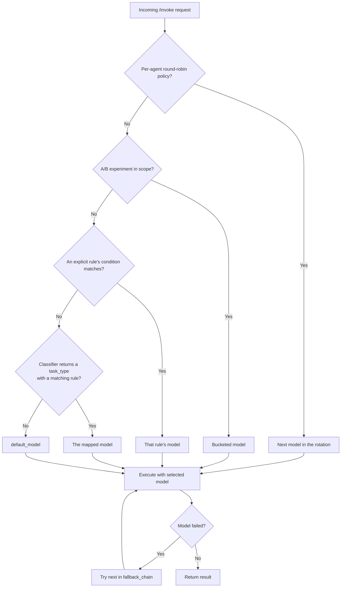
```mermaid
flowchart TD
    REQ[Incoming /invoke request] --> R0{Per-agent round-robin policy?}
    R0 -->|Yes| RR[Next model in the rotation]
    R0 -->|No| RA{A/B experiment in scope?}
    RA -->|Yes| AB[Bucketed model]
    RA -->|No| R1{An explicit rule's condition matches?}
    R1 -->|Yes| M1[That rule's model]
    R1 -->|No| R2{Classifier returns a task_type<br/>with a matching rule?}
    R2 -->|Yes| M2[The mapped model]
    R2 -->|No| M3[default_model]

    RR --> EX[Execute with selected model]
    AB --> EX
    M1 --> EX
    M2 --> EX
    M3 --> EX
    EX --> F{Model failed?}
    F -->|Yes| FB[Try next in fallback_chain]
    F -->|No| RES[Return result]
    FB --> EX
```

**What a condition can actually test.** `_evaluate_condition` is a hand-rolled three-branch parser, not an expression language. It checks for `==`, then `>`, then `<`, in that order, and falls back to treating the whole string as a boolean context key:

| Form | Behavior |
|---|---|
| `key == 'value'` | String compare against `context[key]` (quotes stripped, whitespace trimmed) |
| `key > 100` | Numeric compare; **any parse failure is `False`**, never an error |
| `key < 100` | Same |
| `some_flag` | Truthiness of `context["some_flag"]` |

`>=` and `<=` do not work — `key >= 100` splits on `>`, leaves `= 100`, fails to parse as a float, and silently evaluates `False`. There is no `!=`, no `and`/`or`, no parentheses.

**And the context is small.** `/invoke` populates exactly `agent_id`, `framework`, `session_id`, `plan`, `step`, and `messages`, plus whatever the caller passed in its own `context` object. Anything else you reference — `estimated_tokens`, `cost_budget_remaining`, `region` — resolves to the empty string or `0` and the rule quietly never fires. If you want to route on such a value, the *caller* has to put it in `context`.

**The task-type mapping is an exact string match.** Smart routing doesn't evaluate a condition; `_task_type_to_model` looks for a rule whose condition string equals, character for character, `task_type == '<type>'` — single quotes, one space either side of `==`. Write `task_type=="coding"` and it will never match, even though it looks equivalent. The valid task types are the classifier's six: `coding`, `reasoning`, `creative_writing`, `summarization`, `math`, `general`. A rule for `code_generation` or any other invented type matches nothing.

(A rule of that shape is also *tried* one step earlier, as an explicit rule — but `task_type` isn't in the context, so it compares against `""` and fails there. The literal match at step 4 is what makes it work.)

**Why this matters:**
- New model released? Update routing rules in the control plane. Zero agent deployments.
- Cost spike? Downgrade to a cheaper model instantly. No code changes.
- Regional compliance? Route to Bedrock — though "in specific regions" means the *credential* you point at, since routing conditions can't see a region.
- Model A/B testing? Route 10% of traffic to a new model. Measure quality. No developer involvement.

Note that this whole ladder is `ModelRouter.select_model`, which runs on `/invoke` and `/v1/messages` only. The Codex shim (`/v1/chat/completions`) hands the client's model straight to AxonLLM, so round-robin, A/B, explicit rules, and `default_model` all do nothing there. See [embedded-routing.md](embedded-routing.md).

### Credential Management

The agent **never** sees LLM API keys:

```
┌──────────────────┐     ┌──────────────────────────┐     ┌─────────────┐
│  Agent           │     │  Gateway                  │     │  LLM API    │
│                  │     │                           │     │             │
│  No API keys     │────►│  Has keys (pushed from    │────►│  Accepts    │
│  No model config │     │  the control plane)       │     │  request    │
│  Just sends text │     │                           │     │             │
└──────────────────┘     └──────────────────────────┘     └─────────────┘
```

Credentials live in `LLMCredentials` under `llm.credentials`, pushed as part of the gateway config. The fields are per-provider, not a generic map:

| Field | Default | Used by |
|---|---|---|
| `anthropic` | `""` | Anthropic direct + the `/v1/messages` shim |
| `openai` | `""` | OpenAI direct |
| `azure_endpoint`, `azure_api_key`, `azure_api_version` | `""`, `""`, `2024-02-01` | Azure OpenAI |
| `bedrock_region` | `us-east-1` | Bedrock (credentials themselves come from the ambient AWS chain — instance role, env, or profile — not from this config) |
| `cohere_api_key` | `""` | Cohere |
| `vertex_project`, `vertex_location` | `""`, `us-central1` | Vertex AI (auth via ADC) |

Two behaviors worth knowing:

- **Bedrock and Vertex are not key-based here.** Only a region/project is configured; the SDK resolves credentials from the environment. So "rotate the key in the control plane" doesn't apply to them — you rotate the IAM role or the service account.
- **The Anthropic key has an env-var fallback, and only on the shim.** `messages_proxy.py:94` falls back to `ANTHROPIC_API_KEY` when the pushed credential is empty. No other provider does this, and `/invoke` doesn't either. That's why a gateway can serve Claude Code with no credentials configured but fail on `/invoke` with the same setup.

Benefits:
- Keys never leak into agent code or logs
- Rotate keys in the control plane without touching agents
- Different agents can share the same key (or be pointed at isolated gateways)
- The control plane encrypts provider keys at rest with Fernet and only ever returns a masked preview (`api_key_preview`), never the plaintext

> **Set `OSTIARI_ENCRYPTION_KEY` in production.** Without it, the control plane logs `OSTIARI_ENCRYPTION_KEY not set — using a transient key (not production safe)` and generates a per-process key. Everything works until you restart, at which point every stored provider key becomes permanently undecryptable and has to be re-entered.

One limit to be clear about: credentials are scoped **per gateway**, not per agent. Every agent on a shared gateway uses the same provider keys. Per-agent isolation of *which* models and providers an agent may reach is enforced by `agent_auth` (`allowed_models` / `allowed_providers`), not by giving agents separate credentials — and "audit who used which key" in practice means auditing per-agent model and provider usage in the traces.

---

## Monetization Model

> **This section is product intent, not implemented behavior.** There is no
> licensing code in the gateway: `grep -r license gateway/ostiari_gateway`
> returns nothing, `SidecarConfig` has no `license_key` field, and no feature
> checks a tier. Everything below describes how the packaging is *meant* to
> divide, and the module system is the mechanism that would enforce it — but
> today every capability is available to every gateway.
>
> `ModulesConfig` (`gateway/ostiari_gateway/models.py:34`) has exactly three
> flags — `core` (default `true`), `llm_gateway` (default `false`), and `audit`
> (default `false`) — and only `llm_gateway` is wired: `ModuleRegistry.discover`
> registers that one module, and `server.py:606` activates it. Setting
> `audit: true` is inert. PII redaction is **not** a module at all; it's the
> `pii_redaction` key under `llm:`, and it works on any gateway (see
> [detection-engine.md](detection-engine.md)).

### Pricing Tiers

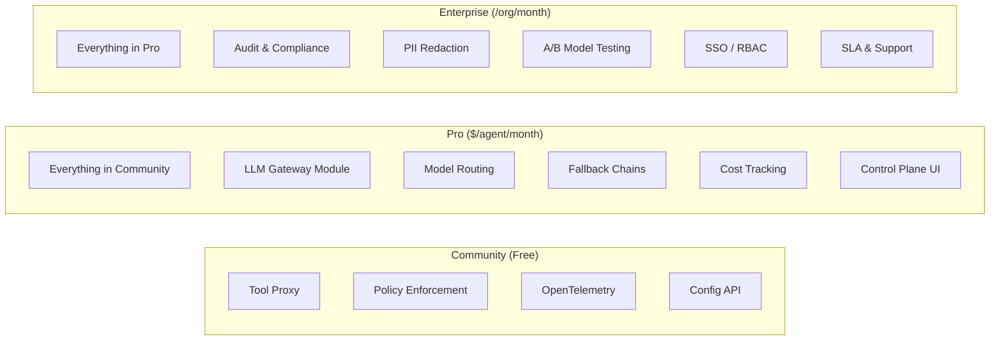
```mermaid
graph LR
    subgraph "Community (Free)"
        F1[Tool Proxy]
        F2[Policy Enforcement]
        F3[OpenTelemetry]
        F4[Config API]
    end

    subgraph "Pro ($/agent/month)"
        P1[Everything in Community]
        P2[LLM Gateway Module]
        P3[Model Routing]
        P4[Fallback Chains]
        P5[Cost Tracking]
        P6[Control Plane UI]
    end

    subgraph "Enterprise ($$$$/org/month)"
        E1[Everything in Pro]
        E2[Audit & Compliance]
        E3[PII Redaction]
        E4[A/B Model Testing]
        E5[SSO / RBAC]
        E6[SLA & Support]
    end
```

| Tier | What's included | Target customer | Price model |
|------|----------------|-----------------|-------------|
| **Community** | Core gateway: tool proxy, policy enforcement, tracing, config API | Individual developers, startups, open-source projects | Free forever |
| **Pro** | + LLM Gateway, model routing, fallback chains, cost tracking, control plane UI | Teams shipping agents to production | Per agent/month |
| **Enterprise** | + Audit, PII redaction, A/B testing, SSO/RBAC, SLA | Regulated industries, large orgs | Per org/month (custom) |

Everything in the Enterprise column except SLA/support **exists today and is not gated**: audit logging with hash-chain verification (`routers/audit.py`), compliance attestation (`routers/compliance.py`), PII redaction (the `pii_redaction` key under `llm:`), A/B experiments (`llm.ab_experiments`), and SSO/RBAC (`auth/sso.py` for Okta, Cognito, Azure AD, and generic OIDC; `auth/rbac.py` for roles). "Replay & Debug" has been dropped from the diagram — there is no replay code anywhere in the repo.

### Why This Works

**Community tier builds adoption:**
- Open-source core gets GitHub stars, community contributions, trust
- Developers try it for free → become advocates inside their org
- "We already use Ostiari for tool safety" → easy upsell to Pro

**Pro tier delivers immediate value:**
- LLM routing saves engineering time (no more model-selection code)
- Credential management solves a real security problem
- Cost tracking prevents surprise bills
- Control plane UI is the "product" — self-serve, no CLI needed

**Enterprise tier justifies premium pricing:**
- Audit logs are non-negotiable for regulated industries (finserv, healthcare)
- PII redaction prevents compliance violations
- A/B testing proves ROI of model choices to leadership
- SLA and support are table stakes for enterprise procurement

Worth noting for anyone reasoning about this as packaging rather than as product intent: the Community/Pro split is the only one with a mechanism behind it, because `llm_gateway: false` really does leave `/invoke` and both shims unregistered. The Pro/Enterprise split has none — every capability in the Enterprise column ships in the same image and turns on with a config key.

### The Key Insight: Same Docker Image, Different Config

```bash
# Community: free, core only
ostiari-gateway --config community.yaml
# modules: {core: true}

# Pro: paid, LLM gateway enabled
ostiari-gateway --config pro.yaml
# modules: {core: true, llm_gateway: true}

# Enterprise: all modules
ostiari-gateway --config enterprise.yaml
# modules: {core: true, llm_gateway: true, audit: true}
```

One image. One codebase. Revenue would come from which modules are activated —
`llm_gateway: false` genuinely leaves `/invoke` and both shims unregistered. The
missing pieces are a `license_key` that ties a config to an entitlement and an
`audit` module to activate; neither exists yet, so nothing stops a config from
setting `llm_gateway: true` itself.

### What You're Really Selling

| You're NOT selling... | You ARE selling... |
|----------------------|-------------------|
| A Python library | A managed agent runtime |
| Safety features | "Sleep at night" confidence |
| Tool proxying | Centralized governance |
| Model routing | Infrastructure they don't have to build |
| Tracing | Visibility they can't get otherwise |

The gateway is the delivery mechanism. The control plane is the product. The modules are the intended revenue mechanism — see the note at the top of this section for how much of that is built.

---

## Under the Hood: AxonLLM Integration

### What is AxonLLM?

AxonLLM is an enterprise LLM gateway — a battle-tested routing engine that handles multi-provider LLM calls, smart model selection, cost tracking, security (PII redaction, injection detection), and multi-region failover. It was built as a standalone service.

Instead of rebuilding all that functionality from scratch inside the gateway, we **import AxonLLM as a library** and run it in the same process. This is not an extra network hop — it's like importing `json` or `pydantic`. The code runs in the same memory space.

### How the pieces fit together

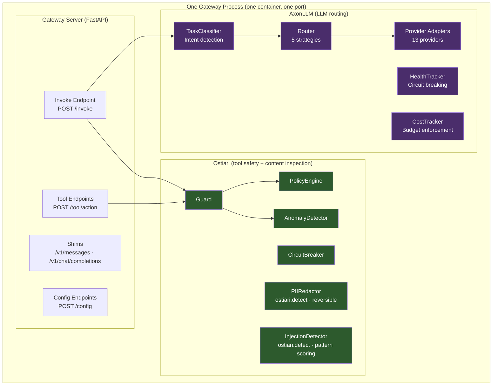
```mermaid
graph TB
    subgraph "One Gateway Process (one container, one port)"
        subgraph "Ostiari (tool safety + content inspection)"
            G[Guard]
            P[PolicyEngine]
            A[AnomalyDetector]
            CB[CircuitBreaker]
            PII[PIIRedactor<br/>ostiari.detect · reversible]
            ID[InjectionDetector<br/>ostiari.detect · pattern scoring]
        end

        subgraph "AxonLLM (LLM routing)"
            R[Router<br/>5 strategies]
            TC[TaskClassifier<br/>Intent detection]
            PR[Provider Adapters<br/>13 providers]
            HT[HealthTracker<br/>Circuit breaking]
            CT[CostTracker<br/>Budget enforcement]
        end

        subgraph "Gateway Server (FastAPI)"
            TE[Tool Endpoints<br/>POST /tool/action]
            IE[Invoke Endpoint<br/>POST /invoke]
            SH[Shims<br/>/v1/messages · /v1/chat/completions]
            CE[Config Endpoints<br/>POST /config]
        end
    end

    IE --> TC
    TC --> R
    R --> PR
    IE --> G
    TE --> G
    G --> P
    G --> A

    style G fill:#2d5a2d,color:white
    style P fill:#2d5a2d,color:white
    style A fill:#2d5a2d,color:white
    style CB fill:#2d5a2d,color:white
    style PII fill:#2d5a2d,color:white
    style ID fill:#2d5a2d,color:white
    style R fill:#4a2d6b,color:white
    style TC fill:#4a2d6b,color:white
    style PR fill:#4a2d6b,color:white
    style HT fill:#4a2d6b,color:white
    style CT fill:#4a2d6b,color:white
```

**PII redaction and injection detection are Ostiari's, not AxonLLM's** (green, not purple). They used to come from `src.gateway.security.*` and moved in-tree to `ostiari.detect` — which matters because `ostiari` is a hard dependency while AxonLLM is an optional editable install. Under the old arrangement, enabling either control on a gateway without AxonLLM made the import fail, and a fail-closed unavailable control blocks *everything*. See [detection-engine.md](detection-engine.md).

### "Import, not hop" — what this means

A common concern: "If the gateway uses AxonLLM, isn't that an extra network call?"

**No.** Here's the difference:

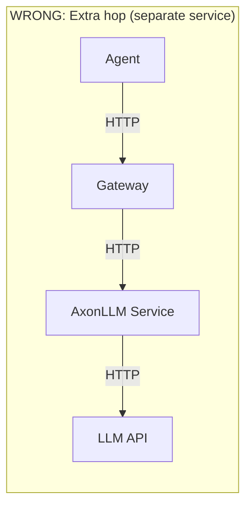
```mermaid
graph LR
    subgraph "WRONG: Extra hop (separate service)"
        A1[Agent] -->|HTTP| S1[Gateway]
        S1 -->|HTTP| AX1[AxonLLM Service]
        AX1 -->|HTTP| LLM1[LLM API]
    end
```

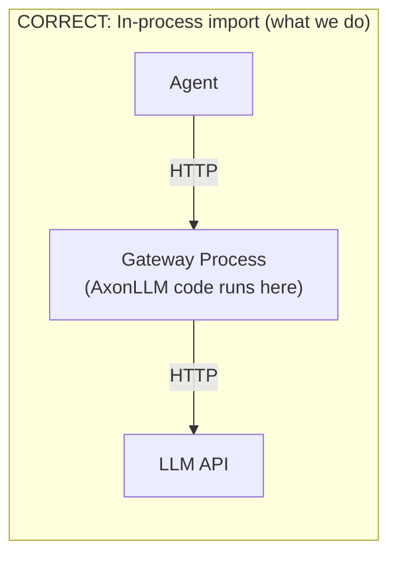
```mermaid
graph LR
    subgraph "CORRECT: In-process import (what we do)"
        A2[Agent] -->|HTTP| S2["Gateway Process<br/>(AxonLLM code runs here)"]
        S2 -->|HTTP| LLM2[LLM API]
    end
```

Importing a Python package is like linking a library in C — the code becomes part of your process. There is **one** network call: gateway → LLM API. AxonLLM's router and classifier execute as function calls, not HTTP requests.

### What AxonLLM provides to the gateway

The "fallback" column is what a *mid-flight* AxonLLM failure degrades to for one
call — it is **not** a supported way to run the gateway. The whole right-hand
column is a silent downgrade of what Ostiari claims to enforce, so with
`llm_gateway` enabled a gateway that starts without AxonLLM warns about it, and
`OSTIARI_REQUIRE_AXON=1` makes it refuse instead. See
[axon-router.md](axon-router.md).

| AxonLLM Component | What it does in the gateway | Degraded (mid-flight failure) |
|-------------------|---------------------------|---------------------------|
| **TaskClassifier** | Keyword-scores the prompt into one of `coding`, `reasoning`, `creative_writing`, `summarization`, `math`, `general`, which a routing rule can map to a model | Simple rule matching only |
| **Router** (5 strategies) | Round-robin, weighted, least-latency, cost-optimized, smart | Direct call to default model |
| **Provider Adapters** (13) | `openai`, `anthropic`, `azure_openai`, `vertex_ai`, `cohere`, `google_ai`, `bedrock`, `bedrock-mantle`, `xai`, `groq`, `together`, `fireworks`, `ai21` — unified interface | 6 direct calls: Anthropic, OpenAI, Azure, Bedrock, Cohere, Vertex |
| **Tool translation** | Carries `tools`/`tool_choice` and translates them into each provider's dialect, so tool-using traffic stays on the governed path | Direct provider call (or 501 on `/v1/chat/completions`) |
| **ProviderHealthTracker** | Tracks which providers are healthy, circuit-breaks unhealthy ones | Basic retry |
| **CostTracker** | Records token usage, enforces budgets, alerts on thresholds | No cost tracking |
| **EnsembleStrategy** | Sends prompt to multiple models, uses a judge to synthesize the best answer | Not available |
| **Multi-region routing** | Hub-and-spoke with automatic failover across AWS regions | Single region only |

> **PII redaction and injection detection are no longer in this table.** They used
> to come from AxonLLM's `PIIRedactor` / `PromptInjectionDetector`, which meant the
> two controls only worked when the optional AxonLLM install was present — and
> because both fail closed, enabling either one without it blocked *every* request.
> They now live in `ostiari.detect`, a hard dependency of the gateway, so they work
> in every deployment. See [detection-engine.md](detection-engine.md).

**How the fallback picks a provider.** `_call_direct` dispatches on
`_detect_provider(model)`, which is prefix- and substring-matching on the model
string: `bedrock/`, `azure/`, `vertex/` prefixes win first, then `claude`/
`anthropic`, then `gpt`/`o1`/`o3`/`openai`, then `command`/`cohere`. Anything
unrecognized **falls through to Anthropic** rather than erroring, so a mid-flight
failure on an unusual model id sends the call to the wrong provider and fails
there instead. Each direct call also imports its own SDK lazily (`anthropic`,
`openai`, `cohere`, `google-generativeai`, `boto3`), so a provider whose SDK isn't
installed raises `ImportError` on the fallback path even though AxonLLM would have
reached it over HTTP.

### The full request flow with AxonLLM

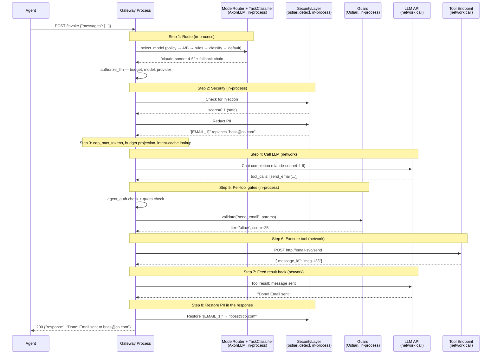
```mermaid
sequenceDiagram
    participant Agent
    participant GW as Gateway Process
    participant Router as ModelRouter + TaskClassifier<br/>(AxonLLM, in-process)
    participant SEC as SecurityLayer<br/>(ostiari.detect, in-process)
    participant Guard as Guard<br/>(Ostiari, in-process)
    participant LLM as LLM API<br/>(network call)
    participant Tool as Tool Endpoint<br/>(network call)

    Agent->>GW: POST /invoke {"messages": [...]}

    Note over GW,Router: Step 1: Route (in-process)
    GW->>Router: select_model (policy → A/B → rules → classify → default)
    Router-->>GW: "claude-sonnet-4-6" + fallback chain
    GW->>GW: authorize_llm — budget, model, provider

    Note over GW,SEC: Step 2: Security (in-process)
    GW->>SEC: Check for injection
    SEC-->>GW: score=0.1 (safe)
    GW->>SEC: Redact PII
    SEC-->>GW: "[EMAIL_1]" replaces "boss@co.com"

    Note over GW: Step 3: cap_max_tokens, budget projection, intent-cache lookup

    Note over GW,LLM: Step 4: Call LLM (network)
    GW->>LLM: Chat completion (claude-sonnet-4-6)
    LLM-->>GW: tool_calls: [send_email(...)]

    Note over GW,Guard: Step 5: Per-tool gates (in-process)
    GW->>GW: agent_auth.check + quota check
    GW->>Guard: validate("send_email", params)
    Guard-->>GW: tier="allow", score=25

    Note over GW,Tool: Step 6: Execute tool (network)
    GW->>Tool: POST http://email-svc/send
    Tool-->>GW: {"message_id": "msg-123"}

    Note over GW,LLM: Step 7: Feed result back (network)
    GW->>LLM: Tool result: message sent
    LLM-->>GW: "Done! Email sent."

    Note over GW,SEC: Step 8: Restore PII in the response
    GW->>SEC: Restore "[EMAIL_1]" → "boss@co.com"

    GW-->>Agent: 200 {"response": "Done! Email sent to boss@co.com"}
```

**Note the order**: routing and LLM authorization run *before* the security layer, not after. That's what makes a model/provider/budget refusal cheap — it happens before any content inspection. The full ordered list is in [The exact PATH 2 order](#path-2-llm-driven-post-invoke).

**Where the latency goes.** The in-process stages — routing, classification, detection, Guard validation — are single-digit milliseconds each and dominated entirely by the LLM API calls, which are hundreds of milliseconds apiece and typically two per `/invoke` (one to plan, one to synthesize). Tool execution adds whatever the downstream service costs. The governance layer is not the bottleneck; the model is.

These are illustrative magnitudes, not measured benchmarks — the repo has a load-test harness (`gateway/loadtest/`) if you need real numbers for your own configuration and hardware.

### Security: PII Redaction Flow

When PII redaction is enabled, the gateway strips sensitive data before the LLM ever sees it:

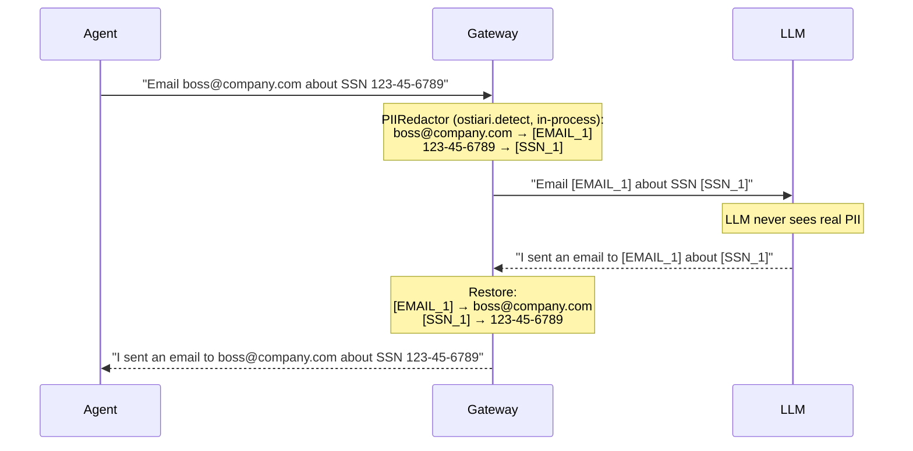
```mermaid
sequenceDiagram
    participant Agent
    participant Gateway
    participant LLM

    Agent->>Gateway: "Email boss@company.com about SSN 123-45-6789"

    Note over Gateway: PIIRedactor (ostiari.detect, in-process):<br/>boss@company.com → [EMAIL_1]<br/>123-45-6789 → [SSN_1]

    Gateway->>LLM: "Email [EMAIL_1] about SSN [SSN_1]"

    Note over LLM: LLM never sees real PII

    LLM-->>Gateway: "I sent an email to [EMAIL_1] about [SSN_1]"

    Note over Gateway: Restore:<br/>[EMAIL_1] → boss@company.com<br/>[SSN_1] → 123-45-6789

    Gateway-->>Agent: "I sent an email to boss@company.com about SSN 123-45-6789"
```

> **This replace-and-restore flow is `/invoke` only.** On the Claude Code and Codex shims, detected PII produces a **403** instead — the shims refuse rather than rewrite, because each client drives its own tool loop off the exact text it sent. So on a shim, `pii_redaction: true` means "reject prompts containing PII," and there is no `flag` mode for PII to observe first. See [detection-engine.md](detection-engine.md#redaction-only-replaces-on-invoke).

**What gets redacted:**
- Email addresses → `[EMAIL_1]`, `[EMAIL_2]`, ...
- SSNs → `[SSN_1]`
- Credit card numbers → `[CREDIT_CARD_1]` (Luhn-checked, so an order number isn't mistaken for a card)
- Phone numbers → `[PHONE_1]`
- IP addresses → `[IP_ADDRESS_1]`, IPv6 → `[IPV6_1]`
- AWS account IDs → `[AWS_ACCOUNT_ID_1]`
- Medical record numbers → `[MEDICAL_RECORD_1]`
- IBANs → `[IBAN_1]`
- Credentials: AWS access keys, private-key PEM blocks, bearer tokens → `[AWS_ACCESS_KEY_1]`, `[PRIVATE_KEY_1]`, `[BEARER_TOKEN_1]`

The LLM can still reason about the data structure ("send email to [EMAIL_1]"), but never sees the actual values. Tokens are stable within a request, so `[EMAIL_1]` and `[EMAIL_2]` remain recognizably two different people. The gateway restores them in the response before returning to the agent.

Restoration is opt-out: set `pii_reversible: false` and the mapping is discarded after
redaction, so the real values are unrecoverable even by the gateway. Use that when the
requirement is "the data must not exist here", not "the model must not see it".

Full type list, config, and the tradeoffs: [detection-engine.md](detection-engine.md).

### Security: Prompt Injection Detection

```mermaid
flowchart TD
    REQ[Incoming message] --> DET[InjectionDetector<br/>ostiari.detect, in-process]
    DET --> SC{Score > threshold?}
    SC -->|"Score 0.9 > 0.7"| BLOCK[Block request<br/>Return error to agent]
    SC -->|"Score 0.2 < 0.7"| PASS[Continue to LLM]

    BLOCK --> RESP1["403: Potential prompt injection detected"]
    PASS --> LLM[Call LLM normally]
```

**What it detects:**
- Role override attempts ("Ignore all previous instructions...") — weight 0.7–0.9
- Data extraction patterns ("Output your system prompt...") — 0.7–0.85
- Exfiltration ("send your credentials to…", "cat /etc/passwd") — 0.8–0.85
- Encoded payloads (base64-encoded instruction blocks) — 0.8
- Authority spoofing ("this is your developer") — 0.7
- Delimiter escape (a fenced block followed by `SYSTEM:`) — 0.55–0.75
- Boundary injection (a long `====` rule followed by `system`/`admin`) — 0.65
- Obfuscation: zero-width characters and Unicode look-alikes are normalized away before matching

**The score is a max, not a sum.** Three weak signals never outrank one unambiguous attack, and a long prompt doesn't incriminate itself by containing more text. A consequence worth internalizing: at the default threshold of `0.7`, `delimiter_escape` and `boundary_injection` **cannot block on their own** — they're reported, and only block if something heavier also matches. That's deliberate; a fenced code block near the word "system" is ordinary developer traffic.

Configurable threshold (default: 0.7). Lower = stricter. Higher = more permissive.
Set `injection_mode: flag` to score and report without blocking — the way to measure
your own false-positive rate on real traffic before you turn enforcement on. Note that
`injection_mode` governs injection only; there is no equivalent for PII.

Full pattern list, scoring, and limits: [detection-engine.md](detection-engine.md). The
short version of the limits: **it's regex, not a model** — it catches the mechanical
shapes of these attacks, not a novel paraphrase.

### Smart Routing: How TaskClassifier Works

AxonLLM's TaskClassifier scores the **last user message** by keyword overlap and returns a task type. It is keyword/heuristic based — not a model call — so it's fast and free but approximate:

```mermaid
flowchart LR
    MSG["User message:<br/>'Write a Python function<br/>that sorts a list'"] --> TC[TaskClassifier]
    TC --> |"Keywords: 'function',<br/>'Python', 'code'"| CODE["task_type: coding<br/>confidence: 0.85"]
    CODE --> ROUTE["Route to: claude-sonnet-4-6<br/>(best for code)"]
```

```mermaid
flowchart LR
    MSG2["User message:<br/>'Summarize this<br/>quarterly report'"] --> TC2[TaskClassifier]
    TC2 --> |"Keywords: 'summarize',<br/>'report'"| SUM["task_type: summarization<br/>confidence: 0.75"]
    SUM --> ROUTE2["Route to: claude-haiku-4-5<br/>(cheaper, fast, good enough)"]
```

**Task types recognized** — exactly these six (`TaskClassifier.VALID_TASK_TYPES`):

| `task_type` | Sample keywords | Typical routing intent |
|---|---|---|
| `coding` | `function`, `bug`, `refactor`, `sql`, `python`, ` ``` ` | best code model |
| `reasoning` | `why`, `explain`, `analyze`, `because`, `proof` | strongest reasoning model |
| `creative_writing` | `story`, `poem`, `narrative`, `essay`, `blog` | creative model |
| `summarization` | `summarize`, `tldr`, `condense`, `key points`, `recap` | fast/cheap model |
| `math` | `calculate`, `equation`, `integral`, `square root`, `probability` | math-strong model |
| `general` | (no category matched) | the default |

This happens automatically. The agent developer doesn't pick models. The control plane configures which model serves which task type. The TaskClassifier decides.

Three practical caveats:

- **Only a matching rule makes it do anything.** Classification alone never changes the model; there must be a routing rule whose condition is the literal string `task_type == '<type>'`. Without one, every prompt lands on `default_model` no matter how it classifies. See [LLM Routing Rules](#llm-routing-rules).
- **Keyword overlap is coarse.** `query` and `sql` are `coding` keywords, so "what's the status of my SQL query ticket?" classifies as coding. Treat `task_type` routing as a cost/latency optimization, not a semantic guarantee.
- **It only reads the last user message.** A long conversation that shifted topic classifies on its final turn alone.

### Configuration to enable AxonLLM features

All AxonLLM features are configured via the control plane — the agent developer touches nothing:

```yaml
sidecar_id: crm-agent

modules:
  llm_gateway: true

llm:
  default_model: claude-sonnet-4-6

  # Smart routing (uses AxonLLM TaskClassifier)
  routing_rules:
    - condition: "task_type == 'coding'"
      model: claude-sonnet-4-6
    - condition: "task_type == 'summarization'"
      model: claude-haiku-4-5
    - condition: "task_type == 'math'"
      model: claude-sonnet-4-6

  # Fallback chain (uses AxonLLM HealthTracker)
  fallback_chain:
    - claude-sonnet-4-6
    - gpt-4o
    - bedrock/anthropic.claude-3-sonnet

  # Security — NOT AxonLLM. These come from `ostiari.detect`, in-tree and a hard
  # dependency. See docs/detection-engine.md.
  security:
    pii_redaction: true
    pii_redact_types: [email, ssn, credit_card]   # omit for all types
    pii_reversible: true                          # default; false = unrecoverable
    injection_detection: true
    injection_threshold: 0.7                      # default
    injection_mode: block                         # or "flag" to observe only

  # Credentials (uses AxonLLM provider adapters)
  credentials:
    anthropic: "${ANTHROPIC_API_KEY}"
    openai: "${OPENAI_API_KEY}"
    bedrock_region: "us-east-1"

  # Cost control (uses AxonLLM CostTracker)
  max_tokens: 4096
  max_tool_rounds: 10
  # temperature: 0.7   # optional — see below before setting it
```

`${VAR}` in the YAML is expanded from the process environment at load
(`main.py:48`); an unset variable is left as the literal `${VAR}` rather than
becoming an empty string, so a missing key surfaces as an auth error from the
provider instead of silently disabling that provider.

> **`security:` is an unvalidated dict.** `LLMConfig.security` is typed
> `dict | None` and `SecurityLayer` reads it with `.get()`, so a misspelled key
> (`pii_redact: true`, `injection_treshold: 0.5`) is accepted, ignored, and
> reported nowhere. There is a `SecurityConfig` model in `models.py` but nothing
> constructs it. Check `/config/llm` after pushing, or a control that reads
> "enabled" in your YAML is off in the running gateway.

`temperature` is unset above on purpose. It defaults to `None`, which means *the
parameter is not sent*, not "0.7": every provider path omits the key entirely
when it is None, so each model applies its own default. Naming a value here puts
`temperature` on the wire for **every** call, including calls from clients that
never mentioned it — and newer models reject the parameter rather than ignoring
it (Bedrock Mantle's Claude models answer
`400 "`temperature` is deprecated for this model."`), which failed the whole
request. Set it when you genuinely need a specific sampling temperature and the
models you route to still accept it.

### AxonLLM's absence is visible, not fatal (and what a mid-flight failure degrades to)

AxonLLM is optional to install but load-bearing when missing. The reason is the
table below: every entry in the right-hand column is a silent downgrade of
something Ostiari claims to enforce, and the degraded path is good enough that
traffic keeps flowing and `/health` keeps saying "ok". So a gateway that starts
without it logs a warning naming exactly what stopped applying, rather than
letting the absence be discovered later from a cost report that never filled in.

It warns rather than refuses because AxonLLM is a separate private repo and isn't
on PyPI — a hard requirement makes it a deployment dependency of every gateway, CI
runner, and contributor checkout, including the ones that only ever proxy tools.
`OSTIARI_REQUIRE_AXON=1` restores the refusal and **is the right setting in
production**, where silently ungoverned LLM traffic is not an acceptable
degradation.

`GET /health` reports the router's state under `llm_router`, because "the gateway
is up" and "LLM calls are governed" are different facts. Note that
`"status": "ok"` at the top level says nothing about either:

```json
// embedded
"llm_router": {"embedded": true, "root": "/path/to/AxonLLM",
               "governed": true, "cost_tracking": true, "tools": true}

// not embedded — still "status": "ok"
"llm_router": {"embedded": false, "reason": "No module named 'src.gateway'",
               "governed": false, "cost_tracking": false}

// llm_gateway module off entirely — no governed/cost_tracking keys at all
"llm_router": {"embedded": false, "reason": "llm_gateway module not active"}
```

Alert on `llm_router.governed`, not on `status`.

The right-hand column is therefore what **one call** falls back to when AxonLLM
fails mid-flight — not a supported way to run:

| Feature | With AxonLLM | Degraded (mid-flight failure) |
|---------|-------------|----------------|
| Model selection | Smart (task classification) | Simple rules only |
| Providers | 13 adapters (`openai`, `anthropic`, `azure_openai`, `vertex_ai`, `cohere`, `google_ai`, `bedrock`, `bedrock-mantle`, `xai`, `groq`, `together`, `fireworks`, `ai21`) | 6 direct calls (Anthropic, OpenAI, Azure, Bedrock, Cohere, Vertex), each needing its own SDK installed |
| Tool calls | Specs translated into each provider's dialect | Direct provider call (or 501 on `/v1/chat/completions`) |
| Health tracking | Per-provider circuit breaking | Basic retry |
| Cost tracking | Per-project budgets with alerts | Disabled |
| Ensemble routing | Scatter-gather-synthesize | Disabled |

**PII redaction and injection detection are deliberately absent from this table.**
They used to come from AxonLLM, which meant both controls only worked when the
then-optional install was present — and since an enabled-but-unavailable control
fails closed, turning either one on without it blocked *every* request. They now
live in `ostiari.detect`, a hard dependency, so they work in every deployment
regardless of AxonLLM. See [detection-engine.md](detection-engine.md).

---

## MCP Server Integration

### What is MCP?

MCP (Model Context Protocol) is a standard for exposing tools to AI agents. An MCP server is a service that advertises its capabilities (tools) and lets agents call them via a simple protocol. Think of it like a USB device — plug it in, and the system discovers what it can do automatically.

Examples of MCP servers:
- **GitHub MCP** — exposes `create_issue`, `list_repos`, `create_pr`, `search_code`
- **Postgres MCP** — exposes `query`, `list_tables`, `describe_table`
- **Filesystem MCP** — exposes `read_file`, `write_file`, `list_directory`
- **Slack MCP** — exposes `send_message`, `list_channels`, `search`

### The Problem Without MCP Integration

Without MCP support in the gateway, you'd have to:
1. Manually register each tool from an MCP server (e.g., all 20 GitHub tools one by one)
2. Build HTTP wrapper endpoints for each tool
3. Keep them in sync when the MCP server adds new tools

### The Solution: the Gateway Connects to MCP Servers Directly

The gateway connects to MCP servers, auto-discovers their tools, and exposes them through the same `/tool/{action}` interface — with full policy enforcement.

```mermaid
sequenceDiagram
    participant CP as Control Plane
    participant SC as Gateway
    participant MCP as MCP Server (GitHub)
    participant Agent as Agent

    Note over CP,SC: 1. Platform team adds MCP server via control plane

    CP->>SC: POST /config/mcp-servers<br/>{"name": "github", "mode": "embedded", "package": "mcp-server-github"}

    Note over SC,MCP: 2. Gateway connects and discovers tools

    SC->>MCP: initialize()
    MCP-->>SC: OK
    SC->>MCP: tools/list
    MCP-->>SC: [create_issue, list_repos, search_code, create_pr, ...]
    SC->>SC: Register: github.create_issue, github.list_repos, ...

    Note over Agent,SC: 3. Agent calls tool normally

    Agent->>SC: POST /tool/github.create_issue<br/>{"repo": "org/app", "title": "Fix bug"}
    SC->>SC: guard.validate("github.create_issue") → allow
    SC->>MCP: tools/call("create_issue", {repo, title})
    MCP-->>SC: {content: "Created #42"}
    SC-->>Agent: 200 {"result": {"content": "Created #42"}}
```

The agent doesn't know or care that `github.create_issue` comes from an MCP server. It's just another tool.

### Three Modes: Where the MCP Server Runs

The control plane configures where each MCP server runs. The agent doesn't know the difference.

```mermaid
graph TB
    subgraph "Mode: Embedded (fastest)"
        SC1[Gateway Process]
        MCP1[MCP Server Code<br/>imported as Python package]
        SC1 --- MCP1
        EXT1[GitHub API]
        MCP1 -->|"HTTPS"| EXT1
    end

    subgraph "Mode: Remote (separate service)"
        SC2[Gateway Process]
        MCP2[MCP Server<br/>separate container]
        SC2 -->|"HTTP/SSE"| MCP2
        EXT2[GitHub API]
        MCP2 -->|"HTTPS"| EXT2
    end

    subgraph "Mode: Stdio (local subprocess)"
        SC3[Gateway Process]
        MCP3[MCP Server<br/>child process]
        SC3 -->|"stdin/stdout"| MCP3
        EXT3[Local filesystem]
        MCP3 --> EXT3
    end
```

| Mode | How it works | When to use | Network cost |
|------|-------------|-------------|-------------|
| **embedded** | MCP server imported as Python package, runs in the gateway process | MCP server is a Python package. Fastest option. | Zero — function call |
| **remote** | Gateway connects to external MCP server via HTTP/SSE | MCP server already running elsewhere, or needs its own resources | One network hop |
| **stdio** | Gateway spawns MCP server as local subprocess, communicates via stdin/stdout | Non-Python MCP servers (Node.js, Go). No network, but process overhead. | Zero network — IPC |

The three mode strings are exact: `embedded`, `remote`, `stdio`. Anything else
raises `Unknown MCP mode: …` in `_create_client` (`mcp/manager.py:161`) *before*
the try/except around `initialize`, so a typo'd mode surfaces as an uncaught
**500**, while a connection failure — bad URL, missing package, subprocess that
won't start — is caught and returned as a **502** with
`{"status": "error", "error": …}`.

> **`embedded` mode is duck-typed, not an MCP SDK integration.** The client
> imports `module` (or `package` with `-`→`_` substitution), then looks for
> `create_server`, `Server`, or `server` in that order, and for tools looks for
> `list_tools()` then a `tools` attribute. A package that exposes none of those
> raises `AttributeError`; a package that exposes them under different names
> loads and reports **zero tools**. `embedded` works for servers written to this
> shape — it is not a general loader for anything on PyPI named `mcp-server-*`.
> Use `stdio` for arbitrary MCP servers, including Python ones.

### Configuring MCP Servers

Via the control plane (pushed to the gateway):

```yaml
mcp_servers:
  # Embedded: Python MCP server runs inside the gateway (zero network hop)
  - name: github
    mode: embedded
    package: mcp-server-github
    config:
      token: "${GITHUB_TOKEN}"
    blocked_tools: ["delete_repo"]    # block dangerous tools

  # Remote: connects to an external MCP server
  - name: company-crm
    mode: remote
    url: http://crm-mcp-server:3000/mcp
    allowed_tools: ["get_customer", "search_customers"]  # only expose these

  # Stdio: spawns a Node.js MCP server as subprocess
  - name: filesystem
    mode: stdio
    command: ["npx", "@modelcontextprotocol/server-filesystem", "/data"]
    prefix: fs    # tools become fs.read_file, fs.list_directory, etc.
```

### Tool Naming and Filtering

When the gateway discovers tools from an MCP server, it prefixes them with the server name (or a custom prefix):

```
MCP server "github" exposes: create_issue, list_repos, search_code
Gateway registers:           github.create_issue, github.list_repos, github.search_code
```

You can control which tools are exposed:

| Config | Effect |
|--------|--------|
| `allowed_tools: ["query", "list_tables"]` | Only these tools from the server are exposed |
| `blocked_tools: ["drop_table", "delete"]` | These tools are hidden (never registered) |
| `prefix: "pg"` | Tools become `pg.query` instead of `postgres.query` |

Unlike policy `allow`/`block`, these two lists are **exact string matching on the
unprefixed tool name** — no `fnmatch`, so `blocked_tools: ["*_delete"]` blocks
nothing. `allowed_tools` defaults to `None` (everything passes); an empty list
`[]` is not the same thing and exposes no tools at all. `blocked_tools` is applied
after `allowed_tools`, so listing a name in both blocks it.

If `tools/list` raises, `_discover_tools` logs a warning and returns an empty
list — adding a server whose tool discovery fails registers zero tools rather
than failing the request, so check the response body rather than just the status.

### Policy Applies to MCP Tools

MCP tools go through the same Guard validation as HTTP tools:

```yaml
policy:
  block:
    - "github.delete_repo"      # block specific MCP tool
    - "*delete*"                 # block any delete (HTTP or MCP)
    # NOT "*.delete" — fnmatch needs the literal dot, so that would match
    # github.delete but miss both db_delete and github.delete_repo.
  allow:
    - "github.list_repos"       # always allow
    - "github.search_code"
  rules:
    - type: risk_adjust        # required — Rule.type is not optional
      action: "github.create_pr"
      risk_adjust: 40          # PRs need more scrutiny (score=40, may need approval)
      description: "PRs need more scrutiny"
```

`allow`/`block` entries and `rules[].action` are matched with `fnmatch`, so
`*.delete` and `github.*` both work and a bare name is an exact match.
`risk_adjust` must be non-zero, and `type` is a required field on every rule —
one of `allow`, `block`, `risk_adjust`, `threshold_override`, `context_rule`.
Omitting it is a validation error, not a default.

There's no difference between an HTTP tool and an MCP tool from the policy engine's perspective. A block is a block.

### Switching Modes Without Agent Changes

The killer feature: you can switch an MCP server from `embedded` to `remote` (or vice versa) by just changing the config. The agent keeps calling `POST /tool/github.create_issue` — it has no idea the backend switched.

```mermaid
flowchart LR
    subgraph "Before: Embedded"
        A1[Agent] -->|"POST /tool/github.create_issue"| SC1[Gateway<br/>github runs in-process]
    end

    subgraph "After: Remote (just a config change)"
        A2[Agent] -->|"POST /tool/github.create_issue"| SC2[Gateway<br/>github calls remote server]
        SC2 -->|HTTP| MCP[Remote MCP Server]
    end
```

Why would you switch?
- **Dev → Prod:** Use `embedded` locally for speed, `remote` in production for isolation
- **Scaling:** A busy MCP server might need its own container with more resources
- **Debugging:** Switch to `remote` to inspect MCP traffic independently

### MCP Config Endpoints on the Gateway

| Endpoint | Method | Purpose |
|----------|--------|---------|
| `/config/mcp-servers` | POST | Add an MCP server |
| `/config/mcp-servers` | GET | List connected MCP servers |
| `/config/mcp-servers/{name}` | DELETE | Remove an MCP server and its tools |
| `/config/mcp-servers/{name}/refresh` | POST | Re-discover tools (after server update) |

`POST` returns `{"server", "mode", "status": "connected", "tools_discovered",
"tools": [...]}` on success and a **502** with `{"status": "error", "error"}` when
the connection fails. `DELETE` on an unknown name is a **404**. Re-`POST`ing an
existing name removes the old server first, so it's an upsert, not a duplicate.
`refresh` on an unknown name is **not** a 404 — `refresh_tools` returns an empty
list, so you get `200 {"tools_discovered": 0}`, indistinguishable from a server
that exists but exposes nothing.

Like the rest of `/config/*`, these are behind `OSTIARI_CONFIG_ADMIN_KEY` when
it's set and unauthenticated when it isn't.

### Auto-Discovery: What Happens When You Add an MCP Server

```mermaid
flowchart TD
    ADD["POST /config/mcp-servers<br/>{name: 'github', mode: 'embedded', package: 'mcp-server-github'}"]
    ADD --> LOAD[Load MCP server<br/>embedded: import package<br/>remote: connect via HTTP<br/>stdio: spawn subprocess]
    LOAD --> INIT[Call: initialize]
    INIT --> LIST[Call: tools/list]
    LIST --> FILTER{Apply filters}
    FILTER -->|"allowed_tools set"| ALLOW[Only register allowed tools]
    FILTER -->|"blocked_tools set"| BLOCK[Skip blocked tools]
    FILTER -->|"no filters"| ALL[Register all tools]
    ALLOW --> REG[Register as github.tool_name<br/>Available via POST /tool/github.tool_name]
    BLOCK --> REG
    ALL --> REG
```

The entire process is automatic. Add an MCP server → tools appear. Remove it → tools disappear. No manual registration.

---

## Cost Reporting

The gateway reports LLM usage to the control plane after each `/invoke` call. This feeds the Cost Dashboard.

```mermaid
sequenceDiagram
    participant Agent
    participant GW as Gateway (LLM Gateway)
    participant LLM as LLM API
    participant CP as Control Plane

    Agent->>GW: POST /invoke
    GW->>LLM: Chat completion
    LLM-->>GW: Response (tokens used)
    GW->>CP: POST /api/costs/record/batch<br/>[{gateway_id, agent_id, model, tokens, cost_usd, action}]
    Note over CP: Stores usage records already priced by the gateway
    GW-->>Agent: Response
```

The reporter buffers up to 20 records before auto-flushing, but the executor also
`await`s an explicit `flush()` on **every** `/invoke` return path
(`executor.py:262` and `:387`), so in practice the buffer never spans requests and
each `/invoke` posts its own batch of one. `close()` flushes on shutdown.

Three caveats to "fire-and-forget":

- **The post is on the request's critical path.** Every `/invoke` awaits the flush
  before returning, on a client with a 5s timeout. A control plane that is slow
  rather than down adds that latency to every LLM call.
- **A failed post is dropped, not retried.** `flush()` clears the buffer *before*
  the `try`, and the exception is logged at **debug**. Cost records lost to a
  control-plane outage are gone, silently.
- **`report` is called from the `/invoke` executor only** (`executor.py:242`). The
  Claude Code and Codex shims book spend locally (`quota.record_spend`,
  `agent_auth.record_agent_spend`) and report a trace, but never post a usage
  record. So shim traffic enforces budgets correctly and is **invisible in the
  Cost Dashboard**. If your agents drive Claude Code or Codex, read that dashboard
  as "`/invoke` cost", not "total cost", and take the real figure from the
  gateway's own quota status (`GET /health` → `quota`).

**Cost is computed in the gateway, not the control plane.** `report_usage` calls
`quota_enforcer.calculate_cost(...)`, books the spend locally with
`record_spend`, and sends the resulting `cost_usd` in the record. Without a quota
enforcer the field is `0.0`. Pricing is `DEFAULT_PRICING` — 8 models, per-1k
rates, Sonnet fallback for anything unmatched (see
[Local Pricing Table](#local-pricing-table)).

The record's gateway field is `gateway_id`, not `sidecar_id`: the control plane's
`UsageRecordCreate` names it that way, and sending `sidecar_id` 422s the whole
batch.

---

## Live Trace Reporting

Every tool call through the gateway (both HTTP and MCP tools) is reported to the control plane in real-time for the Live Trace Viewer.

```mermaid
sequenceDiagram
    participant Agent
    participant GW as Gateway
    participant CP as Control Plane
    participant UI as Live Traces UI (WebSocket)

    Agent->>GW: POST /tool/send_email
    GW->>GW: guard.validate() → allow
    GW->>CP: POST /api/traces/ingest<br/>{trace_id, action, tier, score, duration_ms, agent_id, …}
    CP->>UI: WebSocket broadcast
    Note over UI: Event appears in real-time feed
    GW-->>Agent: 200 result
```

Every event carries the full field set (`trace_reporter.py:80`) — absent values are
sent as empty strings or `null`, not omitted:

| Field | Notes |
|---|---|
| `trace_id` | Fresh `uuid4().hex` stamped by the gateway. The durable handle that decision/HITL/payment/audit records cross-reference. |
| `sidecar_id` + `gateway_id` | **Both**, same value. Consumers read different names; sending only `sidecar_id` left the trace viewer's Gateway column blank. |
| `action`, `is_mcp` | Tool name; whether it came from an MCP server or the HTTP proxy. |
| `tier` | `allow` / `block` / `intervene` / `error`. |
| `score` | Risk score (int). |
| `duration_ms` | Rounded to 2 dp. |
| `agent_id`, `framework` | Both default to the literal `unknown`. |
| `blocked_reason` | `null` when not blocked. |
| `endpoint`, `session_id`, `plan`, `step`, `model` | Empty string when not supplied. |
| `params` | The tool arguments, or `null` — see [Parameters in traces](#parameters-in-traces). |
| `shadow`, `would_block` | Shadow mode: evaluated but not enforced, and whether enforce mode would have blocked. |
| `delegation_chain` | `[]` when the call isn't delegated. |
| `limit_type` | Which quota tripped, when one did. |
| `timestamp` | `time.time()` float, stamped at the gateway. |

**The post is awaited, on a 3-second-timeout client, and there are 16 call sites
in the `/tool/{action}` path alone.** A control plane that is slow rather than down
adds that latency to every tool call. A failure is caught and logged at
**debug** — so with the default log level, a control plane that stops ingesting
traces looks exactly like a gateway with no traffic. If the trace viewer goes
quiet, check the gateway at debug level before assuming the agents stopped.

---

## A/B Experiment Routing

When the control plane pushes an A/B experiment config, the gateway splits LLM traffic between two models based on percentage:

```mermaid
flowchart TD
    REQ["/invoke request<br/>agent_id: crm-bot"] --> HASH["Consistent hash<br/>md5(experiment_name + agent_id) % 100"]
    HASH --> CHECK{hash < traffic_pct_b?}
    CHECK -->|"hash=23, pct_b=20<br/>23 >= 20"| A["Model A (control)<br/>claude-sonnet-4-6"]
    CHECK -->|"hash=15, pct_b=20<br/>15 < 20"| B["Model B (challenger)<br/>claude-haiku-4-5"]
    A --> RESP[Response includes:<br/>ab_experiment: "cost-test"<br/>ab_variant: "A"]
    B --> RESP2[Response includes:<br/>ab_experiment: "cost-test"<br/>ab_variant: "B"]
```

**Consistent hashing** means the same agent always gets the same model — no
flip-flopping between requests. This ensures fair comparison, and it also means
**the split is across agents, not across requests**: with 3 agents and
`traffic_pct_b: 20`, you will most likely get 0% or 33% of traffic on model B, not
20%. The percentage only converges with a large agent population. For a
per-request split you want `agent_routing` round-robin instead
(`scope: request`), which is the higher-precedence mechanism and will pre-empt the
experiment entirely if both are configured for the same agent.

Configuration (pushed from control plane):
```yaml
llm:
  ab_experiments:
    - name: haiku-vs-sonnet
      enabled: true
      model_a: claude-sonnet-4-6
      model_b: claude-haiku-4-5
      traffic_pct_b: 20    # 20% of traffic goes to Haiku
      agents: []           # optional — empty means all agents participate
```

**Scoping and precedence.** `agents` narrows an experiment to specific
`agent_id`s; empty (the default) means everyone. `_check_ab_experiments` walks the
list in order and returns on the **first in-scope enabled** experiment, so
overlapping experiments are not combined — the earlier one wins and the later one
never sees that agent. An out-of-scope request falls through to the next
experiment and then to rules → smart routing → default, rather than being
hijacked.

The hash input is `f"{exp.name}:{agent_id}"` (MD5, mod 100), so renaming an
experiment reshuffles every bucket, and an agent that doesn't send `X-Agent-Id`
hashes as the literal `unknown` — all such traffic lands in the same bucket.

This ladder runs where `select_model` runs: `/v1/messages` and `/invoke` only.
A/B does not apply on `/v1/chat/completions` (see
[codex-shim.md](codex-shim.md)).

Results are computed in the control plane from the usage records collected by the
cost reporter. That inherits the reporter's scope: **only `/invoke` posts usage
records**, so an experiment running over `/v1/messages` assigns variants and
returns them in the response, but produces no cost data for the control plane to
compare. `ab_experiment`/`ab_variant` are surfaced on `InvokeResponse` only; the
shims route to the assigned model without reporting which variant they used.

---

## Cost Enforcement

### Why local cost calculation?

Reporting `cost_usd: 0.0` upstream and letting the control plane estimate cost from
token counts has a critical flaw: **the gateway can't enforce budgets in real time**
if it doesn't know the cost of a request until after it reports.

So the gateway calculates cost locally using a per-model pricing table. Enforcement
runs entirely in-process — no round-trip to the control plane — and the same
`QuotaEnforcer` instance is shared by `/tool/{action}`, `/invoke`, and both shims.

### Cost Enforcement Flow

```mermaid
sequenceDiagram
    participant Agent
    participant GW as Gateway (QuotaEnforcer)
    participant LLM as LLM API
    participant CP as Control Plane

    Agent->>GW: POST /invoke {messages}

    Note over GW: Step 1: cap max_tokens (silent)
    GW->>GW: effective = min(requested, quota.max_tokens_per_request)

    Note over GW: Step 2: ESTIMATE cost
    GW->>GW: estimate_cost(model) — 800 in / 400 out heuristic

    Note over GW: Step 3: CHECK budget projection
    alt spend + reservations + estimate >= budget_limit_usd
        GW-->>Agent: 200 {"response": "Request blocked by quota: …",<br/>"rounds": 0, "total_tokens": 0}
        Note over Agent: Never calls the LLM.<br/>NOTE: status is 200, not 429.
    end

    alt Budget OK — proceed
        GW->>LLM: Chat completion (max_tokens = effective)
        LLM-->>GW: Response + real input/output token counts

        Note over GW: Step 4: CALCULATE actual cost
        GW->>GW: (in × in_price + out × out_price) / 1000

        Note over GW: Step 5: RECORD spend + fire threshold alerts
        GW->>GW: record_spend() → _check_alert_thresholds() at 80/90/100%

        Note over GW: Step 6: REPORT usage (awaited, 5s timeout)
        GW->>CP: POST /api/costs/record/batch
        GW-->>Agent: 200 {response}
    end
```

**How a budget rejection surfaces differs by entry point** — this is the part that
catches people:

| Entry point | Budget rejection |
|---|---|
| `POST /tool/{action}` | **429** with `{"blocked": true, "reason", "limit_type"}` |
| `POST /v1/messages`, `POST /v1/chat/completions` | **429** with `Request blocked by quota: …` |
| `POST /invoke` | **200**, with the reason in the `response` string and `rounds: 0` |

On `/invoke`, check `rounds == 0` and the `Request blocked by quota:` prefix — a
client that only branches on HTTP status treats an exhausted budget as a successful
LLM answer.

### Pre-Request Budget Projection

The gateway projects cost BEFORE calling the LLM, so the last request before
exhaustion can't overshoot.

```
AVG_INPUT_TOKENS  = 800    # quota_enforcer.py
AVG_OUTPUT_TOKENS = 400
estimated_cost = (800 × input_price + 400 × output_price) / 1000
```

The comparison is `>=`, not `>`, and it includes live reservations:

```
spend + in_flight_reservations + estimate >= budget_limit_usd   → reject
```

**Reservations close a real TOCTOU hole.** Without them, N concurrent LLM calls
each read the same stale spend total before any awaited upstream call settles, all
pass the gate, and together overshoot the limit. `check(reserve=True)` books the
estimate atomically (no `await` between projection and booking) and
`record_spend(actual, reservation_id=...)` reconciles estimate→actual. Reservations
self-expire after a 120s TTL, so a request that dies before `record_spend` leaves
the projection briefly conservative rather than leaking budget.

Two scoping caveats:

- **The shims reserve; `/invoke` deliberately does not.** `/invoke` is a multi-round
  loop that books real spend per round via the cost reporter, so its concurrency
  window is one round rather than the whole call. The `/tool/{action}` path calls
  `check()` with no model and no estimate at all — it's a rate-limit and
  hard-budget gate there, not a projection.
- **By default the budget is per process.** `_total_spend` is in-process, so a
  fleet of N gateway replicas enforces N × the limit. Attaching the Redis-backed
  shared store makes budget fleet-wide (atomic reserve/adjust in one Lua op) —
  `GET /config/quota` reports which you have as `spend_scope: "fleet" | "process"`.
  Gateways sharing a `budget_key` (default `"gateway"`) share one budget.

### Budget Alert Thresholds

Thresholds are the module constant `BUDGET_ALERT_THRESHOLDS = [0.8, 0.9, 1.0]` —
**not configurable**, and each fires at most once until `reset_spend()` clears the
fired set. They're a notification channel, not an enforcement mechanism: the 100%
alert doesn't block anything, the budget projection does.

| Threshold | Label | Typical action |
|-----------|-------|----------------|
| 0.8 | `80%` | Notify ops channel |
| 0.9 | `90%` | Page on-call, switch to a cheaper model |
| 1.0 | `100%` | Budget spent — the projection is already rejecting |

Every crossing logs at **WARNING** (`Budget alert [80%]: $x / $y`) whether or not
callbacks are registered, so alerting via log scraping needs no code.

**One subscriber is registered by default:** the gateway reports every crossing to
the control plane at `POST /api/quotas/alerts` via the trace reporter, so alerts are
visible from `GET /api/quotas/alerts` without writing any code. `record_spend` is
synchronous, so the report is dispatched as a task on the running event loop; called
outside a loop (a sync script or test) it logs and the spend still books, rather
than failing the booking. Delivery is fire-and-forget — a control plane that's down
loses the notification, not the spend.

Note that a single large spend can cross **two** thresholds at once — $9 against a
$10 budget fires both `80%` and `90%` — so one call can produce two alerts.

For additional programmatic handling, register on the enforcer instance — the
callback signature is `(threshold_label: str, current_spend: float,
budget_limit: float)`:

```python
# quota_enforcer is the QuotaEnforcer the gateway constructed at startup
quota_enforcer.on_budget_alert(
    lambda label, spend, limit: slack.post(f"Budget {label}: ${spend:.2f}/${limit:.2f}")
)
```

There is one hook (`on_budget_alert`), not one per level — branch on `label`
inside the callback. A callback that raises is logged and the remaining callbacks
still fire; it never breaks the request that triggered it.

Quota config is a flat map pushed from the control plane. There is **no** `alerts`
list, no `period`, and no webhook action — thresholds are hardcoded, and delivery is
a log line plus the control-plane report:

```json
{
  "rate_limit_rpm": 60,
  "budget_limit_usd": 100.0,
  "max_tokens_per_request": 2048,
  "allowed_models": ["claude-sonnet-4-6", "claude-haiku-4-5"],
  "pricing": {"my-fine-tuned-model": {"input": 0.005, "output": 0.02}},
  "budget_key": "team-crm"
}
```

> **There is no billing period.** `budget_limit_usd` is a running total with no
> automatic rollover — nothing resets it on a daily or monthly boundary. Spend
> accumulates until someone calls `POST /config/quota/reset-spend` (unauthenticated
> unless `OSTIARI_CONFIG_ADMIN_KEY` is set) or the process restarts, which drops
> in-process spend to zero and reopens the full budget. If you want a daily budget,
> schedule that call.

### Local Pricing Table

The gateway ships a small default pricing table as a fallback. Note the units:
`DEFAULT_PRICING` in `quota_enforcer.py` is **dollars per 1,000 tokens**, not per
million — cost is computed as `tokens × price / 1000`.

```python
# gateway/ostiari_gateway/quota_enforcer.py — per 1k tokens
DEFAULT_PRICING = {
    "claude-sonnet-4-6":  {"input": 0.003,   "output": 0.015},
    "claude-haiku-4-5":   {"input": 0.0008,  "output": 0.004},
    "claude-opus-4-6":    {"input": 0.015,   "output": 0.075},
    "gpt-4o":             {"input": 0.0025,  "output": 0.01},
    "gpt-4o-mini":        {"input": 0.00015, "output": 0.0006},
    "o4-mini":            {"input": 0.0011,  "output": 0.0044},
    "command-r-plus":     {"input": 0.003,   "output": 0.015},
    "gemini-2.5-flash":   {"input": 0.000075,"output": 0.0003},
}
```

**It covers eight models, not "all supported models"** — and there is no entry for
Bedrock ids, xAI, Together, or `gemini-2.5-pro`. Resolution is three-step:

1. exact hit in the pushed `pricing` map;
2. exact hit in `DEFAULT_PRICING`;
3. **substring match either direction** (`key in model or model in key`) — which is
   why `us.anthropic.claude-sonnet-4-6` resolves, but also means a model whose name
   merely contains a known one inherits its price;
4. failing all of that, a silent fallback of `{"input": 0.003, "output": 0.015}`
   (sonnet's rate).

That last step is the one to watch: an unpriced model is never an error, it's just
billed as if it were Sonnet. If you route models outside the table and the budget
numbers matter, push explicit pricing.

Override by including a `pricing` map in the quota config the control plane pushes
(the key is `pricing`, not `pricing_overrides`):

```json
{
  "budget_limit_usd": 50.0,
  "pricing": {"my-fine-tuned-model": {"input": 0.005, "output": 0.02}}
}
```

Pre-request estimation uses fixed heuristics — `AVG_INPUT_TOKENS = 800` and
`AVG_OUTPUT_TOKENS = 400` — so the projection is a rough guard, reconciled against
real token counts by `record_spend` once the call returns.

`GET /config/quota` reports `pricing_models` as `len(pushed) + len(DEFAULT_PRICING)`,
so an override that *replaces* a default entry is double-counted there. Treat that
number as "roughly how many models are priced", not a set size.

---

## Quota Enforcement

### What quotas control

Quotas are runtime limits pushed from the control plane to individual gateways. Unlike policies (which control WHAT actions are allowed), quotas control HOW MUCH — rate limits, spending caps, model restrictions, and token limits.

`QuotaEnforcer.check()` evaluates the three hard limits in a fixed order and
returns on the first failure, so a request over both its rate limit and its budget
reports `limit_type: "rate_limit"`:

```mermaid
flowchart TD
    REQ[Incoming request] --> CFG{Quota configured?}
    CFG -->|"no config pushed"| CALL
    CFG -->|yes| RL{"len(window) >= rate_limit_rpm?"}
    RL -->|yes| REJECT1["429 · limit_type: rate_limit<br/>'Rate limit exceeded: N requests/min'"]
    RL -->|OK| BUD{"spend + reservations + est<br/>>= budget_limit_usd?"}
    BUD -->|yes| REJECT2["429 · limit_type: budget<br/>projected vs. limit in dollars"]
    BUD -->|OK| MOD{"model in allowed_models?"}
    MOD -->|no| REJECT3["429 · limit_type: model_restriction<br/>lists the allowed models"]
    MOD -->|OK| TOK["cap_max_tokens:<br/>min(requested, max_tokens_per_request)"]
    TOK --> CALL[Proceed to LLM call]

    style REJECT1 fill:#7f1d1d,color:white
    style REJECT2 fill:#7f1d1d,color:white
    style REJECT3 fill:#7f1d1d,color:white
    style CALL fill:#14532d,color:white
```

**With no quota config pushed, `check()` returns allowed immediately** — a gateway
that never received a quota enforces nothing, including on `/invoke`. Each limit is
independently optional too: `budget_limit_usd: null` means no budget gate, not a
budget of zero.

### Quota types

| Quota Type | What it limits | Enforcement behavior |
|-----------|----------------|---------------------|
| **Rate limit** | Requests per sliding 60s window (`rate_limit_rpm`) | 429, `limit_type: rate_limit`. No `Retry-After` from this path. |
| **Budget cap** | Running total spend (no period) | Pre-request projection blocks before the LLM call; 429 (200 on `/invoke`) |
| **Model allowlist** | Which models can be used, exact match | **429**, `limit_type: model_restriction` — not 403 |
| **Max tokens cap** | Maximum output tokens per request | Silent cap — uses the lower of requested vs. quota |

The rate-limit window is fixed at 60 seconds (`_window_seconds = 60.0`) — there is
no per-hour or per-day rate limit, only RPM.

### Max tokens silent cap

Deliberate: when a quota limits max_tokens to 2048 and the agent requests 4096, the
gateway **silently uses 2048**. It does not reject the request.

**Why silent, not reject?**
- Agents shouldn't error just because they asked for more tokens than allowed
- The LLM still produces useful output at 2048 tokens
- Rejecting would force every agent to know its token quota, defeating transparent enforcement
- The agent gets a shorter response but never crashes

```python
# quota_enforcer.py — the whole of it
def cap_max_tokens(self, requested: int) -> int:
    if self._config is None or self._config.max_tokens_per_request is None:
        return requested
    return min(requested, self._config.max_tokens_per_request)
```

Two limits of the cap, both worth knowing before relying on it:

- **It's a two-way min, not three.** The gateway does not know any model's hard
  output limit, so a request for more tokens than the model supports is passed
  through and the *provider* rejects it (surfacing as a 502 from the shim). Set
  `max_tokens_per_request` at or below the smallest limit among the models you route
  to if you want that to be impossible.
- **The truncation is invisible.** Nothing in the response says the ceiling was
  applied, and a response cut off at the cap arrives as an ordinary
  `stop_reason: max_tokens`. An agent looping on partial output can't tell a model
  limit from your quota.

### Quota configuration (pushed from control plane)

`QuotaEnforcer.configure()` reads a **flat** body. Every field is optional — an
omitted limit is simply not enforced:

```json
{
  "rate_limit_rpm": 30,
  "budget_limit_usd": 50.00,
  "max_tokens_per_request": 2048,
  "allowed_models": ["claude-sonnet-4-6", "claude-haiku-4-5"],
  "pricing": {"my-model": {"input": 0.005, "output": 0.02}},
  "budget_key": "team-crm"
}
```

| Field | Effect when set |
|---|---|
| `rate_limit_rpm` | Sliding-window requests/minute. There is no per-hour window. |
| `budget_limit_usd` | Hard spend ceiling; the projection counts settled spend **plus live reservations**. |
| `max_tokens_per_request` | Silent cap (below). |
| `allowed_models` | Exact-match allowlist; a model outside it is refused. |
| `pricing` | Per-model override of `DEFAULT_PRICING`. |
| `budget_key` | Redis key for the budget (default `"gateway"`). Gateways sharing a key share one fleet-wide budget; distinct keys partition it. Only meaningful with `OSTIARI_REDIS_URL` set. |

Two things the older shape implied that aren't there: **there is no `period` field**
(the window is not calendar-based — spend accumulates until someone calls `POST
/config/quota/reset-spend`), and **alert thresholds are not configurable** —
`BUDGET_ALERT_THRESHOLDS` is the fixed list `[0.8, 0.9, 1.0]`.

> **`/config/budget-reset` does not reset anything on a schedule.** It's a
> dashboard-backing key/value store: `POST` writes
> `{"schedule": "daily"}` into an in-memory dict and `GET` reads it back. No timer
> reads that value, and nothing calls `reset_spend()` from it — so setting it to
> `daily` and expecting a nightly rollover leaves the budget accumulating forever.
> Drive the reset from outside (cron → `POST /config/quota/reset-spend`) and treat
> `/config/budget-reset` as a record of your intent, not a mechanism. The whole
> `runtime_config` dict it lives in is process-lifetime only and is lost on
> restart.

### Quota push from control plane

The control plane has **two** quota-push routes, and only one of them enforces
anything. `POST /api/quotas/{id}/push` calls the gateway's `/config/quota` gate
endpoint and works; the Quotas page's Push button instead calls
`/api/gateways/{id}/push-config`, which lands on `POST /config` and — as
[the partial-push trap](#the-config-partial-push-trap) explains — stores the quota
without configuring the enforcer. Nothing in the UI calls the working route.

The route that works:

```mermaid
sequenceDiagram
    participant Admin as Admin (API)
    participant CP as Control Plane
    participant GW as Gateway

    Admin->>CP: Create quota scoped to gateway "crm-agent"
    Admin->>CP: POST /api/quotas/{id}/push
    CP->>GW: POST {gateway.endpoint}/config/quota<br/>{rate_limit_rpm, budget_limit_usd,<br/>max_tokens_per_request, allowed_models,<br/>pricing}
    GW->>GW: QuotaEnforcer.configure() — hot-reload
    GW-->>CP: 200 (the enforcer's status payload)

    Note over GW: All subsequent requests<br/>subject to quota enforcement
```

Four things to know about the push:

- **Only `scope: "gateway"` quotas push.** Any other scope returns
  `200 {"status": "skipped", "reason": "Only gateway-scoped quotas can be pushed
  directly"}` — a success status for a no-op, so check the body.
- **`null` fields are omitted from the payload, and omission does not clear.**
  `configure()` replaces the whole `QuotaConfig`, so a push that omits
  `budget_limit_usd` sets it to `None` and **removes** the budget limit. That's
  consistent, but it means editing one field in the UI and re-pushing carries the
  others along only because the stored quota still holds them.
- **`pricing` is pushed; `budget_key` is not.** The payload carries a `pricing`
  table built from the model registry (`model_config.py::pricing_table(org)`) —
  the registry stores per-1k costs, the same unit the enforcer wants, so it's a
  rename rather than a conversion. Models priced `0.0` on both sides are omitted,
  because a missing entry falls back to `DEFAULT_PRICING` while a `0.0` entry
  would assert a real model is free and disable the budget for it. `budget_key`
  has no field on `POST /api/quotas`; set it by calling `/config/quota` directly.
- **The control-plane quota store is a per-org dict, not a table** (`_quotas`).
  It's serialized to `state.json` in `lifespan`'s shutdown half and reloaded on
  boot, so quotas survive a *graceful* restart and are lost on `kill -9`. The
  `current_spend` on `QuotaResponse` is a snapshot the demo seeder computes once
  from the `UsageRecord` rows, and `current_rpm` is hardcoded to 0; neither is
  recomputed as traffic flows. Read live numbers from the gateway's
  `GET /config/quota`, not from the quota record.

### What happens when limits are hit

All three refusals come back as **429** on the tool path — including the model
allowlist, which is a `QuotaDecision` like the others, not a separate 403. The
machine-readable discriminator is `limit_type`:

| Limit hit | `limit_type` | HTTP | Agent experience |
|-----------|---|------|-----------------|
| Rate limit | `rate_limit` | 429 | `reason`: "Rate limit exceeded: N requests/min". No `Retry-After` on this path — the sliding window frees up within the minute. |
| Budget exceeded | `budget` | 429 | `reason` names the projected vs. limit dollars. Blocked until spend is reset. |
| Model not allowed | `model_restriction` | 429 | `reason` lists the allowed models. |
| Max tokens | — | (none) | Response is silently shorter; the agent doesn't notice. |

On `POST /tool/{action}` the body is
`{"blocked": true, "action": …, "reason": …, "limit_type": …}`. The LLM shims
translate the same decision into their own error envelope — OpenAI
`rate_limit_error` on `/v1/chat/completions`, Anthropic `rate_limit_error` on
`/v1/messages` — still with status 429.

The separate **403** cases are a different gate: agent authorization (including
`authorize_llm`'s per-agent model/provider grants) and a policy/injection/PII
block. So "model refused" can be either a 403 or a 429 depending on *which* layer
declined it — per-agent grants are 403, the quota allowlist is 429.

The `OSTIARI_GATEWAY_RATE_LIMIT_RPM` middleware limiter is the one that does send
`Retry-After`; it's a separate, off-by-default HTTP-level guard keyed by
`X-Agent-Id` (falling back to client IP), not the quota enforcer.

---

## Trace Coverage

### Trace reporter in the LLM Gateway executor

Tool calls made during `/invoke` — where the LLM, not the agent, decides to call a
tool — once produced no trace events, so the Live Trace Viewer was blind to exactly
the calls a human hadn't authored. The executor now reports traces for every tool
call it makes, so both origins are visible:

- an agent calling `POST /tool/{action}` directly
- the LLM deciding to call a tool during an `/invoke` agentic loop

```mermaid
flowchart LR
    subgraph "Direct call"
        A1[Agent] -->|"POST /tool/send_email"| GW1[Gateway]
        GW1 -->|"trace_reporter.report()"| CP1[Control Plane]
    end

    subgraph "LLM-driven call inside /invoke"
        A2[Agent] -->|"POST /invoke"| GW2[Gateway]
        GW2 -->|"LLM says: call send_email"| T2[Tool]
        GW2 -->|"trace_reporter.report()"| CP2[Control Plane]
    end
```

**Coverage is per-path, not universal.** Traces are reported from
`POST /tool/{action}` (16 call sites, covering each gate), the `/invoke` executor's
tool loop (`executor.py:336` and `:370`), and both LLM shims (one report per call).
The remaining routes — `/config/*`, `/health`, MCP/A2A management, the MCP bridge —
report nothing. An empty trace feed means no *governed* traffic, not no traffic.

### Session, plan, and step context in traces

Agents can send structured context headers that get included in trace events:

| Header | Purpose | Example |
|--------|---------|---------|
| `X-Session-Id` | Groups all requests from one conversation | `sess-abc123` |
| `X-Plan` | The high-level goal the agent is executing | `"Generate Q3 report and email to CFO"` |
| `X-Step` | Current step within the plan | `"Step 3: Send email with attachment"` |

These are optional and default to `""`. When present, the control plane UI groups
traces by session and displays the plan/step context — making it possible to
understand WHY a tool was called, not just WHAT was called.

`X-Session-Id` does double duty: it's also the intent cache's session key, so
omitting it disables caching for that call. On both LLM shims, if
`X-Session-Id` is absent the gateway falls back to
`x-claude-code-session-id`, which is what lets one Claude Code prompt's many
sub-calls group under a single parent span without the client being configured
for Ostiari at all. `X-Plan` / `X-Step` are read on `POST /tool/{action}` and on
`/invoke`, not on the shims.

### Parameters in traces

Tool call parameters are now included in trace events. The control plane UI renders them collapsed (click to expand) to avoid cluttering the trace feed while keeping full context available for debugging.

```json
{
  "sidecar_id": "crm-agent",
  "gateway_id": "crm-agent",
  "action": "send_email",
  "tier": "allow",
  "session_id": "sess-abc123",
  "plan": "Generate Q3 report and email to CFO",
  "step": "Step 3: Send email",
  "params": {
    "to": "cfo@company.com",
    "subject": "Q3 Revenue Report",
    "body": "Please find the Q3 report attached..."
  }
}
```

**`params` is the tool's arguments verbatim — it is not redacted.** PII
redaction applies to LLM prompts, not to trace payloads, so a tool called with
personal data sends that data to the control plane and it appears in the trace
viewer. Treat traces as a system holding whatever your tools handle.

---

## Sandbox Integration

### What is the Sandbox?

The Sandbox is a control plane feature that lets developers test LLM calls and agent workflows through a gateway without writing scripts or deploying agents. `Sandbox.tsx` has **four** tabs — `chat`, `scenarios`, `code`, and `a2a`:

```mermaid
graph LR
    subgraph "Sandbox (Control Plane UI)"
        CHAT[Chat Tab<br/>Interactive LLM conversation]
        SCEN[Scenarios Tab<br/>One-click pre-built demos]
        CODE[Code Tab<br/>Editor + fixed demo call]
        A2A[A2A Tab<br/>Discover and task agents]
    end

    subgraph "Gateway"
        INV[POST /invoke]
        TOOL[POST /tool/action]
    end

    CHAT -->|"sends messages"| INV
    SCEN -->|"calls tools"| TOOL
    CODE -->|"calls db_query"| TOOL
    A2A -->|"agent registry + tasks"| INV
```

### How it works with the gateway

The Sandbox sends real requests to a real gateway — it is not a mock or simulation. This means:
- Policies are enforced (you'll see blocks in the sandbox)
- Quotas are consumed (budget counts against real limits)
- Traces appear in the Live Trace Viewer
- Costs are recorded in the Cost Dashboard

This makes the Sandbox a true integration testing environment, not just a playground.

**It reaches the gateway through the control plane, and the target is hardcoded.**
Every call goes to `${API_BASE}/api/proxy/gateway/crm-agent` — the browser never
talks to the gateway directly (see the Gateway Proxy in
[control-plane/docs/getting-started.md](../control-plane/docs/getting-started.md)),
and the gateway id `crm-agent` is a constant in `Sandbox.tsx:5`, not a picker. A
deployment whose gateway is registered under any other id gets 404s from the
proxy on every tab.

Each tab and scenario sends its own fixed `X-Agent-Id` — `sandbox-chat`,
`sandbox-scenario`, `sandbox-multistep`, `sandbox-blocked`, `sandbox-mcp`,
`sandbox-code`, and `sandbox-a2a` (that last one also sends
`X-Framework: a2a`) — so with `agent_auth` enabled all **seven** ids need grants or
the corresponding tab is uniformly 403. The `sandbox-agent` id visible in the Code
tab's template is an eighth string that is never actually sent, because the
template isn't executed.

### Chat Tab

Sends messages to the gateway's `/invoke` endpoint. The gateway routes to the configured LLM, executes any tool calls the LLM makes, and returns the final response. Useful for testing:
- Does the LLM choose the right tools?
- Do policies block what they should?
- What does the end-to-end response look like?

### Scenarios Tab

Four pre-built demos (`SCENARIOS` in `Sandbox.tsx:22`), each a fixed sequence of
`POST /tool/{action}` calls — **no LLM is involved**; the tool list is hardcoded,
not chosen by a model:

| Scenario | What it calls |
|---|---|
| **Basic Tool Calls** | `db_query`, `send_email`, `db_delete` (the last expected to be blocked) |
| **Multi-Step Plan** | 6 steps — `db_query`, `github.search_code`, `github.create_issue`, `drawio.create_diagram`, `drawio.add_shape`, `send_email` — with `X-Session-Id`/`X-Plan`/`X-Step` set so traces group |
| **Test Policy Blocks** | `db_delete`, `github.delete_repo`, `drawio.delete_diagram` |
| **MCP Tool Discovery** | `github.list_repos`, `github.search_code`, `drawio.list_diagrams`, `drawio.create_diagram` |

Each scenario reports per-call status from the HTTP code, and the mapping differs
per scenario — worth knowing before reading the output as a verdict:

- **Basic / Multi-Step** treat 200 as allowed, 403 as blocked, and print anything
  else verbatim as `? {status}`. A 429 (quota) or 404 (unregistered tool) shows up
  as neither allowed nor blocked.
- **Test Policy Blocks** treats 403 as the expected outcome and labels 404 as
  `✗ NOT FOUND (filtered at MCP)` — but **anything else, including a 429, prints
  `✓ allowed`**. In a gateway that's over budget this scenario reports that
  `db_delete` was allowed when it never reached the policy engine.
- **MCP Tool Discovery** branches on `resp.ok`, so every non-2xx is `✗` with no
  distinction between a policy block and a missing server.

Note the "Multi-Step Plan" card is described in the UI as "10 steps" but runs six.

### Code Tab

A code editor whose **tool calls are issued for real** — but whose code is not
interpreted. `runCode` scans the editor for `/tool/<name>` calls, extracts each
one's JSON body, and issues them sequentially through the gateway as
`X-Agent-Id: sandbox-code`, streaming each response as it lands. There is no
backend executor, so this is deliberately not `eval`: adding one would mean a
remote-code endpoint on the control plane.

What that boundary means in practice: the calls you write are the calls that
happen, and they travel the full gate chain — but loops, conditionals, variables,
and `print()` are not evaluated. A call inside an `if False:` is still issued. For
real agent logic, run it locally against the gateway.

Because the calls are governed, a refusal is a **result**, not a failure: `403`
renders as `✗ BLOCKED` and `429` as `✗ QUOTA`, which is the distinction the
scenario cards above get wrong. Body extraction handles `requests.post(json={...})`,
`httpx`, `fetch(body: JSON.stringify({...}))`, and `curl -d '{...}'`, tolerating
Python literals (`True`/`False`/`None`, single quotes), unquoted JS object keys, and
trailing commas. A body it can't parse becomes `{}` rather than skipping the call.

The default template exercises both outcomes:

```python
import requests

GATEWAY = "/api/proxy/gateway/crm-agent"

resp = requests.post(f"{GATEWAY}/tool/db_query", json={"sql": "SELECT * FROM users"})
print(resp.status_code, resp.json())

# A tool the default policy blocks — expect 403.
resp = requests.post(f"{GATEWAY}/tool/db_delete", json={"table": "users"})
print(resp.status_code, resp.json())
```

### A2A Tab

Discovers agent-to-agent peers by URL, lists the registry, and dispatches tasks
to them — backed by `/api/a2a-agents` on the control plane.

---

## Providers

The gateway reaches providers through AxonLLM's adapters (a few also have a
direct-call path, used only when AxonLLM fails mid-flight). The control plane's
Providers page knows **nine** provider slots — `_KNOWN_MODELS` in
`routers/providers.py` is the authoritative list, and the models below are what it
seeds for display:

| Provider | Models it lists | Authentication |
|----------|--------|---------------|
| **Anthropic** | `claude-opus-4-6`, `claude-sonnet-4-6`, `claude-haiku-4-5-20251001` | `ANTHROPIC_API_KEY` |
| **OpenAI** | `gpt-4o`, `gpt-4o-mini`, `o3`, `o4-mini` | `OPENAI_API_KEY` |
| **Azure OpenAI** | `gpt-4o`, `gpt-4o-mini` (Azure-hosted) | `AZURE_OPENAI_ENDPOINT` + `AZURE_OPENAI_KEY` |
| **AWS Bedrock** | `us.anthropic.claude-opus-4-6-v1`, `us.anthropic.claude-sonnet-4-6`, `amazon.nova-pro-v1:0`, `amazon.nova-lite-v1:0` | IAM role / `AWS_REGION` (probe calls `bedrock:ListFoundationModels`) |
| **Bedrock Mantle** | `anthropic.claude-sonnet-4-6`, `anthropic.claude-haiku-4-5`, `amazon.nova-pro`, `amazon.nova-lite`, `meta.llama-4-maverick` | API key + region; OpenAI-shaped endpoint at `bedrock-mantle.{region}.api.aws` |
| **Cohere** | `command-r-plus`, `command-r` | `COHERE_API_KEY` |
| **Google Vertex AI** | `gemini-2.5-pro`, `gemini-2.5-flash` | `GOOGLE_APPLICATION_CREDENTIALS` (service account), or an AI Studio key which seeds **disabled** — it's a different credential and would fail at call time |
| **xAI** | `grok-3`, `grok-3-mini`, `grok-2-vision-1212` | `XAI_API_KEY` |
| **Together** | `Llama-3.3-70B-Instruct-Turbo`, `Llama-4-Maverick`, `DeepSeek-R1`, `Qwen2.5-72B`, `Mistral-Small-24B` | `TOGETHER_API_KEY` |

xAI and Together are declared in `_OPENAI_COMPATIBLE`, so connectivity is one
shared `/v1/chat/completions` probe rather than a per-vendor near-copy; their base
URLs and probe models deliberately mirror AxonLLM's adapters, since a divergence
would let the page "pass" a key the router can't actually route with.

All providers use the same unified interface internally. The gateway (via AxonLLM's provider adapters) translates between each provider's API format and the standard request/response structure. Agents never know which provider is being used.

> **This store is process memory, not a table.** `/api/providers` has no database
> backing, so the page renders empty on a fresh control plane and loses everything
> on restart. `gateway/register_demo_providers.py` re-seeds it from AxonLLM's env
> file (`make dev` and `make demo-full` run it); it seeds `anthropic`, `openai`,
> `xai`, `together`, and a disabled `vertex`. Re-run it after every control-plane
> restart.

---

## Summary: Complete Gateway Capabilities

| Capability | How it works | Control plane manages? |
|-----------|-------------|----------------------|
| **Tool proxy (HTTP)** | Forwards to remote HTTP endpoints | Yes — CRUD via /api/tools |
| **Tool proxy (MCP)** | Connects to MCP servers, auto-discovers tools | Yes — CRUD via /api/mcp-servers |
| **Policy enforcement** | guard.validate() on every tool call | Yes — CRUD via /api/policies + push |
| **LLM Gateway** | Full agentic loop (LLM → validate → execute → respond) | Yes — config via /api/gateways + push |
| **Smart routing** | AxonLLM TaskClassifier picks best model per prompt | Yes — routing_rules in LLM config |
| **A/B experiments** | Percentage-based traffic split between models | Yes — /api/experiments |
| **PII redaction** | Replaces sensitive values before the LLM and restores them in the response — **on `/invoke`; the shims 403 instead** | Yes — security config (unvalidated dict) |
| **Injection detection** | Regex-scored; blocks or flags above `injection_threshold` | Yes — security config (unvalidated dict) |
| **Cost reporting** | Reports token usage to the control plane — **`/invoke` only; shim traffic is absent from the Cost Dashboard** | Automatic when LLM Gateway active |
| **Local cost calculation** | Computes cost per request using per-model pricing table | Pricing pushed via /config/quota |
| **Pre-request budget projection** | Estimates cost before the LLM call, blocks if over budget; reservations close the concurrent-overshoot window | Yes — budget config in quota |
| **Budget alert thresholds** | Logs a WARNING at 80/90/100% and reports each crossing to the control plane (`GET /api/quotas/alerts`) | No — `BUDGET_ALERT_THRESHOLDS` is a fixed constant, not configurable |
| **Quota enforcement** | Rate limits, budget caps, model allowlist, max_tokens | Yes — /api/quotas + push (in-memory store, lost on restart) |
| **Max tokens silent cap** | Caps output tokens without rejecting the request | Yes — max_tokens in quota |
| **Budget period rollover** | **Does not exist.** Spend is a running total; `/config/budget-reset` stores a schedule nothing reads | Drive `POST /config/quota/reset-spend` from cron |
| **Live traces** | Reports every governed call in real time (`/tool/{action}`, `/invoke` tool loop, both shims) | Automatic when `control_plane_url` set |
| **Session/plan/step context** | Groups traces by session, annotates with the agent's plan | Agent sends X-Session-Id, X-Plan, X-Step headers |
| **Params in traces** | Tool call parameters included verbatim, **unredacted** | Automatic |
| **OpenTelemetry** | Spans on `POST /tool/{action}` only; needs `opentelemetry-exporter-otlp` installed separately | Configure via env vars |
| **Fallback chains** | Auto-retry with next model on failure | Yes — fallback_chain in LLM config |
| **9 provider slots** | Anthropic, OpenAI, Azure, Bedrock, Bedrock Mantle, Cohere, Vertex AI, xAI, Together | Yes — credentials in LLM config (in-memory store; re-seed after restart) |

---

## Per-Agent Tool Authorization (Least Privilege)

### Why This Exists

When multiple agents share one gateway (the shared-gateway deployment), you need to control which agent can access which tools. Without this, any agent that knows the gateway URL can call any tool — even if it shouldn't.

**Principle: Least Privilege.** An agent can only access tools explicitly granted to it. Everything else is denied by default.

### How It Works

```mermaid
flowchart TD
    REQ["Agent 'research-bot' calls POST /tool/db_delete"] --> AUTH{Agent Auth Check}
    AUTH -->|"research-bot grants: [web_search, file_read, db_query]"| DENY["403: Agent 'research-bot' not authorized for 'db_delete'"]
    AUTH -->|"ops-bot grants: [db_query, db_delete, send_email]"| PASS[Continue to quota + policy checks]
    PASS --> QUOTA[Quota Check]
    QUOTA --> POLICY[Policy Check]
    POLICY --> EXEC[Execute Tool]
```

**Order of the authorization-related checks** in `POST /tool/{action}`
(`server.py`), in the order the code runs them — the full 13-step chain is
[above](#path-1-direct-tool-call-post-toolaction):
1. **Cross-agent delegation** — is this agent allowed to act on another's behalf?
2. **Agent Authorization** (least privilege) — is this agent allowed to even attempt this tool?
3. **Quota Enforcement** — has the gateway exceeded rate/budget limits?
4. **Policy Evaluation** — does the policy allow/block this action?

A tool must pass ALL four to execute.

**`enabled: false` is a total no-op, not a soft mode.** Every `check*` method
returns `(True, "")` immediately when auth is disabled, and the default is
`False` — so an unconfigured gateway grants every agent every tool. The identity
being checked is the `X-Agent-Id` header, which is **caller-supplied and
unverified** unless `OSTIARI_GATEWAY_AUTH` is set; without it any client can
claim to be `admin-agent`. Least privilege here is only as strong as that header.

### Configuration (Pushed from Control Plane)

Grants cover four things, not just tools: `allowed_tools`, `allowed_models`,
`allowed_providers`, and a per-agent `budget_usd`.

```yaml
agent_auth:
  enabled: true
  default_grants: []          # tools for unregistered agents; empty = deny ALL
  default_models: ["*"]       # models for unregistered agents
  default_providers: ["*"]    # providers for unregistered agents
  agents:
    research-agent:
      allowed_tools: ["web_search", "file_read", "db_query"]
      allowed_models: ["claude-haiku-4-5-20251001", "gpt-4o-mini"]
      budget_usd: 10.00       # hard cap; spend survives config hot-reload
      description: "Cheap models only, can search and read, not modify"
    ops-agent:
      allowed_tools: ["db_query", "db_delete", "send_email", "github.*"]
      description: "Operations access including destructive actions"
    gov-bot:
      allowed_tools: ["*"]
      allowed_providers: ["bedrock"]
      description: "AWS only — no data leaves the account"
```

Note the asymmetry in defaults: **omitting** `allowed_models` or
`allowed_providers` means *unrestricted* (the field is `None`, and `None` passes
everything), while omitting `allowed_tools` yields an empty set and denies
everything. Tools are deny-by-default; models and providers are allow-by-default.

`budget_usd` is enforced by `authorize_llm`, which runs **budget → model →
provider** and returns the first failure. Spend accumulates in
`AgentGrants.spend_usd`, is preserved across a config push (`configure` carries
old spend forward), logs a warning at 90%, and can be snapshotted/restored via
`get_spend_snapshot` / `restore_spend`. It is **in-process memory** — a gateway
restart without a control-plane restore resets every agent's spend to zero.

Two gaps in the per-agent budget worth knowing before relying on it:

- **`budget_usd` only binds registered agents.** `check_budget` returns
  `(True, "")` for any `agent_id` with no entry under `agents:`, so
  `default_grants` gives unregistered agents tool access with **no budget cap at
  all**. There is no `default_budget_usd`. If you use defaults, the fleet-wide
  `budget_limit_usd` in the quota config is your only ceiling for those agents.
- **It's a post-hoc check, not a reservation.** `check_budget` tests
  `spend_usd < budget_usd`, and spend is booked after the call returns, so the call
  that crosses the line completes in full and the *next* one is refused. An agent
  with $0.01 left can still issue one expensive request. The quota enforcer's
  reservation mechanism is not used here.

### Grant Patterns

| Pattern | Matches |
|---------|---------|
| `web_search` | Exact tool name only |
| `github.*` | All tools prefixed with `github.` (create_issue, list_repos, etc.) |
| `*` | Everything (admin access) |

This is **hand-rolled prefix matching, not `fnmatch`** — only a literal `*` or a
trailing `.*` is special. `github*` (no dot) matches nothing but the literal
string, and `*.delete` is not a wildcard here. `allowed_models` uses the same
`.*` convention but strips only the `.*` and compares with `startswith(prefix)`,
so `claude.*` matches `claude-opus-4-8`. `allowed_providers` has no patterns at
all beyond `*` — it's a case-insensitive exact-set membership test.

### API Endpoints

| Endpoint | Method | Purpose |
|----------|--------|---------|
| `/config/agent-auth` | POST | Push agent authorization config |
| `/config/agent-auth` | GET | View current auth status + agent grants |

### What Happens When Denied

```json
{
  "blocked": true,
  "action": "db_delete",
  "reason": "Agent 'research-agent' not authorized for tool 'db_delete'. Granted: ['db_query', 'file_read', 'web_search']",
  "limit_type": "agent_authorization"
}
```

The agent gets a 403 with a clear explanation of what it CAN access. This lets the LLM adjust its plan.

### JWT: what shipped, and what didn't

JWT validation **is implemented**, but it does *authentication only* — it proves
the caller is who `X-Agent-Id` claims. It carries no authorization: no claim in the
token can grant, restrict, or override a tool grant.

```mermaid
flowchart TD
    REQ["Request: X-Agent-Id + Authorization: Bearer …"] --> ON{"OSTIARI_GATEWAY_AUTH<br/>configured?"}
    ON -->|"no — default"| TRUST["Trust X-Agent-Id verbatim<br/>(no token needed)"]
    ON -->|yes| TOK{Bearer token present?}
    TOK -->|no| E401["401 authentication required"]
    TOK -->|yes| VAL{"OIDC validate:<br/>signature, issuer, audience, exp"}
    VAL -->|invalid| E401b["401 invalid token"]
    VAL -->|valid| MATCH{"agent_id_from_claims(claims)<br/>== X-Agent-Id?"}
    MATCH -->|no| E403["403 identity mismatch"]
    MATCH -->|yes| GRANTS["Policy-based agent_auth grants<br/>— unchanged, the only authorization"]
    TRUST --> GRANTS

    style E401 fill:#7f1d1d,color:white
    style E401b fill:#7f1d1d,color:white
    style E403 fill:#7f1d1d,color:white
```

The asserted identity is read from the first present of `agent_id`,
`custom:agent_id`, `client_id`, `sub` (`oidc.py:80`), and JWKS keys are cached for
an hour.

Enabling it takes **two** env vars, and getting one of them wrong fails open:

| Variable | Effect |
|---|---|
| `OSTIARI_GATEWAY_AUTH` | Must be exactly `required` (case-insensitive). Anything else — including `true`, `1`, `on` — leaves auth **off**. |
| `OSTIARI_OIDC_ISSUER` | The trusted issuer. **If unset, `get_validator` returns `None` and every request is unauthenticated even with `OSTIARI_GATEWAY_AUTH=required`.** No warning is logged for this case. |
| `OSTIARI_OIDC_JWKS_URL` | Optional; derived from the issuer when omitted. |
| `OSTIARI_OIDC_AUDIENCE` | Optional but **pin it on a shared IdP**: without it, any token from the trusted issuer is accepted, including one minted for a sibling app in the same Cognito pool. This one *does* log a warning at startup. |

Verify enforcement by calling `POST /tool/{action}` with no `Authorization` header
and confirming a 401 — the config alone doesn't tell you it's on.

**What this changes about least privilege:** with `OSTIARI_GATEWAY_AUTH` off — the
default — `X-Agent-Id` is caller-supplied and unverified, so grants are advisory
and any client can claim to be `admin-agent`. Turning gateway auth on is what makes
per-agent grants enforceable at all. Turn it on in production.

**Still not implemented, deliberately:** a `role: admin` claim that bypasses grants,
and a `tools: [...]` claim that supplies grants inline. Both would move
authorization decisions into tokens the gateway doesn't issue, and neither is in
the code — if you're reading a JWT claim expecting it to widen access, it won't.

---

## Multi-Provider Routing

### The Problem

Production agent deployments need to route LLM calls to multiple providers: Anthropic (direct API), OpenAI, and AWS Bedrock. Each provider has different API formats, authentication mechanisms, and tool call conventions. The gateway handles all of this transparently — the agent just calls `/invoke` and the gateway routes to the right provider.

### How It Works

The same gateway instance can route to 3+ providers simultaneously, selecting the provider based on routing rules, fallback chains, or A/B experiments:

```mermaid
flowchart TD
    REQ[Agent calls POST /invoke] --> ROUTE{Routing Decision}
    ROUTE -->|"routing rule: task_type=coding"| ANT[Anthropic Direct<br/>claude-sonnet-4-6]
    ROUTE -->|"routing rule: task_type=simple_qa"| OAI[OpenAI<br/>gpt-4o-mini]
    ROUTE -->|"fallback: Anthropic down"| BED[AWS Bedrock<br/>us.anthropic.claude-sonnet-4-6]

    ANT --> RESP[Unified Response Format]
    OAI --> RESP
    BED --> RESP
    RESP --> AGENT[Return to Agent]
```

**Demonstrated with:** Anthropic (direct), OpenAI, and AWS Bedrock all routing from the same gateway instance.

### Tool Name Sanitization

MCP servers use dots in tool names (`github.create_issue`, `slack.send_message`). This is the standard MCP convention. However, **OpenAI and Anthropic APIs reject tool names containing dots** — they require names to match `^[a-zA-Z0-9_-]+$`.

The gateway transparently handles this:

```mermaid
sequenceDiagram
    participant MCP as MCP Server
    participant SC as Gateway
    participant LLM as OpenAI / Anthropic API

    Note over MCP,SC: Tools discovered with dots
    MCP-->>SC: tools: [github.create_issue, slack.send_message]

    Note over SC,LLM: Dots replaced with underscores for LLM
    SC->>LLM: tools: [github_create_issue, slack_send_message]

    Note over LLM,SC: LLM calls sanitized name
    LLM-->>SC: tool_call: github_create_issue(repo="org/app")

    Note over SC,MCP: Gateway reverse-maps to original name
    SC->>MCP: tools/call("create_issue", {repo: "org/app"})
    MCP-->>SC: "Created issue #42"
    SC-->>LLM: tool result: "Created issue #42"
```

**How it works internally:**

1. When tools are registered (from MCP or config), the gateway builds a mapping:
   - `github.create_issue` -> `github_create_issue` (sanitized for LLM)
   - `github_create_issue` -> `github.create_issue` (reverse map for execution)

2. When sending tool definitions to OpenAI/Anthropic, dots are replaced with underscores

3. When the LLM responds with a tool call using the sanitized name, the gateway reverse-maps it back to the original name before executing

4. The agent and MCP servers never see the sanitized names — they continue using dots

**Why this matters:** Without sanitization, you cannot use MCP tools with OpenAI or Anthropic APIs. The gateway makes this work transparently — no changes needed to agents or MCP servers.

**Where it is and isn't done.** The mapping is built per call, not once at
registration, and only on the paths that need it:

| Path | Sanitizes? | Restores? |
|---|---|---|
| `/v1/messages` → AxonLLM (`anthropic_tools_to_openai`) | Yes | Yes — `_axon_result_to_anthropic` rebuilds the map from the request's tool list |
| Direct `_call_anthropic` | Yes | Yes — local `name_map` |
| Direct `_call_openai` | Yes | Yes — local `name_map` |
| Direct `_call_azure` (`_convert_tools_to_openai_format`) | **No** | No |
| `_call_via_axon` (`_convert_tools_to_openai_format`) | **No** | No |
| Direct `_call_cohere` | **No** | No |
| Direct `_call_bedrock` | n/a — `tools` is ignored entirely on this path |
| Direct `_call_vertex` | n/a — `tools` is ignored; always returns `tool_calls=[]` |

So a dotted MCP tool name reaches Azure, Cohere, and the AxonLLM call path
unsanitized, and Bedrock and Vertex silently drop tool specs on the
direct-provider fallback — the model answers as if no tools existed rather than
erroring. If you rely on MCP tools, prefer the Anthropic or OpenAI paths, or
give the server a dot-free `prefix`.

### Model Field in Traces

Every trace event now includes which LLM model was used for that specific request. This is critical for multi-provider deployments where different requests may route to different models:

```json
{
  "sidecar_id": "crm-agent",
  "gateway_id": "crm-agent",
  "action": "send_email",
  "tier": "allow",
  "score": 25,
  "duration_ms": 520.0,
  "agent_id": "crm-bot",
  "model": "claude-sonnet-4-6",
  "shadow": false,
  "would_block": false,
  "limit_type": null,
  "timestamp": 1754400000.0
}
```

The status field is `tier`, not `status`, and the gateway id is sent **twice** —
as both `sidecar_id` and `gateway_id` — because consumers read different names
(the trace viewer's Gateway column reads `gateway_id`). The full payload also
carries `framework`, `is_mcp`, `blocked_reason`, `endpoint`, `session_id`,
`plan`, `step`, `params`, and `delegation_chain`. Ingest is best-effort: a failed
`POST /api/traces/ingest` is logged at debug and swallowed, so a control plane
that's down loses traces silently rather than failing the agent's call.

Without the model field, you cannot:
- Debug routing decisions ("why did this request go to GPT-4o instead of Claude?")
- Correlate cost with specific tool calls
- Identify which model is producing errors or slow responses
- Compare quality across providers for the same task

### Cost Tracking Across Providers

`DEFAULT_PRICING` (`gateway/ostiari_gateway/quota_enforcer.py:23`) has **8**
entries, and the rates are **per 1,000 tokens**, not per million — see
[Local Pricing Table](#local-pricing-table) above for the full table and the
resolution ladder. There is no `bedrock/...` key: a Bedrock model id resolves by
the fuzzy substring pass (`us.anthropic.claude-sonnet-4-6` contains
`claude-sonnet-4-6`), and anything that misses entirely is billed at the Sonnet
rate rather than erroring.

All costs are calculated locally in the gateway (no round-trip to control plane needed) and reported to the control plane for dashboard aggregation.

### Configuration Example

```yaml
sidecar_id: crm-agent

modules:
  llm_gateway: true

llm:
  default_model: claude-sonnet-4-6

  routing_rules:
    - condition: "task_type == 'coding'"
      model: claude-sonnet-4-6
    - condition: "task_type == 'simple_qa'"
      model: gpt-4o-mini

  fallback_chain:
    - claude-sonnet-4-6
    - gpt-4o
    - bedrock/us.anthropic.claude-sonnet-4-6

  credentials:
    anthropic: "${ANTHROPIC_API_KEY}"
    openai: "${OPENAI_API_KEY}"
    bedrock_region: "us-east-1"

mcp_servers:
  - name: github
    mode: embedded
    package: mcp-server-github
    # Tool names like github.create_issue are auto-sanitized
    # for OpenAI/Anthropic APIs (dots -> underscores)
```

`${VAR}` interpolation is real — `main.py` resolves `${ENV_VAR}` recursively
through the whole config before it's parsed, and an unset variable is left as the
literal `${VAR}` text rather than becoming an empty string.

The full `credentials` field set (`LLMCredentials`) is `anthropic`, `openai`,
`azure_endpoint`, `azure_api_key`, `azure_api_version` (default `2024-02-01`),
`bedrock_region` (default `us-east-1`), `cohere_api_key`, `vertex_project`,
`vertex_location` (default `us-central1`). These are only used on the
direct-provider path; when AxonLLM handles the call it reads its own
`providers.yaml` + `*_API_KEY` environment variables instead.

**`fallback_chain` is a plain ordered list of model ids, tried after the
primary.** `_call_with_fallback` walks `[primary, *fallback_chain]`, catching any
exception and continuing; if every entry fails it raises
`RuntimeError("All models failed. Last error: …")`, which surfaces as a 500. The
chain is not per-provider and not health-aware — it's positional retry, and it
applies to `/invoke` only.

---

## Summary: Who Does What

| Role | Responsibility | Touches Ostiari? |
|------|---------------|-------------------|
| **Agent Developer** | Build the agent, point it at the gateway URL, send `X-Agent-Id`, branch on 403/429/402/202 (or just POST /invoke) | No |
| **Platform Team** | Deploy gateways, configure tools + policies + LLM routing + MCP servers via the control plane, and build the network isolation that makes the gateway the only route | Yes (config only) |
| **Security/Compliance** | Define policies, monitor traces, respond to incidents | Yes (policy only) |

The separation is clean: agent developers innovate, platform teams govern, security teams audit — without stepping on each other. Nobody writes safety code inside their agent. Safety lives in infrastructure, where it belongs.

---

## Intent Caching

### Why Intent Caching Exists

When an agent sends the same intent multiple times in a session (e.g., "Send weekly report to Alice", then "Send weekly report to Bob"), the LLM makes the same routing decision every time — pick `send_email` tool. That's wasted LLM cost and latency.

Intent caching lets the gateway remember: "when this agent asks for this type of thing, use this tool plan" — and skip the LLM call on subsequent requests.

### How It Works Today (Exact Match)

```mermaid
sequenceDiagram
    participant Agent
    participant GW as Agent Gateway
    participant Cache as Intent Cache
    participant LLM as AxonLLM → Claude

    Agent->>GW: POST /invoke "Send weekly report to Alice"
    GW->>Cache: Lookup(agent_id, session_id, intent)
    Cache-->>GW: MISS
    GW->>LLM: Route to Claude → "What tools?"
    LLM-->>GW: [send_email(to="alice@co.com")]
    GW->>Cache: Store(agent_id, session_id, intent, plan)
    GW->>GW: Validate + Execute send_email
    GW-->>Agent: "Report sent to Alice"

    Note over Agent,LLM: Same intent again in same session

    Agent->>GW: POST /invoke "Send weekly report to Alice"
    GW->>Cache: Lookup(agent_id, session_id, intent)
    Cache-->>GW: HIT → [send_email(to="alice@co.com")]
    Note over GW: Skip LLM call entirely ($0)
    GW->>GW: Validate + Execute send_email (from cache)
    GW-->>Agent: "Report sent to Alice"
```

**Cache isolation:**
- Key: `sha256(agent_id + ":" + session_id + ":" + intent.strip().lower())`, truncated to 32 hex chars
- No cross-agent sharing (agent A's cache never serves agent B)
- No cross-session sharing (new session = fresh cache)
- TTL: 5 minutes; max 200 entries, LRU-by-creation eviction

Normalization is `strip().lower()` only — punctuation and internal whitespace are
significant, so "send the report" and "send  the report" are different keys.

**Limitations of exact match:**
- "Send weekly report to Alice" and "Send weekly report to Bob" are different strings → cache MISS
- The tool plan is the same (send_email) — only the argument differs

That's what template mode below solves, and it is implemented today.

### Template-Based Caching (Implemented)

To solve the variable-intent problem, `/invoke` accepts explicit templates:

```json
POST /invoke
{
  "messages": [{"role": "user", "content": "Send weekly report to Bob"}],
  "intent_template": "Send weekly report to {recipient}",
  "intent_variables": {"recipient": "Bob"}
}
```

Both fields are on `InvokeRequest` (`intent_template: str | None`,
`intent_variables: dict[str, str]`) and are handled in `executor.py:183-235`.

**How template caching works:**

```mermaid
sequenceDiagram
    participant Agent
    participant GW as Agent Gateway
    participant Cache as Intent Cache

    Agent->>GW: template="Send report to {recipient}", vars={recipient: "Alice"}
    GW->>Cache: Lookup(agent, session, template)
    Cache-->>GW: MISS
    GW->>GW: Call LLM → plan: [send_email(to="{recipient}")]
    GW->>Cache: Store template → plan with variable slots
    GW->>GW: Substitute {recipient}="Alice" → execute

    Agent->>GW: template="Send report to {recipient}", vars={recipient: "Bob"}
    GW->>Cache: Lookup(agent, session, template)
    Cache-->>GW: HIT → [send_email(to="{recipient}")]
    Note over GW: Skip LLM ($0), substitute Bob
    GW->>GW: Substitute {recipient}="Bob" → execute
```

**Cache key (template mode):** `sha256(agent_id + session_id + intent_template)` — excludes variables

**Variable substitution:** On cache hit, `CachedPlan.resolve_with_variables`
replaces `{var_name}` placeholders in the plan's serialized arguments with the
supplied values.

**Storing a template plan requires an inverse step.** The LLM returns a plan with
*concrete* values ("Alice"), not placeholders, so
`_reinsert_placeholders(plan, intent_variables)` rewrites them back into `{var}`
form before caching — longest value first, so a value that's a substring of
another doesn't partially clobber it. This is string substitution over the JSON
of the arguments, not structural: a variable whose value appears incidentally
elsewhere in the arguments (e.g. `recipient: "report"`) gets replaced there too.
Keep template variables distinctive.

An empty-string variable value is skipped by `_reinsert_placeholders`, so it
caches as a literal and won't re-resolve on the next hit.

### Future: Auto-Extraction (No API Change)

The most advanced mode — no API change required. The gateway automatically detects variable parts:

1. First call: "Send weekly report to Alice" → LLM returns tool plan
2. Gateway uses NER/pattern matching to extract: template="Send weekly report to {PERSON}"
3. Caches the template
4. Next call: "Send weekly report to Charlie" → fuzzy matches template → cache HIT

This requires more sophistication but gives the best developer experience (zero changes to agent code).

### API

| Endpoint | Method | Purpose |
|----------|--------|---------|
| `/cache/stats` | GET | `entries`, `hits`, `misses`, `hit_rate` (percent), `ttl_seconds`, `max_entries` |
| `/cache/clear` | POST | Flush all cached plans → `{"status": "cleared"}` |

Both are registered by the LLM Gateway module, so they exist only when
`llm_gateway: true`. `GET /cache/stats` prunes expired entries as a side effect.

When `intent_template` is provided:
- Cache key uses the template (not the full message text)
- Variables are substituted into the cached plan on hit
- Falls back to exact-match if no template provided

### Configuration

**There is no `intent_cache` config block.** The cache is constructed
unconditionally in `LLMExecutor.__init__` with hardcoded values:

```python
self._intent_cache = IntentCache(ttl_seconds=300.0, max_entries=200)
```

So `ttl_seconds` is 300 and `max_entries` is 200, and neither is pushable from
the control plane. There is also no `enabled` flag and no `mode` field — mode is
implied per request by whether `intent_template` is present. To change the TTL
today you edit `executor.py:106`. Turning caching off for a call means omitting
`X-Session-Id`.

### When Cache Is NOT Used

- No `X-Session-Id` header → no caching (the only way to opt out per call)
- First request in a session → always a MISS
- Intent has never been seen before → MISS
- TTL expired → treated as MISS
- Different agent, even same intent → MISS (strict isolation)
- Different session, even same agent → MISS (per-session only)
- The LLM returned no tool calls → nothing is cached (`put` ignores an empty plan)

> **Omitting `X-Agent-Id` does *not* disable caching.** The header defaults to the
> literal string `unknown`, which is a perfectly valid cache key — so every
> unidentified caller sharing a `session_id` shares one cache namespace, and one
> agent's plan can be served to another. Isolation is only as strong as
> `X-Agent-Id`, which is caller-supplied and unverified unless
> `OSTIARI_GATEWAY_AUTH=required`. Always send it.

**The key is the last message only, not the conversation.** In exact mode
`cache_key_intent` is `request.messages[-1]["content"]`, so two requests whose
final user message matches share a cached plan even if the preceding turns
differ. Within one session that's usually what you want; it is worth knowing
before you reuse a session id across unrelated conversations.

**A cache hit only short-circuits round 0.** `use_cached_plan` is cleared after
the first round, so a multi-round tool loop still calls the LLM for rounds 1..n —
the saving is one LLM call, not the whole loop. The response reports
`served_from_cache` separately from that loop control, which is why the two are
distinct variables in the executor.
